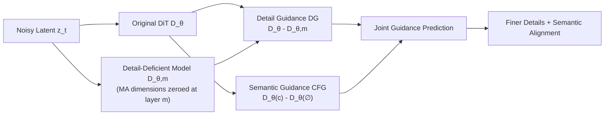

# Massive Activations are the Key to Local Detail Synthesis in Diffusion Transformers

**Conference**: ICLR 2026  
**OpenReview**: [https://openreview.net/forum?id=tOOAWDRjrb](https://openreview.net/forum?id=tOOAWDRjrb)  
**Code**: [Project Page](https://ganchaofan0000.github.io/DG)  
**Area**: Image Generation / Diffusion Transformer  
**Keywords**: Massive Activations, Diffusion Transformer, Detail Guidance, Training-free Sampling Guidance, CFG  

## TL;DR
This paper systematically reveals that "Massive Activations (MA)" in Diffusion Transformers (DiTs) are specifically responsible for local detail synthesis while having almost no effect on global semantics. Based on this finding, it proposes a training-free self-guidance strategy called Detail Guidance (DG), which utilizes a "degraded model after MA disruption" to reversely guide the original model toward generating more refined details.

## Background & Motivation
- **Background**: Massive Activations (outlier hidden states with abnormally large values in a few fixed dimensions) have been documented in LLMs and ViTs. In LLMs, they appear on low-information tokens (e.g., start/separators) to support long-context modeling. In ViTs, they appear on redundant background tokens to encode global semantics. Recent works (related to DiTF, quantization, or distillation) have observed similar outlier activations in DiTs, but primarily treat them as "troublemakers" for quantization.
- **Limitations of Prior Work**: The functional role of MA in the DiT visual generation process remains largely unstudied. Furthermore, standard Classifier-Free Guidance (CFG), while enhancing semantic alignment, often suffers from **insufficient fine-grained local detail synthesis** (e.g., blurred textures, eyes, or hair).
- **Key Challenge**: MA in DiT differs significantly from LLMs/ViTs—it **appears across all spatial tokens** rather than specific low-information tokens, suggesting its function is not encoding global semantics but serves another purpose which was previously unknown.
- **Goal**: To understand the origin, distribution patterns, and functional roles of MA in DiTs, and to transform this mechanism into a plug-and-play, training-free detail enhancement tool.
- **Key Insight**: **[Mechanism Discovery]** MA is dominated by residual scaling factors $\alpha^k$ regressed from AdaLN, with its magnitude modulated by timestep embeddings, and it specifically drives local detail synthesis; **[Method Implementation]** By actively disrupting MA to obtain a "detail-deficient" model, self-guidance can be used to push the original model toward higher detail fidelity.

## Method

### Overall Architecture
The paper first performs a mechanistic investigation (MA characteristics + intervention experiments) and then translates the conclusions into a method. Two key mechanistic conclusions are reached: MA is modulated by the timestep and is critical for local detail synthesis. Based on this, Detail Guidance (DG) constructs a "detail-deficient model" $D_{\theta,m}$ by disrupting MA. Following the Karras self-guidance paradigm, the difference between the original and degraded models serves as the detail guidance signal. This can be used standalone or orthogonally with CFG.

### Key Designs

**1. Tracing MA to AdaLN scaling factors and timestep modulation.** DiT hidden states are updated block-wise via residual connections $z_t^{k+1} = z_t^k + \alpha^k D_k(z_t^k, t, c)$, where the dimension-wise scaling factor $\alpha^k = \mathrm{MLP}^k(t, c)$ is regressed by AdaLN based on timestep $t$ and text $c$. By comparing the per-dimension distributions of $z_t^k$ and $\alpha^k$, the authors found that $\alpha^k$ exhibits spikes in specific fixed dimensions (e.g., dimension 810 in SD3), exactly matching the MA dimensions. This indicates the scaling factor determines the "dimensional position" of MA. Further decomposition shows that across 1000 different text prompts, the MA magnitude remains almost constant (~150), suggesting **text embeddings have negligible impact on MA**. Conversely, as $t$ decreases from $T$ to $0$, the MA magnitude increases steadily, showing that **timestep embeddings dominate the MA magnitude**. This holds across SD3, SD3.5, and Flux, with MA existing stably across layers, scales, and training stages (emerging before 50k iterations).

**2. Activation intervention experiments to locate MA function as local detail synthesis.** Using activation intervention, the authors manually disrupt MA dimensions in a single layer and allow the modified hidden state to propagate. Two findings emerge: first, **global semantics remain nearly unchanged** after MA disruption—object identity, color schemes, and layout stay consistent, with Blipscore/Clipscore win rates comparable to the original model (0.462 vs 0.538, 0.512 vs 0.488). Second, **local details significantly degrade**—fine parts like textures, eyes, and hair become noticeably blurred, with win rates on detail quality metrics plummeting (HPSv2.1 at only 0.028, Laion-Aesthetics at 0.078). This suggests that DiT assigns MA to all spatial tokens to drive fine-grained synthesis, modulated by the timestep to orchestrate details as the sampling moves from coarse structure (large $t$) to fine modification (small $t$).

**3. Detail Guidance (DG): Training-free self-guidance using the "detail-deficient model".** Let $D_\theta$ be the original pre-trained DiT. By zeroing out (masking) the MA-corresponding dimensions in the $m$-th layer hidden state $z_t^k$ to get $\tilde z_t^k$, we obtain a degraded model $D_{\theta,m}$ with crippled detail capability. Following self-guidance principles, the original model is pushed away from the "detail-deficient" distribution using:
$$\hat D_\theta(z_t,t,c) = D_\theta(z_t,t,c) + w\big(D_\theta(z_t,t,c) - D_{\theta,m}(z_t,t,c)\big)$$
where $w$ adjusts the detail guidance scale. This requires no additional training or fine-tuning and is applicable to off-the-shelf DiTs.

**4. Orthogonal superposition with CFG for joint enhancement.** DG enhances local details while CFG enhances semantic alignment. Their directions are complementary and can be linearly combined:
$$\hat D_\theta(z_t,t,c) = D_\theta(z_t,t,c) + \lambda\big(D_\theta(z_t,t,c) - D_\theta(z_t,t)\big) + w\big(D_\theta(z_t,t,c) - D_{\theta,m}(z_t,t,c)\big)$$
where $\lambda$ and $w$ are the guidance scales for CFG and DG, respectively. Compared to similar self-guidance methods like PAG (which modifies attention maps), DG target-specifically degrades the "detail drivers" (MA). Unlike auto-guidance which requires an under-trained "bad model," DG requires no extra models.

## Key Experimental Results

### Main Results (Pick-a-Pic, DG Gain)

| Model | Setting | DG | Clipscore | Blipscore | HPSv2.1 | Aesthetic |
|------|------|----|-----------|-----------|---------|-----------|
| SD3 | Cond | ✗ / ✓ | 22.11 → 24.15 | 66.74 → 76.52 | 21.84 → 28.65 | 5.58 → 6.01 |
| SD3 | CFG | ✗ / ✓ | 26.64 → 26.25 | 87.01 → 86.32 | 28.23 → 29.87 | 5.80 → 6.03 |
| SD3.5 | Cond | ✗ / ✓ | 24.90 → 26.01 | 70.09 → 83.66 | 23.65 → 29.23 | 5.94 → 6.16 |
| SD3.5 | CFG | ✗ / ✓ | 27.67 → 27.68 | 92.62 → 91.61 | 29.90 → 30.70 | 6.01 → 6.18 |
| Flux | Cond | ✗ / ✓ | 22.09 → 25.69 | 57.60 → 80.55 | 19.33 → 27.88 | 5.50 → 6.13 |
| Flux | CFG | ✗ / ✓ | 27.04 → 27.14 | 87.76 → 86.23 | 29.16 → 29.25 | 5.96 → 6.12 |

DG gains are most significant in conditional generation without CFG (e.g., Flux's HPSv2.1 from 19.33 $\rightarrow$ 27.88); under CFG settings, DG also consistently raises detail quality metrics.

### Ablation Study (HPSv2.1, SD3, Comparison with Other Guidances)

| Method | Needs Uncond Branch Training | HPSv2.1 Avg. | Aesthetic |
|------|------|------|------|
| CFG | ✓ | 30.24 | 5.93 |
| CFG-Zero | ✓ | 30.57 | 6.07 |
| FA-CFG | ✓ | 30.26 | 5.96 |
| PAG | ✗ | 29.20 | 6.10 |
| **DG (Ours)** | ✗ | 30.14 | **6.14** |
| **CFG+DG (Ours)** | ✓ | **30.96** | 6.13 |

DG does not require training an unconditional branch. Used alone, its Aesthetic score (6.14) outperforms all baselines, and its detail quality is superior to PAG (30.14 vs 29.20). Combined with CFG, it achieves the best HPSv2.1 of 30.96.

### Key Findings
- MA dimension is determined by AdaLN scaling factor $\alpha^k$, and its magnitude by the timestep, being nearly independent of text.
- Disrupting MA hardly affects semantics (Clip/Blip win rates are steady) but causes detail quality win rates to drop to 0.028 (HPSv2.1).
- DG consistently improves performance across SD3, SD3.5, and Flux, with maximum gain when CFG is absent, and is effective for ImageNet class-conditional generation.
- Ablations on disruption depth $m$ and scales $\lambda, w$ provide practical ranges for hyperparameters.

## Highlights & Insights
- **Mechanism-to-Method Closed Loop**: Using independent evidence (text-independence + intervention), the study isolates MA as the "detail controller." Turning this disruption into guidance is logically self-consistent and interpretable.
- **Training-free, Plug-and-play**: Modifying only the hidden states with zero training cost allows for easy application to any pre-trained DiT.
- **Orthogonality to CFG**: Decoupling "semantic alignment (CFG)" and "detail fidelity (DG)" into manageable guidance terms provides practitioners with a new control knob.
- **Unifying Timestep and Detail Dynamics**: The increase of MA as $t$ decreases corresponds to the coarse-to-fine generation dynamics of diffusion, explaining exactly what the timestep "tunes" inside a DiT.

## Limitations & Future Work
- DG introduces a second forward pass (the degraded model), increasing inference computational overhead for $D_{\theta,m}$.
- Disruption depth $m$ and scale $w$ require tuning; optimal values vary by model/dataset, and adaptive schemes are lacking.
- Identifying MA dimensions relies on empirical observation (e.g., SD3 dimension 810), and automatic cross-architecture localization mechanisms are not yet provided.
- Primarily validated on text-to-image DiTs; universality for video DiTs or larger scales remains to be tested.

## Related Work & Insights
- **Massive Activations Genealogy**: In LLMs, MA supports long contexts (Sun et al. 2024, StreamingLLM); in ViTs, MA encodes global semantics (Darcet et al. 2024 registers). DiTF (Gan et al. 2025) found MA in DiT feature extraction affects discriminative quality. This work completes the puzzle for DiT generation, highlighting the unique "per-token" nature of its MA.
- **Sampling Guidance**: Beyond CFG, auto-guidance uses under-trained "bad models," PAG perturbs attention maps, and variants like CFG-Zero/FA-CFG/Semantic-CFG adapt content/frequency. DG's uniqueness lies in precisely locating the "bad model" to the MA detail driver.
- **Inspiration**: Functional decomposition of internal activations (which dimensions manage semantics vs. details) can serve as handles for controllable generation. This "mechanism as tool" approach could be extended to decoupling style, structure, or other attributes.

## Rating
- **Novelty**: ⭐⭐⭐⭐ — First to systematically characterize MA's function (local details) in DiT and trace it to timestep/AdaLN; DG is a natural yet clever derivative tool.
- **Experimental Thoroughness**: ⭐⭐⭐⭐ — Covers three models (SD3/3.5/Flux), two datasets, multiple metrics, and compares against 6 guidance methods with detailed ablations.
- **Writing Quality**: ⭐⭐⭐⭐ — Logical progression from phenomenon to mechanism to method, supported by clear visualizations of MA distribution and guidance effects.
- **Value**: ⭐⭐⭐⭐ — Training-free, plug-and-play, and orthogonal to CFG. Direct practical value for detail enhancement in existing DiTs with insightful mechanistic findings.

<!-- RELATED:START -->

## Related Papers

- [\[NeurIPS 2025\] Unleashing Diffusion Transformers for Visual Correspondence by Modulating Massive Activations](../../NeurIPS2025/image_generation/unleashing_diffusion_transformers_for_visual_correspondence_by_modulating_massiv.md)
- [\[ICLR 2026\] Scaling Laws for Diffusion Transformers](scaling_laws_for_diffusion_transformers.md)
- [\[ICLR 2026\] Rethinking Global Text Conditioning in Diffusion Transformers](rethinking_global_text_conditioning_in_diffusion_transformers.md)
- [\[ICLR 2026\] A Hidden Semantic Bottleneck in Conditional Embeddings of Diffusion Transformers](a_hidden_semantic_bottleneck_in_conditional_embeddings_of_diffusion_transformers.md)
- [\[ICLR 2026\] MADFormer: Mixed Autoregressive and Diffusion Transformers for Continuous Image Generation](textitmadformer_mixed_autoregressive_and_diffusion_transformers_for_continuous_i.md)

<!-- RELATED:END -->
