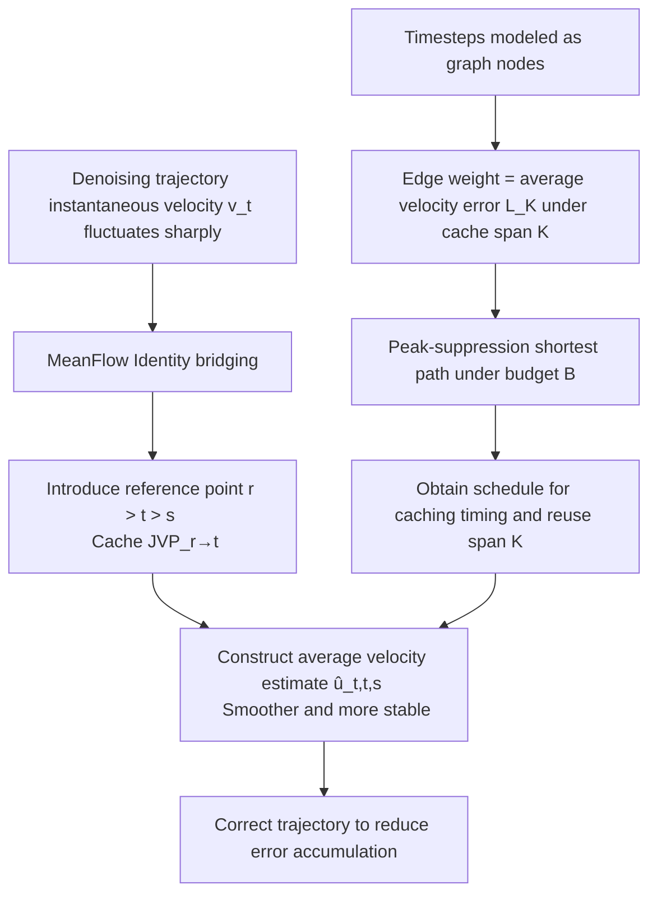

# MeanCache: From Instantaneous to Average Velocity for Accelerating Flow Matching Inference

**Conference**: ICLR 2026  
**OpenReview**: [https://openreview.net/forum?id=GMCyL7Xs9R](https://openreview.net/forum?id=GMCyL7Xs9R)  
**Code**: [UnicomAI/MeanCache](https://github.com/UnicomAI/MeanCache)  
**Area**: Image Generation / Diffusion Acceleration  
**Keywords**: Flow Matching, Training-free Caching, Average Velocity, JVP, Trajectory Stable Scheduling  

## TL;DR
MeanCache shifts the feature caching of diffusion/Flow Matching from an "instantaneous velocity" perspective to an "average interval velocity" perspective. It reconstructs smoother average velocities from instantaneous ones using cached Jacobian-Vector Products (JVP) and determines when to cache and how long to reuse via a budget-constrained "peak-suppression shortest path" scheduler. It achieves speedups of 4.12× on FLUX.1, 4.56× on Qwen-Image, and 3.59× on HunyuanVideo, with image quality superior to existing caching methods.

## Background & Motivation

**Background**: Flow Matching models continuous transmission paths from noise to data by learning instantaneous velocity fields $v_\theta(x_t,t)$. It has become the mainstream paradigm for image/video/multimodal generation. However, commercial-grade models like FLUX.1, Qwen-Image, and HunyuanVideo have high memory requirements, heavy single-step computation, and high inference latency. Acceleration methods such as distillation, pruning, and quantization require architectural changes or retraining; in contrast, **caching is a training-free, lightweight alternative** that reuses intermediate features from selected timesteps to skip redundant computations.

**Limitations of Prior Work**: Mainstream caching methods (TeaCache, TaylorSeer, DiCache, etc.) essentially operate in the **instantaneous velocity domain**: they directly reuse features or velocities from previous steps to reconstruct intermediate states. However, instantaneous velocity fluctuates sharply along the denoising trajectory (as shown in Fig. 2 left of the paper). Reusing it at high acceleration ratios leads to **exponential error accumulation**, causing the trajectory to deviate from the true path and degrading image quality. Furthermore, deciding "when to cache" relies on fixed intervals or manually tuned thresholds, leading to severe quality degradation at high acceleration.

**Key Challenge**: Higher acceleration requires more aggressive skipping, but instantaneous velocity is unstable → the more steps skipped, the worse the trajectory drift. **What signal can be used to reconstruct skipped intervals that is both stable and training-free?**

**Goal**: Find a caching signal that is smoother and better suited for reuse than instantaneous velocity, without retraining and under a fixed computation budget, and systematically determine the timing and duration of caching.

**Core Idea**: Inspired by MeanFlow, the interval average velocity $u$ is much smoother than the instantaneous velocity. **[From Instantaneous to Average]** The instantaneous and average velocities are bridged via a JVP term using the MeanFlow Identity. Consequently, early cached values can approximate this JVP to derive a smooth average velocity from the instantaneous velocity to correct the trajectory. Furthermore, **[Graph Shortest Path Scheduling]** models "when to cache and for how long" as a graph shortest path problem under budget constraints.

## Method

### Overall Architecture
MeanCache consists of two components: (1) **Instantaneous-to-Average Velocity Transformation**—based on MeanFlow Identity, it uses cached JVP to construct an average velocity estimate $\hat{u}(z_t,t,s)$ from the instantaneous velocity $v(z_t,t)$ as a more stable trajectory reconstruction signal; (2) **Trajectory Stable Scheduling**—it constructs the denoising timesteps as a multigraph where edge weights represent average velocity errors under different cache spans $K$. A "peak-suppression shortest path" under budget $B$ determines where to cache and how long to reuse each segment. The entire process is training-free and plug-and-play.

### Key Designs

**1. Instantaneous-to-Average Velocity Transformation: Smoothing signals with JVP.** Flow Matching trains networks to predict instantaneous velocity, yielding the ODE $d\hat{x}_t = v_\theta(x_t,t)\,dt$. MeanFlow defines the average velocity over the interval $[s,t]$ as $u(z_s,t,s)=\frac{1}{s-t}\int_t^s v(z_\tau,\tau)\,d\tau$, and provides the MeanFlow Identity $v(z_s,s)=u(z_s,t,s)+(s-t)\frac{d}{ds}u(z_s,t,s)$ to bridge the two, where the derivative term can be written as a Jacobian-Vector Product (JVP). Intuitively, directly extrapolating instantaneous velocity $v(z_t,t)$ over $[t,s]$ leads to drift, while average velocity accurately reaches the target $s$. The paper generalizes the identity from the endpoint $s$ to the starting point $t$, obtaining $v(z_t,t)=u(z_t,t,s)-(s-t)\frac{d}{dt}u(z_t,t,s)$. Thus, the average velocity can be reconstructed from the instantaneous velocity plus a JVP correction term: $\hat{u}(z_t,t,s):=v(z_t,t)+(s-t)\,\widehat{\mathrm{JVP}}$. The key is that since the true JVP is unavailable during inference, it must be approximated by caching—which is exactly where caching fits in.

**2. JVP-based Cache Construction: Making the correction term fully cacheable.** A reference point $r$ earlier than $t$ ($r>t>s$) is introduced, which corresponds to an earlier cached state. Applying the starting point identity to the interval $[t,r]$ yields $\widehat{\mathrm{JVP}}=\frac{u(z_r,r,t)-v(z_r,r)}{t-r}$. Substituting the displacement form of the average velocity $u(z_r,r,t)=\frac{z_t-z_r}{t-r}$ results in a **fully cacheable estimator**: $\widehat{\mathrm{JVP}}=\frac{z_t-z_r-(t-r)v(z_r,r)}{(t-r)^2}$. Consequently, the predicted average velocity $\hat{u}(z_t,t,s)=v(z_t,t)+(s-t)\frac{z_t-z_r-(t-r)v(z_r,r)}{(t-r)^2}$ uses only the current and cached latent variables and velocities, requiring no retraining. Let $K$ denote the number of discrete steps between $r$ and $t$: for $K>1$, the above equation is used for average velocity correction; for $K=1$, it degrades to pure instantaneous velocity. Larger $K$ extends the reuse interval but increases approximation error—the choice of $K$ directly determines the balance between approximation accuracy and stability, necessitating a principled schedule.

**3. Trajectory Stable Scheduling: Solving "when to cache and for how long" as a graph shortest path.** The authors observe that while the absolute values of latent variables differ across prompts/seeds, their **relative changes at fixed timesteps are highly consistent** (similar to TeaCache). Therefore, caching decisions can be guided by a pre-computed stability graph rather than fixed heuristics. Let the error from $t \to s$ be the difference between the true and cached average velocity $L_K(t,s)=\|u(z_t,t,s)-\hat{u}(z_t,t,s)\|$. Timesteps are modeled as nodes in a multigraph $G=(V,E)$: a directed edge $t\to s$ ($t>s$) represents a cache transition with edge weight $E_K(t\to s)=L_K(t,s)$. Since multiple cache spans $K$ can exist for the same pair of nodes, it is a multigraph.

**4. Peak-Suppression Shortest Path: Avoiding error concentration on a few edges.** Given the error-weighted multigraph, the scheduling degrades to a constrained shortest path search. However, under a small budget, a standard shortest path might **concentrate error on a few edges**, creating peaks. A peak-suppression objective is introduced by applying a power penalty to high-error edges: $\pi^\star=\arg\min_{\pi\in P(T,0)}\sum_{e\in\pi}C(e)^\gamma\ \ \text{s.t.}\ |\pi|\le B\le T$, where $C(e)$ is the edge error cost, $\gamma\ge1$ is the peak-suppression parameter ($\gamma=1$ degrades to standard shortest path), and budget $B$ (equivalent to Number of Function Evaluations, NFE) directly controls the acceleration ratio. This problem is solved efficiently via dynamic programming. Ablations show that $\gamma=5$ yields the best results across all metrics, proving that suppressing error peaks is necessary.

## Key Experimental Results

### Main Results (Text-to-Image, FLUX.1 [dev] / Qwen-Image)

| Model | Method | Accel. | ImageReward↑ | CLIP↑ | LPIPS↓ | SSIM↑ | PSNR↑ |
|------|------|------|------|------|------|------|------|
| FLUX.1 | Original 50 steps | 1.00× | 1.033 | 31.229 | – | – | – |
| FLUX.1 | TaylorSeer (N=6,O=2) | 2.74× | 0.971 | 31.310 | 0.415 | 0.663 | 16.278 |
| FLUX.1 | **Ours (B=15)** | 2.91× | 1.010 | 31.244 | **0.142** | **0.870** | **24.834** |
| FLUX.1 | TaylorSeer (N=20,O=1)†| 3.73× | -0.727 | 24.412 | 0.798 | 0.443 | 11.219 |
| FLUX.1 | **Ours (B=10)** | **4.12×** | **0.993** | **31.323** | **0.272** | **0.761** | **19.425** |
| Qwen-Image | Original 50 steps | 1.00× | 1.180 | 33.626 | – | – | – |
| Qwen-Image | DBCache (r=0.6) | 2.74× | 1.016 | 33.435 | 0.298 | 0.825 | 22.221 |
| Qwen-Image | **Ours (B=13)** | 3.60× | 1.147 | 33.799 | 0.113 | 0.907 | 24.802 |
| Qwen-Image | **Ours (B=10)** | **4.56×** | **1.142** | 33.621 | 0.236 | 0.815 | 18.983 |

†Methods with † show severe degradation in ImageReward (collapsed quality). Ours maintains ImageReward close to the original even at 4×+ acceleration, while TaylorSeer/DiCache become negative.

### Main Results (Text-to-Video, HunyuanVideo)

| Method | Accel. | VBench↑ | LPIPS↓ | SSIM↑ | PSNR↑ |
|------|------|------|------|------|------|
| Original 50 steps | 1.00× | 80.39% | – | – | – |
| TeaCache (l=0.33) | 3.11× | 80.02% | 0.363 | 0.651 | 17.957 |
| **Ours (B=12)** | 3.21× | 80.01% | **0.176** | **0.809** | **24.002** |
| **Ours (B=10)** | **3.59×** | **80.08%** | 0.269 | 0.732 | 20.464 |

### Ablation Study (Peak-suppression parameter γ, FLUX.1 B=15)

| γ | Reward↑ | CLIP↑ | LPIPS↓ | SSIM↑ | PSNR↑ |
|------|------|------|------|------|------|
| 1 | 1.0136 | 31.201 | 0.192 | 0.826 | 22.376 |
| 2 | 1.0072 | 31.195 | 0.148 | 0.860 | 24.147 |
| 4 | 1.0179 | 31.291 | 0.135 | 0.869 | 24.569 |
| 5 | 1.0177 | 31.271 | 0.140 | **0.871** | 24.568 |

### Key Findings
- **Average velocity is far more stable than instantaneous velocity**: At high acceleration ratios, LPIPS for instantaneous-domain methods spikes and ImageReward turns negative, while MeanCache maintains near-original quality at 4.12×/4.56×.
- **Early timesteps are more critical**: Shortest path visualization (Fig. 6) shows that early denoising steps are crucial for quality and should not be skipped, whereas the latter half contributes less and is more suitable for skipping. The optimal JVP span $K$ varies jointly with budget and timestep rather than being a fixed value.
- **Peak suppression is effective**: Quality is not optimal at $\gamma=1$ (standard shortest path), indicating that errors are concentrated on a few edges; metrics improve as $\gamma$ increases.
- **Robustness to rare words**: For prompts with rare words like "Matutinal", TaylorSeer/TeaCache suffer from severe content drift at high acceleration, while MeanCache retains original content details at 4.12×.

## Highlights & Insights
- **Perspective shift brings qualitative change**: Reframing caching from "reusing instantaneous velocity" to "reconstructing average velocity" captures the essence of Flow Matching—that trajectories should be approximately linear. Average velocity is naturally smoother and a better candidate for reuse. This is a simple but explanatory reframing.
- **JVP as a computational bridge**: The derivative term in the MeanFlow Identity is exactly a JVP. The paper converts it from a theoretical identity into a practical cacheable estimator, gracefully bridging theory and engineering.
- **Scheduling formalized as constrained shortest path**: Engineering problems like "when to cache and for how long," which previously relied on manual thresholds, are modeled as a budget-constrained shortest path on a multigraph. Budget $B$ directly corresponds to NFE, allowing precise control over acceleration.
- **Peak suppression is a subtle but key detail**: A direct shortest path would stack errors on a few edges to create peaks. Power penalties flatten the error distribution, which is one of the practical reasons why the method does not collapse at high acceleration.

## Limitations & Future Work
- **Dependency on pre-computed stability graphs**: Edge weights in the multigraph require pre-computation using 50 prompts and 5 seeds. Although training-free, this involves a one-time offline cost; the transferability of graphs across models/resolutions is not fully discussed.
- **Relative consistency assumption**: The schedule relies on the assumption that "relative changes at fixed timesteps are consistent across samples." Its validity for out-of-distribution or extreme prompts lacks boundary analysis.
- **JVP approximation error grows with K**: Aggressive reuse with large $K$ increases approximation error. While scheduling mitigates this, the paper does not provide a theoretical bound for the approximation error.
- **Comparison with distilled few-step models**: The method is positioned as training-free caching, but a quality comparison with few-step distilled models at equivalent latency could be further explored.

## Related Work & Insights
- **MeanFlow (Geng et al., 2025)** is the direct inspiration: it first systematically proposed modeling with average velocity and provided the MeanFlow Identity. MeanCache adapts it from "modeling during training" to "reconstruction for caching during inference."
- **Caching Lineage**: DeepCache (manual rules) → TeaCache (timestep embedding & output correlation + thresholds) → TaylorSeer (multi-step feature reuse via Taylor expansion) → DiCache (shallow online probes) → DBCache/LeMiCa (global DAG caching). MeanCache distinguishes itself by pointing out that these all remain in the instantaneous velocity domain.
- **Graph Modeling**: Inspired by ShortDF's graph modeling and trajectory drift suppression in sequence processing, cache scheduling is modeled as a shortest path.
- **Inspiration**: If a reuse signal is unstable, one does not necessarily need a more complex model; instead, one can switch to a mathematically equivalent but smoother representation (instantaneous → average) and formalize "how much to use and where to place it" as an optimizable discrete problem. This combination of "representation shift + discrete optimization scheduling" is valuable for other training-free acceleration scenarios.

## Rating
- **Novelty**: ⭐⭐⭐⭐ Moving caching from the instantaneous to the average velocity domain, using JVP as a bridge and formalizing it as shortest path scheduling, is a clear and uncommon perspective; the transfer of ideas from MeanFlow shows originality.
- **Experimental Thoroughness**: ⭐⭐⭐⭐ Covers three commercial-grade models (FLUX.1/Qwen-Image/HunyuanVideo) and both image/video tasks. Compares with 6+ mainstream caching baselines and includes ablations for $\gamma$, shortest paths, and rare word consistency. Lacks direct comparison with distilled few-step models at the same latency.
- **Writing Quality**: ⭐⭐⭐⭐ The chain from motivation to derivation and engineering for "instantaneous to average" is coherent. Formulas and figures work well together, making it highly readable.
- **Value**: ⭐⭐⭐⭐ Training-free, plug-and-play, 4×+ acceleration with near-zero loss. Directly valuable for the practical deployment of commercial-grade generative models.

<!-- RELATED:START -->

## Related Papers

- [\[ICLR 2026\] Terminal Velocity Matching](terminal_velocity_matching.md)
- [\[ICLR 2026\] FastFlow: Accelerating The Generative Flow Matching Models with Bandit Inference](fastflow_accelerating_the_generative_flow_matching_models_with_bandit_inference.md)
- [\[ICML 2026\] Stable Velocity: A Variance Perspective on Flow Matching](../../ICML2026/image_generation/stable_velocity_a_variance_perspective_on_flow_matching.md)
- [\[ICLR 2026\] Delay Flow Matching](delay_flow_matching.md)
- [\[ICLR 2026\] Flow Matching with Semidiscrete Couplings](flow_matching_with_semidiscrete_couplings.md)

<!-- RELATED:END -->
