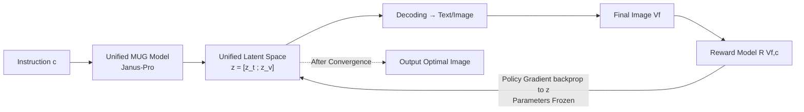

# MILR: Improving Multimodal Image Generation via Test-Time Latent Reasoning

**Conference**: ICLR 2026  
**Code**: [https://github.com/spatigen/milr](https://github.com/spatigen/milr)  
**Area**: Image Generation / Multimodal Reasoning  
**Keywords**: Multimodal Image Generation, Test-Time Reasoning, Latent Space Reasoning, Policy Gradient, Unified Understanding and Generation  

## TL;DR
MILR migrates "reasoning-enhanced image generation" into a **unified latent vector space** shared by text and images. At test-time, it utilizes policy gradient (REINFORCE) in conjunction with image quality critics to jointly optimize intermediate representations of text/image tokens. Without modifying any model parameters, the method achieves SOTA performance across GenEval/T2I-CompBench/WISE, notably improving the base model by 80% on the knowledge-intensive WISE benchmark.

## Background & Motivation
- **Background**: Text-to-image generation has evolved from GANs to autoregressive and diffusion models, and is currently being energized by "reasoning-enhancement" strategies—drawing inspiration from the reflection capabilities of o1/DeepSeek-R1 to enable models to "think before they draw." Existing approaches follow two trajectories: **language reasoning** (rewriting/expanding prompts for better understanding) and **image reasoning** (iteratively refining images based on quality metrics).
- **Limitations of Prior Work**: Early methods perform reasoning only within a single language **or** image space, lacking cross-modal synergy. Subsequent methods using Unified Understanding and Generation (MUG) frameworks achieve "language reasoning followed by drawing," but these **require carefully constructed reasoning data and rely on fine-tuning**, making development complex and expensive.
- **Key Challenge**: While the benefits of cross-modal synergistic reasoning are widely recognized, researchers are either restricted to single modalities or hindered by training costs and data quality. This raises the question: can we achieve **cross-modal reasoning that is also training-free**?
- **Goal**: Propose a pure test-time, parameter-frozen, and naturally cross-modal reasoning method.
- **Core Idea**: **【Unified Latent Space Reasoning】** Instead of reasoning on discrete raw images/text, the search is conducted within the continuous latent vector space (intermediate Transformer outputs) shared by both. As this space is modality-agnostic, it provides a unified perspective for visual and textual reasoning, narrowing the modality gap. **【Test-Time Policy Gradient】** REINFORCE is used to backpropagate gradients from quality rewards solely to these intermediate latent representations, while model parameters remains frozen throughout.

## Method

### Overall Architecture
MILR is built upon a Transformer-based MUG model (instantiated as Janus-Pro). A single forward pass produces latent representations $z=[z^{(t)};z^{(v)}]$ for text and image tokens (taken from the final layer, just before the modality-specific decoding heads), which reside in the same $d$-dimensional space. MILR iteratively updates this set of latent vectors at test-time: decoding images $\rightarrow$ scoring by reward models based on instructions $\rightarrow$ backpropagating reward gradients only to $z$ $\rightarrow$ updating $z$ $\rightarrow$ re-decoding, for up to $T$ steps. The entire process does not modify model weights.

### Key Designs

**1. Multimodal Latent Reasoning: Shifting search from discrete tokens to a shared vector space.** MUG defines multimodal generation as an autoregressive process $p(t,v|c)=\prod_n p(v_n|v_{1:n},t,c)\prod_m p(t_m|t_{1:m},c)$, where image generation depends on language reasoning tokens generated from instructions. The goal of test-time reasoning is to find a pair $(t^*,v^*)$ that maximizes the expected reward $\mathbb{E}_{V_f\sim p(\cdot|t,v,c)}[R(V_f,c)]$. However, searching in the discrete token space is intractable due to its infinite size. MILR instead searches in the continuous latent representation space: $z^*=\arg\max_z \mathbb{E}_{V_f\sim p(\cdot|z,c)}[R(V_f,c)]$, where $z=[z^{(t)};z^{(v)}]$ encodes both text and images. This naturally provides a unified cross-modal perspective, unifying "instruction refinement" and "image refinement." Once the optimal $z^*$ is obtained, the remaining forward pass $p(V_f|z^*,c)=p(V_f|t,v,c)\,p(t,v|z^*)$ is completed to decode the final image.

**2. REINFORCE-based Test-Time Gradient Optimization: Rewards drive latent variables without parameter updates.** Since the objective has no closed-form solution, MILR utilizes the REINFORCE policy gradient for iterative updates: $z_{k+1}\leftarrow z_k+\eta\cdot \mathcal{J}(z_k)$, where $\mathcal{J}(z_k)=\mathbb{E}_{V_f\sim p(\cdot|z_k,c)}[R(V_f,c)\,\nabla_z\log p(t,v|z_k)]$. The authors approximate this expected gradient with a single sample $(t,v)$. The gradient is backpropagated **only** to the model output $z$, leaving parameters unchanged—hence the "test-time" nature. This work is the first to extend REINFORCE, originally used for pure text reasoning, to unified multimodal latent reasoning for image generation.

**3. Prefix-only Optimization: Optimizing only the top $\lambda$ proportion of tokens to balance efficiency and exploration.** Optimizing all $M+N$ latent variables solely via reward guidance might lead to bias and waste the MUG model's inherent generation capabilities. MILR optimizes only the first $\lambda_t M$ latent variables for text (completing the rest with standard autoregressive decoding after mapping to discrete tokens) and similarly the first $\lambda_v N$ latent variables for images. This design is grounded in the observation that the initial image tokens dominate global structure, while subsequent tokens affect high-frequency details. Experiments set $\lambda_t=0.2$ and $\lambda_v=0.02$ (requiring a very small prefix for images), with a learning rate of 0.03, converging within 16 steps. This process is executable on a single A100 80GB GPU.

## Key Experimental Results

### Main Results
The base model is Janus-Pro-7B. Each benchmark uses its native evaluation tool as the reward model.

| Method | GenEval Overall ↑ | T2I-CompBench Overall ↑ | WISE Avg ↑ |
|---|---|---|---|
| Janus-Pro-7B (Base) | 0.78 | 0.3921 | 0.35 |
| GoT-R1 (Training-based) | — | 0.5241 | — |
| T2I-R1 (Training-based) | 0.79 | 0.5281 | 0.54 |
| Flow-GRPO (Training-based) | 0.95 | — | — |
| ReflectionFlow (Test-time) | 0.91 | — | — |
| Janus-Pro-7B+PARM (Test-time) | 0.91 | — | — |
| **Janus-Pro-7B+MILR** | **0.95** | **0.5325** | **0.63** |

- GenEval improves by +0.17 over the base model, with significant gains in Counting (+0.34), Position (+0.21), and Attribute Binding (+0.27), outperforming the strongest test-time method by +4.5%.
- WISE (knowledge-intensive) increases from 0.35 to 0.63, representing an **80% improvement** and exceeding the runner-up T2I-R1 by 16.7%.
- The method remains effective on the 1B base: GenEval 0.73 $\rightarrow$ 0.89, WISE 0.26 $\rightarrow$ 0.40.

### Ablation Study

| Setting | GenEval Overall | T2I-CompBench | WISE Avg |
|---|---|---|---|
| Full MILR (Text + Image) | 0.95 | 0.5325 | 0.63 |
| w/o Image (Text Optimization only) | 0.94 | 0.5210 | 0.61 |
| w/o Text (Image Optimization only) | 0.93 | 0.5043 | 0.56 |
| w/o MILR (Base) | 0.78 | 0.3921 | 0.35 |

### Key Findings
- Optimizing either text or image independently significantly outperforms the base model (>0.21 on WISE), while joint optimization yields the best results—confirming that joint reasoning in a unified latent space is critical for performance.
- Text-only optimization slightly outperforms image-only optimization and approaches the full model, suggesting substantial room for improvement in the MUG's language understanding component.
- Expanding optimization steps from 1 to 16 leads to continued score increases before saturation, demonstrating the scalability of test-time compute.
- For images, optimizing only a small fraction of prefix tokens ($\lambda_v=0.02$) is sufficient; for text, $\lambda_t=0.2$. Prefix optimization outperforms random subset optimization, aligning with the observation that "the first few tokens determine global structure."
- Qualitatively, MILR demonstrates non-trivial geometric, temporal, and cultural reasoning: it can infer "the Great Wall at dawn" from "the Great Wall at 3PM LA time" and understands that the lotus symbolizes purity in Chinese culture.
- On GenEval, MILR (0.95) matches the best training-based model, Flow-GRPO, without any parameter fine-tuning, demonstrating the competitiveness of test-time methods.

## Highlights & Insights
- **Paradigm Novelty**: Moving "reasoning" from the raw token level down to the modality-agnostic latent vector level provides a clean abstraction for cross-modal reasoning, where "prompt editing" and "image refinement" are driven by the same gradient in the same space.
- **Training-free and Plug-and-play**: Pure test-time optimization with frozen parameters. Any off-the-shelf model with multimodal understanding can serve as a reward, ensuring low deployment barriers.
- **Significant Gains in Knowledge-Intensive Scenarios**: The 80% improvement on WISE is compelling, indicating that latent reasoning genuinely helps the model "think through" knowledge-based instructions rather than merely enhancing image quality.
- **Shifting RL from Training-time to Test-time**: This perspective is insightful. By applying REINFORCE to intermediate latent variables instead of model parameters, the method retains reward-driven exploration benefits while avoiding training costs and catastrophic forgetting.

## Limitations & Future Work
- **Test-Time Computational Overhead**: Each image requires multiple forward and backward steps (up to 16), making it slower than single-pass generation and limiting throughput.
- **Dependency on Reward Model Quality**: Using benchmark-specific evaluators as rewards risks "optimizing for the evaluation," and reward reliability for open-ended instructions remains uncertain.
- **Base Model Coupling**: The method relies on MUG/Janus-Pro-like unified frameworks that support language-before-image generation; its transferability to models lacking this structure (e.g., pure diffusion) is unknown.
- **Prefix Heuristics**: Hyperparameters like $\lambda_v=0.02$ are derived via grid search; their robustness across all data and tasks requires further validation.

## Related Work & Insights
- **Reasoning-Enhanced Image Generation**: Training-based approaches (GoT-R1, T2I-R1, Flow-GRPO, GRPO/DPO-tuned Janus-Pro) require data and fine-tuning. Test-time approaches (Reflect-DiT and ReflectionFlow using language feedback; Best-of-N and PARM using search) rely on external critics. MILR differs by optimizing latent representations instead of explicit reasoning on raw text/images.
- **Latent Space Reasoning**: In contrast to explicit Chain-of-Thought (CoT), latent reasoning performs implicit reasoning on hidden states; MILR is the first to extend this to unified multimodal image generation.
- **RL for Generation**: While GRPO/PPO/REINFORCE are typically used for training-time optimization, MILR's use of REINFORCE for **test-time** optimization represents a noteworthy conceptual shift.

## Rating
- **Novelty**: ⭐⭐⭐⭐ A clear and distinct framework that unifies cross-modal reasoning in a shared latent space driven by training-free test-time policy gradients.
- **Experimental Thoroughness**: ⭐⭐⭐⭐ Covers three major benchmarks (GenEval/T2I-CompBench/WISE), two model scales (1B/7B), text/image ablations, and analysis of steps/hyperparameters; using benchmark-specific evaluators as rewards is a minor caveat.
- **Writing Quality**: ⭐⭐⭐⭐ Logical progression from motivation to formulas to strategy; Figures 1 and 2 provide intuitive explanations of latent reasoning.
- **Value**: ⭐⭐⭐⭐ Training-free and plug-and-play; the 80% gain on WISE is highly attractive for knowledge-intensive generation, providing a reusable paradigm for "test-time latent reasoning."

<!-- RELATED:START -->

## Related Papers

- [\[ICLR 2026\] VFScale: Intrinsic Reasoning through Verifier-Free Test-time Scalable Diffusion Model](vfscale_intrinsic_reasoning_through_verifier-free_test-time_scalable_diffusion_m.md)
- [\[ICLR 2026\] Compose Your Policies! Improving Diffusion-based or Flow-based Robot Policies via Test-time Distribution-level Composition](compose_your_policies_improving_diffusion-based_or_flow-based_robot_policies_via.md)
- [\[ICLR 2026\] Test-Time Iterative Error Correction for Efficient Diffusion Models](test-time_iterative_error_correction_for_efficient_diffusion_models.md)
- [\[ICLR 2026\] Projected Coupled Diffusion for Test-Time Constrained Joint Generation](projected_coupled_diffusion_for_test-time_constrained_joint_generation.md)
- [\[CVPR 2026\] Progress by Pieces: Test-Time Scaling for Autoregressive Image Generation](../../CVPR2026/image_generation/progress_by_pieces_test-time_scaling_for_autoregressive_image_generation.md)

<!-- RELATED:END -->
