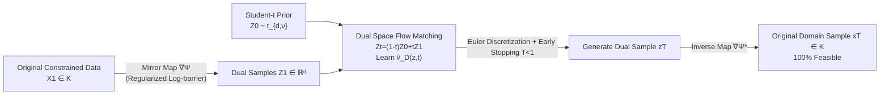

# Mirror Flow Matching with Heavy-Tailed Priors for Generative Modeling on Convex Domains

**Conference**: ICLR 2026  
**OpenReview**: [https://openreview.net/forum?id=dZKl7uc0XQ](https://openreview.net/forum?id=dZKl7uc0XQ)  
**Code**: Provided in supplementary material  
**Area**: Constrained Generative Modeling / Flow Matching Theory  
**Keywords**: Flow Matching, Mirror Map, Heavy-tailed Distribution, Student-t Prior, Convex Constrained Generation, Wasserstein Convergence Rate  

## TL;DR
Addressing constrained generative modeling on convex domains, this paper identifies two major issues: "log-barrier mirror maps induce heavy-tailed dual distributions" and "mismatch between Gaussian priors and heavy-tailed targets." It proposes **Regularized Mirror Flow Matching** with a **Student-t prior**, which ensures finite moments for the dual distribution and provides the first theoretical guarantee of polynomial tail bounds for space-time Lipschitz velocity fields and Wasserstein convergence rates.

## Background & Motivation
**Background**: Flow Matching has become a mainstream framework for unifying score-based diffusion and optimal transport by learning a deterministic velocity field $v(x,t)$ that transports a simple prior (usually Gaussian) to a complex target. However, many real-world tasks involve target distributions supported on **convex constrained domains**—polyhedra, simplices, positive semi-definite matrices, $L_2$ balls, etc. (e.g., molecular generation, preference alignment, robot policies, watermarked image generation). Standard Flow Matching distorts the distribution when projecting unconstrained samples back into the domain.

**Limitations of Prior Work**: The mainstream approach to transform constrained generation into unconstrained is via **mirror maps**: using the gradient of a strictly convex potential function $\nabla\Psi: K\to\mathbb{R}^d$ to map the original domain $K$ to an unconstrained dual space, performing standard Flow Matching there, and pulling back with the inverse map $(\nabla\Psi)^{-1}$. This ensures trajectories stay within $K$. However, classic log-barrier mirror maps possess two overlooked risks.

**Key Challenge**: First, mapping constrained distributions to the dual space using log-barriers **induces heavy tails**—Lemma 2.1 provides a criterion: if $P(\|Y\|\ge R)\ge C/R^p$, then $p$-th order moments do not exist. Heavy tails lead to the failure of moment conditions required for Flow ODEs, causing pathological dynamics. Second, when the target is heavier than the prior, the conditional distribution $p(X_1\mid X_t=x)$ develops a second mode at $x_1\approx x/t$, causing the true velocity field to **explode super-exponentially** with $\|x\|$, which diverges the Lipschitz constant and limits theoretical analysis to strong assumptions like "bounded support."

**Goal**: Design a **synergistic scheme** of mirror maps and priors that simultaneously: (1) transforms constrained distributions to unconstrained ones; (2) guarantees the existence of key moments (e.g., second moment); (3) ensures strong convexity of the potential function to transfer convergence guarantees back to the original Euclidean metric; and (4) provides provable convergence rates under polynomial tail assumptions.

**Key Insight**: **[Regularized Mirror Map to Control Tails]** Adding a quadratic term $\frac12\|x\|^2$ to the log-barrier ensures $\Psi$ is strongly convex and suppresses dual heavy tails. **[Student-t Prior for Tail Alignment]** Replacing Gaussian priors with Student-t distributions allows the data distribution to dominate the tails of the conditional distribution, suppressing the pseudo-mode at $x/t$ and controlling the velocity field.

## Method

### Overall Architecture
The method assembles two components: First, a **regularized mirror map** $\nabla\Psi$ maps original constrained data $X_1$ to dual samples $Z_1$. In the dual Euclidean space, standard Flow Matching is performed using a **Student-t prior** $Z_0\sim t_{d,\nu}$ and linear interpolation $Z_t=(1-t)Z_0+tZ_1$ to learn the dual velocity field $\hat v_D$. For sampling, Euler discretization (with an early stopping time $T<1$) is performed in the dual space, and samples are pulled back to $K$ using the inverse map $\nabla\Psi^*$, guaranteeing 100% feasibility. The key insight is that linear interpolation in the dual space is equivalent to geodesic interpolation under the squared Hessian metric $(\nabla^2\Psi)^2$ in the original space.

### Key Designs

**1. Regularized Log-barrier Mirror Map: Solving "Heavy Tails + Weak Convexity" with a Quadratic Term.** Classic log-barriers are strictly convex but not strongly convex, causing the metric comparison constant $L_\Psi$ in Eq. (1) to explode (even for 2D polyhedra), whereas strong convexity is a prerequisite for transferring the dual Wasserstein bound $W_{2,\Psi}$ to the original $W_2$ bound ($W_2(\nu,\mu)\le L_\Psi W_{2,\Psi}(\nu,\mu)$, requiring $\nabla\Psi^*$ to be $L_\Psi$-Lipschitz, i.e., $\Psi$ is strongly convex). Ours proposes $\Psi(x)=-\frac{1}{1-\kappa}\sum_{i=1}^m(-\phi_i(x))^{1-\kappa}+\frac12\|x\|^2$: the power $1-\kappa$ ($\kappa\in(0,1)$) weakens the singularity near the boundary to control tails, and $\frac12\|x\|^2$ enforces strong convexity. Proposition 2.2 proves that under natural boundary mass conditions $P(K\setminus K_\delta)\le C_K\delta^\beta$, the dual tail satisfies $P(\|\nabla\Psi(X)\|\ge R)\le C/R^{\beta/\kappa}$. Setting $\kappa<\beta/p$ guarantees the existence of $E[\|\nabla\Psi(X)\|^p]$.

**2. Student-t Prior for Tail Alignment: Eradicating Velocity Field Explosion.** Under linear interpolation, the true velocity field is $v(x,t)=-\frac{1}{1-t}x+\frac{1}{1-t}E[X_1\mid X_t=x]$. When the target is heavier than the prior, the second mode at $x_1\approx x/t$ causes the field to diverge as $\exp(x^2)$. Switching to a Student-t prior with $\nu=1$ keeps the main mode of the conditional density stable at $x_1\approx 0$ as $\|x\|$ increases. Mechanism: **Let the data distribution dominate the tail behavior of the conditional distribution**. When the prior is heavier than or equal to the target, pseudo-modes are suppressed, yielding finite moments and Lipschitz continuity.

**3. Dual-Primal Equivalence: Mapping Difficult Geometry to Euclidean Training.** Proposition 3.1 proves that learning the velocity field in the dual Euclidean space $(\mathbb{R}^d,I_d)$ is equivalent to learning in the original space $(K,(\nabla^2\Psi)^2)$, with the relationship $v_D(z,t)=\nabla^2\Psi(x)\,v_P(x,t)$. Thus, one only needs to train a dual field in a simple geometry and recover the original field via $v_P=\nabla^2\Psi^*(Z_t)\,v_D$. The complex geometry of $K$ is entirely handled by the mirror map.

**4. Space-time Lipschitz Continuity and Wasserstein Convergence Rates under Polynomial Tails.** This is the theoretical core. Proposition 4.1 proves that under polynomial tail assumptions ($\pi_1^D(x)\le C/\|x\|^\alpha$), the $t$-Flow velocity field is both space $L_1$-Lipschitz and has controlled time derivatives for $t\in[0,T]$—notably, prior work (Zhou & Liu 2025) required **bounded support** to control time Lipschitzness. Theorem 3 provides the Euler discretization error bound:
$$W_2(\pi_1^D,\hat\pi_T^D)\le \frac{e^{6L_1}}{L_1}\sqrt{h^2 D_3+\varepsilon^2}+(1-T)\sqrt{2(E\|Z_1\|^2+E\|Z_0\|^2)},$$
where the first term vanishes as step size $h\to 0$ and network error $\varepsilon\to 0$, and the second is the early stopping error. Theorem 4 transfers this to the original space via mirror map strong convexity.

## Key Experimental Results

### Main Results

10D Polytope (30 constraints) with Gaussian Mixture target, averaged over 10 runs, MMD scaled by $10^{-2}$:

| Method | MMD ↓ | KL ↓ | Feasibility |
|---|---|---|---|
| **Mirror t-Flow (Ours)** | **0.995 ± 0.021** | **1.424 ± 0.037** | 100% |
| Mirror G-Flow | 1.006 ± 0.016 | 1.447 ± 0.046 | 100% |
| RFM (Xie 2024) | 1.217 ± 0.007 | 2.034 ± 0.052 | 100% |
| MDM (Liu 2023a) | 1.258 ± 0.013 | 1.708 ± 0.054 | 100% |
| Gauge Vanilla (Li 2025) | 1.828 ± 0.011 | 5.023 ± 0.073 | 95.26% |

6D $L_2$ Ball ($\|x\|_2<25$):

| Method | MMD ↓ | KL ↓ | Feasibility |
|---|---|---|---|
| **Mirror t-Flow (Ours)** | **5.329 ± 0.101** | **0.162 ± 0.011** | 100% |
| Mirror G-Flow | 6.244 ± 0.286 | 0.176 ± 0.015 | 100% |
| MDM (Liu 2023a) | 36.156 ± 0.102 | 8.017 ± 0.046 | 100% |

AFHQv2 $64\times64$ Watermarked Image Generation (initialized from EDM checkpoint):

| Method | FID (50k) ↓ | CMMD | Training Time |
|---|---|---|---|
| **Mirror Flow ($\kappa=0.05$)** | **4.27** | **0.023** | **3 hours** |
| Mirror Diffusion Model (Liu 2023a) | 7.29 | 0.170 | 13 hours |

### Ablation Study

| Observation | Conclusion |
|---|---|
| t-Flow vs G-Flow | t-Flow (Student-t prior) consistently outperforms G-Flow (Gaussian prior). |
| $\kappa$ Magnitude | Larger $\kappa$ leads to heavier dual tails $\to$ worse MMD. |
| $\nu$ vs $\kappa$ | Large $\nu$ requires small $\kappa$, matching the theoretical condition $\kappa\le\gamma/(2d+\nu+2)$. |

### Key Findings
- **100% feasibility is constructive**: The inverse mirror map ensures samples inevitably fall within $K$.
- **MDM crashes on general polytopes**: MMD reached 36.16 on the $L_2$ ball because the log-barrier-induced heavy tails prevented the network from learning effectively.
- **FID and efficiency gains on watermarked images**: 4.27 vs 7.29 FID and 3h vs 13h training. Initialization from Flow Matching checkpoints achieved competitive FID (3.14) in just 1.5h.

## Highlights & Insights
- **Synergistic design of "Mirror Map + Prior"**: Treating these as a coupled system rather than independent defaults (log-barrier + Gaussian) is the core conceptual shift.
- **First convergence rate under polynomial tails**: Extends Flow Matching theory from bounded support or Gaussian-like distributions to true heavy-tailed targets.
- **The $\kappa$ knob**: Connects geometry (boundary mass $\beta$), prior (degrees of freedom $\nu$), and tail index $\alpha$ in a single inequality, allowing theory to guide hyperparameter tuning.

## Limitations & Future Work
- **Exponential dependence on Lipschitz constant** $e^{6L_1}$ in the error bound, common in non-convex analysis.
- **Convex domain limitation**: Non-convex geometries (requiring landing techniques) are not yet handled.
- **Fixed degrees of freedom $\nu$**: Future work could implement adaptive $\nu$ to match local data tail behavior.
- **Empirical scope**: Experiments focused on watermarked images and synthetic sets; molecular generation and robot policies remain for future validation.

## Related Work & Insights
- **Constrained Generative Modeling**: Methods are split between reflection-based (RFM) and mirror-map based (MDM). Ours is the first to provide convergence rates for Flow Matching while guaranteeing feasibility.
- **Flow Matching Analysis**: Previous works (Benton 2024, Zhou & Liu 2025) rely on bounded support or Gaussian targets. Ours achieves space-time regularity using Student-t priors for heavy-tailed data.

## Rating
- Novelty: ⭐⭐⭐⭐
- Experimental Thoroughness: ⭐⭐⭐
- Writing Quality: ⭐⭐⭐⭐
- Value: ⭐⭐⭐⭐

<!-- RELATED:START -->

## Related Papers

- [\[ICLR 2026\] Gauge Flow Matching: Efficient Constrained Generative Modeling over General Convex Set and Beyond](gauge_flow_matching_efficient_constrained_generative_modeling_over_general_conve.md)
- [\[ICLR 2026\] LapFlow: Laplacian Multi-scale Flow Matching for Generative Modeling](lapflow_laplacian_multi-scale_flow_matching_for_generative_modeling.md)
- [\[ICLR 2026\] Flow Along the $K$-Amplitude for Generative Modeling](flow_along_the_k-amplitude_for_generative_modeling.md)
- [\[ICLR 2026\] Delay Flow Matching](delay_flow_matching.md)
- [\[ICLR 2026\] Flow Matching with Semidiscrete Couplings](flow_matching_with_semidiscrete_couplings.md)

<!-- RELATED:END -->
