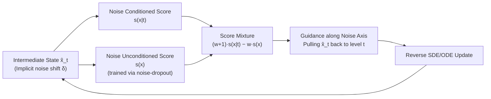

# Mitigating Noise Shift in Denoising Generative Models with Noise Awareness Guidance

**Conference**: ICLR 2026  
**OpenReview**: [https://openreview.net/forum?id=UMBc0Ky20K](https://openreview.net/forum?id=UMBc0Ky20K)  
**Code**: [https://github.com/KlingAIResearch/noise-awareness-guidance](https://github.com/KlingAIResearch/noise-awareness-guidance)  
**Area**: Image Generation / Diffusion Models / Sampling Correction  
**Keywords**: Diffusion Models, Flow Matching, noise shift, classifier-free guidance, sampling trajectory correction, ImageNet generation  

## TL;DR
The authors observe that the noise levels encoded in the intermediate states of diffusion/flow models systematically bias toward "larger" values during sampling (termed **noise shift**). They propose **Noise Awareness Guidance (NAG)**—a classifier-free guidance applied along the "noise condition" axis rather than the "class condition" axis. This pulls deviated trajectories back to the intended noise schedule, significantly enhancing generation quality.

## Background & Motivation
- **Background**: Diffusion models (DDPM) and flow models (flow matching / stochastic interpolant) view generation as solving discretized reverse-time SDEs/ODEs, where a network $v_\theta(x_t,t)$ predicts the velocity field to update states according to predefined coefficients $\alpha_t, \sigma_t$. Optimization efforts have primarily focused on **reducing sampling steps** (distillation, ODE solvers) and **increasing model capacity** (DiT, SiT architectures).
- **Limitations of Prior Work**: Iterative sampling inevitably accumulates errors due to imperfect network approximation, numerical discretization, and stochastic factors. A long-overlooked consequence is that the **actual noise amount contained in the intermediate state $\hat x_t$ does not match the nominal noise level at time step $t$**. The authors refer to this misalignment as noise shift.
- **Key Challenge**: During training, the network only encounters "clean" intermediate states $x_t = \alpha_t x_0 + \sigma_t\epsilon$, but at inference, it processes inputs with extra perturbations $\hat x_t = x_t + e$. Empirical Kernel Density Estimation (KDE) using an external noise estimator $g_\phi(t\mid x)$ on ImageNet reveals that the inference posterior $p_{\phi,t}(t\mid\hat x)$ **systematically biases towards a larger $t'$**, with the shift worsening near the end of sampling. This leads to two issues: ① The model is applied to out-of-distribution (OOD) inputs $s_\theta(x_{t+\delta},t)$; ② Denoising steps become inaccurate as they use misaligned $\alpha_t, \sigma_t$ coefficients.
- **Goal**: Explicitly "pull" the sampling trajectory back to the predefined noise schedule to mitigate noise shift without retraining the entire model or introducing external classifiers.
- **Key Insight**: **Treat the "noise level $t$" as a condition that can be reinforced through guidance**. Since modern denoising networks are already conditioned on $t$, a classifier-free guidance signal can be constructed along the noise condition axis, similar to how CFG reinforces class conditions, ensuring each intermediate state aligns better with its intended noise level.

## Method

### Overall Architecture
The paper quantifies noise shift theoretically and empirically (where error $e\sim\mathcal N(0,\sigma_e^2 I)$ is equivalent to raising the effective variance from $\sigma_t^2$ to $\sigma_t^2+\sigma_e^2$, corresponding to a positive shift $\delta=t'-t>0$). Subsequently, NAG is designed to treat "noise level $t$" as a guidance condition reinforced by score mixture. Two variants of NAG are proposed: **classifier-based NAG**, which relies on the gradient of an external noise estimator, and **classifier-free NAG** (the practical version), which uses an unconditional branch trained via "noise condition dropout" without extra networks.

### Key Designs

**1. Theoretical Characterization of Noise Shift: Translating cumulative error into "time-step shift."** The paper defines "mismatched noise" computationally. Modeling the cumulative error from all sources as additive Gaussian perturbation $\hat x_t = x_t + e,\ e\sim\mathcal N(0,\sigma_e^2 I)$ increases the effective variance of the intermediate state from $\sigma_t^2$ to $\sigma_t^2+\sigma_e^2$. Consequently, the state "appears" to be sampled from a later noise level $t'=t+\delta$, satisfying $\sigma_{t+\delta}^2=\sigma_t^2+\sigma_e^2$. For small $\sigma_e$, the shift has a first-order approximation $\delta\approx(\sqrt{\sigma_t^2+\sigma_e^2}-\sigma_t)/\dot\sigma_t$, which simplifies to $\delta=\sqrt{t^2+\sigma_e^2}-t>0$ under linear interpolation $\sigma_t=t$. Statement 1 translates abstract "error" into a **consistently positive, directionally clear time-step drift**, explaining why empirical posteriors bias toward larger $t$ and providing a direction for correction.

**2. Noise Awareness Guidance: Guidance along the noise condition axis.** Since noise shift is the misalignment between $\hat x_t$ and its nominal noise condition $t$, the natural fix is to strengthen the conditional dependence on $t$. Analogous to conditional generation, the noise-conditioned score is written as $s(x\mid t)=\nabla_x\log p_t(x\mid t)=\nabla_x\log p_t(x)+\nabla_x\log p_t(t\mid x)$. If the posterior $p_t(t\mid x)$ is available, $\nabla\log g_\phi(t\mid x)$ can serve as a guidance signal to push the trajectory toward the intended $t$—this is **classifier-based NAG**. It is conceptually orthogonal to CFG: while CFG pushes along the class condition $c$, NAG pushes along the noise condition $t$, controlling different axes of the sampling process.

**3. Classifier-free NAG: Eliminating external estimators via noise condition dropout.** To avoid the cost and complexity of training an external noise estimator, the classifier-free approach leverages $p_t(t\mid x)\propto p_t(x\mid t)/p_t(x)$ to approximate the gradient of the noise predictor via score mixture:
$$s_{w_{\text{nag}}}(x\mid t)=(w_{\text{nag}}+1)\,s(x\mid t)-w_{\text{nag}}\,s(x),$$
where $w_{\text{nag}}$ is the guidance scale. The critical observation is that modern denoising models **already take $t$ and $x$ as inputs**, meaning the conditional score $s(x\mid t)$ is available for free. To obtain the unconditional score $s(x)$, one only needs to **randomly drop the noise condition $t$** during training (noise-condition dropout, used at 10%/20% in the paper). This allows the same weights to learn both conditional and unconditional objectives without new networks.

**4. Relationship with CFG: Complementary rather than substitution.** NAG reinforces the condition on $t$, leading trajectories toward "lower temperature, higher confidence" regions, aligning intermediate states with their intended noise levels. Since CFG also biases toward low-temperature regions, it indirectly mitigates some noise shift as a side effect. However, NAG **directly targets the reduction of $\delta$** to construct superior trajectories. The two are orthogonal and can be combined; NAG alone can approximate CFG quality, and using both further improves performance. For pre-trained large models, NAG can be enabled by **fine-tuning only the unconditional branch** (approx. 0.7% of original training cost).

## Key Experimental Results

### Main Results (ImageNet 256×256, converged models, 50k samples)
Off-the-shelf DiT-XL/2 and SiT-XL/2 models were fine-tuned for only 10 additional epochs to support NAG sampling:

| Model | w/o CFG / FID | w/o CFG / Prec. | w/o CFG / Rec. | w/ CFG / FID | w/ CFG / Prec. | w/ CFG / Rec. |
|---|---|---|---|---|---|---|
| DiT-XL/2 (1400 ep) | 9.62 | 0.67 | 0.67 | 2.27 | 0.83 | 0.57 |
| **+ NAG** | **2.59** | 0.79 | 0.60 | **2.14** | 0.80 | 0.61 |
| SiT-XL/2 (1400 ep) | 8.61 | 0.68 | 0.67 | 2.06 | 0.82 | 0.59 |
| **+ NAG** | **2.26** | 0.75 | 0.66 | **1.72** | 0.77 | 0.66 |

Without CFG, NAG reduces FID from ~9 to ~2.3, nearly matching CFG performance. Combined with CFG, SiT-XL/2 reaches **1.72**.

### Ablation Study (DiT-XL/2 supervised fine-tuning, 7 fine-grained datasets, FID, 10k samples)
NAG was added to three baselines (keeping other settings constant, adding only noise-dropout training):

| Method | Food | SUN | Caltech | CUB | Stanford Car | DF-20M | ArtBench | Mean |
|---|---|---|---|---|---|---|---|---|
| FT (w/o CFG) | 16.04 | 21.41 | 31.34 | 9.81 | 11.29 | 17.92 | 22.76 | 18.65 |
| **+ NAG** | 11.18 | 14.95 | 24.32 | 5.68 | 5.92 | 14.79 | 19.22 | **13.72** |
| FT (w/ CFG) | 10.93 | 14.13 | 23.84 | 5.37 | 6.32 | 15.29 | 19.94 | 13.69 |
| **+ NAG** | 5.78 | 8.81 | 21.87 | 3.52 | 3.91 | 12.55 | 15.69 | **10.31** |
| FT (w/ DoG) | 9.25 | 11.69 | 23.05 | 3.52 | 4.38 | 12.22 | 16.76 | 11.55 |
| **+ NAG** | 6.45 | 8.24 | 21.88 | 3.41 | 4.21 | 11.38 | 14.80 | **10.05** |

NAG further reduced FID across vanilla, CFG, and DoG baselines, with means dropping from 18.65→13.72, 13.69→10.31, and 11.55→10.05 respectively.

### Key Findings
- **Noise shift is universal and systematic**: Measurements with an external estimator $g_\phi$ show that inference posteriors $p_{\phi,t}(t\mid \hat x)$ consistently bias toward larger $t$, with the shift $\delta$ worsening at the end of sampling (Fig. 4).
- **DiT gains more from NAG than SiT during training from scratch**: The authors suggest DDPM-style schedules are more conducive to training accurate unconditional branches, providing better guidance directions for NAG.
- **Extremely low deployment cost**: For a 1400-epoch pre-trained model, fine-tuning only the unconditional branch for ~10 additional epochs (approx. 0.7% training budget) enables NAG, yielding performance close to CFG when used solo.
- **Orthogonal and complementary to CFG**: Because their guidance axes differ, they can be stacked for continuous gains.

## Highlights & Insights
- **The problem naming itself is a contribution**: Reformulating "sampling error" as a "systematic drift in noise levels of intermediate states" provides a new observable, quantifiable, and correctable perspective for the community, visualized directly via KDE.
- **Nearly zero additional architectural cost**: By leveraging the existing fact that "$t$ is a condition," the method achieves guidance through simple noise-condition dropout, converting a problem seemingly requiring external estimators into a CFG-style classifier-free guidance.
- **High orthogonality and plug-and-play capability**: NAG is agnostic to the baseline (stacks with vanilla/CFG/DoG) and model family (validated on diffusion-based DiT and flow-based SiT), ensuring a low barrier to adoption.

## Limitations & Future Work
- **Reliance on noise estimators for diagnosis**: Empirical measurement of noise shift is limited by the precision of $g_\phi$. Reducing $\delta$ to zero does not guarantee better images if the sample is already severely OOD.
- **Theory based on simplified assumptions**: Approximating cumulative error as additive Gaussian and using first-order expansions for small $\sigma_e$ provides qualitative characterization, but real error structures are more complex.
- **Evaluation limited to class-conditional ImageNet and fine-grained tuning**: Validation is needed for large-scale text-to-image and video generation; automatic selection of $w_{\text{nag}}$ and its interaction with sampling steps/solvers remain to be explored.

## Related Work & Insights
- **Classifier guidance / CFG (Dhariwal & Nichol 2021; Ho & Salimans 2021)**: The direct inspiration for NAG—replacing "guidance along class condition" with "guidance along noise condition" while reusing score mixture and condition-dropout training paradigms.
- **stochastic interpolant / flow matching (Albergo 2023; Lipman 2023; Ma et al. SiT 2024)**: Provides the continuous-time framework for diffusion and flow models; the paper’s forward process, PF-ODE, and reverse-time SDE derivations are based on these.
- **Domain Guidance (Zhong et al. 2025)**: A guidance method for fine-tuning. NAG’s ability to further improve DoG suggests it addresses an error source orthogonal to domain adaptation.
- **Insight**: When an iterative system exhibits training-inference distribution misalignment, rather than seeking to eliminate all errors, one can **explicitly identify the shift direction and construct an inverse guidance term**. Treating error as a signal that can be corrected via conditional reinforcement is a more cost-effective approach than simply using "larger models or more steps."

## Rating
- **Novelty**: ⭐⭐⭐⭐⭐ It defines and quantifies a long-overlooked universal issue (noise shift) and provides an elegant classifier-free correction.
- **Experimental Thoroughness**: ⭐⭐⭐⭐ Covers DiT/SiT, training from scratch/fine-tuning, and 7 downstream datasets, but is restricted to ImageNet class-conditional generation without large-scale T2I/video validation.
- **Writing Quality**: ⭐⭐⭐⭐ Clear motivation, strong alignment between theory (Statement 1) and empirical results (Fig 1/4), and intuitive analogies to CFG.
- **Value**: ⭐⭐⭐⭐⭐ Extremely low correction cost, plug-and-play, and orthogonal to CFG with significant FID improvements, offering direct practical value for mainstream diffusion/flow models.

<!-- RELATED:START -->

## Related Papers

- [\[ICLR 2026\] A Noise is Worth Diffusion Guidance](a_noise_is_worth_diffusion_guidance.md)
- [\[ICLR 2026\] ReDDiT: Rehashing Noise for Discrete Visual Generation](reddit_rehashing_noise_for_discrete_visual_generation.md)
- [\[ICLR 2026\] Carré du champ Flow Matching: Improving the Quality-Generalisation Trade-off in Generative Models via Geometry-Aware Noise](carré_du_champ_flow_matching_better_quality-generalisation_tradeoff_in_generativ.md)
- [\[ICLR 2026\] Diverse Text-to-Image Generation via Contrastive Noise Optimization](diverse_text-to-image_generation_via_contrastive_noise_optimization.md)
- [\[ICLR 2026\] Flow Matching with Injected Noise for Offline-to-Online Reinforcement Learning](flow_matching_with_injected_noise_for_offline-to-online_reinforcement_learning.md)

<!-- RELATED:END -->
