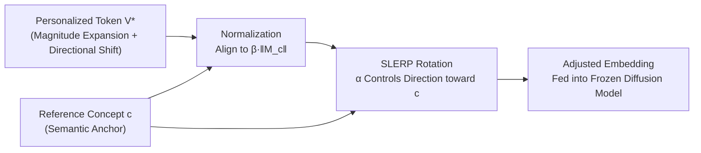

# Mitigating Semantic Collapse in Generative Personalization with Test-Time Embedding Adjustment

**Conference**: ICLR 2026  
**OpenReview**: [https://openreview.net/forum?id=P7sPfvq7Ih](https://openreview.net/forum?id=P7sPfvq7Ih)  
**Code**: [https://github.com/tuananhbui89/Embedding-Adjustment](https://github.com/tuananhbui89/Embedding-Adjustment)  
**Area**: Image Generation / Generative Personalization  
**Keywords**: Text-to-Image Diffusion Models, Generative Personalization, Semantic Collapse, Test-Time Adjustment, Text Embedding, Textual Inversion, DreamBooth  

## TL;DR
This paper identifies and characterizes the "Semantic Collapsing Problem" (SCP) in generative personalization—where the learned personalized token $V^*$ expands in magnitude and shifts in direction within the embedding space, eventually overpowering all context in complex prompts. The authors propose a training-free Test-time Embedding Adjustment (TEA) to pull the magnitude and direction of $V^*$ back toward the original semantic concept $c$, significantly improving text-image alignment.

## Background & Motivation
**Background**: Text-to-image diffusion models have enabled "generative personalization," where users provide a few reference images (of a specific person, pet, or object) and the model learns a unique token $V^*$ (e.g., 'sks', '<new>'). This concept can then be placed into new scenes using arbitrary prompts. Textual Inversion, DreamBooth, and their variants are the primary methodologies.

**Limitations of Prior Work**: Personalized models often "misfire" under complex or multi-concept prompts. For instance, a prompt like `V* in grand canyon` might generate a vivid cat but lose the Grand Canyon background entirely. The community typically attributes this to **language drift** (catastrophic forgetting of pre-trained concepts), limited text embedding expressivity, or reference set entanglement, but the **underlying mechanism has not been rigorously studied**.

**Key Challenge**: Through empirical analysis, the authors discovered a neglected phenomenon: the personalized token **gradually loses its original textual semantics while continuously absorbing visual information** from reference images during training. When combined with descriptive contexts, the generated image is excessively dominated by this concept, causing other intentional elements to be ignored. Essentially, the semantic complexity of the prompt $\lfloor p, V^* \rfloor$ collapses into a simple $\lfloor V^* \rfloor$. The authors name this the **Semantic Collapsing Problem (SCP)** and distinguish it from language drift: SCP is not about the model forgetting other concepts, but about the embedding itself collapsing to encode only visual information without preserving textual semantics.

**Goal**: Identify the root cause of SCP and provide a widely applicable, training-free solution.

**Key Insight**: The root cause is identified as **unconstrained optimization**—the personalized embedding $V^*$ can drift arbitrarily in magnitude and direction ($|M_{V^*}| \gg |M_c|$ and $\cos(M_{V^*}, M_c) \ll 1$). **Since this drift has a specific direction and scale, it can be rotated and scaled back during inference**. By using a training-free Test-time Embedding Adjustment (TEA), the magnitude and direction of $V^*$ are calibrated closer to its reference concept $c$, allowing the token to behave more like a standard word and participate in generation in balance with other tokens.

## Method

### Overall Architecture
TEA does not modify model weights or require additional training. It performs a lightweight "normalization + rotation" rewrite of text embeddings during the inference stage before image generation. Given a pre-trained personalized model (with the U-Net and text encoder remaining intact) and a target semantic anchor $c$, TEA uses a scaling factor $\beta$ to control magnitude and a rotation factor $\alpha$ to pull the direction of $V^*$ toward $c$ via Spherical Linear Interpolation (SLERP). For Textual Inversion (updating token embeddings) and DreamBooth (fine-tuning the text encoder), the same adjustment is implemented at the token and prompt levels, respectively.

### Key Designs

**1. Empirical Characterization of Semantic Collapse: Measuring collapse as distance curves.** Before proposing a solution, the authors established SCP as an observable fact through three sets of experiments. Using an LLM to generate 200 diverse sentences containing keyword $c$ as context set $A$, they constructed prompt sets $P_{V^*} = \{\lfloor a_i, V^* \rfloor\}$ and $P_c = \{\lfloor a_i, c \rfloor\}$. Using Euclidean, Hausdorff, Mahalanobis, and KL metrics, they found that the **cross-set distance $d(P_{V^*}, P_c)$ increases monotonically during training** ( $V^*$ deviates from $c$), while the **intra-set distance $d(P_{V^*}, P_{V^*})$ decreases** (different contexts combined with $V^*$ look increasingly similar). This confirms that $V^*$ overpowers the context.

**2. Dual Nature: SCP is not entirely negative and cannot be crudely eliminated.** Observations using CLIP-I $S(\hat{x}, x_{gt})$ and CLIP-T components ($S_T^p$ for context, $S_T^c$ for concept, $S_T^f$ for full prompt) in image space revealed a nuance: while context alignment $S_T^p$ drops (negative SCP), $S_T^c$ actually increases for **concepts requiring strong visual presence** (positive SCP—$V^*$ anchors the subject against overwhelming context). This necessitates a solution with **adjustable intensity**, motivating the $\alpha$ and $\beta$ knobs in TEA.

**3. Root Cause Localization = Magnitude Expansion + Directional Shift.** The authors attribute SCP to unconstrained optimization. Without regularization, the embedding magnitude of $V^*$ increases significantly (reaching the long-tail of the vocabulary, close to special tokens like `<|startoftext|>`), while the cosine similarity to $c$ drops sharply. Notably, even with gradient clipping in DreamBooth, which only constrains single-step updates, it cannot prevent cumulative drift across iterations.

**4. Test-Time Embedding Adjustment (TEA): Magnitude normalization followed by SLERP rotation.** This is the core mechanism. Step one normalizes $V^*$ and $c$ to a uniform scale determined by the reference concept: $\tilde{M}_{V^*} = \beta \|M_c\| \frac{M_{V^*}}{\|M_{V^*}\|}$ and $\tilde{M}_c = \beta \|M_c\| \frac{M_c}{\|M_c\|}$, where $\beta$ controls the target magnitude relative to $c$. Step two uses SLERP for stable directional adjustment:

$$\hat{M}_{V^*} = \frac{\sin((1-\alpha)\theta)}{\sin\theta}\,\tilde{M}_{V^*} + \frac{\sin(\alpha\theta)}{\sin\theta}\,\tilde{M}_c$$

where $\theta$ is the angle between $\tilde{M}_{V^*}$ and $\tilde{M}_c$, and $\alpha \in [0,1]$ controls the shift toward $c$. These two knobs allow users to trade off visual identity preservation and context restoration.

**5. Prompt-level Variant: Covering DreamBooth-style pipelines.** For DreamBooth methods that fine-tune the encoder without explicitly modifying the embedding matrix $M$, TEA is applied at the prompt level. It takes the text encoder outputs $\tau(\lfloor p, V^* \rfloor)$ and $\tau(\lfloor p, c \rfloor)$ and applies the SLERP formula to **each token $i$** individually. Since it only requires text encoder outputs, TEA acts as a plug-in for nearly all frameworks, including Textual Inversion, DreamBooth, Custom Diffusion, EasyControl, ReVersion, and ClassDiffusion.

## Key Experimental Results

The experiments cover 6 representative personalization methods, 2 architectures (Stable Diffusion and Flux), and 3 datasets (CC101, CelebA-HQ, Relationship), totaling 22 concepts. Metrics include CLIP-T (context $CLIP_T^p$, full prompt $CLIP_T^f$), CLIP-I, DINO-I, and VLM-P/VLM-I based on GPT-4o-mini as a judge.

### Main Results: TEA as a Plug-in for Multiple Methods

| Method | CLIP_T^p ↑ | CLIP_T^f ↑ | CLIP-I ↑ | DINO-I ↑ | VLM-P ↑ | VLM-I ↑ |
|------|-----------|-----------|---------|---------|--------|--------|
| EasyControl (Pet Dog) | 18.54 | 26.02 | 61.33 | 43.71 | 64.25 | 74.00 |
| **+TEA** (Ours) | 18.72 | 26.11 | **64.56** (+3.23) | **48.32** (+4.61) | **66.50** (+2.25) | **77.25** (+3.25) |
| OminiControl (Clock) | 18.11 | 23.90 | 81.37 | 32.41 | 67.50 | 62.25 |
| **+TEA** (Ours) | **18.78** (+0.67) | 23.98 | **83.10** (+1.73) | **34.48** (+2.07) | **71.75** (+4.25) | **64.50** (+2.25) |
| OminiControl (Penguin) | 20.30 | 31.61 | 78.58 | 45.59 | 86.25 | 83.25 |
| **+TEA** (Ours) | 20.33 | **32.02** (+0.41) | **80.64** (+2.06) | **49.37** (+3.78) | **90.50** (+4.25) | **86.75** (+3.50) |

TEA provides stable positive gains across almost all metrics and methods. In particular, the simultaneous improvement in VLM-P (prompt alignment) and DINO-I/CLIP-I (identity fidelity) shows that context is recovered without sacrificing personalization.

### Key Findings
- **Cross-method and Cross-architecture Universality**: TEA improves alignment for models ranging from Textual Inversion to Flux.
- **Unexpected Security Implications**: Applying TEA to models "poisoned" by Anti-DreamBooth can **partially reverse adversarial perturbations**, revealing a "false sense of security" in current anti-personalization defenses.
- **Interpretable Knobs**: $\alpha$ (direction) and $\beta$ (magnitude) correspond directly to the drift axes of SCP, making the adjustment physically meaningful.

## Highlights & Insights
- **Formalizing "Alignment Failure"**: The greatest contribution is defining SCP and reducing it to measurable magnitude/directional drift.
- **Training-free and Test-time Intervention**: Zero retraining cost and high compatibility with existing production pipelines.
- **Honest Observation of Dual Nature**: The authors acknowledge that SCP is not always detrimental, leading to a designed strength-adjustable solution rather than a mandatory erasure.
- **Revealing Defense Vulnerabilities**: Opening Anti-DreamBooth with the same "key" serves as a warning for future copyright protection research.

## Limitations & Future Work
- **Reliance on a Semantic Anchor $c$**: TEA aligns towards $c$; a poorly chosen $c$ (semantically mismatched or too broad) might limit effectiveness.
- **Manual α, β Tuning**: While interpretable, the optimal values vary by concept and prompt, lacking an adaptive selection mechanism.
- **Risk of Weakening Positive Effects**: Pulling $V^*$ back toward $c$ might degrade performance for concepts that rely on high visual salience (positive SCP) to be recognized.
- **Security Double-edged Sword**: The ability to bypass Anti-DreamBooth raises ethical and copyright concerns that require further discussion.

## Related Work & Insights
- **Personalization Mainline**: This work acts as a diagnostic and universal fix for common defects in Textual Inversion and DreamBooth.
- **Alignment Strategies**: Unlike strategies using latent optimization or complex regularization, this paper identifies that the root cause lies in the unconstrained dynamics of embeddings.
- **Utility of SLERP**: Borrowing spherical interpolation from computer graphics to calibrate text embeddings is a valuable paradigm for handling semantic drift geometrically.

## Rating
- **Novelty**: ⭐⭐⭐⭐⭐ — Systematically defines the neglected SCP and reduces "alignment failure" to measurable geometric drift.
- **Experimental Thoroughness**: ⭐⭐⭐⭐ — Covers 6 methods, 2 architectures, and 22 concepts with multi-dimensional evaluation.
- **Writing Quality**: ⭐⭐⭐⭐ — Clear definitions and logical empirical progression.
- **Value**: ⭐⭐⭐⭐ — Highly practical due to its training-free, plug-and-play nature.

<!-- RELATED:START -->

## Related Papers

- [\[CVPR 2026\] Visual Personalization Turing Test](../../CVPR2026/image_generation/visual_personalization_turing_test.md)
- [\[ICLR 2026\] Test-Time Iterative Error Correction for Efficient Diffusion Models](test-time_iterative_error_correction_for_efficient_diffusion_models.md)
- [\[CVPR 2026\] Test-Time Alignment of Text-to-Image Diffusion Models via Null-Text Embedding Optimisation](../../CVPR2026/image_generation/test-time_alignment_of_text-to-image_diffusion_models_via_null-text_embedding_op.md)
- [\[ICLR 2026\] MILR: Improving Multimodal Image Generation via Test-Time Latent Reasoning](milr_improving_multimodal_image_generation_via_test-time_latent_reasoning.md)
- [\[ICLR 2026\] VFScale: Intrinsic Reasoning through Verifier-Free Test-time Scalable Diffusion Model](vfscale_intrinsic_reasoning_through_verifier-free_test-time_scalable_diffusion_m.md)

<!-- RELATED:END -->
## Related Papers

- [\[CVPR 2026\] Visual Personalization Turing Test](../../CVPR2026/image_generation/visual_personalization_turing_test.md)
- [\[ICLR 2026\] Test-Time Iterative Error Correction for Efficient Diffusion Models](test-time_iterative_error_correction_for_efficient_diffusion_models.md)
- [\[CVPR 2026\] Test-Time Alignment of Text-to-Image Diffusion Models via Null-Text Embedding Optimisation](../../CVPR2026/image_generation/test-time_alignment_of_text-to-image_diffusion_models_via_null-text_embedding_op.md)
- [\[ICLR 2026\] MILR: Improving Multimodal Image Generation via Test-Time Latent Reasoning](milr_improving_multimodal_image_generation_via_test-time_latent_reasoning.md)
- [\[ICLR 2026\] VFScale: Intrinsic Reasoning through Verifier-Free Test-time Scalable Diffusion Model](vfscale_intrinsic_reasoning_through_verifier-free_test-time_scalable_diffusion_m.md)

<!-- RELATED:END -->
