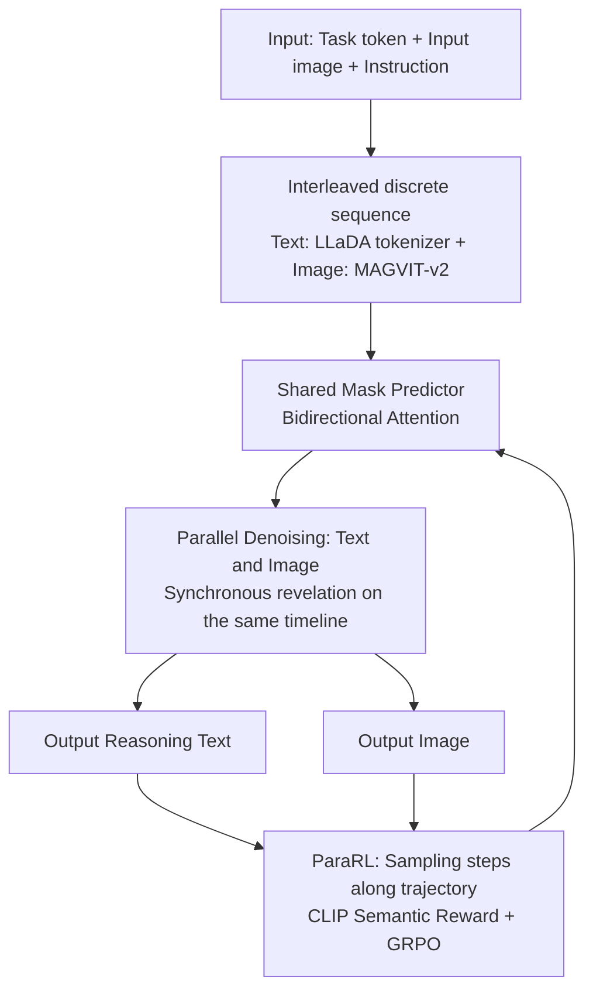

# MMaDA-Parallel: Multimodal Large Diffusion Language Models for Thinking-Aware Editing and Generation

**Conference**: ICLR 2026  
**OpenReview**: [https://openreview.net/forum?id=mkQAd11ovn](https://openreview.net/forum?id=mkQAd11ovn)  
**Code**: [MMaDA-Parallel (HuggingFace + GitHub)](https://huggingface.co/MMaDA-Parallel-Model)  
**Area**: Image Generation / Multimodal Diffusion Language Models  
**Keywords**: thinking-aware generation, discrete diffusion, parallel denoising, cross-modal alignment, reinforcement learning, ParaRL  

## TL;DR
Addressing the issue where serial thinking-aware paradigms ("reasoning before drawing") degrade image quality due to reasoning error propagation, this paper proposes MMaDA-Parallel, a pure discrete diffusion parallel multimodal framework. It allows text and images to interact bidirectionally and generate synchronously across the entire denoising trajectory. By employing Parallel RL (ParaRL) to provide semantic rewards along the trajectory, cross-modal consistency is reinforced, improving Output Alignment by 6.9% over the SOTA open-source model Bagel on the self-constructed ParaBench.

## Background & Motivation
- **Background**: To improve image editing/generation quality under complex instructions, recent works (GoT, Bagel, OmniGen2, etc.) have introduced the "thinking-aware" paradigm. This involving performing Chain-of-Thought reasoning before drawing to guide subsequent image synthesis, which has been shown to improve semantic fidelity.
- **Limitations of Prior Work**: The authors observe a counter-intuitive phenomenon—**reasoning sometimes degrades performance**. In approximately 23% of complex compositional edits on Kris-Bench, image quality decreases after adding thinking (e.g., -2.9 for Causal and -4.8 for Spatial categories in Table 1). The root cause is that low-quality or ambiguous reasoning text actively misleads image generation.
- **Key Challenge**: Existing benchmarks only score the "final image vs. initial instruction," **failing to evaluate the quality of the intermediate reasoning text itself and its consistency with the image**. This leaves the hypothesis of "reasoning drag" unverified. Additionally, serial autoregressive pipelines naturally suffer from error accumulation and semantic drift—once reasoning fails, subsequent drawing cannot correct it.
- **Goal**: To create both an evaluation benchmark for diagnosing "reasoning-image alignment" and a generation framework that avoids serial dependence and allows continuous mutual correction during the generation process.
- **Core Idea**: **① Diagnosis**: Propose ParaBench, the first benchmark to simultaneously evaluate dual-path outputs (text and image) and their alignment. **② Parallel Generation**: Use pure discrete diffusion to allow text and images to bidirectionally attend to each other and denoise synchronously at each step, eliminating autoregressive error propagation at the source. **③ Trajectory-level Reinforcement**: Observing that semantic concepts "emerge synchronously" in both modalities, rewards are distributed across the entire denoising trajectory (ParaRL) rather than only rewarding the final output.

## Method

### Overall Architecture
MMaDA-Parallel represents text and images uniformly as discrete tokens, interleaved into a single sequence with **global bidirectional attention**. A shared mask predictor synchronously denoises both modalities. Training consists of two stages: first, SFT on self-constructed "quadruplet" data (input image, instruction, reasoning trace, output image) to adapt MMaDA into a parallel version, followed by ParaRL post-training using GRPO with semantic alignment rewards along the denoising trajectory.

### Key Designs

**1. ParaBench: A diagnostic benchmark incorporating "reasoning."** Existing benchmarks focus solely on images. The authors constructed 300 high-difficulty prompts (200 editing + 100 generation), using GPT-4.o as a judge to score across six fine-grained dimensions: Text Quality, Text Alignment, Image Consistency, Image Alignment, Image Quality, and most importantly, **Output Alignment**, which measures self-consistency between reasoning and the final image. This "dual-modality ruler" confirmed that performance drops in categories correlate strongly with weak Output Alignment.

**2. Interleaved discrete sequences + Parallel diffusion with a shared mask predictor.** Text uses the LLaDA tokenizer, and images are quantized into discrete visual tokens via a pre-trained MAGVIT-v2. Tokens are concatenated into a sequence `<|task|><|soi|>[img]<|eoi|><|bos|>[text]<|eos|>`. This layout allows outputs to attend to inputs and eliminates the order asymmetry of autoregressive cross-modal pipelines. During training, noise is added only to output segments. Each output token is replaced by [MASK] with probability $\beta_t$. The optimization uses a time-step reweighted cross-entropy:
$$\mathcal{L}_{parallel}(\theta)=-\mathbb{E}_{t,x_0,x_t}\Big[\sum_{i=1}^{L} w(t,i)\,\mathbf{1}[x_t^{(i)}=\text{[MASK]}]\,\log p_\theta(x_0^{(i)}\mid x_t)\Big].$$
A key engineering find is **modality-specific weights**: using $w_{text}(t)=1/t$ and $w_{img}(t)=1$ stabilizes training for image quality and alignment.

**3. ParaRL: Parallel reinforcement learning with rewards across the denoising trajectory.** The authors observed that semantic concepts **emerge synchronously** in both text and images (e.g., when changing a shirt to rainbow colors, the color words and visual features appear at the same time step). This implies cross-modal alignment is built incrementally. ParaRL treats the semantic alignment between text fragments and image content at specific denoising steps as dense rewards. For tractability, **sparse optimization** is used: each rollout selects $|S|=s$ steps to calculate rewards and normalized advantages, following the diffusion-GRPO objective:
$$J_{policy}(\theta)=\mathbb{E}\Big[\sum_{i=1}^{G}\sum_{t\in S}\frac{1}{|\tau_i(t)|}\sum_{o\in\tau_i(t)}C_\epsilon\big(\tfrac{\pi_\theta(o\mid\cdot)}{\pi_{old}(o\mid\cdot)},A_{i,t}\big)\Big]-\beta\,\mathrm{KL}(\pi_\theta\Vert\pi_{old}).$$
This approach **obviates the need for training a PRM or value function**; in the parallel setting, intermediate fragments are semantically sufficient for CLIP-based text-image similarity rewards.

## Key Experimental Results

### Main Results (ParaBench, GPT-4.o as judge)

| Model | Text Qual. | Text Align. | Image Cons. | Image Align. | Image Qual. | Output Align. | Overall |
|---|---|---|---|---|---|---|---|
| GPT-4o (Closed) | 92.5 | 93.4 | 86.2 | 85.7 | 88.1 | 69.5 | 85.9 |
| Gemini-2.5 (Closed) | 94.1 | 95.2 | 88.5 | 76.2 | 90.2 | 63.4 | 84.6 |
| Bagel (w/ think) | 82 | 70.5 | 76.7 | 63.4 | 81.5 | 52.9 | 71.2 |
| Show-o* (tuned) | 75.2 | 70.7 | 69.1 | 57.5 | 78.5 | 48.9 | 66.6 |
| **MMaDA-Parallel w/o ParaRL** | 76.5 | 70.4 | 70.5 | 58.2 | 80.5 | 51.5 | 67.9 |
| **MMaDA-Parallel w/ ParaRL** | 80.4 | 71 | 73.4 | 63.2 | 81.2 | **59.8** | 71.5 |

> Output Alignment of 59.8 is the highest among open-source models, **6.9 points** higher than Bagel (52.9), despite using significantly less training data.

### Ablation Study
**Serial vs. Parallel Denoising (Table 3)**

| Denoising | Text Align. | Image Align. | Output Align. |
|---|---|---|---|
| Sequential | 70.6 | 56.1 | 48.9 |
| **Parallel** | 70.4 | 58.2 | **51.5** |

**Output-level vs. Trajectory-level RL (Table 4)**

| Model | Text Align. | Image Align. | Output Alignment |
|---|---|---|---|
| before RL | 70.4 | 58.2 | 51.5 |
| w/ Output-level RL | 70.7 | 62.3 | 53.6 |
| **w/ ParaRL (Ours)** | 71 | 63.2 | **59.8** |

## Key Findings
- **Reasoning can indeed drag performance**: Table 1 shows Causal/Spatial categories dropping -2.9/-4.8 when thinking is added, correlating with lower Output Alignment. This confirms that bad reasoning "actively misleads" generation.
- **Parallel > Sequential**: Output Alignment improves from 48.9 to 51.5, verifying that synchronous mutual correction reduces error propagation.
- **Trajectory-level > Output-level**: ParaRL pushes Output Alignment from 53.6 to 59.8 with more stable training curves.
- **High Data Efficiency**: Equalized or surpassed the alignment metrics of Bagel using only 150K samples.

## Highlights & Insights
- **"Diagnosis-Framework-Reinforcement" Loop**: Identifying "reasoning drag" with ParaBench, eliminating the cause structurally with parallel diffusion, and treating it with ParaRL on the trajectory.
- **"Semantic Synchronous Emergence"**: This observation provides a motivation for ParaRL and elegantly solves the issue of lacking intermediate semantics for PRMs by using CLIP as a trajectory reward source.
- **Unified Text-Image via Pure Discrete Diffusion**: Replacing the hard dependency of "reasoning before drawing" with a bidirectional "reasoning while drawing" interaction represents a structural shift in thinking-aware paradigms.

## Limitations & Future Work
- **Dependency on LLM-as-judge**: Relies on GPT-4.o for six-dimensional scoring, which may introduce model-specific biases.
- **Gap with Closed-source Models**: Output Alignment (59.8) and overall score (71.5) still lag behind GPT-4o.
- **Reward Source Limitations**: Vanilla CLIP has limitations in fine-grained compositional semantics (counting, spatial relations), capping performance on difficult categories.
- **Sparse Step Approximation**: ParaRL calculates rewards only at pre-selected $s$ steps, representing a trade-off for efficiency; the theoretical optimal density remains unexplored.

## Related Work & Insights
- **Thinking-aware Generation**: While works like Chameleon, GoT, and Bagel utilize serial autoregressive pipelines, this paper identifies those pipelines as the root of error accumulation.
- **Discrete Diffusion Language Models**: Inspired by LLaDA and MMaDA, this work extends single-modality discrete diffusion to multimodal synchronous denoising.
- **Process-level Optimization**: Adapts concepts from process-level RL and diffusion-GRPO, but innovates by bypassing explicit PRMs via the "semantic sufficiency" of intermediate parallel fragments.

## Rating
- **Novelty**: ⭐⭐⭐⭐ — Restructures thinking-aware generation into parallel discrete diffusion and proposes ParaRL to bypass the need for expensive PRMs.
- **Experimental Thoroughness**: ⭐⭐⭐⭐ — Comprehensive ParaBench metrics and multiple ablation studies, though limited to a single judge.
- **Writing Quality**: ⭐⭐⭐⭐ — Clear narrative flow from diagnosis to framework to reinforcement.
- **Value**: ⭐⭐⭐⭐ — High potential for application in tasks where sequential steps suffer from cascading errors by offering a parallel recipe.

<!-- RELATED:START -->

<!-- RELATED:END -->

## Related Papers

- [\[ACL 2026\] Multimodal Large Language Models for Multi-Subject In-Context Image Generation](../../ACL2026/image_generation/multimodal_large_language_models_for_multi-subject_in-context_image_generation.md)
- [\[ICLR 2026\] Consolidating Reinforcement Learning for Multimodal Discrete Diffusion Models](consolidating_reinforcement_learning_for_multimodal_discrete_diffusion_models.md)
- [\[ICLR 2026\] Locality-aware Parallel Decoding for Efficient Autoregressive Image Generation](locality-aware_parallel_decoding_for_efficient_autoregressive_image_generation.md)
- [\[ICLR 2026\] Autoregressive Image Generation with Randomized Parallel Decoding](autoregressive_image_generation_with_randomized_parallel_decoding.md)
- [\[ICLR 2026\] TwinFlow: Realizing One-step Generation on Large Models with Self-adversarial Flows](twinflow_realizing_one-step_generation_on_large_models_with_self-adversarial_flo.md)

<!-- RELATED:END -->
