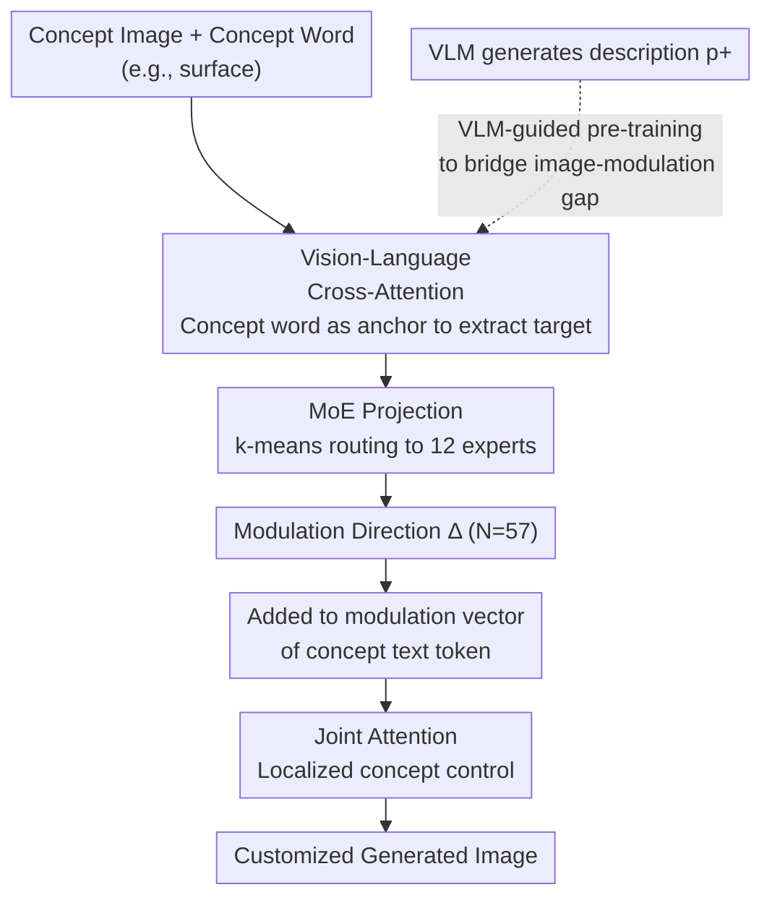

# Mod-Adapter: Tuning-Free and Versatile Multi-concept Personalization via Modulation Adapter

**Conference**: ICLR 2026  
**arXiv**: [2505.18612](https://arxiv.org/abs/2505.18612)  
**Code**: [Project Page](https://weizhi-zhong.github.io/Mod-Adapter)  
**Area**: Diffusion Models / Personalized Generation  
**Keywords**: Multi-concept Personalization, Tuning-Free, DiT Modulation Space, Mixture-of-Experts, VLM Pre-training  

## TL;DR

Mod-Adapter is proposed, a tuning-free multi-concept personalization method that predicts concept-specific modulation directions within the DiT modulation space. It achieves decoupled customized generation of objects and abstract concepts (pose, lighting, material, etc.), significantly outperforming existing methods in multi-concept personalization.

## Background & Motivation

**Background**: Personalized text-to-image generation aims to synthesize target concepts based on user-provided reference images. Most existing methods focus on object concepts (people, animals, daily necessities), and multi-concept personalization methods primarily handle combinations of multiple objects.

**Limitations of Prior Work**: (a) Existing tuning-free methods (e.g., IP-Adapter, MS-Diffusion) cannot decouple objects from abstract concepts—when given an image of a person in a specific pose, they directly copy the entire person rather than just extracting the pose; (b) While TokenVerse supports abstract concepts, it requires test-time fine-tuning for each new image, which is time-consuming and prone to overfitting.

**Key Challenge**: Abstract concepts (pose, lighting, material) are not independent visual entities; they are strongly coupled with objects, making them difficult to extract separately from images. Simultaneously, there exists a massive gap when mapping extracted visual features to the DiT modulation space.

**Goal**: (i) Generalize to new concepts without test-time fine-tuning; (ii) Support simultaneous customization of objects and abstract concepts; (iii) Achieve decoupled control between multiple concepts.

**Key Insight**: Exploiting the locality and semantic additivity of the AdaLN modulation space in DiT—using different modulation vectors for different tokens can achieve localized conceptual control.

**Core Idea**: A Mod-Adapter module is trained to predict concept-specific modulation directions, utilizing VLM-guided pre-training to bridge the significant gap between the image and modulation spaces.

## Method

### Overall Architecture

The paper addresses the simultaneous customization of objects and abstract concepts without test-time fine-tuning. The key observation is that the AdaLN modulation space in DiT (FLUX is used in the paper) exhibits locality and semantic additivity—assigning different modulation vectors to specific tokens allows the control effect to be localized to concept-related image regions. Mod-Adapter follows this path by transforming "customizing a concept" into "predicting a set of concept-specific modulation directions."

Specifically, given a concept image and a corresponding concept word (e.g., "surface"), Mod-Adapter outputs modulation directions $\{\Delta_i \mid i=1,\dots,N\}$, where $N=57$ corresponds to the 57 DiT blocks in FLUX. These directions are added to the modulation vectors of the respective concept text tokens. After passing through the joint attention layers, they only influence the image regions associated with that concept. During multi-concept inference, the modulation directions of each concept act on their respective text tokens independently, achieving decoupled control.

### Key Designs

**1. Vision-Language Cross-Attention: Using concept words as anchors to extract target concepts from images**

Directly using global features from the concept image brings in irrelevant content—this is the root cause of why existing tuning-free methods "copy-paste the whole object" when handling pose/material. Here, concept words are used as anchors for directional extraction: the concept word is passed through a CLIP text encoder and an MLP mapping layer to obtain a neutral feature, which is then projected into $N$ queries (each with sinusoidal positional encoding to distinguish DiT blocks). The concept image passes through a CLIP image encoder to provide keys/values. Visual features for each block are extracted via $\text{Attention}(Q_i, K, V)$. Leveraging CLIP's inherent image-text alignment, the concept word acts as a key to guide attention toward parts of the image that truly belong to the concept.

**2. Mixture-of-Experts (MoE) Projection: Mapping different concept types to modulation space via clustering-based routing**

Extracted visual features must be mapped into the DiT modulation space. However, mapping patterns for objects, materials, and poses differ significantly, making it difficult for a single MLP to learn. Thus, 12 expert MLPs are introduced, each responsible for a category of concepts with similar mapping patterns. Routing uses a parameter-free scheme: k-means clustering is performed on neutral features of all concept words in the training set, and concepts are assigned to experts based on cluster results. This avoids the expert imbalance common in learnable linear gating (where a few experts are repeatedly selected while others remain idle) by naturally distributing concepts according to feature distribution.

**3. VLM-guided Pre-training: Bridging the image–modulation gap with text descriptions first**

There is a huge gap between the concept image space and the DiT modulation space, making end-to-end training difficult to converge (removing this step causes CP·PF to plunge from 0.62 to 0.17). The authors first perform a lightweight pre-training to give Mod-Adapter a solid initialization: a VLM generates a detailed text description $p^+$ (e.g., "transparent cyan-green glass surface") for the concept image. This description is encoded and used as a supervision signal for the modulation space, aligning Mod-Adapter's output with it. The pre-training loss is:

$$\mathcal{L}_{\text{pretrain}} = \frac{1}{N}\sum_{i=1}^N \big\|F_i^+ - \mathcal{M}(\text{CLIP}(p^+))\big\|_2^2$$

This step is efficient as it bypasses DiT forward propagation. Furthermore, the VLM's strong understanding provides a high-quality semantic bridge, translating visual information into text before entering the modulation space, which is far more stable than directly bridging the gap.

### Loss & Training

Only $\mathcal{L}_{\text{pretrain}}$ (MSE loss) is used during the pre-training phase without DiT. The formal training phase switches to the standard diffusion denoising loss of FLUX. Training data blends MVImgNet (objects), AFHQ (animal faces), and FLUX self-distillation synthetic data (abstract concepts), totaling 106K images.

## Key Experimental Results

### Main Results

| Method | Multi-concept CP | Multi-concept PF | Multi-concept CP·PF | Single-concept CP·PF |
|------|----------|----------|-------------|-------------|
| Emu2 | 0.53 | 0.48 | 0.25 | 0.42 |
| MIP-Adapter | 0.68 | 0.55 | 0.37 | 0.27 |
| MS-Diffusion | 0.62 | 0.51 | 0.32 | 0.23 |
| TokenVerse (tuning) | 0.56 | 0.56 | 0.31 | 0.38 |
| **Ours** | **0.70** | **0.89** | **0.62** | **0.54** |

The multi-concept comprehensive score CP·PF reached 0.62, a **67.6%** improvement over the runner-up MIP-Adapter (0.37).

### Ablation Study

| Configuration | Multi-concept CP·PF | Single-concept CP·PF |
|------|-------------|-------------|
| w/o k-means routing | 0.49 | 0.44 |
| w/o MoE | 0.35 | 0.42 |
| w/o VL-attn | 0.39 | 0.49 |
| w/o pre-training | 0.17 | 0.24 |
| **Full model** | **0.62** | **0.54** |

### Key Findings

- VLM pre-training is the **most critical** component—removing it causes CP·PF to drop from 0.62 to 0.17, indicating a massive gap between image and modulation spaces.
- MoE is more important than a single MLP (0.62 vs 0.35), and k-means routing outperforms learnable routing (0.62 vs 0.49).
- In user studies (32 participants, 4000 votes), Mod-Adapter leads by a large margin in both CP and PF (Multi-concept CP 4.29/5, PF 4.40/5).
- Existing tuning-free methods generally fail on abstract concepts—they "copy-paste" the original object instead of extracting abstract attributes.

## Highlights & Insights

- **First tuning-free method for abstract concept personalization**: By utilizing the locality and semantic additivity of the DiT modulation space, it achieves unified and decoupled customization of objects and abstract concepts, which was unattainable for previous tuning-free methods.
- **VLM-guided Pre-training**: Leveraging VLM's image understanding as a bridge to narrow the image-modulation gap is an elegant warm-up strategy. It requires no backpropagation through DiT, ensuring low pre-training overhead.
- **k-means MoE Routing**: Replacing learnable gating with a parameter-free clustering method fundamentally solves the expert imbalance problem. The approach is simple yet highly effective.

## Limitations & Future Work

- The model has 1.67B parameters; while it is the only part requiring training, it is significantly heavier than TI-based methods.
- Training data for abstract concepts is synthesized via FLUX self-distillation, potentially limiting data quality and diversity.
- Inference speed is not discussed—multi-concept inference requires running Mod-Adapter separately for each concept.
- Based on the FLUX architecture, migrating to non-DiT architectures (e.g., U-Net) requires redesign.

## Related Work & Insights

- **vs TokenVerse**: Also utilizes the DiT modulation space, but TokenVerse requires fine-tuning an MLP for every image, whereas Mod-Adapter is a tuning-free generalized solution.
- **vs IP-Adapter/MIP-Adapter**: These inject image features via cross-attention but lack localized control capabilities, failing to handle abstract concepts.
- **vs MS-Diffusion**: Uses a layout-guided scheme for multi-subject handling but is similarly limited to object concepts.
- The idea of directional manipulation in modulation space might inspire other controllable generation tasks (e.g., emotion control, style transfer).

## Rating

- Novelty: ⭐⭐⭐⭐ First to unify object and abstract concept customization in a tuning-free framework; modulation space manipulation is a novel perspective.
- Experimental Thoroughness: ⭐⭐⭐⭐ Includes quantitative + qualitative + user studies + complete ablations, though lacks inference efficiency analysis.
- Writing Quality: ⭐⭐⭐⭐ Clear motivation, detailed method description, and intuitive illustrations.
- Value: ⭐⭐⭐⭐⭐ High practical value; tuning-free multi-concept personalization has broad application scenarios.

<!-- RELATED:START -->

## Related Papers

- [\[CVPR 2026\] UniVerse: A Unified Modulation Framework for Segmentation-Free, Disentangled Multi-Concept Personalization](../../CVPR2026/image_generation/universe_a_unified_modulation_framework_for_segmentation-free_disentangled_multi.md)
- [\[CVPR 2025\] UNIC-Adapter: Unified Image-Instruction Adapter with Multi-modal Transformer for Image Generation](../../CVPR2025/image_generation/unic-adapter_unified_image-instruction_adapter_with_multi-modal_transformer_for_.md)
- [\[ICLR 2026\] ACCORD: Alleviating Concept Coupling through Dependence Regularization for Text-to-Image Diffusion Personalization](accord_alleviating_concept_coupling_through_dependence_regularization_for_text-t.md)
- [\[ICCV 2025\] Trans-Adapter: A Plug-and-Play Framework for Transparent Image Inpainting](../../ICCV2025/image_generation/trans-adapter_a_plug-and-play_framework_for_transparent_image_inpainting.md)
- [\[ICLR 2026\] AEGIS: Adversarial Target-Guided Retention-Data-Free Robust Concept Erasure from Diffusion Models](aegis_adversarial_target-guided_retention-data-free_robust_concept_erasure_from_.md)

<!-- RELATED:END -->
