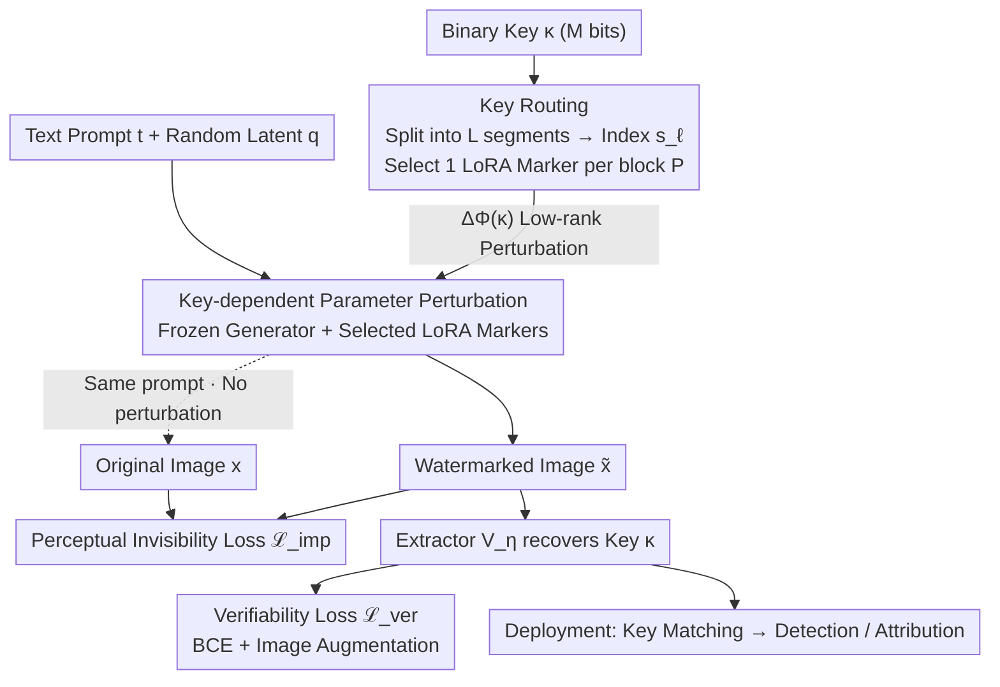

# MOLM: Mixture of LoRA Markers

**Conference**: ICLR 2026  
**arXiv**: [2510.00293](https://arxiv.org/abs/2510.00293)  
**Code**: Undisclosed  
**Area**: Image Generation  
**Keywords**: Watermarking, LoRA, Diffusion Models, Routing Mechanism, Robustness

## TL;DR

The MOLM watermarking framework is proposed, reinterpreting LoRA adapters as watermark markers. It embeds verifiable and robust watermarks into frozen generative models through a binary key-driven routing mechanism, eliminating the need for per-key retraining.

## Background & Motivation

- High-quality images generated by diffusion models raise concerns regarding authenticity and ownership.
- Existing watermarking methods face three major challenges:
  1. **Fragility**: Vulnerability to adversarial attacks (e.g., regeneration attacks, averaging attacks).
  2. **Quality Conflict**: Improving robustness often introduces visible degradation.
  3. **High Cost**: Changing watermark keys requires expensive retraining (e.g., Stable Signature requires per-key training).

## Method

### Overall Architecture

MOLM addresses the problem of embedding watermarks into frozen diffusion models without compromising image quality, ensuring attack resistance, and allowing key swapping **without retraining**. The approach treats the watermark as a key-dependent parameter perturbation applied to the generator, formulated as $\tilde{\mathbf{x}} = \mathcal{G}_{\Phi + \Delta\Phi(\kappa)}(\mathbf{q}, \mathbf{t})$—where the backbone $\Phi$ remains frozen, and the watermark information is fully compressed into the perturbation $\Delta\Phi(\kappa)$. The pipeline operates as follows: an $M$-bit binary key $\kappa$ is divided into multiple segments. Each segment indices one of a set of pre-placed LoRA adapters. The selected adapters are integrated in parallel into specific blocks of the generator to instantiate $\Delta\Phi(\kappa)$. The frozen generator performs sampling with these adapters to output the watermarked image $\tilde{\mathbf{x}}$. During verification, an extractor retrieves the key from the image for detection or attribution. Training only optimizes the adapters and the extractor, using a perceptual loss to maintain image quality and a key recovery loss to ensure readability.

### Key Designs

**1. Key-dependent Parameter Perturbation: Unifying Diverse Watermarks into a Learnable Weight Offset**

Existing watermarking methods—codec-based, backdoor-based, and sampling-based—are often idiosyncratic and difficult to compare. MOLM reduces them to a unified form: a key-dependent perturbation superimposed on a frozen backbone $\Phi$, where the generation is rewritten as $\tilde{\mathbf{x}} = \mathcal{G}_{\Phi + \Delta\Phi(\kappa)}(\mathbf{q}, \mathbf{t})$. Here, $\Delta\Phi(\kappa)$ serves as the total carrier of the watermark. This perspective allows properties like "watermark strength, capacity, and key swappability" to be transformed into a **structural design** problem for $\Delta\Phi$. As long as the perturbation is parametric and routable, the backbone remains untouched when changing keys. This paves the way for instantiating perturbations with LoRA and switching keys via routing, distinguishing it from methods that bind perturbations to a single key.

**2. LoRA Markers + Key Routing: Segmented Indexing for Zero-Retraining Key Swapping**

This is the core mechanism of MOLM designed to achieve "key swapping without retraining." It pre-selects $L$ blocks in the generator and places $P$ low-rank LoRA adapters in parallel as "markers" in each block, training $L\times P$ adapters simultaneously. During generation, an $M$-bit key is split into $L$ non-overlapping segments, each consisting of $\log_2 P$ bits. Each segment is converted into a decimal index $s_\ell \in [P]$, which selects the $s_\ell$-th adapter in the $\ell$-th block. The forward pass of the selected block becomes $\boldsymbol{h}_\ell = \mathcal{F}_\ell(\boldsymbol{h}_{\ell-1}) + \alpha\,\mathcal{A}_\ell^{(s_\ell)}(\boldsymbol{h}_{\ell-1})$, adding a low-rank branch of the selected adapter to the original output (where $\alpha$ is a fixed scaling factor; unselected blocks remain $\boldsymbol{h}_\ell=\mathcal{F}_\ell(\boldsymbol{h}_{\ell-1})$). The entire routing path $\{s_\ell\}_{\ell\in[L]}$ serves as the "fingerprint" for the key. By default, $L=14$ ResNet blocks in the VAE decoder are used with $P=4$, encoding 2 bits per block for a total key size of $M=14\times 2=28$ bits. Since the key only determines which pre-trained branches are activated without modifying weights, key swapping requires zero retraining—a fundamental advantage over per-key training methods like Stable Signature. Distributing the key across multiple blocks also provides inherent redundancy against localized attacks.

> ⚠️ The routing mask remains constant across the entire denoising trajectory (the same key always follows the same execution path), as per the original text.

**3. Extractor + Joint Training Objective: Ensuring Key Readability Without Quality Loss**

Effective embedding requires the watermark to be both imperceptible and recoverable, addressing the "robustness-quality trade-off." MOLM uses a deep network extractor $\mathcal{V}_\eta$ to map the image to $M$ logits, which are rounded bit-wise after a sigmoid function to obtain the recovered key $\tilde{\kappa}$. Training optimizes only the adapter parameters $\Psi$ and extractor parameters $\eta$, using two losses to explicitly balance the conflict. The perceptual invisibility loss minimizes the difference between watermarked images and original images across multiple feature layers:

$$\mathcal{L}_{\text{imp}} = \mathbb{E}_{\kappa} \frac{1}{N} \sum_{n=1}^N \sum_{k=1}^K w_k \big\|\varphi_k(\mathcal{G}_{\Phi+\Psi(\kappa)}(\mathbf{q}, \mathbf{t}_n)) - \varphi_k(\mathcal{G}_\Phi(\mathbf{q}, \mathbf{t}_n))\big\|_2^2$$

where $\{\varphi_k\}$ are fixed perceptual feature extractors (e.g., LPIPS) and $w_k$ are layer-wise weights. The verifiability loss uses binary cross-entropy to force the extractor to recover the key bit-by-bit:

$$\mathcal{L}_{\text{ver}} = \mathbb{E}_{T \sim \Pi}\,\frac{1}{NM} \sum_{n,m} \big[-\kappa_m \log \sigma(u_m) - (1-\kappa_m)\log(1-\sigma(u_m))\big]$$

The critical step is $T\sim\Pi$: during training, watermarked images are randomly subjected to augmentations such as cropping, rotation, and compression before being fed to the extractor. This ensures decoding remains valid under these perturbations—integrating robustness during training rather than as a post-hoc measure. The total objective $\min_{\Psi, \eta} [\mathcal{L}_{\text{ver}} + \lambda \mathcal{L}_{\text{imp}}]$ uses the weight $\lambda$ to explicitly balance recoverability and image quality.

## Key Experimental Results

### Detection and Robustness Comparison (Stable Diffusion v1.5, MS-COCO)

| Method | FID(↓) | SSIM(↑) | Clean | Crop | Rot | Resize | Bright | JPEG | Key Size |
|------|--------|---------|-------|------|-----|--------|--------|------|---------|
| Stable Signature | 29.5 | 0.85 | 0.99 | 0.97 | 0.56 | 0.72 | 0.95 | 0.89 | 48 |
| AquaLoRA | 30.5 | 0.63 | 0.95 | 0.91 | 0.45 | 0.91 | 0.72 | 0.94 | 48 |
| WOUAF | 27.8 | 0.73 | 0.98 | 0.96 | 0.85 | 0.71 | 0.98 | 0.98 | 32 |
| **MOLM** | **27.7** | 0.77 | 0.98 | 0.91 | **0.84** | **0.90** | 0.95 | 0.89 | 28 |

### Robustness to Adversarial Attacks (After Augmented Training)

| Attack Type | Parameters | Bit Acc. | FID |
|---------|------|----------|-----|
| Cheng2020 Compression | q=1/3/6 | 0.94/0.95/0.97 | 30.1/28.9/28.7 |
| Diffusion Regeneration | steps=30/60/100 | 0.85/0.85/0.82 | 30.2/29.9/31.2 |
| PGD Adversarial | ε=10⁻³/10⁻²/10⁻¹ | 1.00/0.99/0.96 | 28.4/28.6/29.0 |
| Averaging Attack (5k imgs) | k=5000 | ≥0.96 | - |

### Key Findings

1. MOLM achieves the best overall robustness with a smaller key size (28 bits vs. 48 bits).
2. Under averaging attacks, MOLM maintains $\geq 0.96$ accuracy (5000 images), while WOUAF drops to $< 0.90$.
3. Under forgery attacks, MOLM results remain at the level of random guessing ($\approx 0.5$), effectively preventing forgery.
4. Training requires only approximately 1 day (on a single A100), with no additional inference overhead.

## Highlights & Insights

1. **Conceptual Innovation**: Redefines LoRA from a model adaptation tool to a watermark carrier, providing a novel perspective.
2. **No Per-key Training**: Capacity scales naturally through the number of routing layers and adapters.
3. **Distributed Redundant Encoding**: Mapping analysis indicates that keys are redundantly encoded across multiple blocks, enhancing robustness.
4. **Sampler Independence**: Does not rely on specific samplers (unlike methods like Tree-Ring that require deterministic sampling).

## Limitations

- UNet routing experiments led to a decrease in generation quality; key size and fidelity require careful balancing.
- Verified only on SD v1.5 and FLUX; other architectures require further testing.
- The 28-bit key capacity may be insufficient for large-scale user attribution.
- Watermarks are non-transferable if an attacker independently retrains the model (intended by design).

## Related Work

- **Codec-based Methods**: Hidden, Stable Signature
- **Backdoor Methods**: DreamBooth fine-tuning, SleeperMark
- **Generative Process Methods**: Tree-Ring, Gaussian Shading, ROBIN
- **LoRA Mixture of Experts**: MoLE

## Rating

- Novelty: ⭐⭐⭐⭐⭐ — The conceptual shift of LoRA-as-watermark is highly ingenious.
- Technical Depth: ⭐⭐⭐⭐ — Complete framework design and comprehensive attack evaluation.
- Experimental Thoroughness: ⭐⭐⭐⭐ — Validation across multiple attacks, datasets, and architectures.
- Value: ⭐⭐⭐⭐ — An efficient and deployable watermarking solution.

<!-- RELATED:START -->

## Related Papers

- [\[ICML 2026\] UnHype: CLIP-Guided Hypernetworks for Dynamic LoRA Unlearning](../../ICML2026/image_generation/unhype_clip-guided_hypernetworks_for_dynamic_lora_unlearning.md)
- [\[ICLR 2026\] Multi-Subspace Multi-Modal Modeling for Diffusion Models: Estimation, Convergence and Mixture of Experts](multi-subspace_multi-modal_modeling_for_diffusion_models_estimation_convergence_.md)
- [\[CVPR 2026\] Mixture of Style Experts for Diverse Image Stylization](../../CVPR2026/image_generation/mixture_of_style_experts_for_diverse_image_stylization.md)
- [\[ECCV 2024\] Implicit Style-Content Separation using B-LoRA](../../ECCV2024/image_generation/implicit_style-content_separation_using_b-lora.md)
- [\[AAAI 2026\] T-LoRA: Single Image Diffusion Model Customization Without Overfitting](../../AAAI2026/image_generation/t-lora_single_image_diffusion_model_customization_without_overfitting.md)

<!-- RELATED:END -->
