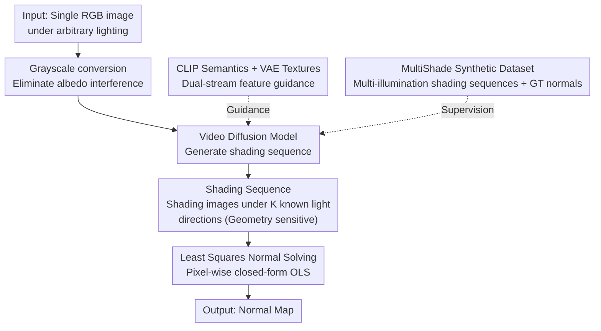

# Monocular Normal Estimation via Shading Sequence Estimation

**Conference**: ICLR 2026 (Oral)  
**arXiv**: [2602.09929](https://arxiv.org/abs/2602.09929)  
**Code**: [GitHub](https://github.com/LMozart/ICLR2026-RoSE)  
**Area**: Image Generation / 3D Vision  
**Keywords**: Normal Estimation, Shading Sequence, Video Generation Models, Least Squares Solving, Monocular 3D Reconstruction

## TL;DR

This paper proposes RoSE, a method that reformulates monocular normal estimation as a shading sequence estimation problem. It leverages image-to-video (I2V) generation models to predict shading sequences under multiple illuminations and then converts these sequences into normal maps via a simple least squares method, achieving SOTA performance on real-world benchmarks.

## Background & Motivation

Monocular normal estimation aims to estimate the normal map of an object from a single RGB image under arbitrary lighting, serving as a critical intermediate representation for 3D reconstruction and rendering. The core issue faced by existing methods is **3D Misalignment**:

**Visually plausible surfaces but distorted geometry**: Existing deep models directly predict normal maps. While results look reasonable visually, the reconstructed 3D surfaces often fail to match the true geometric details.

**Analysis of Causes — Subtle color variations**: Differences between geometric structures in normal maps are reflected only through relatively weak color changes. Models struggle to accurately distinguish and reconstruct different geometric structures from these subtle color differences.

**Limitations of the direct prediction paradigm**: The current "Input RGB → Direct Normal Map output" paradigm forces the model to perform both lighting decoupling and geometric inference in a single inference step, which is overly difficult.

The core insight of this paper is: **Shading sequences (shading variations under multiple illuminations) are more sensitive to geometric information.** Different surface normal directions produce distinct shading patterns under different light directions, which are much more significant than color differences in a single normal map. Therefore, estimating shading sequences first and then recovering normals from them effectively alleviates the 3D misalignment problem.

## Method

### Overall Architecture

RoSE decomposes the "single RGB → normal map" one-step mapping into three sequential processes: first, the input RGB is converted to grayscale to eliminate albedo interference. Then, an image-to-video (I2V) diffusion model, guided by CLIP semantic features and VAE texture features, uses the grayscale image as the first frame to generate a shading sequence under $K$ known light directions. Finally, an ordinary least squares (OLS) solver is applied pixel-wise to recover normals from this shading sequence. In this pipeline, only "shading sequence generation" requires learning, while normal estimation reduces to a linear problem with a closed-form solution. The supervision required for training comes from the synthetic dataset MultiShade.

### Key Designs

**1. Shading Sequence Reconstruction Paradigm: Replacing "indistinguishable color differences" with "amplified shading variations"**

Existing methods force models to read geometry from a single normal map, where structural differences only manifest as weak RGB deviations—the root of 3D misalignment. This paper instead requires the model to predict a set of shading sequences—shading images of the same object under different known light directions $\{l_1, l_2, \dots, l_K\}$. Based on the Lambertian reflectance model, pixel intensity satisfies $I_k = \rho \,(n \cdot l_k)$, where $\rho$ is albedo, $n$ is the normal, and $l_k$ is the $k$-th light direction. Points with slightly different normals exhibit significantly different intensity curves under multiple lights. This difference is far more pronounced than color deviations in a single normal map, effectively "amplifying" geometric information and making it easier for the model to capture.

**2. Shading Sequence Generation via Video Diffusion: Leveraging I2V temporal consistency for multi-illumination frames**

A shading sequence is essentially a "video" that changes continuously with lighting, naturally fitting the ability of I2V models to generate temporally consistent sequences. RoSE treats the grayscale input as the initial frame and uses an I2V diffusion model to generate subsequent frames corresponding to different light directions. To ensure semantic consistency and texture accuracy, generation is guided by two feature streams: the CLIP encoder provides global semantics to help the model identify the object, while the VAE encoder provides fine-grained textures and structures to constrain the correctness of local shading. During training, only the video diffusion model is updated, while CLIP and VAE encoders remain frozen.

**3. Least Squares Normal Solving: Reducing normal recovery to a closed-form linear solution**

After obtaining $K$ shading frames and their corresponding light directions, the Lambertian equation becomes a system of linear equations $I = L\,n$ for each pixel, where $I \in \mathbb{R}^{K}$ is the intensity vector, $L \in \mathbb{R}^{K \times 3}$ is the stacked light direction matrix, and $n \in \mathbb{R}^3$ is the target normal. The solution can be analytically found via ordinary least squares (OLS) as $n = (L^{\top} L)^{-1} L^{\top} I$. This requires no additional learning, has minimal computational overhead, and is mathematically optimal. Since the shading definition includes a $\max(\cdot,0)$ truncation, negative values cause bias in OLS; thus, only frames with intensity $> 0$ are used as valid equations. Lights are arranged in a ring on the upper hemisphere (9 lights work best) to ensure solvability. This step clearly separates "difficult shading estimation" from "simple linear solving," preventing error accumulation and avoiding fitting what already has a closed-form solution.

**4. MultiShade Synthetic Dataset: Using rendering to obtain multi-illumination supervision unavailable in the real world**

It is nearly impossible to collect multi-illumination shading sequences with ground truth normals for the same real-world object. Therefore, this paper constructs the large-scale synthetic dataset MultiShade. It covers diverse 3D shapes, materials, and lighting conditions, providing object images, shading sequences, and ground truth normals directly from the rendering pipeline. This diversity enhances the model's generalization and robustness to real-world data.

### Loss & Training

The video diffusion model is trained using the standard denoising loss, with all data sourced from the MultiShade synthetic set. The CLIP and VAE encoders are kept frozen, and only the diffusion backbone is trained. The normal solving stage during inference is purely analytical and involves no training.

## Key Experimental Results

### Main Results

| Dataset | Metric | RoSE | Prev. SOTA | Description |
|--------|------|------|----------|------|
| DiLiGenT | Mean Angular Error (MAE)↓ | SOTA | - | Benchmark for real-world object normal estimation |
| DiLiGenT-102 | MAE↓ | SOTA | - | Larger-scale real benchmark |
| Apple/Google Dataset | MAE↓ | SOTA | - | Industrial-grade object scan data |
| Complex Object Scenes | MAE↓ | SOTA | - | Objects with complex geometry and materials |

### Ablation Study

| Configuration | Key Metric | Description |
|------|---------|------|
| Direct Normal Prediction vs Shading Sequence | Shading sequence significantly better | Validates effectiveness of the core paradigm innovation |
| No CLIP guidance | Performance drop | Semantic features are important for generation quality |
| No VAE guidance | Performance drop | Fine-grained texture/structural features are indispensable |
| Number of frames $K$ | Optimal $K$ exists | Too few frames lack info; too many increase generation difficulty |
| Different video generation backbones | Performance variation | Base model capability affects final results |
| Real vs Synthetic Training | Synthetic better | Diversity of MultiShade is key |

### Key Findings

1. **Paradigm breakthrough effectiveness**: The shading sequence paradigm significantly outperforms the traditional direct prediction paradigm, validating the "indirect but easier to learn" route.
2. **Alleviation of 3D misalignment**: The alignment between RoSE-reconstructed surface geometry and true geometry is noticeably superior to baseline methods.
3. **New utility for video generation models**: Using I2V models for structured physical sequence generation is a novel and effective direction.
4. **Reliability of analytical solving**: The analytical nature of the OLS solver avoids error accumulation from potential extra learning.
5. **Generalization of synthetic training**: Models trained on MultiShade synthetic data generalize well to real-world data.
6. **ICLR Oral recognition**: As an Oral paper, its paradigm innovation is highly recognized by the research community.

## Highlights & Insights

1. **Paradigm-level innovation**: Instead of patching existing "direct prediction" frameworks, it proposes a completely new "shading sequence + analytical solving" paradigm, the paper's primary contribution.
2. **Integration of physical intuition and deep learning**: Uses the physical prior of the Lambertian reflectance model to design learning objectives, allowing the deep model to learn "easier-to-learn things."
3. **Elegant problem decomposition**: Decomposes a difficult end-to-end learning problem into "learning + analytical solving," utilizing the most suitable tools for each.
4. **Cross-domain application of generative models**: Creatively applies video generation models to 3D geometry estimation, opening new directions for generative models in 3D vision.
5. **Simple pipeline**: Despite involving complex components like video diffusion, the logic chain remains clear and concise.

## Limitations & Future Work

1. **Lambertian assumption**: The shading model relies on the Lambertian assumption, limiting its ability to handle specular, transparent, or translucent materials.
2. **Inference speed**: Inference of video diffusion models requires multi-step sampling, which may be slow.
3. **Light direction assumption**: Requires a pre-defined sequence of light directions; these choices may affect estimation quality.
4. **Object-level constraints**: Currently focuses on object-level normal estimation; expansion to scene-level requires more work.
5. **Synthetic-real domain gap**: Although generalization is good, a domain gap still exists between MultiShade and the real world.
6. **Occlusions and self-shadowing**: Handling complex occlusions and self-shadowing may be imperfect.
7. **Resolution limits**: The resolution of video diffusion models may limit the level of detail in normal maps.

## Related Work & Insights

- **Photometric Stereo**: Classic multi-light normal estimation; RoSE can be seen as its deep learning extension.
- **Marigold / GeoWizard**: Diffusion-based monocular depth/normal estimation using direct prediction.
- **Video Diffusion Models (SVD, AnimateDiff)**: RoSE leverages their ability to generate temporally consistent sequences.
- **Shape from Shading**: Classic single-light normal estimation; RoSE extends it by generating multiple illuminations.
- **Insights**: 
    - "Transforming difficult learning targets into easier intermediate representations" is a general strategy applicable to depth or material estimation.
    - Video generation models have immense potential in 3D perception tasks, such as dynamic 3D reconstruction and 4D generation.
    - Combining physical priors with generative models is a direction worth further exploration.

## Rating
- Novelty: ⭐⭐⭐⭐⭐
- Experimental Thoroughness: ⭐⭐⭐⭐
- Writing Quality: ⭐⭐⭐⭐⭐
- Value: ⭐⭐⭐⭐⭐

<!-- RELATED:START -->

## Related Papers

- [\[ICLR 2026\] Learning a Distance Measure from the Information-Estimation Geometry of Data](learning_a_distance_measure_from_the_information-estimation_geometry_of_data.md)
- [\[ICLR 2026\] Sample-Efficient Evidence Estimation of Score-Based Priors for Model Selection](sample-efficient_evidence_estimation_of_score_based_priors_for_model_selection.md)
- [\[ICML 2026\] DiScoFormer: Plug-In Density and Score Estimation with Transformers](../../ICML2026/image_generation/discoformer_plug-in_density_and_score_estimation_with_transformers.md)
- [\[ICLR 2026\] Any-step Generation via N-th Order Recursive Consistent Velocity Field Estimation](any-step_generation_via_n-th_order_recursive_consistent_velocity_field_estimatio.md)
- [\[ICLR 2026\] Multi-Subspace Multi-Modal Modeling for Diffusion Models: Estimation, Convergence and Mixture of Experts](multi-subspace_multi-modal_modeling_for_diffusion_models_estimation_convergence_.md)

<!-- RELATED:END -->
