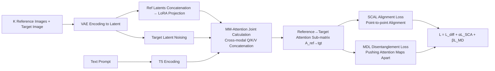

# MOSAIC: Multi-Subject Personalized Generation via Correspondence-Aware Alignment and Disentanglement

**Conference**: ICLR 2026  
**OpenReview**: [https://openreview.net/forum?id=7AH0y1OtnC](https://openreview.net/forum?id=7AH0y1OtnC)  
**Code**: [https://github.com/bytedance-fanqie-ai/MOSAIC](https://github.com/bytedance-fanqie-ai/MOSAIC)  
**Area**: Image Generation / Multi-Subject Personalized Generation  
**Keywords**: Multi-subject Personalized Generation, Semantic Correspondence, Attention Alignment, Attention Disentanglement, Diffusion Transformer  

## TL;DR
MOSAIC reformulates multi-subject personalized generation as a "representation optimization" problem. By utilizing the SemAlign-MS dataset with dense semantic correspondence annotations, it employs an "Alignment Loss" to force point-to-point alignment between reference and target attention, and a "Disentanglement Loss" to push different subjects into orthogonal attention subspaces. This maintains high fidelity even with more than 4 reference subjects, avoiding the identity blending and attribute leakage collapse observed in existing methods beyond 3 subjects.

## Background & Motivation
- **Background**: Multi-subject personalized generation requires preserving the identity/appearance of multiple reference images while "following the text." Prevailing approaches fall into two categories: one (MS-Diffusion, SSR-Encoder) injects spatial layouts into cross-attention to bind subjects to specific regions; the other (DreamO, XVerse) adds routing constraints or token-level modulation offsets within DiT blocks to control individual subject representations.
- **Limitations of Prior Work**: These methods rely on **global feature matching** and lack explicit modeling of "which region of the generated image should attend to which part of the reference image." When multiple subjects are present, their representations interfere with each other while sharing the same latent space, leading to frequent identity blending and attribute leakage. **Performance typically collapses after exceeding 3-4 subjects.**
- **Key Challenge**: There is an inherent conflict in a shared attention space between maintaining individual fidelity and enforcing inter-subject separability. Existing methods lack a mechanism to explicitly balance these two goals.
- **Goal**: Design optimization objectives that can **simultaneously** preserve identity and enforce separation between subjects, allowing the method to scale to 4+ subjects without degradation.
- **Key Insight**: **[Representation-centric + Explicit Supervision]** Instead of modifying the architecture to force control signals, this work uses dense semantic correspondence data to **directly supervise attention distributions**. One loss forces reference tokens to align with their intended target positions (alignment), while another pushes the attention maps of different references apart (disentanglement).

## Method

### Overall Architecture
MOSAIC is based on FLUX-1.0-DEV and follows the "LoRA branch for reference, original weights for denoising" paradigm from OmniControl. The VAE encodes the target image and $K$ reference images into latent representations. The target latent is noisied, while the reference latents are projected via the LoRA branch and **concatenated into a unified sequence**, then fed into the MM-Attention block together with the target and text. The key to the training phase is not the structure but two losses applied to the reference→target attention sub-matrix $A_{\text{ref}\to\text{tgt}}$: SCAL for "alignment" and MDL for "separation." These losses require dense correspondence annotations between "reference point ↔ target point," which is addressed by the SemAlign-MS dataset.

### Key Designs

**1. SemAlign-MS: Establishing "Semantic Correspondence" as a Supervised Foundation.** The bottleneck in multi-subject generation is not the lack of images, but the lack of annotations specifying "which point in the reference corresponds to which point in the target." The authors designed a five-stage pipeline to automatically generate data: GPT-4o generates multi-subject prompts covering humans/animals/objects and interactions; SOTA T2I models synthesize images, which are filtered by quality/clarity/composition; Lang-SAM performs open-vocabulary detection and segmentation of each subject; FLUX Kontext performs view correction to expand pose diversity; and finally, semantic correspondence points are sampled between the target and each reference. The dataset is defined as $D=\{(\{I_{\text{ref}}^{(i,k)}\}_{k=1}^K, I_{\text{tgt}}^{(i)})\}_{i=1}^N$. A critical constraint is **disjoint correspondence**: $V^{(i,k_1)} \cap V^{(i,k_2)}=\emptyset, \forall k_1 \neq k_2$. This ensures a target token is occupied by at most one reference image, avoiding supervisory ambiguity. 1.2 million high-quality pairs with verified correspondences were collected.

**2. Semantic Correspondence Attention Alignment (SCAL): Forcing reference tokens to precise target positions.** To preserve fine-grained structure and texture, the authors directly supervise reference→target attention. For reference position $u$ and target latent position $v$, the average attention across selected $N_{\text{block}}$ DiT blocks is $A_{\text{ref}\to\text{tgt}}[u,v]=\frac{1}{N_{\text{block}}}\sum_l \frac{\exp(Q_u K_v^\top/\sqrt{d})}{\sum_v \exp(Q_u K_v^\top/\sqrt{d})}$. Local coordinates are mapped to global token indices: $G(u_{i,j}^{(k)})=\sum_{\text{idx}=1}^{k-1} N^{(\text{idx})} + u_{i,j}^{(k)}$. Cross-entropy style supervision is used to concentrate attention on the corresponding target locations:
$$L_{\text{SCA}}=-\frac{1}{K}\sum_{k=1}^K \frac{1}{P(k)}\sum_{j=1}^{P(k)} \log A_{\text{ref}\to\text{tgt}}[G(u_{i,j}^{(k)}), v_{i,j}^{(k)}]$$
This upgrades "global similarity" to explicit point-to-point mapping, significantly improving local structure and detail fidelity.

**3. Multi-reference Disentanglement Loss (MDL): Pushing attention maps of different subjects into orthogonal subspaces.** While alignment ensures "accuracy," multiple subjects sharing a latent space can still interfere. MDL explicitly separates the attention distributions of different references. First, the attention responses for the $k$-th reference are aggregated and normalized into a distribution $a^{(k)}=\|\frac{1}{P(k)}\sum_j a_j^{(k)}\| \in \mathbb{R}^{N_{\text{tgt}}}$. Then, **Symmetric KL** divergence measures the distance between two reference distributions: $\text{dist}(a^{(i)}, a^{(j)})=\frac{1}{2} D_{\text{KL}}(a^{(i)}\|a^{(j)})+\frac{1}{2} D_{\text{KL}}(a^{(j)}\|a^{(i)})$. Finally, the average divergence of all reference pairs is **maximized**:
$$L_{\text{MD}}=-\frac{1}{K(K-1)}\sum_{i}\sum_{j \neq i} \text{dist}(a^{(i)}, a^{(j)})$$
This prevents different references from competing for the same attention region, directly mitigating cross-reference feature interference. The total loss is $L=L_{\text{diff}}+\alpha L_{\text{SCA}}+\beta L_{\text{MD}}$ (with $\alpha=0.4, \beta=0.6$).

## Key Experimental Results

### Main Results
Quantitative comparison on DreamBench for single/multi-subject scenarios (selected, ↑ is better):

| Scenario | Method | CLIP-I | CLIP-T | DINO | UnifiedReward | HPSv3 |
|----------|--------|--------|--------|------|---------------|-------|
| Single-Subject | DreamO | 83.35 | 30.61 | 76.03 | 4.33 | 12.78 |
| Single-Subject | UNO | 83.50 | 30.41 | 75.97 | 4.00 | 11.24 |
| Single-Subject | **Ours** | **84.30** | **31.64** | **77.40** | **4.40** | **14.36** |
| Multi-Subject | DreamO | 73.32 | 32.10 | 52.17 | 4.33 | 13.25 |
| Multi-Subject | UNO | 73.29 | 32.23 | 54.22 | 4.23 | 11.55 |
| Multi-Subject | **Ours** | **76.30** | **32.40** | **56.83** | **4.39** | **14.90** |

On XVerseBench total average score: **Ours 76.04** vs XVerse 73.40 vs DreamO 69.25. Multi-subject ID-Sim reached 69.90 (XVerse 66.59) and IP-Sim reached 74.27 (XVerse 71.48), showing clear advantages in identity preservation and perceptual similarity. Compared with strong identity preservation baselines (Face-Diffuser protocol, zero-shot), multi-subject IP reached 0.712 (vs Face-Diffuser 0.594, FastComposer 0.465).

### Ablation Study
Contribution of the two losses in multi-subject DreamBench scenarios:

| $L_{\text{SCA}}$ | $L_{\text{MD}}$ | CLIP-I | CLIP-T | DINO |
|:---:|:---:|--------|--------|------|
| ✗ | ✗ | 73.45 | 29.90 | 52.03 |
| ✓ | ✗ | 75.89 | 31.10 | 55.99 |
| ✗ | ✓ | 75.10 | 31.70 | 55.24 |
| ✓ | ✓ | **76.30** | **32.40** | **56.83** |

### Key Findings
- Both losses provide significant gains and are complementary: SCAL primarily improves identity/structure-related metrics (DINO, CLIP-I), while MDL boosts text consistency (CLIP-T). The combination is optimal.
- **Scalability is the core selling point**: While existing methods degrade after 3 subjects, MOSAIC maintains high fidelity under 4+ reference subjects. This capability stems from representation-level explicit alignment and disentanglement, which traditional global matching cannot achieve.
- Attention map visualizations show that specific reference regions only activate corresponding regions in the generated image, verifying that disentanglement effectively partitions subjects into different attention subspaces.

## Highlights & Insights
- **Perspective Shift**: Rephrases multi-subject generation from "adding control signals at the architecture level" to "optimizing attention distribution at the representation level." Since interference occurs in attention, it is supervised directly.
- **Data as Method**: The feasibility of SCAL/MDL relies entirely on semantic correspondence annotations. Instead of avoiding this, the authors created the SemAlign-MS dataset with 1.2 million pairs, turning "explicit supervision" into a trainable objective.
- **Symmetric Alignment & Disentanglement Design**: One loss uses cross-entropy to "pull closer," while the other uses symmetric KL to "push apart." Both act on the same attention sub-matrix, forming a concise and complementary regularization.
- **Plug-and-Play**: Adds only a LoRA branch and two training losses without altering the base model weights, keeping inference overhead manageable.

## Limitations & Future Work
- The data pipeline relies heavily on off-the-shelf models like GPT-4o, Lang-SAM, and FLUX Kontext. The "ground truth" for semantic correspondence is bound by the quality of these models.
- The disjoint correspondence constraint requires each target token to correspond to at most one reference. This may be too restrictive in cases of significant subject occlusion or overlapping interactions.
- Evaluations are concentrated on DreamBench/XVerseBench. While 4+ subjects are claimed, stability under extreme subject counts (e.g., 5+ fine-grained objects) requires more systematic validation.
- The loss weights $\alpha$ and $\beta$ are fixed hyperparameters; whether they should adapt based on the number of subjects remains unexplored.

## Related Work & Insights
- **Subject-driven Generation**: OmniControl uses the generative model itself as a reference encoder, UNO proposes a data pipeline, DreamO uses routing to focus on target subjects, and XVerse uses text-stream modulation to turn references into token offsets. MOSAIC argues these still rely on global feature matching and lack fine-grained point correspondence constraints.
- **Visual Correspondence in Generation**: DIFT, SD-DINO, and GeoAware-SC have shown that pre-trained diffusion features can establish reliable semantic correspondences, but this had not been utilized in multi-subject generation. MOSAIC is the first work to explicitly inject semantic correspondence into the generation process.
- **Insight**: When the failure mode of a task (subject interference) can be localized to a specific intermediate variable (attention sub-matrix), it is more effective to create corresponding supervisory signals to **directly constrain that variable** rather than adding architectural complexity.

## Rating
- **Novelty**: ⭐⭐⭐⭐ Reformulating multi-subject generation as attention representation optimization and introducing explicit semantic correspondence with a dedicated dataset is novel.
- **Experimental Thoroughness**: ⭐⭐⭐⭐ Solid evidence for 4+ subject scalability across multiple benchmarks, baselines, and visualizations, though robustness analysis for extreme cases is slightly lacking.
- **Writing Quality**: ⭐⭐⭐⭐ Clear logic from motivation to method; formulas and pipeline descriptions are comprehensive.
- **Value**: ⭐⭐⭐⭐ Addresses the practical pain point of 3-subject collapse in multi-subject generation. The plug-and-play nature and open-sourcing provide direct value for personalized generation applications.

<!-- RELATED:START -->

## Related Papers

- [\[CVPR 2026\] PSR: Scaling Multi-Subject Personalized Image Generation with Pairwise Subject-Consistency Rewards](../../CVPR2026/image_generation/psr_scaling_multi-subject_personalized_image_generation_with_pairwise_subject-co.md)
- [\[CVPR 2026\] MultiCrafter: High-Fidelity Multi-Subject Generation via Disentangled Attention and Identity-Aware Preference Alignment](../../CVPR2026/image_generation/multicrafter_high-fidelity_multi-subject_generation_via_disentangled_attention_a.md)
- [\[ICLR 2026\] SIGMA-GEN: Structure and Identity Guided Multi-Subject Assembly for Image Generation](sigma-gen_structure_and_identity_guided_multi-subject_assembly_for_image_generat.md)
- [\[CVPR 2026\] Correspondence-Attention Alignment for Multi-View Diffusion Models](../../CVPR2026/image_generation/correspondence-attention_alignment_for_multi-view_diffusion_models.md)
- [\[ICLR 2026\] LazyDrag: Enabling Stable Drag-Based Editing on Multi-Modal Diffusion Transformers via Explicit Correspondence](lazydrag_enabling_stable_drag-based_editing_on_multi-modal_diffusion_transformer.md)

<!-- RELATED:END -->
