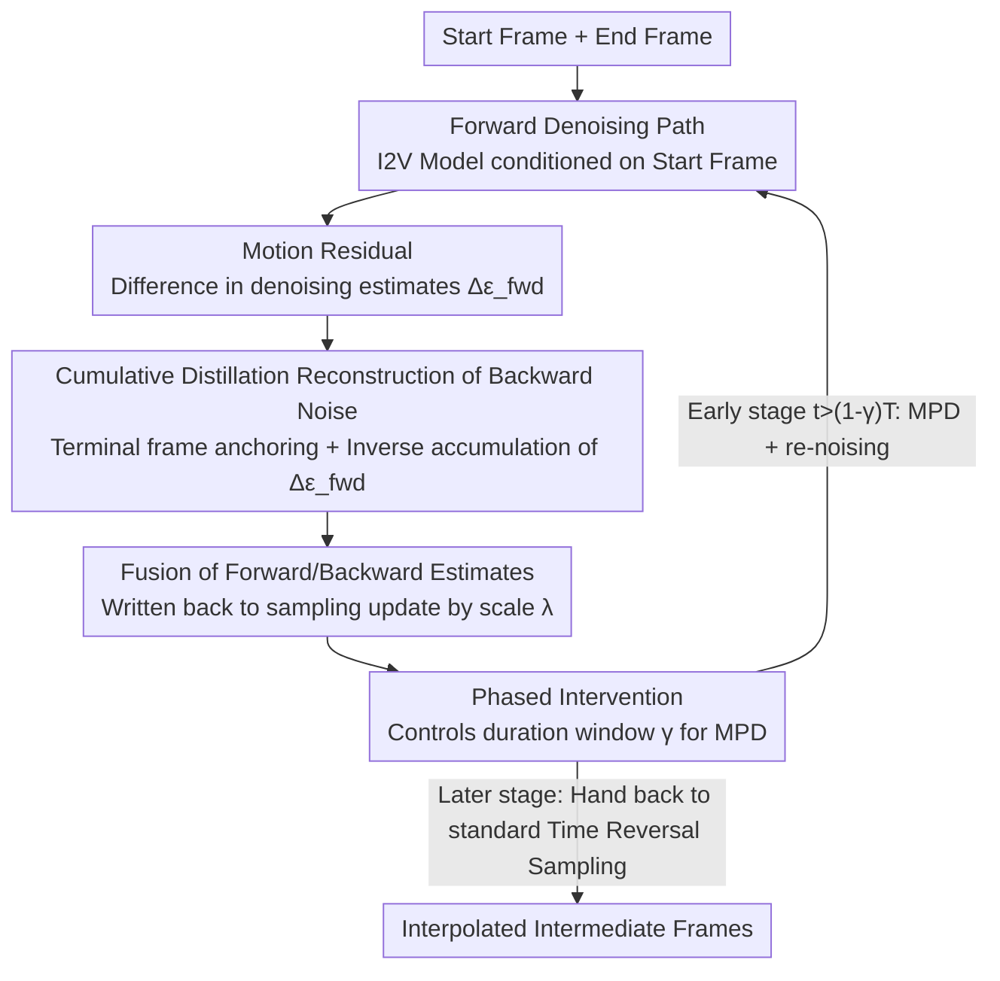

# Motion Prior Distillation in Time Reversal Sampling for Generative Inbetweening

**Conference**: ICLR 2026  
**arXiv**: [2602.12679](https://arxiv.org/abs/2602.12679)  
**Code**: [https://vvsjeon.github.io/MPD/](https://vvsjeon.github.io/MPD/)  
**Area**: Diffusion Models / Video Generation  
**Keywords**: Generative Frame Interpolation, Motion Prior, Time Reversal Sampling, Inference-time Distillation, SVD  

## TL;DR

Ours proposes Motion Prior Distillation (MPD), an inference-time distillation method that distills motion residuals from the forward path into the backward path. This fundamentally resolves the motion prior conflict in time reversal sampling, enabling more coherent generative frame interpolation without additional training.

## Background & Motivation

**Rise of Generative Frame Interpolation**: Advances in I2V diffusion models have expanded frame interpolation from traditional optical flow methods to semantic-level "generative inbetweening."

**Mechanism of Time Reversal Sampling**: The starting and ending frames are used to condition the forward and backward denoising paths, respectively, followed by a fusion of the intermediate frames.

**Motion Prior Conflict**: I2V models are trained to generate continuous frames forward from a single frame. When conditioned on the ending frame for backward generation, the model still tends to "look forward" rather than trace back to historical frames, resulting in forward generation bias.

**Off-manifold Problem in Parallel Methods**: Linearly interpolating two paths (e.g., TRF) pushes samples off the learned data manifold, leading to oscillations and artifacts.

**Persistence of Conflicts in Sequential Methods**: Although alternating denoising of forward/backward paths (e.g., ViBiDSampler) maintains manifold consistency, the motion priors of the two paths still conflict.

**Phenomena**: Conflicts lead to ghosting artifacts, reversed playback, and disappearing objects, which severely degrade generation quality.

## Method

### Overall Architecture

MPD transforms time reversal sampling from "fusing two independent forward/backward denoising paths" into "running only one forward path while reconstructing the backward path via distillation." The key observation is that the backward path creates conflict because it carries its own motion prior starting from the end frame. Since this prior should ideally be the inverse of the forward motion, the model does not need to re-denoise it. Instead, the backward noise can be derived from the motion already calculated in the forward path. Specifically, for one denoising step: the forward path is executed first, a **motion residual** is extracted from the difference between denoising estimates of adjacent frames, and then it is used to **reconstruct backward noise through cumulative distillation** (with terminal frame anchoring to ensure correct endpoints). The estimates from both paths are fused and written back for the sampling update. This distillation is controlled by **phased intervention**, active only in the early steps that determine the global motion trajectory, before handing back to the standard sampler for refining endpoints and details in later stages.

### Key Designs

**1. Motion Residual: Using inter-frame differences of forward estimates as motion carriers**

MPD does not operate on the whole frame directly but looks at the residuals between denoising estimates of adjacent frames. For frame $i$, the image residual is defined as $\Delta \hat{x}_{0,c_{\text{start}}}^{(i)} := \hat{x}_{0,c_{\text{start}}}^{(i)} - \hat{x}_{0,c_{\text{start}}}^{(i-1)}$, which is then converted into the forward noise residual $\Delta \epsilon_{\text{fwd}} = (\Delta x_t - \Delta \hat{x}_{0,c_{\text{start}}})/\sigma_t$. This residual characterizes "how the image changes from one frame to the next," effectively representing the model's motion estimation. This is exactly what needs to be distilled into the backward path to prevent it from generating its own contradictory motion.

**2. Cumulative Distillation Reconstruction: Reversing the backward path via forward motion rather than independent denoising**

The backward path no longer uses the end frame condition $c_{\text{end}}$ to run the model; instead, it is reconstructed frame-by-frame starting from the endpoint by subtracting the forward residuals. First, the end frame $z_{\text{end}}$ anchors the first frame of backward noise $\epsilon_{\text{bwd}}^{(1)} = ((x_t')^{(1)} - z_{\text{end}})/\sigma_t$. Then, backward noise for each frame is obtained by inverse accumulation: $\epsilon_{\text{bwd}}^{(i)} = \epsilon_{\text{bwd}}^{(1)} - \sum_{k=2}^{i} \Delta \epsilon_{\text{fwd}}^{(k)}$. The backward denoising estimate $\hat{x}_{0,c_{\text{start}}^*}' = x_t - \sigma_t \epsilon_{\text{bwd}}$ (without $c_{\text{end}}$ condition) is then solved. Finally, it is fused with the forward estimate using scale $\lambda$: $\tilde{x}_{0,c_{\text{start}}} = (1-\lambda)\hat{x}_{0,c_{\text{start}}} + \lambda(\hat{x}_{0,c_{\text{start}}^*}')'$, and written back for the sampling update $x_{t-1} = \tilde{x}_{0,c_{\text{start}}} + \frac{\sigma_{t-1}}{\sigma_t}(x_t - \hat{x}_{0,\varnothing})$. Since backward noise is entirely derived from forward motion, both paths share the same motion prior, eliminating conflicts at the source while ensuring terminal frame alignment via $z_{\text{end}}$.

**3. Phased Intervention: Early distillation for trajectory, later standard sampling for endpoints and details**

Distillation is not active throughout the entire process. MPD and re-noising are applied in the early steps ($t > (1-\gamma)T$) because this stage determines the global motion trajectory where conflicts are most critical. In the later stages, the process switches back to standard time reversal sampling (parallel fusion in TRF or sequential denoising in ViBiD) to allow the original sampler to refine endpoint consistency and high-frequency details. The distillation ratio $\gamma$ controls the intervention window, allowing MPD to be a plug-and-play addition to TRF and ViBiD without modifying their later pipelines.

### Loss & Training

MPD is a purely inference-time method requiring no training. Its effect is particularly clear from the perspective of optimization objectives. Standard time reversal sampling implies a dual-path objective $\mathcal{L} = \frac{1}{\sigma_t^2}\|\hat{x}_{0,c_{\text{start}}} - (\hat{x}_{0,c_{\text{end}}}')\|_2^2$, requiring the forward estimate to align with a backward estimate generated by an independent condition $c_{\text{end}}$, where motion priors naturally clash. MPD replaces this with a single-path objective $\mathcal{L} = \frac{1}{\sigma_t^2}\|\hat{x}_{0,c_{\text{start}}} - (\hat{x}_{0,c_{\text{start}}^*}')\|_2^2$. The alignment target becomes $\hat{x}_{0,c_{\text{start}}^*}'$, which is reconstructed from forward motion without introducing end-frame priors, thereby ensuring motion semantic consistency across paths without any training.

## Key Experimental Results

### DAVIS Dataset

| Method | LPIPS ↓ | FID ↓ | FVD ↓ | VBench ↑ | VBench++ ↑ |
|------|---------|-------|-------|----------|-----------|
| TRF | 0.3127 | 56.894 | 674.31 | 0.7618 | 0.9352 |
| GI | 0.2432 | 48.427 | 654.91 | 0.7747 | 0.9320 |
| FCVG | 0.2347 | 38.997 | 621.82 | 0.7904 | 0.9353 |
| ViBiD | 0.2492 | 39.883 | 559.49 | 0.7733 | 0.9387 |
| **Ours + TRF** | **0.2212** | **34.910** | 612.17 | **0.7992** | 0.9330 |
| **Ours + ViBiD** | 0.2220 | 37.241 | **527.05** | 0.7845 | **0.9474** |

### Pexels Dataset

| Method | LPIPS ↓ | FID ↓ | FVD ↓ | VBench++ ↑ |
|------|---------|-------|-------|-----------|
| FCVG | 0.1160 | 35.269 | 525.08 | 0.9701 |
| **Ours + TRF** | 0.1149 | **34.470** | **460.99** | **0.9862** |
| **Ours + ViBiD** | **0.1028** | 34.775 | 412.66 | 0.9605 |

### User Study (30 Participants)

| Method | Alignment Score ↑ | Artifact Rate ↓ | Unrealistic Motion ↓ |
|------|-----------|---------|------------|
| TRF | -0.3119 | 28.09% | 25.24% |
| ViBiD | -0.0678 | 28.10% | 25.24% |
| **Ours + TRF** | **0.3060** | 20.36% | 22.62% |
| **Ours + ViBiD** | 0.2440 | **8.93%** | **9.88%** |

## Highlights & Insights

1.  **Precise Problem Identification**: Identifies the motion prior conflict as the fundamental issue in time reversal sampling, rather than simple path fusion methods.
2.  **Single-Path Design**: Deliberately avoids denoising the backward path, instead reconstructing it via motion residual distillation to eliminate the secondary motion prior entirely.
3.  **Plug-and-Play**: Can be layered directly onto existing methods like TRF (parallel) or ViBiD (sequential).
4.  **Training-Free**: A pure inference-time method that runs on a single RTX 4090.
5.  **Persuasive User Study**: Artifact detection rate dropped to 8.93% and unrealistic motion to 9.88%, significantly outperforming baselines.

## Limitations & Future Work

1.  Validated only on SVD; not yet extended to newer video models like Wan or CogVideoX.
2.  Distillation ratio $\gamma$, re-noising steps $k$, and interpolation scale $\lambda$ require manual hyperparameter tuning.
3.  The motion residual assumption might fail under extreme motion (e.g., scene cuts) or non-rigid deformations.
4.  Generated frames are limited by SVD (14-25 frames); long-video scenarios remain unexplored.
5.  Computational Overhead: MPD requires additional forward calculations for residuals in the early steps.

## Related Work & Insights

-   **TRF (Feng et al.)**: The first time reversal sampling method (parallel fusion), which MPD can directly improve.
-   **ViBiDSampler (Yang et al.)**: Sequential time reversal sampling + CFG++, also compatible with MPD.
-   **GI (Wang et al.)**: Fine-tunes backward motion via rotating temporal SA, requiring training; MPD is training-free.
-   **FCVG (Zhu et al.)**: Injects linear correspondence as frame-level conditions, but the fundamental motion prior conflict remains unresolved.
-   Insight: Denoising estimation residuals in diffusion models inherently carry rich motion semantics, which could be utilized for other temporal consistency tasks (e.g., video editing, inpainting).

## Rating

-   Novelty: ⭐⭐⭐⭐ — The approach of motion residual distillation is novel with deep analysis.
-   Experimental Thoroughness: ⭐⭐⭐⭐⭐ — Strong evidence through quantitative metrics, user studies, and ablation.
-   Writing Quality: ⭐⭐⭐⭐ — Complete mathematical derivation, clear diagrams, and well-articulated motivation.
-   Value: ⭐⭐⭐⭐ — Directly advances the field of generative frame interpolation with high practical utility due to being training-free.

<!-- RELATED:START -->

## Related Papers

- [\[ICLR 2026\] Joint Distillation for Fast Likelihood Evaluation and Sampling in Flow-based Models](joint_distillation_for_fast_likelihood_evaluation_and_sampling_in_flow-based_mod.md)
- [\[ICLR 2026\] Large Scale Diffusion Distillation via Score-Regularized Continuous-Time Consistency](large_scale_diffusion_distillation_via_score-regularized_continuous-time_consist.md)
- [\[ICCV 2025\] Inference-Time Diffusion Model Distillation](../../ICCV2025/image_generation/inference-time_diffusion_model_distillation.md)
- [\[ICLR 2026\] Strictly Constrained Generative Modeling via Split Augmented Langevin Sampling](strictly_constrained_generative_modeling_via_split_augmented_langevin_sampling.md)
- [\[ICLR 2026\] Mitigating Semantic Collapse in Generative Personalization with Test-Time Embedding Adjustment](mitigating_semantic_collapse_in_generative_personalization_with_test-time_embedd.md)

<!-- RELATED:END -->
