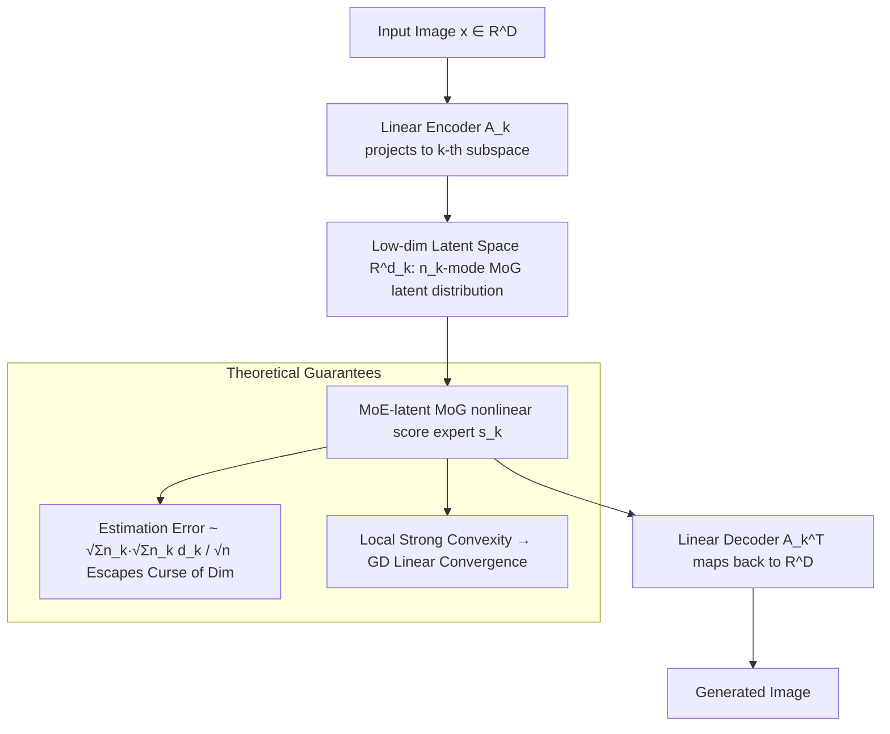

# Multi-Subspace Multi-Modal Modeling for Diffusion Models: Estimation, Convergence and Mixture of Experts

**Conference**: ICLR 2026  
**OpenReview**: [https://openreview.net/forum?id=MPWIM6rxxU](https://openreview.net/forum?id=MPWIM6rxxU)  
**Code**: To be confirmed  
**Area**: Diffusion Theory / Generative Models  
**Keywords**: Diffusion Models, Estimation Error, Curse of Dimensionality, Mixture of Experts (MoE), Low-Rank Gaussian Mixture, Convergence Analysis  

## TL;DR
This paper proposes "Mixture of Subspaces with Mixture of Low-rank Gaussians" (MoLR-MoG) modeling, characterizing real image data as a union of multiple low-dimensional linear subspaces, with a Gaussian mixture residing within each subspace. This induces a nonlinear score function with an inherent MoE structure, theoretically reducing the estimation error to $\sqrt{\sum_k n_k}\sqrt{\sum_k n_k d_k}/\sqrt{n}$ (escaping the curse of dimensionality) and proving local strong convexity for convergence guarantees. Empirically, it generates clear images using a network with 10× fewer parameters than a U-Net.

## Background & Motivation
**Background**: Diffusion models achieve impressive results in 2D/3D/video generation with small training sets and stable optimization. However, theoretically analyzing score estimation for general data using deep ReLU networks or diffusion transformers yields a minimax rate of $n^{-s'/D}$ ($D$ being the ambient dimension). This rate deteriorates exponentially with dimension—the "curse of dimensionality"—failing to explain the sample efficiency of diffusion models.

**Limitations of Prior Work**: Two approaches exist to bridge this theory-practice gap. One uses multimodal modeling (e.g., Mixture of Gaussians, MoG) to describe real data; the other assumes data lies on a single low-dimensional linear subspace $x=Az$, reducing the error to $n^{-2/d}$ and removing $D$-dependence. Yet, real images are not a single manifold but a **union of multiple manifolds**. MoLRG modeling by Wang et al. (2024) models data as a union of linear subspaces, with each subspace containing a **zero-mean Gaussian** latent variable, achieving a $1/\sqrt{n}$ estimation error.

**Key Challenge**: While MoLRG captures the "multi-manifold" property, its zero-mean Gaussian latent variables are too simplistic to characterize the **multimodal** structure within each low-dimensional manifold (real data manifolds often contain multiple clusters/modes). This deviates significantly from real distributions, and the induced score is linear, losing the nonlinearity of real scores.

**Goal**: Propose a modeling framework that reflects both "multi-manifold + multimodal" characteristics and prove that diffusion models can escape the curse of dimensionality and enjoy fast convergence under this framework.

**Core Idea**: **MoLR-MoG Modeling** — Data is modeled as a union of $K$ linear subspaces, where **each subspace no longer contains a single Gaussian but an $n_k$-mode mixture of low-rank Gaussians**. This modification ensures the induced score function naturally possesses a Mixture of Experts (MoE) structure, capturing multimodal information with nonlinearity, thereby unifying multimodal and multi-manifold modeling.

## Method

### Overall Architecture
Real image data is modeled as a union of $K$ low-dimensional linear subspaces; the $k$-th subspace is spanned by an orthogonal column matrix $A_k^*\in\mathbb{R}^{D\times d_k}$. Inside this subspace, an $n_k$-mode low-rank Gaussian mixture is placed as the latent distribution, yielding the full target distribution $p_0=\sum_{k=1}^K\frac1K\sum_{l=1}^{n_k}\pi_{k,l}\,\mathcal N(x; A_k^*\mu^*_{k,l}, A_k^*\Sigma^*_{k,l}A_k^{*\top})$. The score derived analytically from this distribution naturally exhibits an MoE structure: each "expert" is a nonlinear MoG score within a low-dimensional subspace; a linear encoder $A_k$ projects the image to the $k$-th manifold, performs denoising in the low-dimensional latent space, and a decoder $A_k^\top$ maps it back to the full dimension. The theoretical part focuses on "estimation error" and "optimization convergence," first proving the escape from the curse of dimensionality and then proving local strong convexity.

### Key Designs
**1. MoLR-MoG Modeling: Replacing zero-mean Gaussians with MoGs in subspaces to enable nonlinear scores.** This is the foundation. MoLRG assumes latent variables are zero-mean Gaussians, equivalent to a linear score that cannot express multiple modes within a manifold. Ours replaces the latent distribution in the $k$-th subspace with an $n_k$-mode mixture of Gaussians with low-rank covariances $\Sigma^*_{k,l}=U^*_{k,l}U^{*\top}_{k,l}$. From a universal approximation perspective, MoG can approximate any smooth density given enough components and proper parameters $\{\pi_{k,l},\mu^*_{k,l},\Sigma^*_{k,l}\}$, making it more general than the single-Gaussian latents in MoLRG. Notably, the authors point out that MoLR-MoG **cannot** be simplified to an MoLRG with $\sum_k n_k$ subspaces, as the latter would require $\sum_k n_k$ independent VAEs, which is impractical.

**2. MoE-latent Nonlinear MoG Score: Naturally derived expert structure.** Under MoLR-MoG, the score function has a closed-form solution $\nabla\log p_t(x)=-\frac1{\gamma_t^2}\frac{\sum_k\frac1K\sum_l\pi_{k,l}\mathcal N(\cdot)\,\delta_{k,l,t,A}(x)}{\sum_k\frac1K\sum_l\pi_{k,l}\mathcal N(\cdot)}$, where $\gamma_t=s_t\sigma_t$. This expression is naturally a "soft gating + multi-expert" MoE: each subspace corresponds to an expert, and each expert is a nonlinear MoG score. Since the error introduced by linear encoding/decoding is of order $Dd_k^3/\sqrt n$ (not dominant), the authors assume encoders/decoders are perfectly learned and focus on the harder "latent space MoG diffusion" part. The score within the $k$-th manifold simplifies to $\nabla\log p_{t,k}(x_{LD})$, requiring only parameters $\mu_{k,l}$ and $U_{k,l}$. Engineering-wise, this is equivalent to "encoding with a pre-trained VAE and training diffusion only in the latent space."

**3. Estimation Error Bound Escaping the Curse of Dimensionality.** The authors use the structure of MoLR-MoG and MoE-MoG scores to derive the Lipschitz constant of the network and loss $L\le\sqrt{\sum_k n_k(L_{\mu_l}^2+L_{U_k}^2)}=O((\sum_k n_k)^{1/2}C_w)$. By controlling the Rademacher complexity of the loss class and using Bernstein concentration inequalities, they obtain a generalization bound: with high probability, $|L(\theta)-\hat L_n(\theta)|\le O\!\big(C_1\frac{(R+s_tB_\mu)^4 s_t^2\sqrt{\sum_k n_k}}{\gamma_t^6}\sqrt{\frac{\sum_k n_k d_k}{n}}+C_2\sqrt{\frac{\log(1/\delta)}{n}}\big)$. Crucially, this bound replaces exponential dependence on ambient dimension $D$ with polynomial dependence on the number of subspaces $K$, latent dimension $d_k$, and number of modes $n_k$—the intrinsic structures of real data.

**4. Local Strong Convexity and Linear Convergence.** Facing a highly non-convex score-matching objective, the authors leverage the closed-form MoG score to explicitly calculate the Jacobian and Hessian of the objective. They prove that under the "well-separated clusters" condition, the Hessian near the ground truth $\theta^*$ simplifies to a block-diagonal form, ensuring local strong convexity. Coupled with a good initialization region, Gradient Descent (GD) achieves a linear convergence rate. This elevates the empirical observation of "fast and stable diffusion optimization" to a provable conclusion, using the symmetric case of 2-mode identical covariance ($\mu^*_{k,1}=-\mu^*_{k,2}=\mu^*_k$) as an analytical entry point.

## Key Experimental Results
The experiments aim to "verify the validity of MoLR-MoG modeling" rather than chasing SOTA. Three latent parameterizations are compared on MNIST/CIFAR-10/ImageNet-256: latent U-Net, latent MoG NN (per Eq. 3, $n_k\in\{4,8,40\}$), and latent Gaussian NN (MoLRG closed-form linear score). Following Brown et al. (2023), 10 VAEs are trained for each digit on MNIST as $K$ low-dimensional manifolds.

### Main Results (ImageNet parachute category, CLIP score, text "a photo of parachute")

| Parameterization | CLIP score | Relative Params |
|---|---|---|
| MoLR + U-Net | 0.304 | Baseline (Large) |
| **MoLR-MoG NN (Ours)** | **0.293** | **~10× Smaller** |
| MoLRG Gaussian NN | 0.254 | Small |

### Ablation Study

| Comparison Dimension | Conclusion |
|---|---|
| Generation Quality (MNIST/CIFAR-10/ImageNet) | MoLRG Gaussian only generates blurry, unrecognizable images; MoLR-MoG produces clear images comparable to MoLR-U-Net. |
| Training Loss Curves (CIFAR-10) | Loss for MoE-MoG NN is significantly lower than MoE-Gaussian and approaches MoE-U-Net, supporting efficient estimation of the true score. |
| Dedicated VAEs vs. Unified VAE (Fig. 5) | Using a single unified VAE makes the latent space too complex for small MoG experts; fine-tuning dedicated VAEs for each expert makes the latent manifold simple enough for small MoG experts to generate clear images. |

### Key Findings
- MoLR-MoG achieves comparable text-image alignment to U-Net (CLIP 0.293 vs 0.304) with **10× fewer parameters**, suggesting the "multimodal latent prior" accurately captures real data structure.
- "Dedicated VAEs" are key to implementing MoLR-MoG: they echo the theoretical setting of "$K$ encoders projecting to their own manifolds" and suggest an engineering path using clustering + LoRA fine-tuning of a shared VAE backbone for large unlabeled datasets.

## Highlights & Insights
- **Unified Modeling**: For the first time, two theoretical threads—"multi-manifold (multi-subspace)" and "multimodal (MoG within subspaces)"—are unified in one distribution. The induced score is naturally an MoE structure, elevating the question of "whether diffusion should use MoE" from an empirical observation to a theoretical motivation based on manifold perspectives.
- **Theory-Practice Loop**: The paper provides both an estimation bound escaping the curse of dimensionality and a proof of local strong convexity while corroborating the modeling with real image experiments. Theoretical assumptions (dedicated VAEs, small latent MoG) match experimental settings, explaining both sample efficiency and optimization stability.
- **Analyzability of Nonlinear Scores**: Although MoG scores are nonlinear, they possess closed-form solutions. The authors use this to compute the Hessian explicitly, bypassing the impasse of general non-convex optimization.

## Limitations & Future Work
- Theoretical analysis relies on several strong assumptions: perfectly learned encoders/decoders, "well-separated" clusters, and optimization analysis simplifying $d_{k,l}=1$ for Hessian computation, alongside the need for a good initialization region. The validity of these in large-scale real-world data remains to be tested.
- Experiments are scaled for "validating modeling" rather than SOTA; they are limited in size (MNIST/CIFAR-10/ImageNet single-class CLIP) and lack systematic metrics like FID across all datasets.
- The need for VAEs (or LoRA experts) for each manifold/cluster raises scalability and engineering questions regarding clustering quality and its impact on generation, which the authors acknowledge for future work.
- Convergence guarantees are **local** (strong convexity near truth + good initialization); the global optimization landscape is not yet characterized.

## Related Work & Insights
This work sits at the intersection of two theoretical veins: score estimation error analysis (minimax rate $n^{-s'/D}$ by Oko et al. 2023, 2-layer wide networks by Li/Han requiring $exp(n)$ samples, and multimodal MoG analysis by Shah/Cui/Chen) and low-dimensional structure assumptions (single subspace $n^{-2/d}$ by Chen et al. 2023b, and multi-subspace $1/\sqrt n$ by Wang et al. 2024). The core contribution is identifying that MoLRG's zero-mean Gaussian loses multimodality, then filling this gap with MoG latents while maintaining a $1/\sqrt n$ error rate. Insights for future work include tying MoE structures to multi-manifold/multimodal modeling, suggesting a parameter-efficient path using "Dedicated VAEs + Latent Small Experts + Clustering + LoRA backbones."

## Rating
- **Novelty**: ⭐⭐⭐⭐⭐ First to propose MoLR-MoG modeling, unifying manifolds and multimodality with an inherent MoE score, resolving the lack of multimodality in MoLRG.
- **Experimental Thoroughness**: ⭐⭐⭐ Positioned to validate modeling; the three datasets, loss curves, and VAE ablations are sufficient, but scale is small and systematic metrics like FID are missing.
- **Writing Quality**: ⭐⭐⭐⭐ Logic from motivation to modeling, estimation, and convergence is consistent. Theoretical and experimental settings align well; formula-heavy, presenting a barrier to non-theoretical readers.
- **Value**: ⭐⭐⭐⭐ Simultaneously explains "small sample efficiency" and "fast optimization stability," providing theoretical support for MoE-Diffusion and insights for parameter-efficient generative architectures.

<!-- RELATED:START -->

## Related Papers

- [\[CVPR 2026\] Mixture of Style Experts for Diverse Image Stylization](../../CVPR2026/image_generation/mixture_of_style_experts_for_diverse_image_stylization.md)
- [\[ICLR 2026\] ColorCtrl: Training-Free Text-Guided Color Editing Based on Multi-Modal Diffusion Transformer](training-free_text-guided_color_editing_with_multi-modal_diffusion_transformer.md)
- [\[ICML 2026\] Diffusion Models Are Statistically Optimal for Learning Low-Dimensional Multi-Modal Distributions](../../ICML2026/image_generation/diffusion_models_are_statistically_optimal_for_learning_low-dimensional_multi-mo.md)
- [\[ICLR 2026\] LazyDrag: Enabling Stable Drag-Based Editing on Multi-Modal Diffusion Transformers via Explicit Correspondence](lazydrag_enabling_stable_drag-based_editing_on_multi-modal_diffusion_transformer.md)
- [\[ICLR 2026\] LapFlow: Laplacian Multi-scale Flow Matching for Generative Modeling](lapflow_laplacian_multi-scale_flow_matching_for_generative_modeling.md)

<!-- RELATED:END -->
