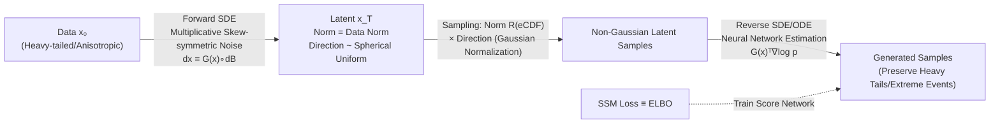

# Multiplicative Diffusion Models: Beyond Gaussian Latents

**Conference**: ICLR 2026  
**OpenReview**: [https://openreview.net/forum?id=F6w8LcJJFA](https://openreview.net/forum?id=F6w8LcJJFA)  
**Code**: To be confirmed  
**Area**: Generative Models / Diffusion Models  
**Keywords**: Multiplicative noise, diffusion models, non-Gaussian latent space, heavy-tailed distribution, extreme events, sliced score matching, physics-inspired  

## TL;DR
This paper proposes Multiplicative Score-based Generative Models (MSGM), which replace the classical additive Gaussian noise in diffusion models with **skew-symmetric multiplicative noise**. This ensures the forward process converges to a non-Gaussian latent distribution that naturally aligns with the data while keeping the data norm distribution invariant, enabling more accurate generation of rare extreme events in heavy-tailed and anisotropic data.

## Background & Motivation
- **Background**: Diffusion models / Score-based Generative Models (SGM) have achieved SOTA in image generation. Their forward process is an Ornstein-Uhlenbeck (OU) process driven by additive Gaussian noise, where the latent space always converges to a standard Gaussian $\mathcal{N}(0, I_d)$, regardless of the data distribution.
- **Limitations of Prior Work**: Standard Gaussian priors are often far removed from real-world data distributions. For **heavy-tailed / anisotropic** data, the norm of Gaussian latent variables follows a $\chi^2$ distribution, which never exhibits heavy tails regardless of the data—as pointed out by Lafon et al. (2023): without heavy-tailed latents, generating samples that reproduce heavy tails is nearly impossible. More critically, for heavy-tailed data, the KL divergence from the data to the SGM latent distribution is **infinite**.
- **Key Challenge**: Diffusion models use a fixed, data-independent Gaussian latent space to fit diverse real-world distributions that often contain extreme events. The greater the distance between the latent distribution and the data distribution, the more difficult the forward/backward integration becomes, making rare critical events harder to generate, particularly in low-data regimes.
- **Goal**: Construct a diffusion model with a **data-adaptive latent space that preserves key data information (norm distribution)**, keeping the latent space as close to the data distribution as possible to efficiently and accurately generate extreme events.
- **Core Idea**: **[Conserved Physical Structure]** Drawing inspiration from transport noise in fluid mechanics, the authors drive the forward SDE with skew-symmetric multiplicative noise. This noise only performs random rotations around the origin, **strictly preserving the norm of each data point** (energy conservation). Consequently, the norm distribution of the latent space matches that of the data, automatically inheriting the data's heavy-tailed properties.

## Method

### Overall Architecture
MSGM replaces the "additive noise + Gaussian latent space" of classical diffusion with "skew-symmetric multiplicative noise + data-aware non-Gaussian latent space." The forward SDE causes data points to rotate randomly on a sphere defined by their norm; the direction eventually converges to a uniform distribution on the sphere, while the norm remains constant. The latent variable is thus decomposed into the product of the "data norm (estimable in 1D)" and a "spherical uniform direction." The reverse process uses Sliced Score Matching (SSM) to train a neural network to estimate the score, which is proven to be equivalent to maximizing the ELBO.

### Key Designs
**1. Skew-Symmetric Multiplicative Forward SDE: Replacing translation with rotation to make the norm a conserved quantity.** The forward process is formulated as a multiplicative Stratonovich SDE $\mathrm{d}\overrightarrow{x}_s = G(\overrightarrow{x}_s) \circ \mathrm{d}\overrightarrow{B}_s$, where the linear operator $G$ is represented by a third-order tensor $[G^k_{i,j}]$ with two imposed assumptions: **Skew-symmetry (A1)** requires each $G^k$ to satisfy $G^k_{i,j} = -G^k_{j,i}$, and the **Rank condition (A2)** requires $\mathrm{rank}(G(x)) = d-1$. Skew-symmetry directly implies that the noise increment $\mathrm{d}Z_s$ is orthogonal to $\overrightarrow{x}_s$, resulting in $\mathrm{d}\|\overrightarrow{x}_s\|^2 = 2\overrightarrow{x}_s \cdot \mathrm{d}\overrightarrow{x}_s = 0$, meaning the norm is strictly conserved $\|\overrightarrow{x}_s\| = \|\overrightarrow{x}_0\|$. This is a generative counterpart to energy conservation induced by incompressible flow in fluid mechanics. The rank condition A2 ensures that the noise fully covers the entire tangent space $\langle x\rangle^\perp$ orthogonal to $x$, enabling sufficient directional mixing and an analytical latent distribution.

**2. Data-Aware Non-Gaussian Latent Distribution: Original norm preservation with directional convergence to spherical uniform.** Decomposing the latent variable into spherical components $\overrightarrow{x}_s = \|\overrightarrow{x}_s\| \cdot \overrightarrow{x}^n_s$. Since the norm is constant, the entire noise process evolves on a sphere of radius $\|\overrightarrow{x}_0\|$. The paper proves that the direction $\overrightarrow{x}^n_s$ follows a Fokker-Planck equation on the sphere and converges **exponentially** to a uniform distribution on $\mathcal{S}^{d-1}$. Therefore, the steady-state latent density has a product structure $p_\infty(x) = p_{|\cdot|}(\|x\|) \cdot \|x\|^{1-d} / |\mathcal{S}^{d-1}|$, where the norm and direction are asymptotically independent. This latent distribution degenerates to a Gaussian if and only if the squared data norm follows a $\chi^2_d$ distribution; otherwise, it is non-Gaussian, and **data is heavy-tailed ⟺ latent distribution is heavy-tailed**. The paper further proves that the KL divergence from the MSGM latent distribution to the data is always no greater than that of SGM; for heavy-tailed data, SGM’s KL is infinite while MSGM’s is finite, implying fewer time steps are needed for integration.

**3. 1D Norm Sampling + Spherical Direction Sampling: Reducing high-dimensional problems to one dimension.** The product structure of the latent distribution makes sampling exceptionally simple: the directional component is sampled via a normalized Gaussian $\overrightarrow{x}^N \sim \mathcal{N}(0, I_d)$. The norm component collapses the high-dimensional distribution into a **1D log-norm distribution** $F_{\log|\cdot|}$, which is fitted using an empirical CDF (eCDF) and sampled using an inverse transform $r = F^{-1}_{\log|\cdot|}(F_{2}^{(d)}(r^2))$. This bypasses the curse of dimensionality by solving a 1D problem, while the independence of norm and direction ensures correctness.

**4. Sliced Score Matching ≡ ELBO: Theoretical foundation for training with multiplicative noise.** In the multiplicative case, the conditional score $\nabla \log p_s(\overrightarrow{x}_s \mid \overrightarrow{x}_0)$ lacks an analytical form. Thus, the authors use a neural network $a_\theta(\overrightarrow{x}_t, T{-}t)$ to model $G(\overrightarrow{x}_t)^\top \nabla \log p_{T-t}$ and train it using **Sliced Score Matching (SSM)** with the loss $\mathcal{L}_{\mathrm{SSM}}(\theta) = \mathbb{E}\big[\tfrac{1}{2}\|a_\theta\|^2 + (v \cdot \nabla)(G^\top a_\theta) \cdot v\big]$, where $v$ follows a Rademacher distribution. Theorem 3.4.1 proves that even with multiplicative noise, minimizing this SSM loss is **exactly equivalent to maximizing the ELBO** (Implicit Score Matching, ISM), aligning the framework with variational principles and generalizing the results of Huang et al. (2021). The reverse process is provided in both SDE and Probability Flow ODE forms.

## Key Experimental Results
> The paper uses **Maximum Mean Discrepancy (MMD)** as the core metric to compare MSGM against classical SGM baselines (also trained with SSM for fair comparison).

### Main Results

| Task | Dimension / Setup | Observations |
|------|-------------------|--------------|
| Correlated Cauchy Distribution | $d=4$, correlated Cauchy vector $x_0 = A x_{Ca}$ (power-law tail $\propto|x|^{-2}$) | SGM fails to reproduce fat tails and extreme directionality; MSGM captures them accurately. MSGM improves with ADAM iterations, while SGM diverges. |
| Measured Vorticity Fields | $d=16$, 1024 PIV vorticity samples (Re=3900 cylinder wake) | SGM over-concentrates samples near the mean, underestimating rare large-vorticity events; MSGM's latent distribution is closer to data (suspected Laplace tail), with significantly better tail characterization. |
| High-Dir Images | $d=1024$, sparse tensor $G$ | Provides initial MSGM high-dimensional generated images, validating scalability (preliminary exploration, not in the main theoretical framework). |

### Key Findings
- **Extreme Events / Tail Behavior**: In both heavy-tailed tasks, MSGM's characterization of extreme events and tail distributions is significantly superior to SGM, especially in **low-data** scenarios (Figure 4b: MMD vs. training samples shows MSGM leading throughout).
- **Convergence Stability** (Figure 4a): On the Cauchy task, MSGM's MMD continues to decrease with effective ADAM iterations, while SGM training diverges—confirming the theoretical expectation that "the closer the latent distribution is to the data, the easier the optimization."
- **Theoretical Consistency**: Experimental observations show MSGM has a smaller KL divergence to the data and the latent distribution inherits data heavy-tails, consistent with theoretical results in Section E.5/E.6.

## Highlights & Insights
- **Turning Physical Conservation Laws into Inductive Biases**: Skew-symmetry (incompressibility) ⟹ Norm conservation (energy conservation) ⟹ Latent distribution preserves data norm. This chain borrowed from fluid mechanics is elegant and fundamentally challenges the default assumption that "diffusion must wash data into an isotropic Gaussian."
- **Data-Aware Latent Space**: While standard diffusion's latent distribution is data-independent, MSGM allows the latent space to automatically inherit the data's norm distribution (including heavy tails). This reduces the "distance" between data and latent space, where KL is theoretically always $\le$ SGM, and finite instead of infinite for heavy-tailed data.
- **Cleverly Bypassing the Curse of Dimensionality**: The product structure splits high-dimensional sampling into "1D norm (eCDF) × spherical uniform direction (Gaussian normalization)," compressing all difficulty into a 1D space.
- **Complete Theoretical Closed-Loop**: From Fokker-Planck equations and exponential convergence to analytical steady-state distributions and SSM≡ELBO, the paper provides a self-consistent mathematical framework rather than just empirical tricks.

## Limitations & Future Work
- **Lack of Analytical Score, Limited Training**: Under multiplicative noise, the forward SDE lacks analytical solutions for large-rank tensors, and finite-time scores are not analytical. This precludes the use of stable Denoising Score Matching (DSM), forcing reliance on ISM/SSM—which can be less stable and require numerical integration of the forward process, leading to slower training.
- **Memory Explosion of Dense Tensors**: The dense third-order tensor $G$ used in experiments has $d^3$ coefficients, making it computationally prohibitive for $d=O(10^5)$ real images or turbulence problems. High-dimensional cases rely on sparse tensors (Section K), which do not fully satisfy the main theoretical framework (A1/A2).
- **Future Work**: The authors look toward generative models on symmetric Riemannian manifolds, stochastic differential geometry, and random matrix theory (where forward SDE semigroups can be represented as unitary Brownian matrices) to provide more efficient sampling and score evaluation on the d-sphere. They are also developing physics-inspired sparse tensors $G$ (corresponding to spatial discretization of SPDEs with transport noise).

## Related Work & Insights
- **Score-based Diffusion Foundations**: The SDE unified framework of Song et al. (2021), the $a_\theta = \sqrt{2}s_\theta$ and SSM≡ELBO proof of Huang et al. (2021), and Sliced Score Matching by Song et al. (2020)—MSGM generalizes these from additive Gaussian to multiplicative skew-symmetric noise.
- **Physical / Fluid Transport Noise**: Work by Kraichnan (1968), Resseguier et al. (2021), etc., on transport noise and stochastic fluid mechanics served as the inspiration for skew-symmetric multiplicative noise.
- **Challenges in Heavy-Tailed Generation**: Lafon et al. (2023) regarding the necessity of heavy-tailed latent variables for heavy-tailed generation—the core problem addressed by MSGM's data-aware latent space.
- **Riemannian Manifold Diffusion**: Directional dynamics on the sphere and Riemannian gradients link MSGM to manifold diffusion models, suggesting new paths for generation on symmetric spaces.
- **Insight**: For any field requiring the generation of "rare but critical" events (climate extremes, turbulence, financial tail risk, Bayesian inverse problems), "conserving key data statistics in the latent distribution" may be a more efficient and accurate paradigm than "forcing data into a Gaussian."

## Rating
- **Novelty**: ⭐⭐⭐⭐⭐ Fundamentally restructuring the noise mechanism of diffusion (additive → multiplicative skew-symmetric) to derive a data-aware non-Gaussian latent space is a truly pioneering direction.
- **Experimental Thoroughness**: ⭐⭐⭐ The theory is solid, but experiments are somewhat toy-scale ($d=4/16$ for Cauchy/vorticity; $d=1024$ is preliminary). It lacks head-to-head comparisons on image benchmarks (FID/real datasets) and relies primarily on MMD.
- **Writing Quality**: ⭐⭐⭐⭐ Mathematically rigorous with clear contributions. Figure 1 provides an intuitive comparison; however, the theoretical density is high, with many conclusions relegated to the appendix, creating a barrier for non-theoretical readers.
- **Value**: ⭐⭐⭐⭐ Provides a principled new framework for heavy-tailed / extreme event generation and physics-inspired modeling. Long-term potential is high, though short-term scalability is limited by dense tensor costs and score estimation stability.

<!-- RELATED:START -->

## Related Papers

- [\[ICLR 2026\] Hyperspherical Latents Improve Continuous-Token Autoregressive Generation](hyperspherical_latents_improve_continuous-token_autoregressive_generation.md)
- [\[ICML 2025\] Gaussian Mixture Flow Matching Models](../../ICML2025/image_generation/gaussian_mixture_flow_matching_models.md)
- [\[CVPR 2026\] What Is It Like to Be a Noise? An Entropy-based Gaussian Noise Regularization for Diffusion Models](../../CVPR2026/image_generation/what_is_it_like_to_be_a_noise_an_entropy-based_gaussian_noise_regularization_for.md)
- [\[ICLR 2026\] Improving Discrete Diffusion Unmasking Policies Beyond Explicit Reference Policies (UPO)](improving_discrete_diffusion_unmasking_policies_beyond_explicit_reference_polici.md)
- [\[ICLR 2026\] Score Distillation Beyond Acceleration: Generative Modeling from Corrupted Data](score_distillation_beyond_acceleration_generative_modeling_from_corrupted_data.md)

<!-- RELATED:END -->
