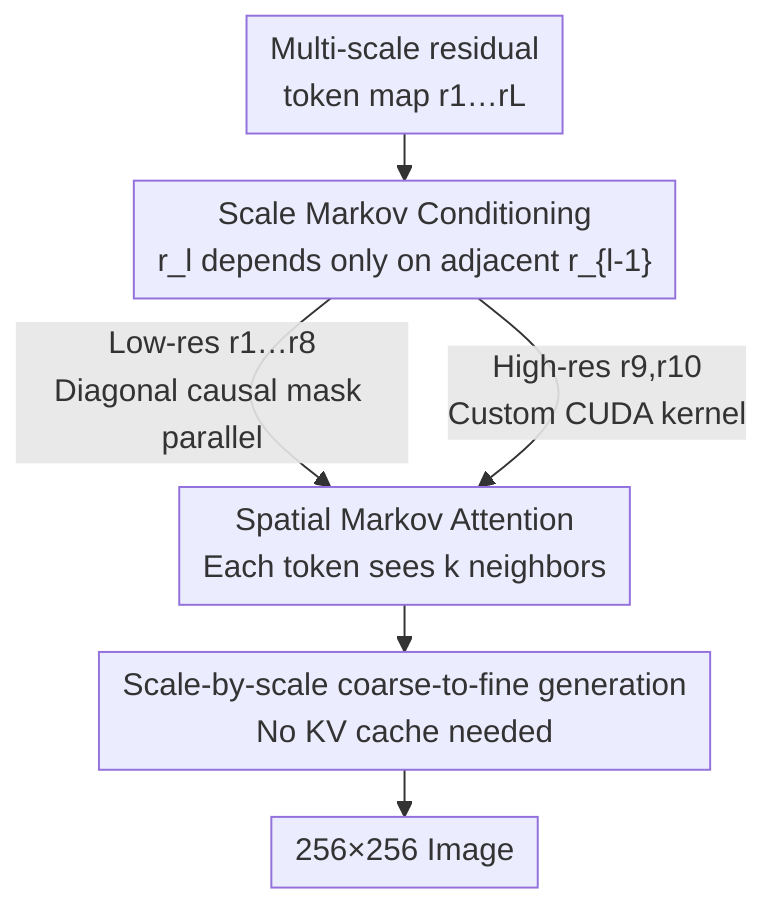

# MVAR: Visual Autoregressive Modeling with Scale and Spatial Markovian Conditioning

**Conference**: ICLR 2026  
**arXiv**: [2505.12742](https://arxiv.org/abs/2505.12742)  
**Code**: [Project Page](https://nuanbaobao.github.io/MVAR)  
**Area**: LLM Efficiency  
**Keywords**: Visual Autoregressive, Next-Scale Prediction, Markov Assumption, Attention Optimization, Image Generation, Memory Efficiency

## TL;DR

Proposes MVAR (Markovian Visual AutoRegressive), which reduces the attention calculation complexity of VAR models from $\mathcal{O}(N^2)$ to $\mathcal{O}(Nk)$ by introducing the scale Markov assumption (depending only on adjacent scales rather than all preceding scales) and spatial Markov attention (restricting the neighborhood size $k$). It achieves comparable or superior performance on ImageNet 256×256, reduces inference VRAM by 3.0-4.2×, and can be trained using only 8 RTX 4090 GPUs.

## Background & Motivation

### Next-Scale Prediction Paradigm

VAR (Visual AutoRegressive modeling) redefines traditional next-token prediction as next-scale prediction: an image is encoded into multi-scale residual token maps $\mathcal{R} = (r_1, r_2, \dots, r_L)$ and generated autoregressively from coarse to fine. This approach preserves the 2D structure of images better than raster-scan ordering, significantly improving generation efficiency and quality.

### Limitations of Prior Work

The authors identified two key redundancies through attention weight analysis:

**Scale Redundancy**: Attention weights for each scale are highly concentrated on the **immediately preceding scale**, with distant scales receiving almost no attention. However, VAR makes each scale dependent on all previous scales.

**Spatial Redundancy**: Inter-scale attention exhibits a **diagonal-dominant pattern** (similar to local connections in convolutions). Each token primarily attends to neighbors at its corresponding spatial location rather than all tokens.

These redundancies lead to unnecessary GPU VRAM consumption and computational waste.

## Method

### Overall Architecture

MVAR aims to eliminate two types of waste in the "next-scale prediction" pipeline of VAR: the dependency of each scale on **all** preceding scales, which causes KV cache to bloat with scale accumulation, and the **global** attention between adjacent scales, which causes computation to grow quadratically with the token count. MVAR overlays two Markov assumptions on the next-scale pipeline. In the scale dimension, the current token map $r_l$ only conditions on the adjacent preceding scale $r_{l-1}$ (Scale Markov). In the spatial dimension, each token only attends to its neighbors within a window of size $k$ (Spatial Markov). By combining these assumptions, the dense full attention across all scales and tokens is pruned into a sparse "adjacent scale + local window" path. This eliminates the KV cache during inference and compresses attention complexity from $\mathcal{O}(N^2)$ to $\mathcal{O}(Nk)$, enabling training on 8 RTX 4090 GPUs.

### Key Designs

**1. Scale Markov Conditioning: Pruning Full-Scale Dependency to Adjacent-Hop**

The joint distribution of VAR requires each scale to condition on all preceding scales $p(r_1, \dots, r_L) = \prod_{l=1}^{L} p(r_l \mid r_1, \dots, r_{l-1})$, which is the root cause of KV cache bloat. Attention analysis shows that distant scales are rarely attended to (scale redundancy). Thus, MVAR replaces the condition prefix with only the adjacent scale:

$$p(r_1, r_2, \dots, r_L) = p(r_1) \prod_{l=2}^{L} p(r_l \mid \eta_k(r_{l-1}))$$

where $\eta_k(\cdot)$ further restricts attention to a spatial neighborhood of size $k$ (linking with spatial Markov below), and $p(r_1)$ is generated by the start token of class embeddings. After decoupling scale dependencies, training no longer needs to be strictly sequential: for 256×256 generation, low-resolution maps $r_1$ to $r_8$ can be computed in parallel with a diagonal causal mask because their receptive fields are smaller than the neighborhood $k$. Only the highest two resolutions $r_9$ and $r_{10}$ require custom CUDA kernels. During inference, since it only depends on the previous scale, each scale can be discarded after generation, **eliminating the need for a KV cache entirely**—this directly leads to significant VRAM reduction and simplified inference engineering.

**2. Spatial Markov Attention: Replacing Global Scoring with local Windows**

Even after pruning distant scales, dense attention between adjacent scales remains wasteful. Attention maps are diagonal-dominant, where each token primarily focuses on neighbors at its corresponding spatial location. Calculating $\mathbf{Q}\mathbf{K}^\top$ for all tokens is unnecessary. MVAR restricts each token $i$ to compute scores only for its $k$ nearest neighbors $\mathbf{S}_i^l = [\mathbf{Q}_i^l (\mathbf{K}_{\eta_k^i(1)}^l)^T, \dots, \mathbf{Q}_i^l (\mathbf{K}_{\eta_k^i(k)}^l)^T]$, obtaining the output via $\text{SA}_i^l = \text{SoftMax}(\mathbf{S}_i^l / \sqrt{d}) \, \mathbf{V}_i^l$. This reduces single-scale complexity from $\mathcal{O}(N_l^2)$ to $\mathcal{O}(N_l k)$. The implementation utilizes CUDA kernels from Neighborhood Attention with a neighborhood size $k = 7 \times 7$. Smaller sizes ($3\times3$) cause information loss that raises FID, while larger sizes ($9\times9$) yield diminishing returns. This size balances quality and efficiency, with gains primarily realized in high-resolution scales that account for approximately 60% of total computation.

### Loss & Training

The training objective is fully aligned with VAR—independent cross-entropy for each scale, where each scale calculates its own $\text{loss}_l$ without introducing extra regularization or distillation terms. This choice is significant for two reasons: first, all MVAR gains stem from the conditional structure and attention sparsification rather than loss engineering; second, keeping the loss unchanged allows pre-trained VAR weights to be smoothly fine-tuned and transferred. Combined with the scale-wise parallel training enabled by decoupling, overall VRAM and computational overhead are significantly reduced.

## Key Experimental Results

### Main Results: ImageNet 256×256 Class-Conditional Generation

| Model Type | Model | FID↓ | IS↑ | Precision↑ | Recall↑ | Parameters |
|---------|------|------|-----|-----------|---------|--------|
| GAN | StyleGAN-XL | 2.30 | 265.1 | 0.78 | 0.53 | 166M |
| Diffusion | DiT-XL/2 | 2.27 | 278.2 | 0.83 | 0.57 | 675M |
| Token-wise AR | VQGAN-re | 5.20 | 280.3 | — | — | 1.4B |
| Scale-wise | VAR-d16 | 3.55 | 280.4 | 0.84 | 0.51 | 310M |
| **Scale-wise** | **MVAR-d16** | **3.09** | **285.5** | **0.85** | 0.51 | 310M |

MVAR-d16 trained from scratch reduces FID by 0.46 and improves IS by 5.1 compared to VAR-d16.

### Finetuning Comparison

| Model | Inference Time↓ | KV Cache↓ | Inference VRAM↓ | Training Speedup | FID↓ | IS↑ |
|------|---------|----------|---------|------------|------|-----|
| VAR-d16 | 0.34s | 5704M | 10882M | — | 3.55 | 280.4 |
| MVAR-d16† | 0.27s | **0** | **3846M (2.8×)** | 1.6× | 3.40 | 297.2 |
| VAR-d20 | 0.52s | 8500M | 16244M | — | 2.95 | 302.6 |
| MVAR-d20† | 0.45s | **0** | **5432M (3.0×)** | 1.7× | 2.87 | 295.3 |
| VAR-d24 | 0.81s | 12240M | 23056M | — | 2.33 | 312.9 |
| MVAR-d24† | 0.71s | **0** | **7216M (3.2×)** | — | 2.23 | 300.1 |

The fine-tuned MVAR achieves 2.8-3.2× VRAM reduction across all scales while maintaining consistent FID improvements.

### Ablation Study

**Effect of the number of prefix scales**:

| Prefix Scales | KV Cache | VRAM | GFLOPs | FID↓ | IS↑ |
|-----------|----------|------|--------|------|-----|
| All (VAR) | 5704M | 10882M | 43.61 | 4.84 | 227.1 |
| 3 | 3565M | 9518M | 41.54 | 4.86 | 220.3 |
| 2 | 2147M | 9262M | 40.15 | 5.01 | 208.8 |
| **1 (MVAR)** | **0** | **4199M (2.6×)** | 37.84 | **4.35** | **240.6** |

Using only 1 adjacent scale yields the best results, improving IS by 13.5 while eliminating the KV cache and reducing VRAM by 2.6×.

**Effect of neighborhood size k**:
- $k = 3\times3$: Higher FID due to information loss from a too-small neighborhood.
- $k = 7\times7$: Optimal balance point.
- $k = 9\times9$: Diminishing marginal returns.

### Key Findings

1. Scale redundancy exists and can be safely removed—relying only on adjacent scales actually improves generation quality.
2. Spatial Markov attention provides the greatest benefit in high-resolution scales ($r_9, r_{10}$), which account for 60% of total computation.
3. Completely eliminating the KV cache makes inference smoother and removes the need for complex cache management.

## Highlights & Insights

1. **From Empirical Observation to Theoretical Design**: Instead of making arbitrary Markov assumptions, the architecture is designed based on detailed attention weight analysis that identifies redundancy.
2. **Training Democratization**: MVAR can be trained on just 8 RTX 4090 GPUs (whereas VAR requires more expensive hardware), significantly lowering the barrier to visual generation research.
3. **Significance of KV Cache Removal**: Not only saves VRAM but also simplifies the engineering complexity of inference systems.
4. **Less is More**: By reducing scale dependency, the model focuses on more critical local refinement information, which improves generation quality.
5. **Echoing Sparse Attention in NLP**: Spatial Markov attention validates the effectiveness of local attention in the vision domain.

## Limitations & Future Work

1. **Limited Validation**: Primarily validated on ImageNet 256×256; validation on higher resolutions and more complex datasets is limited.
2. **Engineering Burden of Custom Kernels**: High-resolution scales ($r_9, r_{10}$) require handwritten CUDA kernels.
3. **Fixed Neighborhood Size k**: The same $k$ is used for all scales, although different scales might have different optimal sizes.
4. **Text-Conditional Generation**: Only class-conditional generation was shown; effectiveness in text-to-image scenarios remains to be verified.

## Related Work & Insights

- **VAR** (Tian et al., 2024): The direct baseline for MVAR, validating the next-scale paradigm but containing redundancy.
- **MaskGIT** (Chang et al., 2022): An alternative paradigm for generating multiple tokens in parallel.
- **Neighborhood Attention** (Hassani & Shi, 2022): The local attention CUDA implementation directly adopted by MVAR.
- **Insight**: The Markov assumption approach can be extended to other autoregressive vision models, such as simplifying inter-frame dependencies in video generation.

## Rating

- **Novelty**: ⭐⭐⭐⭐ — Elegantly introduces the Markov assumption into the next-scale paradigm.
- **Technical Depth**: ⭐⭐⭐⭐ — Balanced theoretical analysis and engineering implementation with clear complexity analysis.
- **Experimental Thoroughness**: ⭐⭐⭐⭐ — Includes training from scratch, fine-tuning, and multi-dimensional ablations, though the dataset variety is limited.
- **Value**: ⭐⭐⭐⭐⭐ — Significantly reduces training and inference costs, making it 8×4090 trainable.
- **Overall Recommendation**: ⭐⭐⭐⭐ — An excellent practical-oriented work that maintains theoretical beauty.

<!-- RELATED:START -->

## Related Papers

- [\[CVPR 2026\] Markovian Scale Prediction: A New Era of Visual Autoregressive Generation](../../CVPR2026/image_generation/markovian_scale_prediction_a_new_era_of_visual_autoregressive_generation.md)
- [\[ICLR 2026\] SSG: Scaled Spatial Guidance for Multi-Scale Visual Autoregressive Generation](ssg_scaled_spatial_guidance_for_multi-scale_visual_autoregressive_generation.md)
- [\[ICLR 2026\] Visual Autoregressive Modeling for Instruction-Guided Image Editing](visual_autoregressive_modeling_for_instruction-guided_image_editing.md)
- [\[ICML 2026\] Visual Implicit Autoregressive Modeling](../../ICML2026/image_generation/visual_implicit_autoregressive_modeling.md)
- [\[ICLR 2026\] ViPO: Visual Preference Optimization at Scale](vipo_visual_preference_optimization_at_scale.md)

<!-- RELATED:END -->
