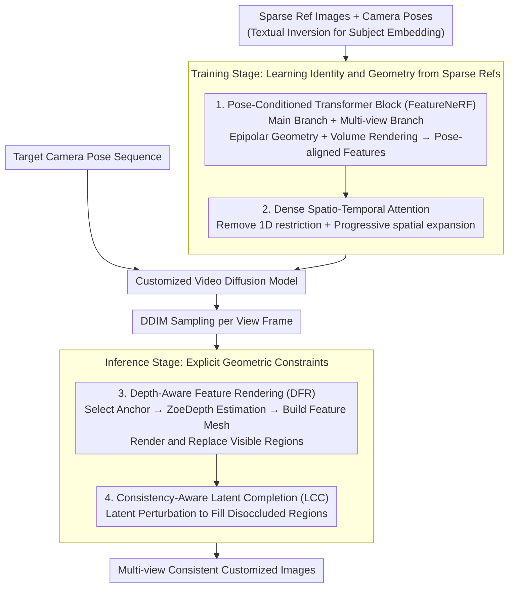

# MVCustom: Multi-View Customized Diffusion via Geometric Latent Rendering and Completion

**Conference**: ICLR 2026  
**arXiv**: [2510.13702](https://arxiv.org/abs/2510.13702)  
**Code**: [Project Page](https://minjung-s.github.io/mvcustom/)  
**Area**: Diffusion Models / Personalized Generation  
**Keywords**: Multi-view customized generation, camera pose control, feature field rendering, video diffusion, geometric consistency  

## TL;DR

Ours proposes a new task called multi-view customization and designs the MVCustom framework. By utilizing a video diffusion backbone combined with dense spatio-temporal attention to achieve overall frame consistency, and introducing two inference-stage techniques—depth-aware feature rendering and consistency-aware latent completion—it is the first to simultaneously achieve camera pose control, subject identity preservation, and cross-view geometric consistency.

## Background & Motivation

**Background**: Controllable image generation has two key dimensions: camera control (multi-view generation) and customization (maintaining subject identity based on reference images). While extensive work exists for each, methods that **jointly** achieve both are virtually non-existent.

**Limitations of Prior Work**:
   - Traditional customization methods (DreamBooth, Custom Diffusion) do not support camera pose control.
   - Multi-view generation methods (CameraCtrl, SEVA) do not support personalized customization.
   - Customized methods with pose control (CustomDiffusion360, CustomNet) focus only on the subject and ignore cross-view consistency of the background.
   - Directly applying customization methods (e.g., DreamBooth-LoRA) to multi-view generation backbones leads to loss of subject identity and weakened camera control.

**Key Challenge**: Multi-view generation relies on large-scale data to learn 3D geometry, whereas customization scenarios provide only a few reference images. There is a fundamental conflict between data scarcity and the requirement for geometric consistency.

**Goal**: Define and solve the "multi-view customization" task: (i) generate images matching specified camera poses; (ii) maintain the subject identity from reference images; (iii) ensure consistency for both subject and background across views.

**Key Insight**: Decouple the training and inference stages. The training stage learns subject identity and geometry from limited data, while the inference stage ensures consistency through explicit geometric constraints (depth rendering).

**Core Idea**: Utilize a video diffusion backbone to learn temporal consistency, model geometry with feature fields, and ensure cross-view geometric consistency during inference via depth-guided rendering.

## Method

### Overall Architecture

MVCustom addresses "multi-view customization": given a few reference images and a sequence of target camera poses, it generates a set of images that maintain subject identity and exhibit geometric consistency across views. It splits the process into training and inference phases. The training phase uses an AnimateDiff video diffusion model as the backbone, replacing the original 1D temporal attention with dense spatio-temporal attention. It inserts pose-conditioned Transformer blocks with FeatureNeRF to inject camera geometry and uses textual inversion to learn a subject embedding for identity and coarse geometry from sparse references. The inference phase no longer relies on implicit geometric memory but applies explicit constraints: first, using depth-aware feature rendering to project anchor frame content to other views via geometry, then using consistency-aware latent completion to fill regions newly exposed by camera movement.

### Key Designs

**1. Pose-Conditioned Transformer Block (FeatureNeRF): Learning 3D Geometry from Sparse References**

In customization scenarios with few reference images, the model must learn both subject identity and its 3D structure. A dual-branch structure is designed: the main branch generates feature maps for the target view, while the multi-view branch aggregates features from reference views via FeatureNeRF. FeatureNeRF utilizes epipolar geometry and volume rendering to synthesize a pose-aligned feature map $\bm{X}_y$ from a set of posed reference features $\{(\bm{X}_i, \pi_i)\}$. This explicitly injects camera pose information into the diffusion process, allowing the model to recover pose-aligned subject representations from sparse references.

**2. Dense Spatio-Temporal Attention: Enabling Correct Spatial Flow Propagation**

The original 1D temporal attention in AnimateDiff only interacts between frames at the same spatial position. When the viewpoint changes and spatial displacement occurs, objects move to different pixel positions, which this attention cannot model. Dense 3D spatio-temporal attention removes this restriction, allowing cross-frame interaction between any spatial locations. To maintain pre-trained knowledge and training stability, the spatial attention domain is expanded progressively. Ablation studies show this is critical: during feature replacement, 1D temporal attention fails to propagate spatial flow correctly, whereas dense spatio-temporal attention enables correct cross-frame spatial consistency propagation.

**3. Depth-Aware Feature Rendering (DFR): Explicit Geometric Constraints for Data Scarcity**

Since training data is insufficient for implicit geometric consistency (unlike large-scale multi-view methods), explicit constraints are applied during inference. An anchor frame is selected, its depth is estimated using ZoeDepth, and a feature mesh $\mathcal{M}_a = (\bm{P}_a, \bm{F}_a, \mathcal{T}_a)$ is constructed. This mesh is rendered into other camera poses using a differentiable renderer. In the first 35 steps of DDIM sampling, the visible regions of the target frames are directly replaced by the rendered features:

$$\hat{\bm{F}}_n = \bm{M}_n^a \odot \bm{F}_n^a + (1-\bm{M}_n^a) \odot \bm{F}_n$$

where $\bm{M}_n^a$ denotes the visibility mask of the anchor frame in the $n$-th view. This ensures geometry-aligned consistency for anchor-visible content across all views, causing the background to translate correctly with camera movement instead of remaining static.

**4. Consistency-Aware Latent Completion (LCC): Handling Disoccluded Regions**

Feature rendering only transfers parts visible in the anchor frame. Viewpoint changes inevitably reveal disoccluded regions that rendering cannot fill; these must be completed using generative priors. During denoising, $x_0$ is predicted from the intermediate latent $x_t$, then re-noised to $t$ to obtain a perturbed latent $x_t'$. The disoccluded regions in the original latent are then replaced with the perturbed version, iterating from timestep $T$ to an early timestep $\tau$. This forces the model to "imagine" coherent content for new regions while maintaining existing geometry, avoiding repetitive textures caused by simple copying.

### Loss & Training

Standard denoising loss + FeatureNeRF loss. The video backbone is trained on a WebVid10M subset (430K samples), and the CO3Dv2 dataset is used for customization experiments (3 concepts each for cars, chairs, and motorcycles).

## Key Experimental Results

### Main Results

| Method | Pose Accuracy↑ | MV Consistency↓ | ID Preservation↓ | Text Alignment↑ |
|------|-------------|-------------|----------|----------|
| Custom Img + Img-MV gen | 0.675 | 0.214 | 0.504 | 0.676 |
| Txt-MV gen with DB | 0.283 | **0.116** | 0.557 | 0.723 |
| CustomDiffusion360 | 0.000 | 0.190 | **0.417** | **0.806** |
| **MVCustom (ours)** | **0.735** | 0.121 | 0.448 | 0.744 |

MVCustom is the only method to achieve high scores in both camera pose accuracy and multi-view consistency simultaneously.

### Ablation Study

| Configuration | Effect |
|------|------|
| Customization Fine-tuning only (No DFR/LCC) | Background remains static across views |
| + Depth-Aware Feature Rendering (DFR) | Background translates correctly, but repeats in disoccluded areas |
| + Consistency-Aware Latent Completion (LCC) | Natural completion of disoccluded regions, full geometric consistency |
| 1D Temporal Attention + Feature Replacement | Spatial flow propagation fails |
| Dense Spatio-Temporal Attention + Feature Replacement | Correct spatial consistency propagation |

### Key Findings

- CustomDiffusion360 completely fails COLMAP reconstruction (Pose Accuracy=0), indicating that focusing solely on the subject while ignoring background consistency is non-viable.
- DFR and LCC are complementary: the former ensures geometric consistency for visible regions, while the latter handles generation for invisible regions.
- Dense spatio-temporal attention is a prerequisite for the feature replacement strategy to be effective.
- MVCustom has a significant computational overhead (130.92s, 19.29GB), primarily due to depth estimation and feature replacement.

## Highlights & Insights

- **Systematic Task Definition**: Through Table 1, the paper systematically analyzes the missing capabilities of existing methods in multi-view customization, defining an important and unmet task.
- **Clever Training-Inference Decoupling**: Learning subject representations with limited data during training and using explicit geometric constraints during inference to compensate for data scarcity—this strategy is generalizable to other data-scarce generation tasks.
- **Video Diffusion to Multi-View Transfer**: Leveraging the temporal consistency of video models to achieve multi-view consistency is an effective cross-task transfer approach.

## Limitations & Future Work

- Cannot change the intrinsic pose of an object via text (e.g., from "sitting" to "standing"), as FeatureNeRF learns a fixed canonical pose.
- Computational overhead is notably higher than competing methods (130.92s vs 27-97s, 19.29GB vs 5-7GB).
- Evaluation is limited to 3 categories in CO3Dv2; generalization is not fully verified.
- Rendering results are directly affected by depth estimation quality, which may not be robust for complex scenes.

## Related Work & Insights

- **vs CustomDiffusion360**: Both perform pose-controllable customization, but CD360's neglect of background consistency leads to COLMAP failure; MVCustom solves this via a video backbone and inference-time geometry constraints.
- **vs SEVA (Img-MV gen)**: Multi-view generation from a single image, but lacks subject identity info and degrades severely far from the input view.
- **vs CameraCtrl + DB**: Direct DreamBooth fine-tuning on multi-view models degrades camera control capability.
- The concept of depth-aware feature rendering can be transferred to other generation tasks requiring geometric consistency (e.g., video editing, 3D-aware inpainting).

## Rating

- Novelty: ⭐⭐⭐⭐ Innovative task definition and clever inference-stage geometry constraints.
- Experimental Thoroughness: ⭐⭐⭐ Limited categories (3 classes), lacks large-scale validation.
- Writing Quality: ⭐⭐⭐⭐ Clear problem definition and detailed methodology.
- Value: ⭐⭐⭐⭐ Opens a new direction for multi-view customized generation with potential for 3D content creation.

<!-- RELATED:START -->

## Related Papers

- [\[ICLR 2026\] CroCoDiLight: Repurposing Cross-View Completion Encoders for Relighting](crocodilight_repurposing_cross-view_completion_encoders_for_relighting.md)
- [\[CVPR 2026\] LaRP: Efficient Multi-View Inpainting with Latent Reprojection Priors](../../CVPR2026/image_generation/larp_efficient_multi-view_inpainting_with_latent_reprojection_priors.md)
- [\[CVPR 2025\] LaTexBlend: Scaling Multi-concept Customized Generation with Latent Textual Blending](../../CVPR2025/image_generation/latexblend_scaling_multi-concept_customized_generation_with_latent_textual_blend.md)
- [\[CVPR 2026\] Correspondence-Attention Alignment for Multi-View Diffusion Models](../../CVPR2026/image_generation/correspondence-attention_alignment_for_multi-view_diffusion_models.md)
- [\[ICLR 2026\] Geometric Image Editing via Effects-Sensitive In-Context Inpainting with Diffusion Transformers](geometric_image_editing_via_effects-sensitive_in-context_inpainting_with_diffusi.md)

<!-- RELATED:END -->
