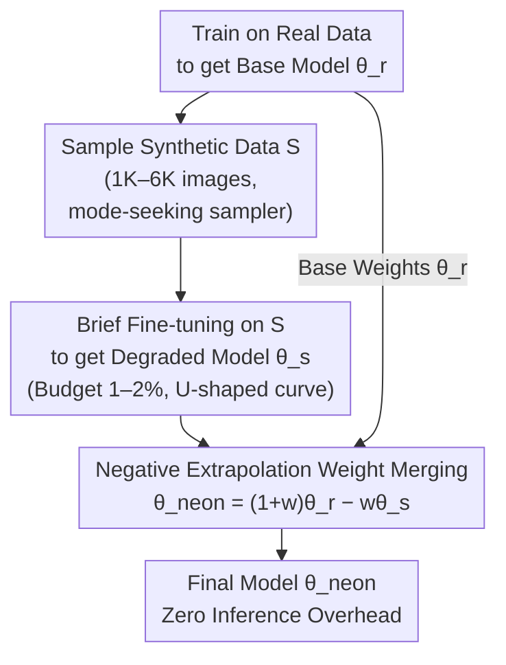

# Neon: Negative Extrapolation From Self-Training Improves Image Generation

**Conference**: ICLR 2026 Oral  
**arXiv**: [2510.03597](https://arxiv.org/abs/2510.03597)  
**Code**: [github.com/VITA-Group/Neon](https://github.com/VITA-Group/Neon)  
**Area**: Image Generation / Self-Training  
**Keywords**: self-training, model collapse, weight merging, negative extrapolation, FID

## TL;DR
Neon is proposed as a post-processing method requiring <1% additional training computation. It involves fine-tuning the model on its own synthetic data to induce degradation, followed by negative extrapolation away from the degraded weights. The study proves that mode-seeking samplers cause anti-alignment between synthetic and real data gradients, making negative extrapolation equivalent to optimizing toward the real data distribution. It improves xAR-L to a SOTA FID of 1.02 on ImageNet 256×256.

## Background & Motivation

**Background**: The scaling of generative models is constrained by the scarcity of high-quality training data. Self-training using synthetic data is an intuitive solution but leads to **Model Autophagy Disorder (MAD / Model Collapse)**, characterized by rapid degradation in sample quality and diversity.

**Limitations of Prior Work**: (a) Self-improvement methods like SIMS require 2× inference NFE, large synthetic datasets (100K), and significant extra training computation (20%); (b) DDO requires multiple iterations (16 rounds × 50K samples); (c) Existing approaches lack a unified theoretical explanation for why self-training degrades and how to exploit it.

**Key Challenge**: While self-training degradation appears wasteful, the direction of degradation itself contains information. If this direction is understood, it can be utilized in reverse.

**Goal**: Can the degradation signals from self-training be converted into self-improvement signals? Can this be supported with theoretical guarantees?

**Key Insight**: The authors observe that mode-seeking samplers (temperature <1, top-k, finite-step ODE solvers) bias synthetic data toward high-probability regions of the model distribution, causing the population gradients of synthetic and real data to be **anti-aligned** ($\cos\varphi < 0$). Consequently, reversing the self-training gradient is approximately equivalent to optimizing toward the real data distribution.

**Core Idea**: Self-training makes a model worse, but the "direction of worsening" is precisely the opposite of the "direction of improvement." Therefore, negative extrapolation can improve the model.

## Method

### Overall Architecture
Neon converts the degradation direction of self-training into an improvement signal. The pipeline adds three steps after the initial training: first, sample a small batch of synthetic data $S$ (approx. 1K–6K) using the base model $\theta_r$; second, briefly fine-tune on $S$ to obtain a "deliberately worsened" degraded model $\theta_s$; finally, perform negative extrapolation in parameter space $\theta_{\text{neon}} = (1+w)\theta_r - w\theta_s$ ($w>0$). This process requires no changes to inference and no new real data, with extra computation under 1% of the original training. Two theories (Anti-alignment Theorem and Risk-reduction Theorem) ensure the reverse direction yields improvement, while a U-shaped budget curve determines the optimal degree of degradation.

### Key Designs

**1. Negative Extrapolation Weight Merging: Moving away from degradation**

Self-training pushes the model toward a worse position $\theta_s$. Neon reverses this by pushing weights in the opposite direction: $\theta_{\text{neon}} = \theta_r + w(\theta_r - \theta_s)$. Here, $(\theta_r - \theta_s)$ acts as the "anti-degradation" direction vector. Implementation is a single line of merging code: `merged[k] = base[k] - w * (aux[k] - base[k])`. Unlike methods like SIMS that require running two models during inference (doubling NFE), Neon produces standard weights with zero additional inference overhead.

**2. Anti-alignment Theory (Theorem 1): Why the reverse is the right direction**

Negative extrapolation relies on gradient directionality. Let the population gradient of the base model on real data be $r_d = \nabla_\theta \mathcal{L}_{\text{real}}(\theta_r)$ and on synthetic data be $r_s = \nabla_\theta \mathcal{L}_{\text{synth}}(\theta_r)$. The paper proves that if the sampler is mode-seeking (monotone reweighting, e.g., temperature $<1$) and the model error $|\varepsilon|$ is sufficiently small, these gradients are anti-aligned:

$$\cos\varphi = \frac{\langle r_d, r_s \rangle}{\|r_d\| \|r_s\|} < 0.$$

This explains why self-training (updating along $r_s$) increases real data loss, and why reversing $r_s$ approximates an update along $r_d$.

**3. Neon reduces population risk (Theorem 2): Guaranteed improvement**

The paper provides an existence guarantee: there exists a suitable $w>0$ such that $\mathcal{L}_{\text{real}}(\theta_{\text{neon}}) < \mathcal{L}_{\text{real}}(\theta_r)$. The optimal $w$ can be predicted from the degree of gradient alignment, making Neon a theoretically grounded correction rather than a purely empirical trick.

**4. U-shaped Training Budget Curve: Optimal degradation**

The duration of fine-tuning for $\theta_s$ (budget $B$) determines the accuracy of the extrapolation direction. If $B$ is too small, $\theta_s$ lacks a clear degradation trend, leading to high noise. If $B$ is too large, the displacement exceeds the validity of the first-order Taylor approximation. Performance follows a U-shaped curve with respect to $B$, with the optimum typically at 1-2% of the base training effort.

### Loss & Training
The fine-tuning stage uses the original standard training loss for each respective architecture. The parameter $w$ is typically chosen in the range $[0.5, 1.5]$, with $w \approx 0.8\text{-}1.0$ recommended. For class-conditional models, $w$ should be tuned jointly with the CFG scale $\gamma$.

## Key Experimental Results

### Main Results

| Model | Type | Dataset | Base FID | Neon FID | Gain |
|------|------|--------|----------|----------|------|
| xAR-L | Flow matching | ImageNet-256 | 1.28 | **1.02** | -20.3% |
| xAR-B | Flow matching | ImageNet-256 | 1.72 | **1.31** | -23.8% |
| VAR d16 | Autoregressive | ImageNet-256 | 3.30 | **2.01** | -39.1% |
| VAR d36 | Autoregressive | ImageNet-512 | 2.63 | **1.70** | -35.4% |
| EDM (cond.) | Diffusion | CIFAR-10 | 1.78 | **1.38** | -22.5% |
| EDM (uncond.) | Diffusion | FFHQ-64 | 2.39 | **1.12** | -53.1% |
| IMM | Moment matching | ImageNet-256 | 1.99 | **1.46** | -26.6% |

### Ablation Study

| Dimension | Key Findings |
|---------|---------|
| Training Budget $B$ | U-shaped curve: optimal at 1-2% of base training. |
| Merging Weight $w$ | $w=-1$ (standard self-training) degrades; $w \in [0.5, 1.5]$ provides consistent improvement. |
| Synthetic Samples | 1K is effective; returns diminish after 6K. |
| Cross-architecture | Synthetic data from one architecture can improve another. |

### Efficiency Comparison

| Method | FID (EDM, cond. CIFAR-10) | Extra Computation | Synthetic Samples | Inference Overhead |
|------|--------------------------|---------|----------|---------|
| **Ours** | 1.38 | 1.75% | 6K | None |
| SIMS | 1.33 | 20% | 100K | 2× NFE |
| DDO | 1.30 | 12% | 800K | None |

### Key Findings
- **Cross-Architecture Generality**: Applicable without modification to diffusion, flow matching, autoregressive, and moment matching models.
- **Precision-Recall Tradeoff**: Neon primarily improves recall (diversity) while slightly decreasing precision, resulting in a net FID reduction.
- **Mode-seeking vs Diversity-seeking**: If the sampler is diversity-seeking ($\tau > 1$), gradient alignment flips, and negative extrapolation fails, confirming theoretical boundary conditions.
- **SOTA**: xAR-L + Neon achieves FID 1.02 on ImageNet 256×256 with only 0.36% extra computation.

## Highlights & Insights
- **Elegant "Degradation as Signal" Insight**: Converting model collapse into a tool by leveraging the information in the degradation direction is a profound conceptual shift.
- **Minimal Implementation**: The method requires only a single line of weight merging code, with no changes to the inference pipeline or extra overhead.
- **Theoretical Alignment**: The anti-alignment theorem accurately predicts the observed U-shaped curve and the requirement for mode-seeking samplers, making it a rare theoretically driven practical method.

## Limitations & Future Work
- **Hyperparameter Tuning**: $w$ and $B$ require some tuning, and there is currently no automatic selection mechanism.
- **Domain Scope**: Only verified for image generation; not yet tested on NLP (where temperature/top-k are also used) or video generation.
- **One-time Correction**: As a local first-order approximation, it cannot be applied iteratively (multiple extrapolations would invalidate the Taylor expansion).
- **Quality vs. Diversity**: It improves the proportion of samples above a quality threshold rather than increasing the peak generation quality.

## Related Work & Insights
- **vs SIMS**: SIMS uses the difference between base and self-trained model scores during inference (2× NFE). Neon performs a one-time merge after training with zero inference cost.
- **vs DDO**: DDO requires 16 iterations and 800K samples, involving far more computation than Neon.
- **Connection to "Why DPO is Misspecified"**: Both exploit information from misspecified or degraded directions—repurposing "bias signals" for model refinement.

## Rating
- Novelty: ⭐⭐⭐⭐⭐ "Negative exploitation of degradation" is highly original conceptually and theoretically.
- Experimental Thoroughness: ⭐⭐⭐⭐⭐ Comprehensive evaluation across 4 architectures and 3 datasets.
- Writing Quality: ⭐⭐⭐⭐⭐ Clear theory, intuitive diagrams, and simple implementation.
- Value: ⭐⭐⭐⭐⭐ High potential to become a standard post-training step due to generality and low cost.

<!-- RELATED:START -->

## Related Papers

- [\[ICLR 2026\] VLM-Guided Adaptive Negative Prompting for Creative Generation](vlm-guided_adaptive_negative_prompting_for_creative_generation.md)
- [\[ICLR 2026\] Stochastic Self-Guidance for Training-Free Enhancement of Diffusion Models](stochastic_self-guidance_for_training-free_enhancement_of_diffusion_models.md)
- [\[ICLR 2026\] Safety-Guided Flow (SGF): A Unified Framework for Negative Guidance in Safe Generation](safety-guided_flow_sgf_a_unified_framework_for_negative_guidance_in_safe_generat.md)
- [\[AAAI 2026\] RetrySQL: Text-to-SQL Training with Retry Data for Self-Correcting Query Generation](../../AAAI2026/image_generation/retrysql_text-to-sql_training_with_retry_data_for_self-correcting_query_generati.md)
- [\[ICLR 2026\] Diffusion Negative Preference Optimization Made Simple](diffusion_negative_preference_optimization_made_simple.md)

<!-- RELATED:END -->
