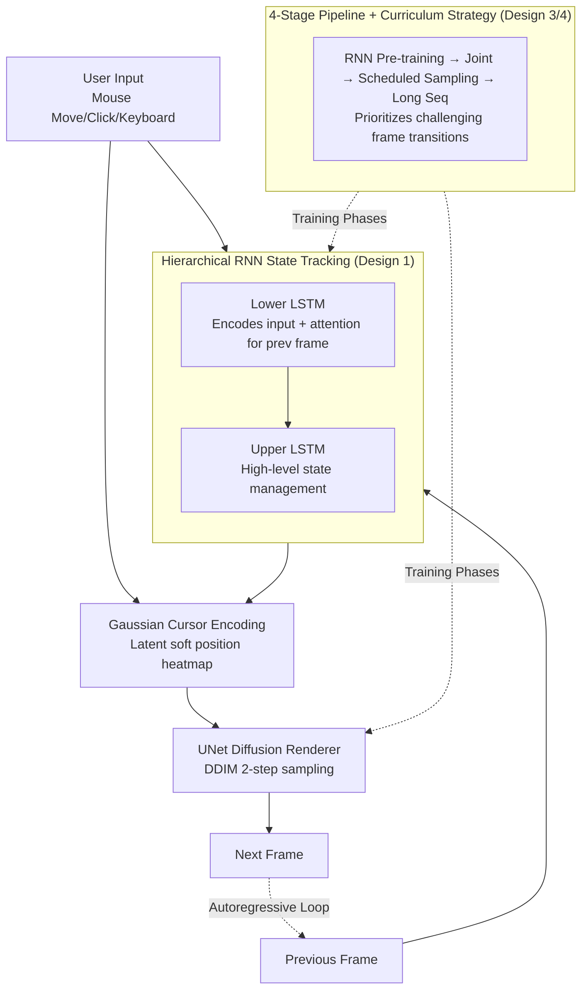

# NeuralOS: Towards Simulating Operating Systems via Neural Generative Models

**Conference**: ICLR 2026  
**arXiv**: [2507.08800](https://arxiv.org/abs/2507.08800)  
**Code**: [neural-os.com](https://neural-os.com)  
**Area**: Image Generation / Interactive World Models  
**Keywords**: operating system simulation, world model, diffusion rendering, GUI generation, interactive systems

## TL;DR

Ours proposes NeuralOS, a dual-component architecture utilizing an RNN for state tracking and a diffusion renderer to predict operating system GUI frame sequences directly from user input events (mouse movement/clicks/keyboard), achieving the first end-to-end simulation of an operating system via neural generative models.

## Background & Motivation

**Background**: Generative models have advanced from text and image generation to video generation and interactive virtual environment simulation (e.g., game world models like GameGen and Oasis). These developments suggest that computing interfaces could potentially transition from manual programming to fully generative systems.

**Limitations of Prior Work**: Existing interactive world models primarily target video games and rely on short context windows, as game states can often be inferred from recent frames. However, OS interfaces are fundamentally different: (1) state transitions exhibit long latencies (e.g., opening Firefox may take 30 frames); (2) the user action space is massive (pixel-level discrete mouse positions); (3) long-term state memory is required (hidden windows, historical operations, etc.).

**Key Challenge**: OS interfaces must respond instantaneously to unpredictable user inputs, often causing abrupt visual changes (e.g., launching an app), which contrasts with the smooth, predictable transitions in video generation. The model must simultaneously maintain precise state tracking and high-quality visual rendering.

**Goal**: Can a neural generative model simulate a graphical user interface of an operating system end-to-end? This involves precise cursor modeling, long-term state tracking, and complex interactions like application lifecycle management.

**Key Insight**: Borrowing from the functional separation between the kernel (state management) and desktop rendering (GUI output) in real operating systems, ours designs a dual-module architecture consisting of an RNN (state tracking) and a diffusion renderer (visual generation), coupled with a multi-stage training strategy.

**Core Idea**: Use a hierarchical RNN to track system state and a diffusion model to render interface frames, enabling the network to learn to simulate an OS through multi-stage training.

## Method

### Overall Architecture

NeuralOS frames OS simulation as an autoregressive generation problem: given historical frames and all user inputs up to the current step, it predicts the next interface frame, formalized as $P(x_{1:T}\mid a_{1:T};\theta) = \prod_t P(x_t\mid x_{<t}, a_{\leq t};\theta)$. It mimics the division of labor in a real OS—where the "kernel manages state and the desktop manages rendering"—by splitting the model into two collaborative components: a hierarchical RNN acting as the "kernel" to continuously track open applications, hidden windows, and history within hidden states; and a UNet diffusion renderer acting as the "monitor" to draw the interface based on the RNN's current state and the latest inputs. During inference, these components loop autoregressively: the rendered current frame is fed back into the RNN as visual input to drive the next frame. The components are optimized via a four-stage training pipeline and curriculum training strategies.

### Key Designs

**1. Hierarchical RNN State Tracking: Infinite History with Constant Computation**

The difficulty of OS interfaces lies in long-term dormant states—a minimized window must be restorable after dozens of frames, and actions like opening Firefox take 30 frames to manifest. This makes short-window Transformer world models ineffective. NeuralOS uses two-layer LSTMs (4096-dim hidden states) for long-range memory: the lower LSTM encodes current user inputs (coordinates, clicks, keys) and merges previous visual information via multi-head attention; the upper LSTM performs high-level state management on this representation. The RNN choice is critical: computation per step remains constant, compressing infinite history into a fixed hidden state, which is ideal for real-time frame-by-frame simulation requiring long-term persistence.

**2. Gaussian Cursor Encoding: Preventing Cursor Drift in Latent Space**

Mouse positions exist in a large pixel-level discrete space, but rendering occurs in a compressed latent space. Feeding raw coordinates or one-hot encodings often leads to precision loss due to the coarse latent grid, causing cursor drift. NeuralOS generates a 2D Gaussian heatmap centered at the cursor coordinates in the latent space: $M_t(i,j) = \exp\!\left(-\frac{(i-a_t^x/s)^2 + (j-a_t^y/s)^2}{2}\right)$, where $s$ is the downsampling ratio. This is concatenated with the RNN output for the renderer, replacing discrete hard-coding with a continuous soft position signal. This reduced horizontal/vertical cursor error from 130 / 95.8 pixels to 1.6 / 1.4 pixels.

**3. Four-Stage Training Pipeline: From Component Isolation to Error Resilience**

In end-to-end training, the diffusion renderer might ignore the RNN output by relying solely on the previous frame, leading to vanishing gradients for the RNN. NeuralOS utilizes a four-stage process: Stage 1 pre-trains the RNN using MSE loss to predict latent frames, establishing the gradient path; Stage 2 performs joint optimization of the RNN and renderer; Stage 3 introduces scheduled sampling, replacing ground-truth frames with model-generated frames with probability $p$ to mitigate exposure bias and long-sequence error accumulation; Stage 4 extends the sequence length to capture longer dependencies.

**4. Curriculum Training Strategy: Focusing on Learning Signals that Matter**

Most adjacent frames in real OS recordings involve only minor cursor movements with stagnant backgrounds. Full-scale training on such data dilutes the learning signal. NeuralOS prioritizes "challenging frame transitions"—pairs where pixel differences exceed a threshold—to focus computation on state mutations like app launches or window pop-ups before expanding to the full dataset.

### Loss & Training

The training loss transitions from MSE in Stage 1 (constraining the first $C$ channels of RNN output to match target latent frames) to standard DDPM diffusion loss in Stages 2–4. The model features a 2.2B parameter RNN and a 263M parameter UNet renderer. Interactive data was collected via 64 parallel Docker containers, with a total training cost of approximately 23,000 GPU hours (H200 + H100). Using 2-step DDIM sampling, inference reaches 18 fps on a single H100.

## Key Experimental Results

### Main Results

**Cursor Position Accuracy**

| Method | Δx (pixels) | Δy (pixels) |
|------|-------------|-------------|
| NeuralOS (with Gaussian Map) | 1.6 | 1.4 |
| NeuralOS (w/o Gaussian Map) | 130.0 | 95.8 |
| Random Baseline | 175.4 | 126.9 |

**State Transition Accuracy**: 37.7% (across 73 clusters, significantly outperforming the majority voting baseline of 1.4%).

**Human Identification Experiment**:

| Clip Length | Human Success Rate in Identifying Real OS |
|----------|----------------------|
| 10s | 58.3% |
| 20s | 55.0% |

In short clips, humans perform only slightly better than random guessing.

### Ablation Study

| Component | Impact |
|------|------|
| No Gaussian Cursor Encoding | Δx increased from 1.6 → 130.0 px |
| No Scheduled Sampling (Stage 3) | RMSE continuously grows; long-sequence degradation |
| Random Data Only | Spurious correlations emerge (moving to close button closes window) |
| Agent Data Only | Insufficient interaction diversity |

### Key Findings

1. **Precise cursor modeling is vital**: Gaussian spatial encoding reduced cursor error from 130px to 1.6px.
2. **RNN pre-training is necessary**: Without it, the diffusion renderer tends to ignore RNN outputs.
3. **Scheduled sampling mitigates error accumulation**: Long-sequence generation quality improved significantly.
4. **Synthetic data enables new capabilities**: The model simulated Doom—which was never installed—by learning from synthetic demonstrations.
5. **Data diversity balance**: Combining random and agent-driven data sources is superior to using either in isolation.

## Highlights & Insights

- **Grand Vision**: This work represents a shift from content generation to system simulation by being the first to propose and implement an OS via neural models.
- **Doom Experiment**: Training on synthetic data to simulate uninstalled applications suggests that generative interfaces can exist independently of real software.
- **Engineering Depth**: Demonstrates strong system engineering through parallelized data collection, 4-stage curriculum strategies, and inference optimization (18fps).
- **Cursor Modeling Insight**: Gaussian spatial encoding is a simple yet effective solution for precise position control in interactive generative models.
- **Inspiration for Agents**: NeuralOS provides a safe, simulated environment for training and evaluating computer-use agents without requiring real system commands.

## Limitations & Future Work

1. **Restricted Resolution**: Limited to 512×384, far below standard OS resolutions.
2. **Limited Application Scope**: Only includes Home, Trash, Terminal, and Firefox.
3. **Keyboard Modeling**: Fine-grained keyboard input modeling is hindered by computational resource constraints.
4. **High Training Cost**: Requires 23,000 GPU hours and significant data processing time.
5. **Low Transition Accuracy**: While 37.7% beats baselines, it is far from practical utility.
6. **Scalability**: Difficulty in extending to complex real-world scenarios like multi-window applications or system settings.

## Related Work & Insights

- Difference from video game world models (GameGen, Oasis): OS simulation requires longer state memory and larger action spaces.
- Connection to **World Labs / Genie**: Part of the trend exploring generative environments as a replacement for manual programming.
- Inspiration for **computer-use agents** (e.g., Claude computer use): Potential as a simulation layer.
- Future UI Design: Generative interfaces could allow real-time personalized adaptation based on user needs.

## Rating

- **Novelty**: ⭐⭐⭐⭐⭐ — Pioneering work in OS simulation via neural generative models.
- **Experimental Thoroughness**: ⭐⭐⭐⭐ — Comprehensive multi-angle evaluation, though environments are simplified.
- **Writing Quality**: ⭐⭐⭐⭐⭐ — Engaging narrative with clear formalization and detailed training descriptions.
- **Value**: ⭐⭐⭐⭐ — Exciting vision with preliminary validation, though far from deployment.

<!-- RELATED:START -->

## Related Papers

- [\[ICLR 2026\] PixNerd: Pixel Neural Field Diffusion](pixnerd_pixel_neural_field_diffusion.md)
- [\[ICLR 2026\] Amortising Inference and Meta-Learning Priors in Neural Networks (BNNP)](amortising_inference_and_meta-learning_priors_in_neural_networks.md)
- [\[NeurIPS 2025\] AccuQuant: Simulating Multiple Denoising Steps for Quantizing Diffusion Models](../../NeurIPS2025/image_generation/accuquant_simulating_multiple_denoising_steps_for_quantizing.md)
- [\[ACL 2025\] Planning with Diffusion Models for Target-Oriented Dialogue Systems](../../ACL2025/image_generation/difftod_diffusion_dialogue_planning.md)
- [\[ICLR 2026\] DoFlow: Flow-based Generative Models for Interventional and Counterfactual Forecasting](doflow_flow-based_generative_models_for_interventional_and_counterfactual_foreca.md)

<!-- RELATED:END -->
