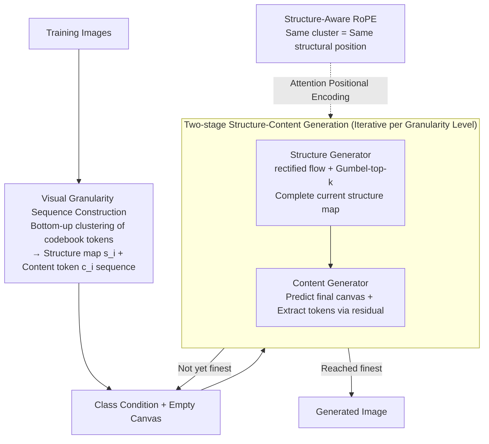

# Next Visual Granularity Generation

**Conference**: ICLR 2026  
**arXiv**: [2508.12811](https://arxiv.org/abs/2508.12811)  
**Code**: [Project Page](https://yikai-wang.github.io/nvg)  
**Area**: Image Generation / Visual Autoregression  
**Keywords**: Visual Granularity, Autoregressive Generation, Structured Sequence, Coarse-to-fine Generation, ImageNet

## TL;DR

Ours proposes the Next Visual Granularity (NVG) generation framework, which decomposes images into structured sequences at different granularity levels. By generating from global layout to fine details step-by-step, it achieves consistent FID improvements over the VAR series.

## Background & Motivation

- **Limitations of existing generation paradigms**:
    - Token serialization methods ignore rich 2D spatial structures and suffer from exposure bias.
    - In VAR's visual pyramids, a single token in early stages represents large and semantically diverse regions, causing representation ambiguity.
    - Diffusion models lack explicit structural control and require additional modules.
- **Core Idea**: Represent images using different numbers of unique tokens at the same spatial resolution to construct a granularity hierarchy.

## Method

### Overall Architecture

NVG addresses the issue where autoregressive image generation flattens images into 1D token sequences, losing 2D spatial structure, and where VAR's spatial pyramids involve tokens representing semantically mixed regions in early stages. The Mechanism is to decompose an image at a **fixed spatial resolution** into a coarse-to-fine granularity sequence: each stage covers the entire image, but the number of allowed unique tokens increases—from a few tokens sketching the global layout to more tokens refining fine details.

The pipeline follows two steps. **Sequence construction (offline)**: A multi-granularity quantized autoencoder encodes images into a $16\times16$ latent space. Codebook tokens are then clustered bottom-up to obtain the structured sequence $\mathcal{T} = \{(\boldsymbol{c}_i, \boldsymbol{s}_i)\}_{i=0}^K$, where $\boldsymbol{c}_i$ represents content tokens (containing $|c_i| = n_i$ unique tokens from a shared codebook $\mathcal{V}$) and $\boldsymbol{s}_i$ is an $h \times w$ structure map identifying which token to use at each spatial position. **Generation (online)**: "Predicting the next token" is replaced by "predicting the next granularity level." Starting from an empty canvas, a structure generator first completes the structure map for the current level, followed by a content generator filling details and refining the canvas. This iterates until the finest granularity. Structure-Aware RoPE embeds "intra-cluster" relationships into the attention positional encoding, making structural control intrinsic to the generation.

### Key Designs

**1. Visual Granularity Sequence Construction: Defining "Coarse-to-Fine" without Resolution Scaling**

VAR uses spatial downsampling to create pyramids, where an early-stage token must represent a large, semantically mixed area. NVG instead uses bottom-up clustering: starting from the finest granularity (one unique token per position), it greedily merges the top-$k$ most similar tokens based on $\ell_2$ distance. With $k=2$, the number of tokens halves per stage, forming a sequence of levels $\{2^i\}_{i=0}^8$ on a $16^2$ latent space. The content side uses a residual pyramid similar to VAR, but compression is guided by the structure map rather than spatial scaling. Thus, each token always corresponds to a semantically coherent cluster of regions. To inform the model of its current level, a $K$-dimensional vector encodes cross-stage hierarchical relationships.

**2. Two-stage Structure-Content Generation: Sketching before Painting**

Generation at each granularity level is split into "structure first, then content." The structure generator is a lightweight rectified flow model using v-prediction with Gumbel-top-$k$ sampling to recover the structure map from noise. It uses $\boldsymbol{z}_s(t) = t \cdot \boldsymbol{\varepsilon} + (1-t) \cdot \boldsymbol{s}_e$, where determined parts are replaced by ground-truth to ensure stability. The content generator directly predicts the final canvas $f_c(\boldsymbol{x}_i) \rightarrow \boldsymbol{x}$. New tokens are extracted from the canvas via residuals. The training objective constrains both canvas regression and token classification:

$$\ell(\boldsymbol{x}_i) = \|\boldsymbol{x} - f_c(\boldsymbol{x}_i)\|_2^2 + \text{CE}(\hat{\boldsymbol{c}}_i, \boldsymbol{c}_i)$$

The regression term pushes each stage toward the complete canvas, while the cross-entropy term ensures token accuracy. This "residual modeling + progressive canvas refinement" allows the model to correct the whole image at each step, mitigating exposure bias and error accumulation common in autoregression.

**3. Structure-Aware RoPE: Embedding Clusters into Positional Encodings**

To help attention distinguish intra-cluster and inter-cluster relationships, NVG splits the 64-dimensional attention features into three segments: 8 dims for text/image identification, $2\times8$ dims for structural level encoding, and $20\times2$ dims for spatial position. Crucially, tokens within the same cluster share the same structural position. Consequently, the model naturally perceives which positions belong to the same granular unit during attention, building structural control into the generation process without extra conditioning modules.

## Key Experimental Results

### ImageNet 256×256 Class-Conditional Generation

| Type | Model | FID(↓) | IS(↑) | Prec(↑) | Rec(↑) | Parameters |
|------|------|--------|-------|---------|--------|-------|
| X-AR | VAR-d16 | 3.30 | 274.4 | 0.84 | 0.51 | 310M |
| X-AR | VAR-d20 | 2.57 | 302.6 | 0.83 | 0.56 | 600M |
| X-AR | VAR-d24 | 2.09 | 312.9 | 0.82 | 0.59 | 1.0B |
| **X-AR** | **NVG-d16** | **3.03** | **291.6** | - | - | - |
| **X-AR** | **NVG-d20** | **2.44** | **305.0** | - | - | - |
| **X-AR** | **NVG-d24** | **2.06** | **323.0** | - | - | - |
| Mask | MAR-H | 1.55 | 303.7 | 0.81 | 0.62 | 943M |
| Diff | SiT-X | 2.06 | 270.3 | 0.82 | 0.59 | 675M |

### Ablation Study: Granularity vs. Spatial Decomposition

| Method | rFID(↓) | IS(↑) | Description |
|------|--------|-------|------|
| **NVG (Granularity)** | **Better** | **Better** | Clearer token semantics |
| VAR (Spatial) | Baseline | Baseline | Mixed semantics in early stages |

### Key Findings

1. NVG consistently outperforms VAR across all model scales (FID: 3.30→3.03, 2.57→2.44, 2.09→2.06).
2. Clear scaling laws: larger models continuously improve performance.
3. High correspondence between generated images and structure maps validates effective structural control.
4. Structure maps from reference images can be reused for cross-content structure transfer.

## Highlights & Insights

1. **Elegant Problem Reformulation**: Shifts autoregressive generation from "next token" to "next granularity level."
2. **Addressing VAR Ambiguity**: Granularity-based decomposition ensures each token has clearer semantics.
3. **Explicit Structural Control**: Structural control is built into the generation process without needing auxiliary conditioning modules.
4. **Mitigating Exposure Bias**: Residual modeling and progressive canvas refinement prevent the accumulation of errors typical in autoregression.

## Limitations & Future Work

- Greedy clustering may not be the optimal way to construct structures.
- The dual-model design (structure + content) increases system complexity.
- Currently only validated on class-conditional generation; text-to-image generation is unexplored.
- "Cold start" issues in the structure generator require unified cross-stage training for mitigation.

## Related Work

- **Visual Autoregression**: VAR, LlamaGen, Open-MAGVIT2
- **Diffusion Models**: DiT, SiT, LDM
- **Masked Models**: MaskGIT, MAR, TiTok

## Rating

- Novelty: ⭐⭐⭐⭐⭐ — The concept of visual granularity sequences is unique and intuitive.
- Technical Depth: ⭐⭐⭐⭐ — Sophisticated design of structural embeddings and Structure-Aware RoPE.
- Experimental Thoroughness: ⭐⭐⭐⭐ — Comprehensive comparisons and clear scaling analysis.
- Value: ⭐⭐⭐⭐ — Provides a new paradigm for image generation and structural control.

<!-- RELATED:START -->

## Related Papers

- [\[CVPR 2026\] FVAR: Next-Focus Prediction for Visual Autoregressive Modeling](../../CVPR2026/image_generation/fvar_next-focus_prediction_for_visual_autoregressive_modeling.md)
- [\[ICLR 2026\] BAR: Refactor the Basis of Autoregressive Visual Generation](bar_refactor_the_basis_of_autoregressive_visual_generation.md)
- [\[ICLR 2026\] Product of Experts for Visual Generation](product_of_experts_for_visual_generation.md)
- [\[ICLR 2026\] Pyramidal Patchification Flow for Visual Generation](pyramid_patchification_flow_for_visual_generation.md)
- [\[ICML 2026\] Semantic Granularity Navigation in Image Editing](../../ICML2026/image_generation/semantic_granularity_navigation_in_image_editing.md)

<!-- RELATED:END -->
