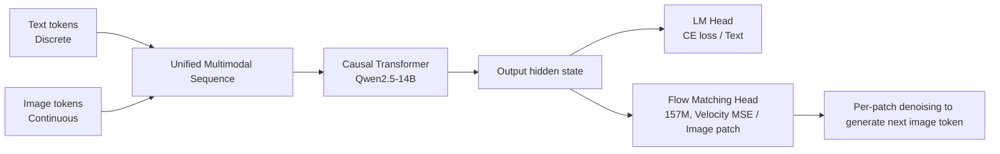

# NextStep-1: Toward Autoregressive Image Generation with Continuous Tokens at Scale

**Conference**: ICLR 2026  
**OpenReview**: [https://openreview.net/forum?id=Ndnwg9oOQO](https://openreview.net/forum?id=Ndnwg9oOQO)  
**Code**: [https://github.com/stepfun-ai/NextStep-1](https://github.com/stepfun-ai/NextStep-1)  
**Area**: Image Generation / Autoregressive Generation / Multimodal  
**Keywords**: Autoregressive image generation, continuous tokens, Flow Matching, image tokenizer, text-to-image  

## TL;DR
A 14B causal Transformer is utilized to perform next-token prediction directly on **continuous image tokens**, paired with a lightweight 157M flow matching head as a sampler. Without relying on heavy diffusion backbones or vector quantization, this approach achieves pure autoregressive text-to-image quality comparable to top-tier diffusion models.

## Background & Motivation
- **Background**: High-fidelity image generation has long been dominated by diffusion models (e.g., SD3, FLUX). However, mainstream architectures are "decoupled"—relying on independent pre-trained T5/CLIP text encoders to feed semantics into MMDiT via cross-attention, which is a non-end-to-end design with fixed context windows. Inspired by the "next-token prediction" of LLMs, unified multimodal generation has become an attractive alternative.
- **Limitations of Prior Work**: Autoregressive approaches are divided into two camps with respective flaws. **Discrete AR** (LlamaGen, Emu3, Janus) relies on Vector Quantization (VQ) to discretize images. Quantization introduces information bottlenecks (reconstruction artifacts) and exposure bias; to reduce loss, low compression ratios are used, leading to excessively long sequences and skyrocketing training costs. **Hybrid Architectures** (Transfusion, BAGEL) insert noise inputs and diffusion losses into the LLM's bidirectional attention, requiring simultaneous processing of noisy latents and clean conditional signals, which doubles data, lengthens sequences, and loses the efficiency advantage inherent to sparse autoregression.
- **Key Challenge**: Directly performing autoregression on **continuous** latents (MAR, Fluid) bypasses quantization, yet a significant quality and consistency gap remains compared to SOTA diffusion models. It has not been proven that pure AR on continuous tokens can achieve diffusion-level quality alongside LLM-level simplicity and scalability.
- **Goal**: To build a continuous token autoregressive text-to-image model with a minimalist architecture that matches the quality of top diffusion models while retaining the simplicity and scalability of standard LLMs.
- **Key Insight**: **The key to closing the gap lies in the image representation itself.** The paper designs an image tokenizer specifically pursuing a "well-dispersed + normalized" continuous latent space to stabilize the autoregressive training of high-dimensional continuous latents. Once the representation is correct, a naive causal Transformer and a lightweight flow matching head are sufficient to rival diffusion models.

## Method

### Overall Architecture
NextStep-1 concatenates **continuous image tokens** encoded by the image tokenizer with discrete text tokens into a unified sequence $x=\{x_0,...,x_n\}$, performing standard autoregression $p(x)=\prod_i p(x_i\mid x_{<i})$ with a causal Transformer. Text tokens use an LM head for cross-entropy sampling, while image tokens use a patch-wise flow matching head to regress the velocity field for sampling. The system is optimized end-to-end with $L_{total}=\lambda_{text}L_{text}+\lambda_{visual}L_{visual}$ (weight ratio CE:MSE = 0.01:1).

### Key Designs

**1. Continuous token autoregression + patch-wise flow matching head: Reducing diffusion to a lightweight sampler.** Unlike the mainstream approach of "AR generating semantic embeddings followed by a heavy diffusion model denoising the whole image," NextStep-1 operates **patch-by-patch** autoregressively. The Transformer outputs a hidden state for each patch as a condition, and the flow matching head only handles pushing a noise sample along the velocity field to the clean latent of that specific patch. This head, with only 157M parameters (12 layers, 1536 hidden dimensions MLP), supports diffusion-level quality. The paper argues this framework belongs to **pure next-token prediction** rather than "diffusion orchestrated by a Transformer."

**2. "Dispersed + Normalized" latent space of tokenizer: The root of stable high-dimensional continuous AR.** The tokenizer is fine-tuned from the FLUX VAE (using only reconstruction and perceptual losses), encoding images into 16-channel, 8× downsampled latents. Token-wise normalization is then applied to standardize each channel to zero mean and unit variance. To make the latent distribution more uniform and robust, it draws from $\sigma$-VAE by injecting random perturbations into the normalized latent: $\tilde z = \text{Norm}(z) + \alpha\cdot\varepsilon$, where $\alpha\sim U[0, \gamma]$ and $\varepsilon\sim N(0, I)$, with $\gamma$ controlling maximum noise intensity. Finally, a 2×2 space-to-depth (pixel-shuffle) operation compresses the latent into a compact sequence—a 256×256 image becomes 256 tokens of 64 dimensions.

**3. Token-wise normalization to cure CFG instability: Identifying the true cause of "gray block artifacts".** VAE-based autoregressive models often produce gray block artifacts under high Classifier-Free Guidance (CFG). While previous work blamed 1D positional encoding discontinuity, this paper identifies the cause as **token-level distribution drift amplified by high guidance scales**. CFG interpolates predictions as $\tilde v(x|y)=(1-w)v_\theta(x|\varnothing)+w\,v_\theta(x|y)$. In diffusion, latents are normalized and stable; however, in token-level AR, global normalization of the entire latent does not guarantee per-token statistical consistency. Small differences between conditional and unconditional predictions are amplified by large $w$, causing mean/variance drift in later tokens. Token-wise normalization forces per-token statistical stability, preventing collapse even at high CFG.

**4. The counter-intuitive rule of regularized latent spaces: Higher generation loss leads to better quality.** During tokenizer training, increasing noise intensity $\gamma$ raises downstream generation loss but **actually improves** the final generated image quality. This suggests that pursuing low reconstruction/generation loss alone results in an "overfitted" fragile latent space, whereas moderate regularization (noise injection) to improve "generatability" is key. This is combined with three-stage curriculum pre-training (256² → dynamic resolution 512² → high-quality annealing) and post-training alignment (SFT + DPO including Self-CoT data).

## Key Experimental Results

### Main Results (Text-to-Image, prompt alignment)

| Method | Type | GenEval↑ | GenAI-Bench(Adv)↑ | DPG-Bench↑ |
|---|---|---|---|---|
| FLUX.1-dev | Diffusion | 0.66 | 0.65 | 83.79 |
| SD3.5 Large | Diffusion | 0.71 | 0.66 | 83.38 |
| BAGEL | Hybrid | 0.82/0.88† | 0.69/0.75† | 85.07 |
| Qwen-Image | Diffusion | 0.87 | - | 88.32 |
| Emu3 | Discrete AR | 0.54/0.65* | 0.60 | 80.60 |
| Janus-Pro-7B | Discrete AR | 0.80 | 0.66 | 84.19 |
| Infinity | Discrete AR | 0.79 | - | 86.60 |
| **NextStep-1** | **Continuous AR** | **0.63/0.73†** | **0.67/0.74†** | **85.28** |

(†=Self-CoT, *=prompt rewriting) NextStep-1 reaches SOTA levels within the AR category and matches several strong diffusion models. In image editing, NextStep-1-Edit scores 6.58 on GEdit-Bench-EN and 3.71 on ImgEdit-Bench, proving competitive with advanced diffusion editing models.

### Ablation Study (Flow matching head scale)

| Configuration | Layers/Dim/Params | GenEval | GenAI-Bench | DPG-Bench |
|---|---|---|---|---|
| Baseline | - | 0.59 | 0.77 | 85.15 |
| w/ FM Head Small | 6 / 1024 / 40M | 0.55 | 0.76 | 83.46 |
| w/ FM Head Base | 12 / 1536 / 157M | 0.55 | 0.75 | 84.68 |
| w/ FM Head Large | 24 / 2048 / 528M | 0.56 | 0.77 | 85.50 |

### Key Findings
- **The Transformer backbone, not the FM head, performs the generation**: Increasing the FM head from 40M to 528M (13×) results in nearly identical performance. This shows the core generative modeling $p(x_i\mid x_{<i})$ is handled by the Transformer, while the FM head serves as a lightweight sampler translating context predictions into continuous tokens.
- **Token-wise normalization is the switch for high CFG stability**: Without normalization, CFG=3.0 leads to significant mean/variance drift in later tokens and artifacts. With normalization, output latent statistics remain stable across all CFG settings.
- **Tokenizer is key to image generation**: The degree of regularization in the latent space (noise injection $\gamma$) correlates positively with final image quality, even if it increases the training loss.

## Highlights & Insights
- **Minimalist architecture matching diffusion**: A standard decoder-only LLM (initialized from Qwen2.5-14B) + 157M MLP head + 1D RoPE, with no cross-attention, no separate text encoder, and no VQ, proves that "getting the representation right" is more important than "stacking complex architectures."
- **FM head insensitivity is clean evidence of decoupling**: Controlled experiments clarify "who is generating," pinning the responsibility on the Transformer and providing a clear narrative for scaling continuous AR—only the backbone needs to scale, while the head can remain lightweight.
- **Turning CFG instability from mystery to statistics**: Using per-token mean/variance drift curves to locate the cause of artifacts and providing a one-line fix (token-wise normalization) that is transferable to other continuous token AR models.

## Limitations & Future Work
- **Relatively low base GenEval score**: Without Self-CoT, GenEval is only 0.63, lower than Qwen-Image (0.87) or BAGEL (0.82). Reaching 0.73 requires strong dependence on Self-CoT/rewriting, indicating a gap in native prompt alignment.
- **High training cost**: 14B backbone + trillion-level tokens (Stage 1 ~1.23T) + three-stage pre-training + DPO. The entry barrier for replication is high, and the feasibility of smaller model versions is not fully discussed.
- **Tokenizer remains the ceiling**: Image quality is constrained by the reconstruction capability of the FLUX VAE-derived tokenizer. The optimal noise regularization $\gamma$ depends on empirical tuning, lacking a theoretical framework for the "generatability vs. reconstruction fidelity" trade-off.

## Related Work & Insights
- **Discrete AR (LlamaGen/Emu3/Janus)**: This work avoids VQ quantization bottlenecks and sequence length issues by using continuous tokens.
- **Continuous AR (MAR/Fluid)**: Adopts the patch-wise diffusion/flow head concept but closes the quality gap with diffusion through superior tokenizer design.
- **Hybrid Architectures (Transfusion/BAGEL)**: Replaces bidirectional attention and dual inputs with pure NTP, reclaiming the efficiency of AR.
- Insight: For researchers using the LLM paradigm for image generation, this paper signals that effort should be directed toward latent space regularization and per-token statistical stability rather than scaling denoising heads or modifying RoPE.

## Rating
- **Novelty**: ⭐⭐⭐⭐ While components are not entirely new, the assertion that "tokenizer is the key to closing the AR-diffusion gap" + token-wise normalization as a CFG fix + FM head decoupling creates a convincing new understanding.
- **Experimental Thoroughness**: ⭐⭐⭐⭐ Solid evidence across multiple benchmarks (GenEval/GenAI/DPG/Editing) and targeted ablations (FM head/normalization/noise injection).
- **Writing Quality**: ⭐⭐⭐⭐ Discussions on "who generates" and "why the tokenizer matters" are insightful and well-supported by data.
- **Value**: ⭐⭐⭐⭐⭐ Open-sourcing the 14B model and code provides a new SOTA and reproducible baseline for pure autoregressive continuous token text-to-image generation, driving the field toward unified multimodal generation.

<!-- RELATED:START -->

## Related Papers

- [\[ICLR 2026\] Hyperspherical Latents Improve Continuous-Token Autoregressive Generation](hyperspherical_latents_improve_continuous-token_autoregressive_generation.md)
- [\[ICLR 2026\] MADFormer: Mixed Autoregressive and Diffusion Transformers for Continuous Image Generation](textitmadformer_mixed_autoregressive_and_diffusion_transformers_for_continuous_i.md)
- [\[ICLR 2026\] Group Critical-token Policy Optimization for Autoregressive Image Generation](group_critical-token_policy_optimization_for_autoregressive_image_generation.md)
- [\[ICLR 2026\] Autoregressive Image Generation with Randomized Parallel Decoding](autoregressive_image_generation_with_randomized_parallel_decoding.md)
- [\[ICLR 2026\] SSG: Scaled Spatial Guidance for Multi-Scale Visual Autoregressive Generation](ssg_scaled_spatial_guidance_for_multi-scale_visual_autoregressive_generation.md)

<!-- RELATED:END -->
