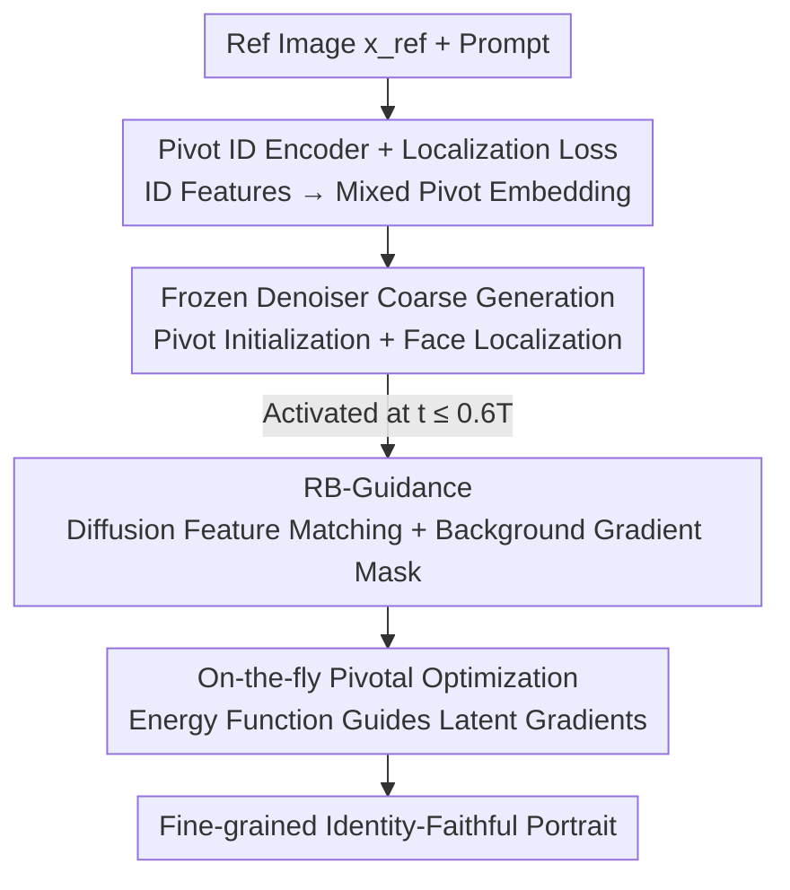

# OmniPortrait: Fine-Grained Personalized Portrait Synthesis via Pivotal Optimization

**Conference**: ICLR 2026  
**OpenReview**: [https://openreview.net/forum?id=DVmR3Ij0ap](https://openreview.net/forum?id=DVmR3Ij0ap)  
**Code**: To be confirmed  
**Area**: Diffusion Models / Image Generation  
**Keywords**: Portrait customization, Identity fidelity, Pivotal optimization, Test-time guidance, Diffusion feature matching

## TL;DR
OmniPortrait decomposes "identity customization" into two coarse-to-fine steps: first, a frozen denoiser and an encoder-only Pivot ID Encoder provide a coarse-grained identity "pivot"; then, during inference, a training-free RB-Guidance performs reference image matching and gradient optimization on intermediate diffusion features. This captures fine-grained details of the reference face without compromising text editability, achieving new SOTA in both identity similarity (SIM) and text alignment (CLIP-T).

## Background & Motivation
**Background**: Within text-to-image diffusion models, personalized portrait generation follows two primary paths: test-time fine-tuning (e.g., DreamBooth, Textual Inversion) or adding identity encoders to the diffusion condition space (e.g., IP-Adapter, InstantID, PhotoMaker) to inject reference features. The latter has become mainstream as it requires only a single reference image without per-person training.

**Limitations of Prior Work**: These "single-stream" injection methods capture coarse identity concepts (gender, face shape) but fail to preserve fine-grained details like moles or specific textures. The loss of detail results in over-smoothed or artificial-looking images. Conversely, methods like FastComposer that use full fine-tuning destroy the rich priors of pre-trained models, leading to abnormal scene composition and a sharp decline in text editability.

**Key Challenge**: A trade-off exists between identity fidelity and text editability. Fine-tuning the denoiser improves fidelity but damages priors; using only an encoder preserves editability but loses details. The paper illustrates this trade-off curve using the delayed conditioning parameter $\alpha$ in FastComposer: increasing $\alpha$ improves identity but causes text control to fail.

**Goal**: Achieve both coarse-grained identity consistency and fine-grained facial details while preserving text alignment, all without modifying denoiser parameters.

**Key Insight**: The authors borrow the idea of PTI (Pivotal Tuning Inversion) from GAN inversion—finding a "pivot" as a stable initialization and then performing local optimization around it. In diffusion customization, this translates to obtaining a coarse but reliable identity initialization, followed by fine-grained test-time optimization.

**Core Idea**: Utilize "pivotal optimization" for **dual-stream, coarse-to-fine** identity guidance. The first stream involves a frozen denoiser and a trained Pivot ID Encoder to provide an identity pivot; the second stream is the test-time RB-Guidance, which performs dense matching in the diffusion feature space and backpropagates gradients to refine details.

## Method

### Overall Architecture
OmniPortrait is built upon latent diffusion models (SD / SDXL) and extends condition injection into energy-based diffusion guidance. Given a reference face $x_{ref}$ and a target prompt $P_t$, the goal is to generate a portrait that matches the text scene while retaining reference details. The pipeline consists of two stages: **Training Phase**, where only a Pivot ID Encoder and a linear projection layer are trained (denoiser remains frozen), using a facial localization loss to constrain identity embeddings to the face region for a reliable "identity pivot"; **Inference Phase**, where the frozen encoder first provides a coarse-grained portrait, and then RB-Guidance is activated in the middle-to-late stages of diffusion ($t \le 0.6T$). RB-Guidance performs feature matching against the reference, formulates a similarity-based energy function, and optimizes noise latents via gradients to "pull" fine-grained details toward the reference identity.

### Key Designs

**1. Pivot ID Encoder + Face Localization Loss: Establishing a Reliable Identity Pivot**

To address the issue where fine-tuning denoisers damages priors, the authors keep the base model frozen. A visual encoder (OpenCLIP-ViT-L/14) extracts features $e_{ref}$, which are concatenated with text embeddings $e_{txt}$ and passed through a linear layer to produce the mixed pivot embedding $e_{mix}$. This essentially "binds" the reference identity to the token that best represents the concept (e.g., woman/man).

To prevent $e_{mix}$ from spreading across the entire body, the **Face Localization Loss** is introduced. It constrains the cross-attention map $A_{t}(m) \in [0,1]^{16\times16}$ of $e_{mix}$ at time $t$ to approximate a scaled face segmentation mask $M$:

$$\mathcal{L} = \mathcal{L}_{diff} + \eta \mathcal{L}_{loc},\quad \mathcal{L}_{loc} = \frac{1}{hw}\sum_{i,j}\big(A_t(i,j)-M(i,j)\big)^2,$$

where $\eta = 2\times10^{-3}$. This constraint improves identity similarity and allows the face mask to be extracted directly from the attention maps during inference, providing an entry point for localized optimization.

**2. RB-Guidance: Training-Free Detail Recovery via Diffusion Feature Matching**

This step recovers details lost by single-stream methods without training. It performs three functions:
- **Region Mask Extraction**: Instead of simple thresholding, it uses structure-rich self-attention maps $A_s(m)$ for iterative refinement $\hat{A}^c_t(m) = A_s(m)\cdot \text{norm}(\cdots\text{norm}(A^c_t(m))^\alpha\cdots)^\alpha$ with $\gamma=3$ iterations and $\alpha=2$, producing the face mask $M_{gen}$ via threshold $\beta=0.5$.
- **Diffusion Feature Correspondence**: Utilizing the local correspondence of diffusion features (DIFT), reference features $D^{ref}_{t_0}$ (at $t_0=671$) are matched with generated features $D^{gen}_t$ inside the mask: $p_{gen} = \arg\min_{p\in M_{ref}} d(D^{ref}_{t_0}[p_{ref}], D^{gen}_t[p])$. The matching score $S_{dift}$ is calculated via cosine similarity.
- **Background Gradient Masking (BGM)**: To prevent gradients from blurring the background, the score gradient is filtered using $M_{gen}$: $\hat{S}_{dift} = (\cdots)\odot M_{gen}$. This ensures only the face region is optimized.

**3. On-the-fly Pivotal Optimization: Guiding Gradients via Energy Functions**

Applying matching from the start would cause divergence because the early-stage generation lacks a stable structure. The matching score is wrapped into an energy function:

$$\mathcal{E} = \frac{p}{1 + \hat{S}_{dift}(z_t, x_{ref}, M_{gen}, M_{ref})},$$

The energy gradient $\nabla_{z_t}\mathcal{E}$ is added to the classifier-free guidance noise prediction only when $t \le \hat{t} = uT$ (where $u=0.6$):

$$\hat{\epsilon}_y(z_t) = \begin{cases} \epsilon_\theta(z_t,t,\varnothing)+w(\epsilon_\theta(z_t,t,y)-\epsilon_\theta(z_t,t,\varnothing)), & t > \hat{t}\\ \cdots + \nabla_{z_t}\mathcal{E}, & t \le \hat{t}\end{cases}$$

Here, $p$ controls optimization strength (set to 8.5). This localized refinement around the "pivot" ensures stability and effectiveness.

### Loss & Training
Only the Pivot ID Encoder and linear layer are optimized using AdamW with a learning rate of $2\times10^{-5}$. The SD version was trained for 80k steps and the SDXL version for 60k steps (filtered to 1024 resolution) on 4×A100-80GB GPUs. 10% dropout is applied to text and ID conditions for CFG support. Inference uses $w=7.5$ and 50 steps of sampling.

## Key Experimental Results

### Main Results
Evaluated on 50 reference images (CelebA-HQ / FFHQ) with 30 prompts each, covering text editability (CLIP-T), identity fidelity (CLIP-I, SIM), and image quality (IQA, FID).

| Method | Plug-and-Play | CLIP-T↑ | CLIP-I↑ | SIM↑ | IQA↑ | FID↓ |
|------|:--:|:--:|:--:|:--:|:--:|:--:|
| DreamBooth | ✗ | 23.32 | 66.45 | 60.07 | 85.88 | 219.40 |
| InstantID | ✓ | 22.26 | 73.03 | 68.35 | 84.17 | 221.62 |
| IP-Adapter | ✓ | 23.93 | 68.23 | 64.19 | 88.15 | 211.15 |
| **Ours** | ✓ | **24.25** | **73.08** | **69.13** | 86.80 | 213.48 |

OmniPortrait achieves the best performance in **both** identity fidelity and text alignment. Unlike InstantID, which acts like "copy-paste" and loses text control, OmniPortrait does not sacrifice one for the other.

### Ablation Study
Ablation on SD version:

| Configuration | CLIP-T↑ | CLIP-I↑ | SIM↑ | FID↓ | Description |
|------|:--:|:--:|:--:|:--:|------|
| w/o $\mathcal{L}_{loc}$ | 22.11 | 46.54 | 35.01 | 476.22 | ID injection misaligned; regions outside face destroyed |
| w/o PIE | 23.19 | 21.83 | 14.15 | 383.17 | No pivot; gradients disperse; no ID enhancement |
| w/o BGM | 19.34 | 37.30 | 33.42 | 483.93 | Gradient leakage blurs background |
| w/o RB-Guidance | 24.88 | 66.10 | 63.87 | 210.45 | Only coarse consistency; lacks facial details |
| **Full** | 24.25 | **73.08** | **69.13** | 213.48 | Complete Model |

### Key Findings
- **PIE (Identity Pivot) is the Foundation**: Without it, SIM drops from 69.13 to 14.15 because RB-Guidance cannot locate or match features without a reliable initialization.
- **BGM Determines Quality**: Masking gradients is essential to prevent blurring (FID 483 without BGM).
- **RB-Guidance Handles Details**: It is the key to recovering fine-grained details, with only a negligible marginal cost to text alignment.
- **Timing $u$ is Sensitive**: $u=0.6$ represents the optimal trade-off between stability and guidance effectiveness.
- **Dataset Contribution**: The authors released OmniPortrait-1M, a million-scale dataset with fine-grained facial and body annotations, filling the gap for high-quality multimodal face data.

## Highlights & Insights
- **Migration of PTI to Diffusion**: The "pivotal optimization" paradigm avoids the dilemma of "modifying denoisers vs. ignoring details."
- **Training-Free RB-Guidance**: Leveraging DIFT for dense matching and energy-based guidance makes it plug-and-play for various base models.
- **Dual-Purpose Localization Loss**: Handles both training constraints and inference-time mask generation in one design.
- **Effective Gradient Masking**: A simple solution to the common problem of background blurring in test-time optimization.

## Limitations & Future Work
- The method assumes a single face; robustness in multi-person or occlusion scenarios is not fully quantified.
- RB-Guidance increases inference overhead; real-time performance is likely lower than vanilla diffusion.
- Many hyperparameters ($t_0$, $u$, $p$, $\gamma$) are set empirically, and their generalizability across different base models requires further verification.

## Related Work & Insights
- **vs. InstantID**: OmniPortrait uses a dual-stream coarse-to-fine scheme to exceed InstantID's identity fidelity without the significant drop in text alignment.
- **vs. FastComposer**: By keeping the denoiser frozen, OmniPortrait avoids destroying pre-trained priors.
- **vs. IP-Adapter**: Adds a test-time detail-recovery mechanism that breaks the detail ceiling of single-stream encoders.

## Rating
- **Novelty**: ⭐⭐⭐⭐⭐ Clear originality in applying PTI to the diffusion dual-stream paradigm.
- **Experimental Thoroughness**: ⭐⭐⭐⭐ Comprehensive baselines and ablations, though lacks quantitative multi-person or latency analysis.
- **Writing Quality**: ⭐⭐⭐⭐ Logical flow and clear explanations, though hyperparameter sensitivity could be more systematic.
- **Value**: ⭐⭐⭐⭐⭐ High practical value for plug-and-play high-fidelity generation and its large-scale dataset.

<!-- RELATED:START -->

## Related Papers

- [\[CVPR 2026\] ExpPortrait: Expressive Portrait Generation via Personalized Representation](../../CVPR2026/image_generation/expportrait_expressive_portrait_generation_via_personalized_representation.md)
- [\[CVPR 2026\] CogniEdit: Dense Gradient Flow Optimization for Fine-Grained Image Editing](../../CVPR2026/image_generation/cogniedit_dense_gradient_flow_optimization_for_fine-grained_image_editing.md)
- [\[ICLR 2026\] LaTo: Landmark-tokenized Diffusion Transformer for Fine-grained Human Face Editing](lato_landmark-tokenized_diffusion_transformer_for_fine-grained_human_face_editin.md)
- [\[CVPR 2026\] Towards Fine-Grained Attribution: Instance-Aware Preference Optimization for Aligning Diffusion Models](../../CVPR2026/image_generation/towards_fine-grained_attribution_instance-aware_preference_optimization_for_alig.md)
- [\[ICLR 2026\] CoCoDiff: Correspondence-Consistent Diffusion Model for Fine-grained Style Transfer](cocodiff_correspondence-consistent_diffusion_model_for_fine-grained_style_transf.md)

<!-- RELATED:END -->
