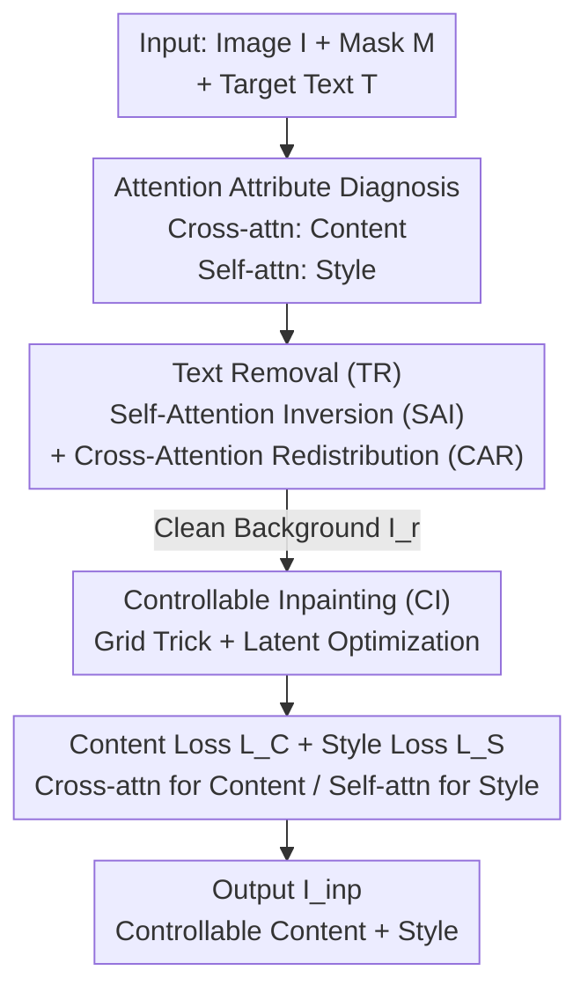

# OmniText: A Training-Free Generalist for Controllable Text-Image Manipulation

**Conference**: ICLR 2026  
**OpenReview**: [https://openreview.net/forum?id=zF7GyVXVw6](https://openreview.net/forum?id=zF7GyVXVw6)  
**Paper**: [Project Page](https://kaist-viclab.github.io/omnitext-site/)  
**Code**: To be confirmed (see project page)  
**Area**: Diffusion Models / Image Editing / Controllable Text Rendering  
**Keywords**: Text-Image Manipulation, Training-Free, Attention Manipulation, Text Removal, Style-Controllable Inpainting

## TL;DR
OmniText is a training-free generalist framework that requires no parameter updates. By manipulating the self-attention and cross-attention of the off-the-shelf text diffusion model TextDiff-2, it unifies "text removal + content control + style control." It covers six types of text-image manipulation (TIM) tasks: removal, editing, insertion, rescaling, repositioning, and style transfer. OmniText outperforms similar text synthesis methods and approaches the performance of task-specific models across multiple metrics.

## Background & Motivation
**Background**: Diffusion-based text synthesis (e.g., AnyText, TextDiff-2, DreamText) uses inpainting to "fill" text into specified masks, enabling the generation of text that is harmonious with the background.

**Limitations of Prior Work**: Existing methods narrow "text-image manipulation" down to only "insertion/editing," facing three critical flaws: (i) Inability to erase text: given an empty text prompt, the model often hallucinations new characters instead of erasing; (ii) Lack of style control: the font, color, and tilt of rendered text rely solely on the surrounding context, lacking explicit control knobs; (iii) Character repetition: redundant letters occasionally appear in the edited area. Consequently, tasks like rescaling, repositioning, and style transfer using separate references remain unaddressed.

**Key Challenge**: Current approaches treat each TIM sub-task as a separate fine-tuning problem for a specialized network, lacking both a generalist framework and fine-grained decoupled control over text content and style. However, generalist capabilities (e.g., poster design) require the ability to erase, modify content, and change styles within a single system.

**Goal**: To decouple text removal, content control, and style control into plug-and-play modules without training or fine-tuning, thereby supporting all TIM tasks using a single backbone.

**Key Insight**: An analysis of TextDiff-2's attention maps during sampling reveals that the attention mechanism itself carries control knobs. Cross-attention character tokens point precisely to spatial regions (controlling content), while self-attention allows character regions to "attend" to nearby similar text (controlling style/causing repetition). The strong self-attention to surrounding text is the root cause of erasure failure and character hallucinations.

**Core Idea**: Since attention naturally encodes content and style, the framework uses "Self-Attention Inversion" + "Cross-Attention Redistribution" to forcefully suppress text generation for removal. It then employs "attention-as-reward latent optimization" to pull content and style respectively—all achieved with zero training.

## Method

### Overall Architecture
OmniText uses TextDiff-2 as a frozen backbone. Given an image $I$, a target mask $M$, and target text $T$, it outputs the manipulated image. The pipeline consists of two serial stages: first, **Text Removal (TR)** to obtain a clean background $I_r$, followed by **Controllable Inpainting (CI)** on $I_r$ to render the target text in the specified style. Neither stage modifies network weights; they only manipulate attention during sampling or apply on-the-fly optimization to latents during early sampling steps. All TIM tasks are combinations of these two modules: removal uses TR only; style-based insertion uses CI only; editing, repositioning, rescaling, and style editing utilize both TR and CI. The "generalist" nature stems from the ability to toggle these components.

The foundation of the method is the **Attention Attribute Diagnosis** (§3.1): cross-attention governs content, self-attention governs style, and strong self-attention to ambient text causes erasure hallucinations. Each subsequent module is a direct application of these three observations.

### Key Designs

**1. Attention Attribute Diagnosis: Identifying "Control Knobs"**

This step addresses the "black-box" nature of existing methods. The authors observe attention probability maps $A_{l,t}=\mathrm{softmax}(QK^\top/\sqrt{d})$ at specific sampling steps (e.g., $t=751$). Three conclusions are drawn: First, in certain cross-attention layers $C_l$, each character token $C^l_{j=e_{c_k}}$ responds only to its corresponding spatial region $m_{c_k}$, indicating that **content can be controlled via cross-attention**. Second, in self-attention layers $S_l$, positions within a character region $S^l_{i\in m_{c_k}}$ attend to adjacent or similar characters, which facilitates style transfer but also causes duplication, indicating that **style can be controlled via self-attention**. Third, even with an empty prompt ($T=$""), the self-attention $S^l_{i\in m}$ still attends to surrounding text, leading to hallucinations. Increasing the cross-attention of the end-of-description token $C^l_{j=E_d}$ suppresses hallucinations, while increasing the start token $C^l_{j=S_d}$ promotes background reconstruction.

**2. Text Removal: Self-Attention Inversion (SAI) + Cross-Attention Redistribution (CAR)**

To solve the issue of residual text and hallucinations during erasure: SAI performs a linear inversion (min $\leftrightarrow$ max) of self-attention values within the mask:

$$S^l_{i,j} = \max_j(S^l_{i,j}) + \min_j(S^l_{i,j}) - S^l_{i,j}$$

This suppresses the high response to surrounding text and enhances the response to the background, forcing the model to "look at the background rather than the text." To supplement this when surrounding detected signals are weak, CAR redistributes the cross-attention map as a step function:

$$C^l_{i,j} = \begin{cases} 1, & (i\in m \text{ and } j=E_d)\ \text{or}\ (i\notin m \text{ and } j=S_d)\\ 0, & \text{otherwise}\end{cases}$$

Effectively, non-edited regions ($i\notin m$) are locked to the start token $S_d$ for reconstruction, while edited regions ($i\in m$) are locked to the end token $E_d$ to suppress text. The combination of SAI ("don't look at text") and CAR ("reconstruct and suppress") allows for clean erasure, even when targeting only the largest text in an image.

**3. Controllable Inpainting: Grid Trick + On-the-fly Latent Optimization**

After obtaining the background $I_r$, the target text must be rendered in the reference style. Borrowing from video editing, a "grid trick" concatenates the target latent and reference latent into a grid structure $G=[z_{I_r\cdot(1-M_{shr})}\ z_{I_{ref}}]$ with a corresponding grid mask $[m_{shr}\ 0]$, allowing self-attention to "copy" style across grids. To prevent character duplication when the target text (e.g., "FLASH") is shorter than the original (e.g., "POCKET"), character width priors are used to shrink the mask to $M_{shr}$. The process is formulated as $I_{inp}=\mathrm{CI}_{\epsilon_\theta}(z_t,[z_{I_r\cdot(1-M_{shr})}\ z_{I_{ref}}],[m_{shr}\ 0],e_T)$, with Adam optimization applied to latents $z'_t\leftarrow\mathrm{Adam}(\nabla_{z_t}L(z_t))$ during early sampling steps.

**4. Content Loss $L_C$ and Style Loss $L_S$: Attention-based Reward**

The total loss is $L=\lambda_C L_C+\lambda_S L_S$. **Content Loss** models character placement as a binary classification: the cross-attention $C^l_{j=c_k}$ should be high in the corresponding region $i\in m_{c_k}$ and low elsewhere. Due to class imbalance, Focal Loss is used:

$$L_C = \sum_{k=1}^{N}\mathrm{FL}(C^l_{i,j=c_k}, m_{c_k}),\quad \mathrm{FL}(p,l)=(1-(p\cdot l))^\gamma\cdot\big[-(l\log p+(1-l)\log(1-p))\big]$$

**Style Loss** models style consistency as distribution matching. KL divergence aligns the self-attention map $S^l_{i\in m}$ within the target mask with a Ground Truth (GT) derived from the reference mask:

$$L_S = D_{KL}(GT, S^l_{i\in m}),\quad GT = m_{ref}\big/\textstyle\sum_{j=1}^{N}(m_{ref})_j$$

Using $L_C$ alone may distort the style by over-focusing on accuracy; using $L_S$ alone improves style but reduces character accuracy. The weighted combination balances the two.

### Loss & Training
The method is entirely **training-free**. No backbone parameters are updated. During inference: (1) SAI/CAR attention manipulation is applied during sampling, and (2) Adam optimization is performed on latents $z_t$ during early steps. For text editing, $\lambda_C=5$ and $\lambda_S=10$ are used, with the input image itself serving as the style reference for CI.

## Key Experimental Results

### Main Results
Evaluation was conducted on standard benchmarks (SCUT-EnsText for removal, ScenePair for editing) and the self-curated OmniText-Bench (150 mockups covering five tasks).

**Text Removal (SCUT-EnsText, "all text" setting)**:

| Method | MS-SSIM↑ | PSNR↑ | MSE↓ | FID↓ |
| :--- | :--- | :--- | :--- | :--- |
| TextDiff-2 (Backbone) | 92.73 | 25.42 | 9.51 | 52.46 |
| AnyText | 92.11 | 23.38 | 9.70 | 69.55 |
| **Ours (OmniText)** | **95.71** | **29.52** | **3.44** | **39.06** |
| LaMa (Specific) | 93.93 | 29.37 | 2.91 | 43.67 |
| ViTEraser (SOTA Specific)| 96.55 | 34.12 | 1.14 | 28.35 |

OmniText is the strongest among generalist methods and outperforms the specialized inpainting model LaMa in MS-SSIM, PSNR, and FID. Specialized removal models like ViTEraser remain the upper bound.

**Text Editing (ScenePair)**:

| Method | ACC(%)↑ | NED↑ | MSE↓ | MS-SSIM↑ | PSNR↑ | FID↓ |
| :--- | :--- | :--- | :--- | :--- | :--- | :--- |
| TextDiff-2 | 76.41 | 0.944 | 6.49 | 35.56 | 13.62 | 29.86 |
| UDiffText | 78.36 | 0.954 | 7.55 | 29.51 | 12.58 | 32.87 |
| **Ours (OmniText)** | **78.44** | **0.951** | **4.79** | **40.11** | **14.85** | 31.69 |
| TextCtrl (Specific) | 78.98 | 0.917 | 4.58 | 37.93 | 14.92 | 31.95 |

OmniText achieves the highest rendering accuracy among generalists and the best style fidelity across most metrics, even outperforming the specialized TextCtrl in NED, MS-SSIM, and FID.

### Ablation Study

**Text Removal Components (SCUT-EnsText)**:

| Config | MS-SSIM↑ (all/largest) | PSNR↑ (all/largest) | FID↓ (all/largest) |
| :--- | :--- | :--- | :--- |
| TextDiff-2 | 92.73 / 96.27 | 25.42 / 28.52 | 52.46 / 21.64 |
| + SAI | 95.56 / 97.58 | 30.02 / 33.12 | 37.31 / 16.70 |
| + SAI + CAR | 95.71 / 98.21 | 29.52 / 33.90 | 39.06 / 15.33 |

**Controllable Inpainting Components (ScenePair)**:

| Config | ACC↑ | NED↑ | MS-SSIM↑ | PSNR↑ | FID↓ |
| :--- | :--- | :--- | :--- | :--- | :--- |
| TextDiff-2 | 76.41 | 0.944 | 35.56 | 13.62 | 29.86 |
| + $L_C$ | 88.52 | 0.970 | 29.90 | 12.01 | 38.85 |
| + G + $L_S$ | 78.28 | 0.949 | 40.19 | 14.86 | 31.64 |
| + $L_C$ + G + $L_S$ | 78.44 | 0.951 | 40.11 | 14.85 | 31.69 |

### Key Findings
- **SAI is the primary driver for removal, while CAR handles realistic scenarios**: In the "all text" setting, SAI alone increases PSNR from 25.42 to 30.02. CAR may introduce slight color shifts in "all text" but is essential for selective removal (e.g., "largest text"), where it further reduces FID from 16.70 to 15.33.
- **Content and style losses inherently conflict**: Adding $L_C$ alone boosts ACC to 88.52 but drops MS-SSIM to 29.90 (distorted style). Adding $G+L_S$ alone boosts style but keeps ACC at 78.28. The combination is necessary to balance accuracy and style consistency.
- **Style control is transferable**: Applying the grid trick and self-attention modulation to UDiffText improves font and color transfer, validating the universality of the approach.

## Highlights & Insights
- **Training-Free Generalist**: By converting attention observations into three modular components (SAI, CAR, and Loss Optimization), the framework unifies six TIM tasks without touching a single model weight.
- **The Elegance of SAI**: Instead of training a new erasure network, the authors identify that hallucinations are caused by the model "looking" at the surrounding text. Simply inverting the attention values forces the model to attend to the background.
- **Attention Decoupling**: Binding content to cross-attention and style to self-attention—and designing specific losses for each—is a design pattern that can be extended to other decoupled editing tasks.
- **OmniText-Bench**: Fills the gap in the literature for a benchmark capable of evaluating the full spectrum of TIM tasks.

## Limitations & Future Work
- **Backbone Dependency**: OmniText’s performance is capped by TextDiff-2’s inherent limitations in handling large font sizes and character spacing.
- **CAR Side Effects**: CAR can introduce minor color shifts during "all text" removal, requiring selective activation.
- **Optimization Overhead**: On-the-fly Adam optimization of latents during inference is slower than pure forward-pass methods.
- **Extreme Style Gaps**: Transferring styles with massive font discrepancies relative to the reference remains challenging.

## Related Work & Insights
- **vs. TextDiff-2 (Backbone)**: TextDiff-2 lacks erasure and style control and suffers from duplication; OmniText fixes these without retraining.
- **vs. Specialized Removal Models (ViTEraser/LaMa)**: While specialized models remain the upper bound for single tasks, OmniText approaches or exceeds them (e.g., LaMa) while maintaining generalist versatility.
- **vs. Specialized Editing Models (TextCtrl)**: TextCtrl is less flexible with character boundaries; OmniText’s grid trick and style loss adapt better to varying masks and outperform it on several fidelity metrics.
- **vs. Generic Training-Free Attention Editing (Prompt-to-Prompt)**: While those methods target general image structures, OmniText is the first to tailor attention manipulation specifically for text-image decoupling.

## Rating
- **Novelty**: ⭐⭐⭐⭐⭐ First TIM generalist; ingenious use of SAI and CAR for training-free control.
- **Experimental Thoroughness**: ⭐⭐⭐⭐ Comprehensive evaluation on standard and new benchmarks; cross-backbone validation.
- **Writing Quality**: ⭐⭐⭐⭐ Logical flow from diagnosis to design; clear mathematical formulation.
- **Value**: ⭐⭐⭐⭐⭐ Highly practical for design automation and as a baseline for future training-free text editing.

<!-- RELATED:START -->

## Related Papers

- [\[ICLR 2026\] Improving Diffusion Models for Class-imbalanced Training Data via Capacity Manipulation](improving_diffusion_models_for_class-imbalanced_training_data_via_capacity_manip.md)
- [\[ICLR 2026\] Training-Free Reward-Guided Image Editing via Trajectory Optimal Control](training-free_reward-guided_image_editing_via_trajectory_optimal_control.md)
- [\[AAAI 2026\] Infinite-Story: A Training-Free Consistent Text-to-Image Generation](../../AAAI2026/image_generation/infinite-story_a_training-free_consistent_text-to-image_gene.md)
- [\[ICLR 2026\] WithAnyone: Toward Controllable and ID Consistent Image Generation](withanyone_toward_controllable_and_id_consistent_image_generation.md)
- [\[NeurIPS 2025\] SceneDesigner: Controllable Multi-Object Image Generation with 9-DoF Pose Manipulation](../../NeurIPS2025/image_generation/scenedesigner_controllable_multi-object_image_generation_with_9-dof_pose_manipul.md)

<!-- RELATED:END -->
