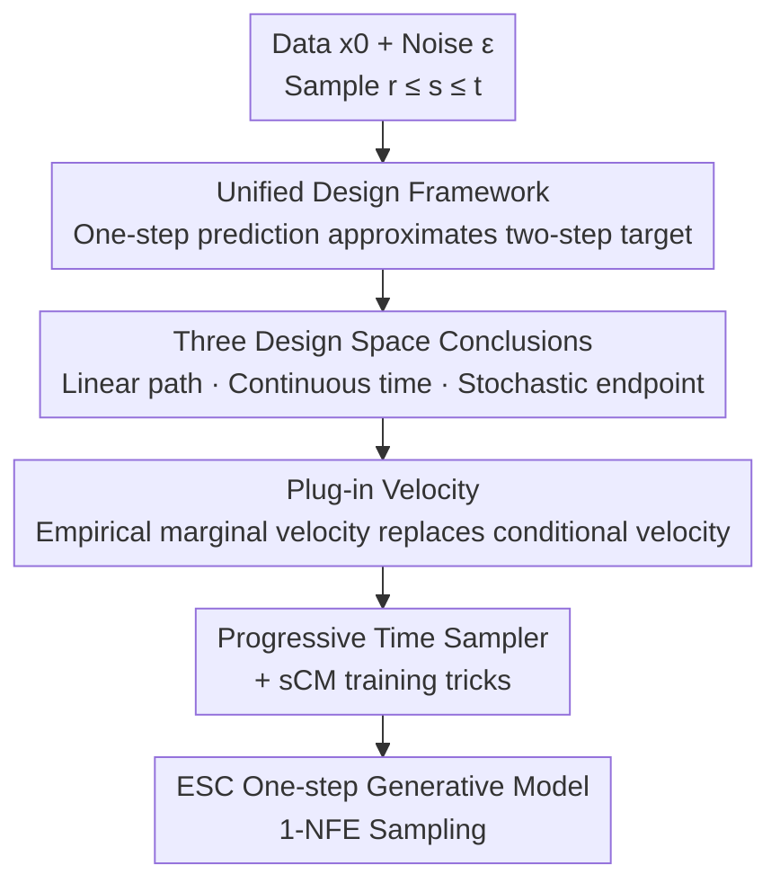

# On the Design of One-Step Diffusion via Shortcutting Flow Paths

**Conference**: ICLR 2026  
**OpenReview**: [https://openreview.net/forum?id=k6q8rRYVQR](https://openreview.net/forum?id=k6q8rRYVQR)  
**Code**: https://github.com/EDAPINENUT/ExplicitShortCut  
**Area**: Diffusion Models / One-step Generation  
**Keywords**: shortcut model, one-step diffusion, flow map, continuous time, ImageNet generation

## TL;DR
This paper unifies various "train-from-scratch one-step diffusion (shortcut models)" into a design framework of "approximating a two-step flow map target with a one-step prediction." This allows for the decoupling of entangled components (flow paths, time samplers, network parameterization, loss metrics) for comparative experiments. Based on this, improvements such as plug-in velocity and progressive time samplers are proposed, achieving a new SOTA FID50k of 2.85 for 1-NFE generation on ImageNet-256×256 (2.53 with 2× training steps) without requiring pre-training, distillation, or curriculum learning.

## Background & Motivation

**Background**: Diffusion and flow models have become mainstream generative modeling techniques, but sampling requires dozens or hundreds of neural network forward passes (NFE), resulting in slow inference. To achieve one-step generation, works like consistency models first train a reliable diffusion model and then distill velocity or scores from it. While effective, this requires expensive two-stage training. Recently, a class of "train-from-scratch" one-step models has emerged—Consistency Training (CT), Inductive Moment Matching (IMM), Shortcut Diffusion (SCD), and continuous-time versions like sCT and MeanFlow. These directly learn the "shortcut mapping" between two points on the probability flow trajectory, collectively referred to here as "shortcut models."

**Limitations of Prior Work**: While these methods share identical goals, their papers are often written with highly coupled "theory + derivation + training tricks." Technical details such as time sampling curricula, loss normalization, and EMA targets are tightly bound to theoretical derivations. This makes every carefully designed module appear indispensable, suggesting that altering one component might break the entire system. Consequently, the design space remains obscured—researchers cannot clearly see how components interact or where improvements can be made.

**Key Challenge**: The fundamental issue is that "proof of theoretical validity" and "specific component-level choices" are conflated. What actually determines the performance of a shortcut model are several orthogonally replaceable components; however, existing literature presents them as entangled, making them impossible to evaluate independently.

**Goal**: (1) Distill a common design framework covering representative discrete/continuous-time methods and provide a theoretical basis for its validity; (2) Deconstruct models into orthogonal components to systematically compare different combinations and clarify the design space; (3) Propose stackable training improvements based on these findings.

**Key Insight**: The authors observe that CT, SCD, IMM, sCT, and MeanFlow essentially perform the same task—"using a one-step parameterized prediction to approximate a target constructed from a two-step flow map." Once this common skeleton is extracted, the remaining differences (linear vs. cosine paths, discrete vs. continuous time, velocity vs. average velocity parameterization, $\ell_2$ vs. LPIPS vs. MMD loss) become pluggable components.

**Core Idea**: Establish "two-step target ↔ one-step prediction" as the unified paradigm, decouple the orthogonal components, and identify the optimal combination (linear path + continuous time + stochastic endpoint) through comparative experiments. Improvements like plug-in velocity are then added to stabilize the supervision signal.

## Method

### Overall Architecture

The "Method" is divided into two layers. The base layer is a **Unified Design Framework**: all train-from-scratch shortcut models first sample three time points $r \le s \le t$, construct a two-step flow map target $\hat{X}_{s,r}\circ\hat{X}_{t,s}(x_t)$, and then have a one-step parameterized prediction $X^\theta_{t,r}(x_t)$ approximate it (with stop-gradient on the target side). The unified objective is:

$$\arg\min_\theta \mathbb{E}_{r,s,t,\,x_t}\Big[w(r,s,t)\cdot d\big(X^\theta_{t,r}(x_t),\ \mathrm{sg}(\hat{X}_{s,r}\circ\hat{X}_{t,s}(x_t))\big)\Big]$$

Where the flow map is solved via $X_{t,r}(x_t)=x_t+(r-t)\,u_{t,r}(x_t)$ (average velocity form) or a DDIM first-order approximation $X_{t,r}(x_t)\approx\bar\alpha_{t,r}x_t+\bar\beta_{t,r}v_t$. This framework decomposes methods into four orthogonal components: **Flow Path** (Linear/Cosine), **Time Sampler** (Discrete/Continuous, Fixed/Stochastic endpoints), **Network Parameterization** (Outputting instantaneous velocity $v^\theta$ or average velocity $u^\theta$), and **Loss Metric** ($\ell_2$ / LPIPS / Group kernel MMD). The paper rewrites CT, SCD, IMM, sCT, and MeanFlow into this framework, proving they are merely different component choices, and provides a Wasserstein-2 error bound (Theorem 2.2) to justify the "two-step target approximation" paradigm.

The upper layer involves **Design Space Study + Improvements**: By fixing training steps and batch size in a unified codebase for component comparisons, three conclusions are drawn (Linear paths > Cosine; Continuous time > Discrete; Stochastic endpoint $r$ is generally better, though fixed $r=0$ converges faster initially). Based on these, the "Continuous time + Linear path + MeanFlow base" is selected, and three training improvements are stacked to create the final model, **ESC (Explicit & easier ShortCut)**. The training pipeline is as follows:

### Key Designs

**1. Unified Design Framework: Decoupling Two-Step Targets into Pluggable Components**

This design addresses the pain point of coupled theory and implementation. The authors argue that all shortcut models follow the flow map consistency $X_{s,r}(X_{t,s}(x_t))=X_{t,r}(x_t)$. Since the ideal goal is to map $x_t$ on a PF-ODE trajectory directly to $x_r$, but $x_r$ is unavailable (marginal velocity $v_t(x)$ and its integral are not analytical), the model must estimate an intermediate point $\hat{x}_s$ first and then $\hat{x}_r$ as the target. By formalizing this (the equation above), the differences between CT/SCD/IMM and sCT/MeanFlow are compressed into component choices—e.g., CT uses cosine paths, $v^\theta$ parameterization, LPIPS loss, and $r$ fixed at 0; MeanFlow uses linear paths, $u^\theta$ parameterization, $\ell_2$ loss, and stochastic $r$. The authors also prove that discrete-time forms converge to continuous-time forms as $s\to t$ (e.g., sCT and MeanFlow are equivalent under linear paths). This decoupling lowers the barrier for innovation.

**2. Design Space Conclusions: Linear Paths, Continuous Time, Stochastic Endpoints**

Using orthogonal components, the authors conducted itemized comparisons (CIFAR-10 unconditional + ImageNet-256 with/without CFG). First, **Linear paths are superior to cosine paths**: The marginal velocity field induced by linear condition paths has lower convex transport costs and smaller trajectory curvature, making the two-step target less likely to deviate from the ideal trajectory. Second, **Continuous time is superior to discrete time**: Proposition 3.1 shows the discrete-time Wasserstein-2 bound includes an extra term $\ell^2\delta_2^2\delta_1^2\sigma_{dtsc}^2$ ($\delta_1=t-s, \delta_2=s-r$), leading to higher inference error and training instability. Third, **Stochastic endpoint $r$ is generally better**: Fixing $r=0$ (sCT-linear) is equivalent to learning only the denoising task, which converges faster initially (around 20–40k steps) but lacks supervision for intermediate trajectories, leading to sub-optimal results. Stochastic $r$ sampling allows the model to learn the overall shortcut pattern.

**3. Plug-in Velocity: Replacing Conditional Velocity with Mini-batch Empirical Marginal Velocity**

Error analysis (Eq. 10) indicates that the inference error of continuous-time models is proportional to the variance of the conditional velocity $\sigma_{v_{t|0}}^2:=\mathrm{Var}(v_t(x_t|x_0))$. This explains why distillation from a pre-trained velocity field is better than training from scratch: distillation replaces high-variance conditional velocity with low-variance $v^\phi_t$. Without a teacher, the authors use the **Ideal Marginal Velocity under empirical distribution** $v^*_t(x_t\mid\{y^{(i)}\}_N)$ (Eq. 12) to replace conditional velocity, theoretically reducing variance to $O(1/N)$ at the cost of $O(1/N)$ bias. Since summation over the entire set ($N \approx 1.28$ million for ImageNet) is unfeasible, it is approximated as a **plug-in velocity** $v^*_t(x_t\mid\{y^{(i)}\}_B)$ calculated within a mini-batch. This is essentially a softmax-weighted mixture of conditional velocities (Algorithm 1), reducing variance to $O(1/B)$. It also includes two corrections for CFG: a **plug-in probability** $p_{\text{plug-in}}$ to trade off between plug-in and conditional velocity (to preserve class signals), and **class-consistent mini-batching**.

**4. Progressive Time Sampler + Existing Training Tricks**

To resolve the conflict between the early speed of $r=0$ and the long-term benefit of stochastic $r$, the authors designed a **Progressive Time Sampler**: For the first $K_{\text{fix0}}$ steps (approx. 20k), $r=0$ is chosen with probability $p_{\text{fix0}}$, while the remainder follows stochastic sampling. $p_{\text{fix0}}$ decays from 1.0 to 0 via a cosine schedule, allowing training to transition smoothly from simple denoising to full shortcut learning. Additionally, since sCT is a form of CTSC, its training tricks—variational adaptive loss weighting and tangent warmup—are stacked to further boost performance.

### Loss & Training
The unified loss is the two-step target approximation formula. Under continuous time, squared $\ell_2$ distance with adaptive weight $w$ is used. For models like MeanFlow, the loss is normalized by $dt$ and includes instantaneous conditional velocity supervision at $r=t$ (probability $p_{teq}$). ESC uses MeanFlow + SiT-B/2 as a baseline, stacking B2 (plug-in velocity $p_{\text{plug-in}}=0.5$ + class-consistent batching) + C (Progressive Sampler) + D (sCM training tricks). For scaling, SiT-XL/2 (≈676M) is trained from scratch for 240 epochs (≈1.2M steps), with ESC+ trained for 480 epochs.

## Key Experimental Results

### Main Results
ImageNet-256×256, 1-NFE generation, SiT-XL/2 backbone:

| Method | NFE | Parameters | FID50k |
|------|-----|--------|--------|
| iCT | 1 | 675M | 34.24 |
| SCD | 1 | 675M | 10.60 |
| IMM | 1×2 | 675M | 7.77 |
| MeanFlow | 1 | 676M | 3.43 |
| MeanFlow | 2 | 676M | 2.93 |
| **ESC** (class-consistent) | 1 | 676M | **2.85** |
| **ESC+** (480 epochs) | 1 | 676M | **2.53** |

ESC (1-NFE) at 2.85 represents a 16.9% improvement over MeanFlow (1-NFE) at 3.43 and outperforms MeanFlow (2-NFE) at 2.93. ESC+ further reaches 2.53. On CIFAR-10 unconditional, ESC achieves a 1-NFE FID of 2.83, surpassing MeanFlow (2.92), sCT (2.97), and IMM (3.20).

### Ablation Study
SiT-B/2, 1-NFE generation, MeanFlow (CFG) as baseline (FID50k 6.09):

| Configuration | FID50k | Description |
|------|--------|------|
| MeanFlow under CFG (Baseline) | 6.09 | Starting point |
| +A1 Plug-in Velocity ($p=1.0$) | 6.01 | Always use plug-in |
| +A2 Plug-in Velocity ($p=0.5$) | 5.98 | Trade-off probability is better |
| +B2 Plug-in + Class-consistent batching | 5.96 | Adding class-consistency |
| +C Progressive time sampler | 5.99 | Progressive sampler only |
| +D sCM training tricks | 5.95 | sCM tricks only |
| **ESC (B2+C+D)** | **5.77** | All components stacked |

### Key Findings
- Improvements scale better with larger models: The same three techniques reduced FID from 6.09 to 5.77 on SiT-B/2, but from 3.43 to 2.85 on SiT-XL/2.
- A plug-in probability of $p=0.5$ is better than $p=1.0$: Using plug-in velocity exclusively dilutes class signals under CFG; a trade-off is necessary.
- Class-consistent mini-batching shows similar final FID to standard batching but converges significantly faster in terms of FID50k, making it beneficial for limited-step fine-tuning.
- Plug-in velocity incurs almost zero overhead: profiling over 1M steps showed an increase from 554 to 558 ms/iter (≈0.7%).

## Highlights & Insights
- The most significant "Aha!" moment: Proving that a variety of seemingly independent and incompatible one-step diffusion methods are actually instances of the same "two-step target ↔ one-step prediction" skeleton. This turns "inventing a new method" into "switching components for ablation," significantly reducing the cost of research.
- Explaining engineering phenomena through error bounds: Equations 10/11 explicitly attribute why distillation is better than training from scratch and why continuous time is better than discrete time to conditional velocity variance and the $\ell^2\delta^2$ term.
- Plug-in velocity as a transferable trick: It approximates low-variance teacher supervision within a mini-batch without needing a pre-trained model.
- The progressive sampler effectively bridges the gap between early-stage $r=0$ speed and late-stage stochastic $r$ quality through a simple cosine schedule.

## Limitations & Future Work
- The design space study was primarily conducted on image synthesis (CIFAR-10, ImageNet-256). Whether the conclusions (linear paths, continuous time) hold for more complex distributions like video, 3D, or text-to-image remains unverified.
- The variance reduction of plug-in velocity depends on mini-batch size $B$. At $B=16$, significant estimation bias and variance remain.
- While class-consistent mini-batching accelerates convergence, its final FID is similar to standard training. Its broader applicability is noted as future work.
- The framework focuses on "two-step targets"; the possibility and benefit of constructing multi-step (>2) targets were not explored in depth.

## Related Work & Insights
- **vs. Consistency Model / sCM (Distillation-based One-step)**: These require training a teacher model followed by distillation. ESC trains from scratch and uses plug-in velocity to approximate the low-variance supervision typically provided by a teacher.
- **vs. MeanFlow**: MeanFlow is an instance of the framework using "Linear path + Continuous time + Average velocity parameterization," serving as the baseline for ESC. ESC improves upon it with plug-in velocity, progressive sampling, and sCM tricks.
- **vs. SCD / IMM / CT (Discrete-time Shortcut)**: These use discrete time points for targets. The paper proves that discrete-time methods possess an extra error term $\ell^2\delta_2^2\delta_1^2\sigma^2$, leading to higher FID and potential instability.

## Rating
- Novelty: ⭐⭐⭐⭐⭐ Unifying entangled methods into a decouplable framework is a conceptual innovation rather than just stacking tricks.
- Experimental Thoroughness: ⭐⭐⭐⭐ Component comparison in a unified codebase and scaling to SiT-XL/2 for SOTA is robust, though limited to image domains.
- Writing Quality: ⭐⭐⭐⭐ The three-layer logic (framework–analysis–improvement) is clear, with theory and empirical results reinforcing each other.
- Value: ⭐⭐⭐⭐⭐ Lowers the barrier for component-level innovation in shortcut models and provides a SOTA one-step solution without pre-training/distillation.

<!-- RELATED:START -->

## Related Papers

- [\[ICLR 2026\] FARI: Robust One-Step Inversion for Watermarking in Diffusion Models](fari_robust_one-step_inversion_for_watermarking_in_diffusion_models.md)
- [\[ICLR 2026\] One Step Further with Monte-Carlo Sampler to Guide Diffusion Better](one_step_further_with_monte-carlo_sampler_to_guide_diffusion_better.md)
- [\[CVPR 2026\] Stable Mean Flow: Lyapunov-Inspired One-Step Flow Matching](../../CVPR2026/image_generation/stable_mean_flow_lyapunov-inspired_one-step_flow_matching.md)
- [\[ICLR 2026\] Generalised Flow Maps for Few-Step Generative Modelling on Riemannian Manifolds](generalised_flow_maps_for_few-step_generative_modelling_on_riemannian_manifolds.md)
- [\[ICLR 2026\] TwinFlow: Realizing One-step Generation on Large Models with Self-adversarial Flows](twinflow_realizing_one-step_generation_on_large_models_with_self-adversarial_flo.md)

<!-- RELATED:END -->
