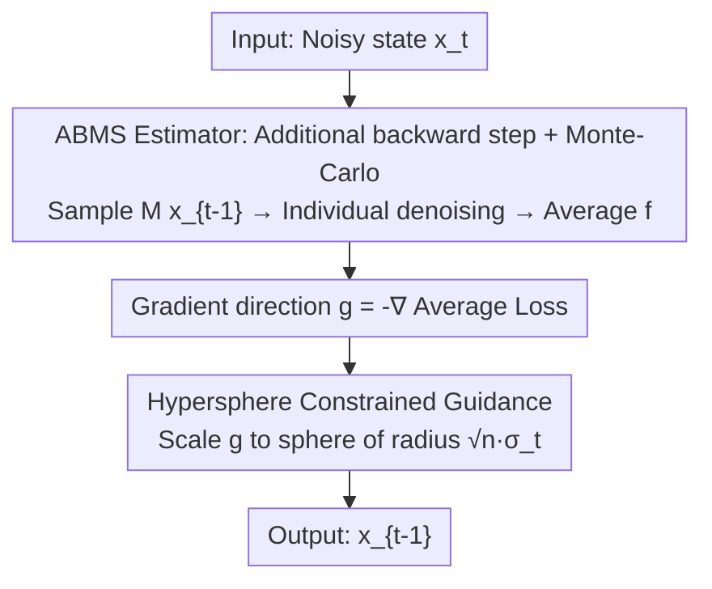

# One Step Further with Monte-Carlo Sampler to Guide Diffusion Better

**Conference**: ICLR 2026  
**OpenReview**: [https://openreview.net/forum?id=cpdHmRtx7d](https://openreview.net/forum?id=cpdHmRtx7d)  
**Code**: https://github.com/AI4Science-WestlakeU/ABMS  
**Area**: Diffusion Models / Conditional Generation / Training-free Guidance  
**Keywords**: Diffusion Posterior Sampling, Training-free Guidance, Monte-Carlo Sampling, Estimation Bias, Inverse Problems

## TL;DR
To address the systematic gradient bias in training-free guidance (DPS family) caused by approximating the conditional expectation $\mathbb{E}_{x_0|x_t}[f(x_0)]$ with a single point $\hat{x}_0(x_t)$, this paper proposes ABMS. By taking an additional backward denoising step and performing Monte Carlo sampling on the intermediate state before averaging, ABMS obtains more accurate guidance gradients. It is plug-and-play, combined with hypersphere-constrained step size control and "dual-focus" evaluation, achieving consistent improvements in generation quality across tasks such as handwriting trajectory, image inverse problems, molecular inverse design, and text style transfer.

## Background & Motivation
**Background**: In conditional diffusion generation, training-free guidance is the most versatile approach—eliminating the need for retraining diffusion models or noisy classifiers as in classifier/classifier-free guidance. Instead, it directly backpropagates gradients from a pre-defined differentiable loss $L(x_0;y)$. DPS (Diffusion Posterior Sampling) is a representative work that approximates the conditional score as $\nabla_{x_t}\log p(y|x_t)\approx\nabla_{x_t}\log p(y|\hat{x}_0(x_t))$. Subsequent works (MPGD, DSG, etc.) mostly focus on preventing the intermediate state $x_t$ from deviating from the manifold $\mathcal{M}_t$ to allow larger step sizes.

**Limitations of Prior Work**: The authors observe that almost all existing methods directly adopt the naive gradient direction provided by DPS, which is **systematically biased**. An intuitive phenomenon: when guiding toward one condition, another supposedly decoupled condition is significantly disturbed—for instance, guiding only by "character category" in handwriting generation distorts the "writing style." This indicates hidden cross-talk in the gradient estimation.

**Key Challenge**: The root cause is that DPS uses a **single-point estimate** $\hat{x}_0(x_t)$ to approximate the conditional expectation $\mathbb{E}_{x_0|x_t}[f(x_0)]$. Since $f$ is non-linear and $x_t$ contains significant noise, Jensen's inequality $f(\mathbb{E}[x_0])\ne\mathbb{E}[f(x_0)]$ applies. Single-point estimation fails to capture the multi-modal nature of the posterior $p(x_0|x_t)$, introducing large bias. This leads to a trade-off: increasing guidance weight improves condition alignment at the cost of global quality (e.g., higher FID, decreased molecular stability).

**Goal**: (i) Reduce the estimation bias of the conditional expectation to obtain more accurate guidance gradients; (ii) Provide an evaluation framework that simultaneously considers "condition alignment" and "global quality" to expose masked cross-talk.

**Key Insight**: Rather than guessing $x_0$ directly from $x_t$ in one step, it is better to **take an additional backward denoising step to $x_{t-1}$**. Since $p(x_{t-1}|x_t)$ is an explicitly parameterizable Gaussian in practice, one can sample $M$ candidates $x_{t-1}^{(m)}$, denoise them individually, and average the results. This Monte Carlo approach "spreads out" the multi-modality of the posterior to approximate the true conditional expectation.

## Method

### Overall Architecture
ABMS (Additional Backward step with Monte-Carlo Sampling) serves as a replacement for the **single-step guidance update**. For each denoising timestep, given the current noisy state $x_t$, the method no longer computes the gradient using single-point $\hat{x}_0(x_t)$. Instead, it samples $M$ intermediate states, denoises them, and averages the loss to obtain a more stable gradient direction $g$. This $g$ is then projected/scaled onto a hypersphere of radius $\sqrt{n}\sigma_t$ (to prevent samples from drifting off the data manifold) before completing the update $x_t\to x_{t-1}$. This workflow is plug-and-play and applicable to DDPM, DDIM, and even Flow Matching SDE sampling.

### Key Designs

**1. ABMS Estimator: Additional backward step + Monte-Carlo averaging to reduce estimation bias**

This is the core contribution. The target quantity is $\mathbb{E}_{x_0|x_t}[f(x_0)]$, but the posterior $p(x_0|x_t)$ is complex and lacks analytical sampling. Utilizing the Markov chain structure of reverse diffusion, the authors rewrite it using the law of total expectation:

$$\mathbb{E}_{x_0|x_t}[f(x_0)] = \mathbb{E}_{x_{t-1}|x_t}\big[\,\mathbb{E}[f(x_0)\,|\,x_{t-1}]\,\big].$$

The key is that the inner expectation relies on the **cleaner state $x_{t-1}$**, while $p(x_{t-1}|x_t)\sim\mathcal{N}(\mu_\theta(x_t,t),\sigma_t^2 I)$ is an explicit Gaussian from which one can sample directly. The ABMS estimator is defined by sampling $M$ states $x_{t-1}^{(m)}\sim p(x_{t-1}|x_t)$, obtaining $\hat{x}_0(x_{t-1}^{(m)})$ via the pre-trained denoising network, and averaging the loss:

$$\hat{f}_{\text{ABMS}}(M,x_t)=\frac{1}{M}\sum_{m=1}^{M} f\big(\hat{x}_0(x_{t-1}^{(m)})\big).$$

Intuitively, injecting a stochastic intermediate step allows the network to explore multiple plausible denoising trajectories, naturally capturing the multi-modal shape of $p(x_0|x_t)$. A key difference from LGD-MC is that LGD-MC assumes $p(x_0|x_t)$ is Gaussian, which fails in multi-modal scenarios; ABMS makes no assumption on the $x_0$ posterior shape and uses the **known, solvable one-step transition kernel** of the diffusion process.

**2. Error Theory: Proving ABMS expected error bound is strictly no greater than DPS**

The authors provide Proposition 1, decomposing the estimation error into a "reconstruction error term" and a "Jensen gap term." Under two mild assumptions—A1: $f$ is $K$-Lipschitz with $L$-Lipschitz gradients; A2 (monotonicity): cleaner intermediate states lead to more accurate denoising, i.e., $\mathbb{E}_{x_{t-1}|x_t}\|\hat{x}_0(x_{t-1})-\mathbb{E}_{x_0|x_{t-1}}[x_0]\|\le\|\hat{x}_0(x_t)-\mathbb{E}_{x_0|x_t}[x_0]\|$:

- **Reconstruction term**: Directly from A2, ABMS reconstruction error $\le$ DPS.
- **Jensen term**: Using the $L$-Lipschitz gradient, the Jensen gap is bounded by $\text{UB}_t=\tfrac{1}{2}L\,\mathbb{E}_{x_t}\text{Tr}(\text{Cov}_{x_0|x_t}[x_0])$. Applying the law of total covariance, $\text{UB}_t-\text{UB}_{t-1}=\tfrac{1}{2}L\,\mathbb{E}_{x_t}\text{Tr}(\text{Cov}_{x_{t-1}|x_t}[\mathbb{E}_{x_0|x_{t-1}}[x_0]])\ge0$.

This theoretical backing ensures the additional backward step reduces bias rather than relying solely on empirical results.

**3. Hypersphere Constrained Guidance Step: Fixing gradient norm on the high-dimensional Gaussian sphere**

With a more accurate direction $g$, the method must control the step size. Following the geometric observation of DSG, an $n$-dimensional isotropic Gaussian $\mathcal{N}(\mu,\sigma^2 I)$ has its probability mass concentrated on a hypersphere centered at $\mu$ with radius $\sqrt{n}\sigma$. To prevent samples from drifting off the manifold, ABMS rescales the guidance vector:

$$g' = \omega_t\cdot\sqrt{n}\,\sigma_t\cdot\frac{g}{\|g\|},$$

where $\omega_t\in(0,1)$ is the guidance rate, utilizing a cosine schedule $\omega_t=\tfrac{w_{\max}}{2}\big(1+\cos(\pi(1-t/T))\big)$. The update is $x_{t-1}^{\text{new}}=x_{t-1}^{\text{mean}}+g'+\sigma_t\varepsilon_t$.

**4. Dual-focus Evaluation + Cross-talk Diagnosis**

The authors argue that evaluation must consider two sides: (i) alignment with target conditions; (ii) preservation of global attributes (FID, molecular stability). Since increasing guidance weight often improves alignment at the cost of global quality, they design probe experiments where guidance is applied to only one condition while monitoring another decoupled condition (e.g., content score vs. style score, Distance vs. FID).

### Loss & Training
The method is training-free and requires only a differentiable loss $L(x_0;y)\propto-\log p(y|x_0)$. Different $L$ are used for various tasks: image inverse problems use $L=\|A\hat{x}_0(x_t)-y\|_2^2$; text style uses Frobenius distance of CLIP feature Gram matrices; molecular design reuses the EEGSDE predictor frozen at $t=0$. New hyperparameters include Monte Carlo sample count $M$ and guidance rate upper bound $w_{\max}$.

## Key Experimental Results

### Main Results
Covering four tasks: handwriting trajectory, image inverse problems, molecular inverse design, and text style transfer, primarily compared against the SOTA DSG.

ImageNet 256×256 Linear Inverse Problems ($M=3$):

| Task | Metric | DPS | LGD | DSG | Ours |
|------|------|-----|-----|-----|------|
| Inpainting | PSNR↑ / FID↓ | 27.56 / 30.57 | 27.78 / 28.65 | 28.67 / 23.63 | **29.23 / 19.25** |
| Super-Res | PSNR↑ / FID↓ | 22.07 / 41.36 | 22.23 / 39.85 | 23.74 / 34.28 | **23.80 / 33.06** |
| Gaussian Deblur | PSNR↑ / FID↓ | 18.78 / 52.13 | 19.52 / 50.42 | 22.64 / 45.27 | **22.65 / 41.65** |

In inpainting, FID significantly drops from DSG's 23.63 to 19.25, with consistent improvements in LPIPS/SSIM across tasks.

Molecular Inverse Design (QM9, MAE compared under similar MS): ABMS outperforms DSG/EEGSDE across six quantum properties. For example, $\mu$ drops from DSG 0.7811 to 0.7274; $\Delta\epsilon$ drops from 0.4558 to 0.4182.

### Ablation Study

| Configuration | Key Observation |
|------|---------|
| MC Samples $M$ | $M=1$ curve matches original DSG; $M=3$ shows significant improvement; marginal gains beyond $M=3$. |
| Cross-talk (Handwriting) | DSG style 0.534, Ours style 0.878 (both at 0.99 content). DSG distorts style; ABMS preserves it. |
| Distance vs FID Curve | ABMS maintains higher quality at lower Distance and is more robust to guidance scales. |

### Key Findings
- **Multi-modal modeling is crucial**: Performance gains stem from ABMS capturing posterior multi-modality via the solvable one-step transition kernel.
- **Cross-talk is universal**: In the handwriting task where conditions should be decoupled, naive DPS gradients still disturb unrelated conditions, indicating a systematic flaw in the DPS formula.
- **Transferability**: Valid across DDPM, DDIM, and Stable Diffusion 3.5 (Flow Matching) SDE sampling.

## Highlights & Insights
- **Efficient Compute Budget**: Instead of blindly increasing denoising steps, ABMS takes one extra step and uses MC on an explicit Gaussian kernel—bypassing the unsolvable $p(x_0|x_t)$ while theoretically reducing bias.
- **Closed-loop Theory and Phenomenon**: Starting from "cross-talk," the authors identify the root cause (Jensen gap + single-point estimate) and provide a provable improvement.
- **Dual-focus Evaluation**: The insight that "reporting only alignment metrics is misleading" is universally applicable to controllable generation research.

## Limitations & Future Work
- **Computational Overhead**: Each step requires sampling $M$ intermediate states and $M$ denoising passes, making inference roughly $M$ times slower.
- **Few-step Generation**: Adapting this strategy to few-step generation paradigms remains an open question.
- **A2 Assumption**: Proof relies on monotonicity (cleaner states yield better denoising), which might not hold under extreme noise schedules or weak denoisers.

## Related Work & Insights
- **vs DPS**: DPS uses single-point $\hat{x}_0(x_t)$; ABMS corrects this by reducing the systematic Jensen bias.
- **vs LGD-MC**: LGD-MC assumes Gaussian $p(x_0|x_t)$; ABMS uses the known $p(x_{t-1}|x_t)$ to capture arbitrary multi-modal shapes.
- **vs DSG/MPGD**: While DSG/MPGD focus on manifold preservation ("how far to go"), ABMS fixes the gradient inaccuracy ("where to go"), making them complementary.

## Rating
- Novelty: ⭐⭐⭐⭐ Cleverly uses total expectation to transform the intractable $x_0$ posterior into a tractable $x_{t-1}$ kernel.
- Experimental Thoroughness: ⭐⭐⭐⭐ Covers various data types/tasks with probe experiments, though lacking a detailed per-step timing table.
- Writing Quality: ⭐⭐⭐⭐ Clear chain of logic from phenomenon to proof.
- Value: ⭐⭐⭐⭐ Plug-and-play with broad applicability to the DPS family.

<!-- RELATED:START -->

<!-- RELATED:END -->

## Related Papers

- [\[ICLR 2026\] Efficient Approximate Posterior Sampling with Annealed Langevin Monte Carlo](efficient_approximate_posterior_sampling_with_annealed_langevin_monte_carlo.md)
- [\[ICLR 2026\] Quasi-Monte Carlo Methods Enable Extremely Low-Dimensional Deep Generative Models](quasi-monte_carlo_methods_enable_extremely_low-dimensional_deep_generative_model.md)
- [\[ICLR 2026\] On the Design of One-Step Diffusion via Shortcutting Flow Paths](on_the_design_of_one-step_diffusion_via_shortcutting_flow_paths.md)
- [\[ICLR 2026\] FARI: Robust One-Step Inversion for Watermarking in Diffusion Models](fari_robust_one-step_inversion_for_watermarking_in_diffusion_models.md)
- [\[ICLR 2026\] Towards Better Optimization for Listwise Preference in Diffusion Models](towards_better_optimization_for_listwise_preference_in_diffusion_models.md)

<!-- RELATED:END -->
