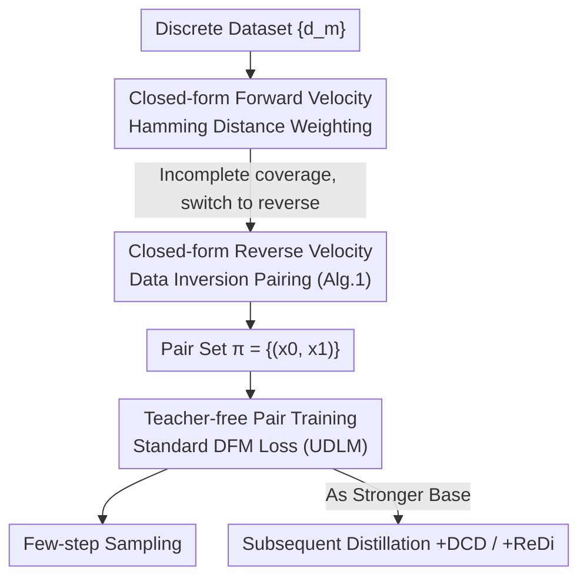

# PairFlow: Closed-Form Source-Target Coupling for Few-Step Generation in Discrete Flow Models

**Conference**: ICLR 2026  
**OpenReview**: [https://openreview.net/forum?id=awEvtKliMC](https://openreview.net/forum?id=awEvtKliMC)  
**Code**: Project Page https://pair-flow.github.io  
**Area**: Diffusion Models / Discrete Diffusion / Few-step Generation  
**Keywords**: Discrete Flow Models, Few-step sampling, Closed-form velocity field, Source-target pairing, Teacher-free

## TL;DR
PairFlow utilizes a closed-form discrete flow velocity field (determined by Hamming distance) to invert source samples from data. With preprocessing costs less than 1.7% of training time, it enables discrete flow models to achieve few-step generation performance that matches or exceeds distillation methods requiring pretrained teachers and fine-tuning.

## Background & Motivation
**Background**: Discrete Flow Models (DFM) adapt the concept of Flow Matching from continuous domains to discrete data (e.g., molecular SMILES, discretized pixels), modeling joint transitions via iterative sampling on categorical distributions. Uniform-state models (e.g., UDLM) are representative for their "self-correcting" property, which allows recovery from errors during parallel decoding.

**Limitations of Prior Work**: Like continuous flows, DFMs suffer from slow sampling requiring many iterations. Existing acceleration methods mostly rely on **distillation-based fine-tuning**: training a base model as a teacher, then generating source-target pairs to fine-tune a student (e.g., ReDi, DCD). However, fine-tuning adds 10–20% of the base training cost, meaning inference speedup comes at the expense of higher training costs. No prior work has addressed this training overhead directly.

**Key Challenge**: In few-step generation, DFMs must update multiple highly correlated tokens simultaneously. However, DFMs model joint transitions by independently decomposing them per token. This mismatch between the "true joint distribution" and "product approximation" is amplified in few-step settings. ReDi formalized this as **Total Correlation (TC)**, suggesting that minimizing TC is equivalent to "straightening" discrete paths—but straightening currently relies on iterative teacher-based re-pairing, which is computationally expensive.

**Goal**: Can high-quality source-target pairs needed for "straightening" be constructed directly from data without relying on pretrained teachers or fine-tuning, thus pushing acceleration costs down to the level of minutes on a GPU?

**Key Insight**: In the continuous domain, prior work (Karras, Bertrand, etc.) has shown that if both source and target distributions have analytical densities, the transport velocity field can be **expressed in closed-form**. This approach has not been explored in the discrete domain. If DFMs have closed-form velocities, "pairing" no longer requires sampling from a teacher model.

**Core Idea**: Derive closed-form forward and reverse velocity fields (determined by Hamming distance) for uniform-state DFMs. Starting from each data point, use the reverse velocity to "invert" the corresponding source sample. The resulting pairs are used to train the model directly, replacing expensive distillation with a lightweight preprocessing step that accounts for ~1.7% of training costs.

## Method

### Overall Architecture
The essence of PairFlow is replacing "teacher sampling" with "closed-form calculation" for pairing. The pipeline consists of a one-time **preprocessing + standard training**: Given a discrete dataset, iterate with the closed-form reverse velocity for each data point to obtain a paired source (noise) sample; feed these $(x_0, x_1)$ pairs into a standard DFM loss (using UDLM as the base). The resulting model gains few-step sampling capabilities and can serve as a stronger initialization for subsequent distillation.

Why derive the forward velocity first and then switch to reverse? While the most direct idea is to evolve from source to data via the forward velocity, the authors found that forward construction results in **incomplete coverage**—multiple sources may map to the same target. By inverting from the data points using reverse velocity, every data point is guaranteed to be paired.

Recalling DFM notation: a sequence $x=(x^1,\dots,x^N)$ where each token takes values from a vocabulary $V$ of size $K$. The conditional path uses a mixture $p_t(z^i|x_0,x_1)=(1-\kappa_t)\delta_{x_0}(z^i)+\kappa_t\delta_{x_1}(z^i)$, where the schedule $\kappa_t$ monotonically increases from 0 to 1. The model learns a denoiser $p^\theta_{1|t}$, corresponding to the marginal velocity field:

$$v^\theta_t(x^i,z)=\frac{\dot\kappa_t}{1-\kappa_t}\big[p^\theta_{1|t}(x^i|z)-\delta_z(x^i)\big].$$.

The key to PairFlow is that when the target distribution is the empirical distribution $\tilde q(x)=\frac1M\sum_m \delta_{d_m}(x)$ and the source is a uniform prior $p_0=U^N$, this velocity field can be written in closed-form without a network.

### Key Designs

**1. Closed-form Forward Velocity: Pulling Noise toward Similar Data via Hamming Distance**

To decouple pairing from teachers, the first step is proving the forward velocity has a closed-form solution. Under a uniform prior and empirical target distribution, the closed-form denoiser and forward velocity are derived as:

$$p_{1|t}(x^i|z)=\frac{\sum_{m=1}^{M}\delta_{d_m^i}(x^i)\,\gamma^{-h(d_m,z)}}{\sum_{m=1}^{M}\gamma^{-h(d_m,z)}},\qquad \hat v_t(x^i,z)=\frac{\dot\kappa_t}{1-\kappa_t}\big[p_{1|t}(x^i|z)-\delta_z(x^i)\big],$$

where $\gamma=\frac{1+(K-1)\kappa_t}{1-\kappa_t}$ and $h(s,z)=N-\sum_{i=1}^{N}\delta_{s^i}(z^i)$ is the **Hamming distance** between sequences. This denoiser is a weighted mixture of Dirac deltas: data sequences closer to $z$ (smaller Hamming distance) have higher weights. Intuitively, the forward velocity "pulls" each token toward the data samples most similar to the current sequence. This shows pairs can be calculated directly from data. However, forward construction requires an impractical number of source samples to cover the entire dataset.

**2. Closed-form Reverse Velocity and Data Inversion: Ensuring Efficient Coverage**

To circumvent incomplete coverage, the authors invert samples starting from data points using the **reverse** velocity, pushing them toward the source distribution. This ensures every data point is paired. The closed-form noise predictor and reverse velocity are derived as:

$$p_{0|t}(x^i|z)=\delta_z(x^i)-\frac{\kappa_t(K\delta_{x^i}(z^i)-1)}{1+(K-1)\kappa_t}\cdot\frac{\sum_{m}\delta_{d_m^i}(z^i)\,\gamma^{-h(d_m,z)}}{\sum_{m}\gamma^{-h(d_m,z)}},$$

$$\check v_t(x^i,z)=\frac{\dot\kappa_t\,(K\delta_{x^i}(z^i)-1)}{1+(K-1)\kappa_t}\cdot\frac{\sum_{m}\delta_{d_m^i}(z^i)\,\gamma^{-h(d_m,z)}}{\sum_{m}\gamma^{-h(d_m,z)}}.$$

The summation term estimates the conditional likelihood of the $i$-th token based on its Hamming proximity to all data points. Tokens with stronger local consensus receive higher weights, so $\check v_t$ pushes the sample "away from data toward a uniform source." The algorithm (Alg. 1) is straightforward: initialize with each data point $x_{1,m}=d_m$, iteratively update reverse for $T$ steps to get source samples $x_{0,m}$, and collect them into the pair set $\pi=\{(x_{0,m},x_{1,m})\}$. This process is fully parallelizable and extremely fast (e.g., 0.8 minutes on QM9). Compared to standard UDLM corruption, PairFlow-inverted sources are closer to the original data in Hamming distance (6.47 vs 9.0 in Fig. 1), meaning the model requires fewer token flips to recover data, approximating the "straight path" goal.

**3. Teacher-free Pair Training as a Stronger Base for Distillation**

Given $\pi$, training substitutes these pairs into the standard DFM loss to train UDLM—no teacher, no extra loss terms, and no fine-tuning phase is required. The acceleration capability stems entirely from "well-paired" source-target samples. Furthermore, this model serves as a superior initialization: passing a PairFlow-trained model to DCD or ReDi (PairFlow+DCD / PairFlow+ReDi) further improves performance with only a marginal increase in preprocessing cost. This transforms PairFlow from a "distillation alternative" into a "distillation enhancer."

### Loss & Training
The training target is the original DFM denoising cross-entropy $L_{\text{DFM}}$. The only modification is replacing source-target pairs (usually random uniform corruption or teacher sampling) with the inverted set $\pi$ from Algorithm 1. Pair generation is a one-time preprocessing step; the number of reverse iterations $T$ is the main hyperparameter. The base model is fixed as a uniform-state UDLM. The forward velocity provides theoretical support for "statistical straightness": the authors measure decomposition error via conditional Total Correlation, $TC_\pi(x_s|x_t)=\mathbb{E}_{x_t}\!\big[D_{\mathrm{KL}}\big(p_{s|t}(x_s|x_t)\,\|\,\prod_i p_{s|t}(x_s^i|x_t)\big)\big]$. PairFlow's pairs result in a smaller TC, indicating a straighter discrete path.

## Key Experimental Results

### Main Results
Experiments involve molecules (QM9 / ZINC-250k reporting valid/unique/novel SMILES) and images (MNIST-Binary, CIFAR-10 reporting FID/IS). The table summarizes key few-step results.

| Dataset | Setting | Metric | UDLM (Base) | PairFlow | Distillation Baseline |
|--------|------|------|-----------|----------|----------|
| QM9 | 1-step | # Valid | 17.5 | **223.4** (12.8×) | — |
| QM9 | 2-step | # Valid | — | **416.0** | UDLM+ReDi 232.4 / UDLM+DCD 530.8 |
| ZINC-250k | 2-step | # Valid | — | **146.3** | UDLM+ReDi 75.9 |
| MNIST-Binary | 1-step | FID↓ | ~130 | **40.59** (↓68.9%) | UDLM+DCD 53.84 |
| MNIST-Binary | 2-step | FID↓ | 42.54 | **15.61** (↓63.3%) | UDLM+ReDi 10.36 |
| MNIST-Binary | 4-step | FID↓ | 11.25 | **8.51** (↓24.4%) | — |

PairFlow consistently outperforms the base UDLM in all few-step settings. The 2/4-step efficiency roughly matches UDLM running with double the steps (4/8 steps). It also competes effectively with distillation methods requiring a teacher (surpassing ReDi and approaching DCD on QM9 2-step results).

### Training Cost Comparison (Relative to Base Training Time $T_{\text{Base}}$)

| Dataset | $T_{\text{Base}}$ (min) | DCD | ReDi | **PairFlow** |
|--------|------|-----|------|----------|
| MNIST-Binary | 80 (100%) | 40 (50%) | 49 (61%) | **1.4 (1.7%)** |
| CIFAR-10 | 6720 (100%) | 360 (5.3%) | 468 (6.9%) | **20 (0.3%)** |
| QM9 | 450 (100%) | 115 (24.8%) | 100 (22.2%) | **0.8 (0.2%)** |
| ZINC-250k | 1110 (100%) | 211 (19%) | 194 (17.4%) | **13 (1.2%)** |

PairFlow's preprocessing is **28.6× to 35×** faster than DCD/ReDi on MNIST, saving up to 143× the overall computational budget compared to distillation.

### Key Findings
- **Pair Quality is a Core Variable**: Using PairFlow as a base for distillation improves PairFlow+DCD on QM9 (1/2-step valid from 323/530.8 to 453.8/685.8) and PairFlow+ReDi on ZINC (2-step valid from 75.9 to 221.5). This suggests that "good pairs" are more valuable than "extensive fine-tuning."
- **Inversion Yields Straighter Paths**: The average Hamming distance for PairFlow-inverted sources is 6.47, significantly lower than the 9.0 observed in UDLM's corruption process, which directly correlates to fewer required token flips during recovery.
- **CIFAR-10 Failure Cases**: DCD/ReDi degraded FID and IS on CIFAR-10, likely due to a weak teacher model. While PairFlow's improvements were modest, it remained stable as it does not rely on a teacher.

## Highlights & Insights
- **Closed-form Velocity replaces Teacher Sampling**: Compressing "pairing" from an full teacher generation process into an analytical formula determined by Hamming distance is the primary reason for reducing training costs by two orders of magnitude.
- **Inversion Strategy**: Identifying the "incomplete coverage" of forward construction as a barrier and solving it via reverse inversion ensures full data coverage with a clean theoretical solution.
- **From Alternative to Enhancer**: The same pair set can be used independently for few-step generation or as a stronger initialization for distillation, shifting attention from "fine-tuning algorithms" to "pairing strategies."

## Limitations & Future Work
- **Dependency on Uniform Priors / Uniform-State Models**: The analytical derivation relies on uniform sources and self-correcting models like UDLM. Generalization to masked models (e.g., MDLM) or non-uniform priors remains unverified.
- **Computational Cost of Hamming Weighting**: Calculating the closed-form denoiser involves weighted sums over the entire dataset. While parallelizable, the cost and numerical stability (as $\gamma^{-h}$ becomes extreme when $\kappa_t\to1$) on massive datasets or long sequences warrant attention.
- **Baselines on High-Dimensional Data**: Discrete flow performance on high-resolution RGB images remains a bottleneck. PairFlow's improvements on CIFAR-10 were limited, suggesting that the underlying base model quality is still a major factor.

## Related Work & Insights
- **vs. ReDi (Yoo et al., 2025)**: Both aim for "straightened paths" via source-target pairing. However, ReDi requires teacher sampling and iterative fine-tuning, whereas PairFlow uses analytical inversion from data, reducing costs by 1–2 orders of magnitude.
- **vs. DCD (Sahoo et al., 2025)**: DCD is a discrete version of consistency distillation requiring a teacher. PairFlow matches DCD performance at a fraction of the cost.
- **vs. Continuous Closed-form Flows (Karras / Bertrand)**: PairFlow represents a non-trivial adaptation of the "closed-form velocity when densities are known" concept to the discrete domain, identifying Hamming distance as the key variable.

## Rating
- Novelty: ⭐⭐⭐⭐⭐ First to derive closed-form forward/reverse velocity for DFMs and use them for teacher-free pairing.
- Experimental Thoroughness: ⭐⭐⭐⭐ Covers molecules and binary/RGB images across multiple steps, though high-dimensional image results are modest.
- Writing Quality: ⭐⭐⭐⭐ Clear derivation and logical chain from forward to reverse construction.
- Value: ⭐⭐⭐⭐⭐ Reduces acceleration cost to ~1.7% and highlights pair quality as a critical variable for discrete flow acceleration.

<!-- RELATED:START -->

<!-- RELATED:END -->

## Related Papers

- [\[CVPR 2026\] Closed-Form Concept Erasure via Double Projections](../../CVPR2026/image_generation/closed-form_concept_erasure_via_double_projections.md)
- [\[ICLR 2026\] Generalised Flow Maps for Few-Step Generative Modelling on Riemannian Manifolds](generalised_flow_maps_for_few-step_generative_modelling_on_riemannian_manifolds.md)
- [\[ICLR 2026\] DistillKac: Few-Step Image Generation via Damped Wave Equations](distillkac_few-step_image_generation_via_damped_wave_equations.md)
- [\[ICLR 2026\] BézierFlow: Learning Bézier Stochastic Interpolant Schedulers for Few-Step Generation](bézierflow_learning_bézier_stochastic_interpolant_schedulers_for_few-step_genera.md)
- [\[ICLR 2026\] Discrete Guidance Matching: Exact Guidance for Discrete Flow Matching](discrete_guidance_matching_exact_guidance_for_discrete_flow_matching.md)

<!-- RELATED:END -->
