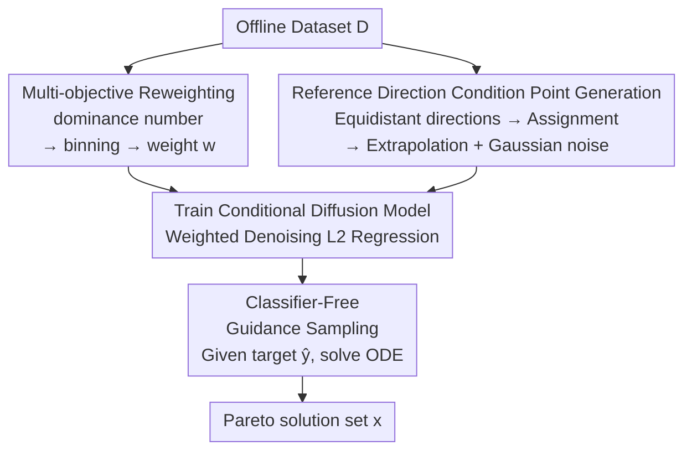

# Pareto-Conditioned Diffusion Models for Offline Multi-Objective Optimization

**Conference**: ICLR 2026 Oral  
**arXiv**: [2602.00737](https://arxiv.org/abs/2602.00737)  
**Code**: [GitHub](https://github.com/jatan12/PCD)  
**Area**: Image Generation  
**Keywords**: Offline Multi-Objective Optimization, Conditional Diffusion Models, Pareto Frontier, Surrogate-free, Reference Directions

## TL;DR

Proposes Pareto-Conditioned Diffusion (PCD), which reformulates offline multi-objective optimization as a conditional sampling problem. It directly generates high-quality solutions conditioned on objective tradeoffs without explicit surrogate models, achieving the best consistency across various benchmarks.

## Background & Motivation

- **Background**: Static datasets only, with no ability to query the true objective functions.
- **Limitations of Prior Work**: Existing methods rely on surrogate models (DNN or GP approximating objective functions) $\rightarrow$ MOEA search $\rightarrow$ performance bottlenecked by surrogate accuracy.
- **Limitations of Prior Work**: Generative approaches (e.g., ParetoFlow) still rely on surrogate predictors for guidance, inheriting the risk of inaccurate surrogate predictions.
- **Key Insight**: Directly model MOO as a conditional generation task $p(\boldsymbol{x} | \boldsymbol{y}; \sigma)$.

## Method

### Overall Architecture

PCD reformulates offline multi-objective optimization as a single conditional sampling process: a diffusion model $D_\theta(\boldsymbol{x}; \boldsymbol{y}, \sigma)$ is trained on the dataset conditioned on the objective vector $\boldsymbol{y}$. During inference, providing the desired target tradeoff vector $\hat{\boldsymbol{y}}$ directly generates the corresponding solution $\boldsymbol{x}$. The pipeline contains no surrogate models for objective prediction; solution generation and Pareto frontier modeling are compressed into the same generator, thereby bypassing the traditional failure path where "inaccurate surrogates lead to misguided searches." The training is driven by two mechanisms: **Multi-objective reweighting**, which assigns a frontier-biased weight to each sample, and **Reference direction condition point generation**, which lays out "coordinates" for condition vectors to uniformly cover the frontier. Inference utilizes **Classifier-Free Guidance sampling** to anchor samples to specific tradeoff regions.

### Key Designs

**1. Multi-objective Reweighting: Biasing the model towards reliable and frontier samples**

Points in offline datasets vary in quality; uniform fitting pulls the model toward mediocre regions. PCD first uses the dominance number $o(\boldsymbol{x}) = \sum_{\boldsymbol{x}' \in \mathcal{D}} \mathbb{I}[\boldsymbol{f}(\boldsymbol{x}) \prec \boldsymbol{f}(\boldsymbol{x}')]$ to measure how many other points dominate a sample—smaller values indicate proximity to the frontier. Samples are then binned based on this number, with the $i$-th bin assigned weight $w_i = \frac{|B_i|}{|B_i| + K} \exp\!\left(\frac{-\frac{1}{|B_i|}\sum_{j=1}^{|B_i|} o(\boldsymbol{x}_{b_j})}{\tau}\right)$. This weight encodes two intentions: the first term $\frac{|B_i|}{|B_i|+K}$ approaches 1 as the number of points in the bin increases, giving more weight to statistically reliable bins ($K$ controls the penalty for small bins); the second exponential term elevates bins with lower average dominance (closer to the frontier) ($\tau$ is the temperature adjusting preference sharpness). Their product ensures training is not misled by noisy small bins while continuously tilting toward the frontier.

**2. Reference Direction Condition Point Generation: Establishing "coordinates" for condition vectors to uniformly cover the frontier**

To ensure conditional sampling covers the entire Pareto frontier, the conditions $\boldsymbol{y}$ provided during training must be uniformly distributed in the objective space; otherwise, holes appear in the frontier. PCD adopts the NSGA-III philosophy to construct these condition points in three steps: first, use the Riesz s-Energy method to generate $L$ maximally equidistant direction vectors $\boldsymbol{w}_i$ as "reference rays" on the frontier; second, iteratively assign data points to their nearest direction vectors via non-dominated sorting to associate a representative point with each ray; finally, extrapolate representative points along their respective directions and add zero-mean Gaussian noise. This pushes condition points toward the frontier edges not yet covered by data while adding local diversity. The resulting condition distribution spreads uniformly across the frontier, allowing the model to be guided to any specified tradeoff region during inference.

**3. Classifier-Free Guidance Sampling: Amplifying condition signals to anchor samples in target regions**

During training, conditions are dropped with a certain probability, allowing the model to learn both conditional scores $D_\theta(\boldsymbol{x}; \hat{\boldsymbol{y}}, \sigma)$ and unconditional scores $D_\theta(\boldsymbol{x}; \sigma)$. During sampling, these are linearly extrapolated with a guidance scale $\gamma$ to solve the ODE $d\boldsymbol{x}/d\sigma = -(\gamma D_\theta(\boldsymbol{x}; \hat{\boldsymbol{y}}, \sigma) + (1-\gamma) D_\theta(\boldsymbol{x}; \sigma) - \boldsymbol{x})/\sigma$. Setting $\gamma > 1$ effectively takes an extra step in the "conditional minus unconditional" direction, strengthening the pull of the target $\hat{\boldsymbol{y}}$ and pulling generated samples tighter to regions consistent with that tradeoff. In practice, the gains of $\gamma$ saturate quickly (near $2.5$), as the first-step reweighting already biases the data distribution toward the frontier.

### Loss & Training

The training objective is a reweighted conditional denoising $L_2$ regression: $\theta = \arg\min_\theta \mathbb{E}\,[\,w(\boldsymbol{y})\,\lambda(\sigma)\,\|D_\theta(\boldsymbol{x} + \boldsymbol{n}; \boldsymbol{y}, \sigma) - \boldsymbol{x}\|_2^2\,]$. Here, $\boldsymbol{n}$ is the perturbation added to the sample at noise scale $\sigma$, $\lambda(\sigma)$ is the standard scale-wise loss weight, and $w(\boldsymbol{y})$ is the sample weight calculated in the first step—integrating the bias toward "reliable and frontier" samples directly into the denoising loss, causing the model to lean toward high-quality solutions during fitting.

## Key Experimental Results

### Average Rank Across Tasks (100th percentile HV, ↓ lower is better)

| Method | Synthetic | MORL | RE | Scientific | MONAS | Total Avg |
|------|------|------|-----|-----------|-------|-------|
| $\mathcal{D}$(best) | 5.45 | **1.70** | 2.60 | 9.35 | 11.53 | 7.43 |
| ParetoFlow | **2.44** | 8.50 | 1.74 | 9.05 | 11.19 | 6.74 |
| MM + IOM | 5.16 | 12.70 | 5.76 | 4.40 | 5.77 | 5.80 |
| E2E | 6.16 | 9.70 | 6.06 | 4.20 | 5.13 | 5.71 |
| **PCD** | 3.38 | 5.50 | **1.51** | **4.05** | 7.54 | **4.80** |

### Ablation Study: Component Contributions

| Variant | ZDT2 | MO-Swimmer | RE34 | Regex | C10/MOP2 |
|------|------|------------|------|-------|----------|
| Ideal + N/A | 7.59 | 1.76 | 9.19 | 5.60 | 10.46 |
| Ref.Dir. + N/A | 7.89 | 3.53 | 10.11 | 5.55 | 10.47 |
| Ref.Dir. + Pruning | 5.64 | 3.63 | 10.16 | 4.20 | 10.55 |
| **PCD (Full)** | 6.25 | **3.69** | **10.17** | 4.80 | **10.59** |

### Key Findings

1. PCD achieves the best overall ranking across all task categories using a single set of fixed hyperparameters.
2. The reference direction mechanism nearly doubles the HV on MO-Swimmer (1.76 $\rightarrow$ 3.53).
3. The reweighting strategy consistently outperforms simple pruning (the method of Xue et al., 2024).
4. Gains from the guidance scale $\gamma$ are limited (saturating around 2.5) because reweighting has already biased the data distribution.

## Highlights & Insights

1. **End-to-End Framework**: Simplifies multi-stage pipelines (surrogate + search) into a single conditional generative model.
2. **Cross-Task Consistency**: The most significant advantage of PCD—it performs robustly across continuous, discrete, and classification tasks.
3. **NSGA-III Inspired Condition Generation**: Cleverly combines the direction vector concept from evolutionary algorithms with conditional generation in diffusion models.

## Limitations & Future Work

- MORL tasks (~10,000 dimensional parameter space) are limited as the MLP denoiser operates directly on the parameter space.
- The purely categorical search space of MONAS poses challenges for continuous diffusion models.
- Combinatorial optimization tasks (e.g., TSP) have not been addressed.
- Reweighting may be counterproductive on datasets where the data quality is already high.

## Related Work & Insights

- **Surrogate Methods**: COMs, ICT, IOM, Tri-Mentoring
- **Generative Methods**: ParetoFlow, LaMBO, MOGFNs
- **Conditional Diffusion**: DDOM, MINs, Reward-Directed Diffusion

## Rating

- Novelty: ⭐⭐⭐⭐ — Reformulating offline MOO as conditional sampling is a natural yet effective contribution.
- Technical Depth: ⭐⭐⭐⭐ — Reweighting strategies and reference direction mechanisms are well-designed.
- Experimental Thoroughness: ⭐⭐⭐⭐⭐ — Covers 5 major benchmark categories, comparing against 13 baseline methods.
- Value: ⭐⭐⭐⭐ — Hyperparameter robustness makes practical deployment more feasible.

<!-- RELATED:START -->

## Related Papers

- [\[CVPR 2026\] MapReduce LoRA: Advancing the Pareto Front in Multi-Preference Optimization for Generative Models](../../CVPR2026/image_generation/mapreduce_lora_advancing_the_pareto_front_in_multi-preference_optimization_for_g.md)
- [\[ICML 2026\] Pareto-Guided Optimal Transport for Multi-Reward Alignment](../../ICML2026/image_generation/pareto-guided_optimal_transport_for_multi-reward_alignment.md)
- [\[ICLR 2026\] Intention-Conditioned Flow Occupancy Models](intention-conditioned_flow_occupancy_models.md)
- [\[ICLR 2026\] Pareto Variational Autoencoder](pareto_variational_autoencoder.md)
- [\[ICML 2026\] Support-Proximity Augmented Diffusion Estimation for Offline Black-Box Optimization](../../ICML2026/image_generation/support-proximity_augmented_diffusion_estimation_for_offline_black-box_optimizat.md)

<!-- RELATED:END -->
