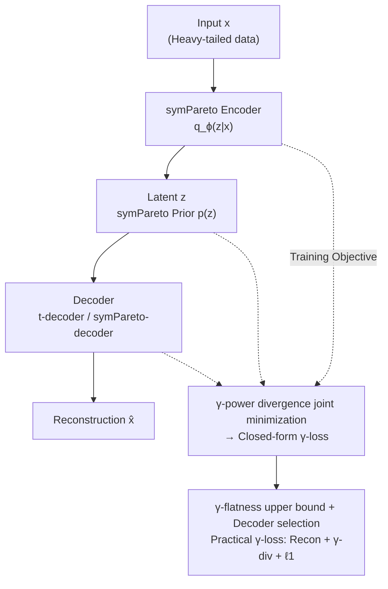

# Pareto Variational Autoencoder

**Conference**: ICLR 2026  
**OpenReview**: [https://openreview.net/forum?id=s5a8zBPFfe](https://openreview.net/forum?id=s5a8zBPFfe)  
**Area**: Generative Models / Variational Autoencoders  
**Keywords**: Heavy-tailed distributions, Symmetric Pareto, γ-power divergence, Information geometry, VAE

## TL;DR
To address the issues of Gaussian VAEs underestimating tail probabilities and over-regularizing the latent space, this paper proposes a multivariate heavy-tailed distribution based on the $\ell_1$-norm—the symmetric Pareto (symPareto). By substituting the KL divergence with the γ-power divergence from information geometry, the authors construct ParetoVAE with a closed-form loss. It significantly outperforms VAEs based on Gaussian, Laplace, or Student's t distributions in heavy-tailed tasks such as graph degree reconstruction, word frequency analysis, and image denoising.

## Background & Motivation
**Background**: VAE (Kingma & Welling, 2013) has been a cornerstone of scalable probabilistic inference and representation learning for over a decade. For mathematical tractability, mainstream VAEs almost exclusively use exponential family distributions—especially multivariate Gaussians—to model the prior, encoder, and decoder, causing the loss function to degenerate into an "MSE reconstruction term + KL regularization term."

**Limitations of Prior Work**: Real-world data often exhibits heavy tails and extreme events, such as degree distributions in scale-free networks or long-tailed category frequencies. The exponentially decaying tails of Gaussian distributions fail to cover such data, leading Gaussian VAEs to systematically underestimate tail probabilities, over-compress latent codes, and lose rare but informative events. Recent works have turned to multivariate Student's t distributions to mitigate this, but t is just one choice among many heavy-tailed families, whereas classical extreme value theory points to Pareto distributions as the most suitable for characterizing tail behavior.

**Key Challenge**: Directly incorporating power-law distributions like Pareto into VAEs hits a computational wall—the KL divergence between two symPareto distributions lacks a closed-form solution. Numerical integration becomes prohibitively expensive in high dimensions, while Monte Carlo methods introduce additional variance. In other words, there is a sharp conflict between heavy-tailed modeling capability and the computability of the ELBO.

**Goal**: (1) Construct a multivariate Pareto distribution with an explicit density, support over the entire real domain, and computable divergence; (2) Design a VAE framework with a closed-form loss that bypasses the intractability of KL divergence.

**Key Insight**: The authors adopt an information geometry perspective, viewing VAE as a joint minimization problem between two statistical manifolds. In this view, maximizing the ELBO is equivalent to minimizing a specific divergence between the data manifold and the model manifold—and the choice of divergence can be substituted. For power-law families, the γ-power divergence naturally induces a "γ-flat" geometric structure, allowing the divergence between power-law distributions to be expressed in closed form.

**Core Idea**: Replace Gaussian with an $\ell_1$-norm version of "symmetric Pareto" for the prior/encoder and substitute KL with γ-power divergence for the joint minimization objective, thereby enabling heavy-tailed modeling within a VAE framework optimized via closed-form expressions.

## Method

### Overall Architecture
ParetoVAE maintains the standard "Encoder → Latent Space → Decoder" autoencoding structure, but all three components are "heavy-tailed": the prior and encoder use the symmetric Pareto distribution, while the decoder can flexibly choose between Student's t or symPareto. The training objective is no longer maximizing the ELBO but directly minimizing the γ-power divergence $D_\gamma(q_\phi\|p_\theta)$ between the joint data manifold $q_\phi(x,z)$ and the joint model manifold $p_\theta(x,z)$. Since the γ-power divergence has a closed-form expression for power-law families, this joint minimization simplifies into a differentiable γ-loss—comprising "reconstruction error + γ-divergence regularization + $\ell_1$ penalty"—optimizable via standard backpropagation.

### Key Designs

**1. Symmetric Pareto Distribution: An $\ell_1$-norm Multivariate Heavy-tailed Foundation**

Since Gaussian tails are too light and Student's t is just "another" heavy-tailed option, the authors sought a multivariate Pareto with an explicit density, support for all real numbers, and computable divergence. Most existing multivariate Paretos lack explicit densities suitable for divergence calculation and only support the positive orthant. Starting from Mardia’s Type I multivariate Pareto, this paper defines the symmetric Pareto (symPareto) distribution:

$$P_n(x\mid\mu,\sigma,\nu)=\frac{C_{n,\nu,\nu}}{\bar\sigma}\left(1+\frac{1}{\nu}\left\|\frac{x-\mu}{\sigma}\right\|_1\right)^{-(\nu+n)},\quad C_{n,\nu_1,\nu_2}=\frac{\Gamma(\nu_1+n)}{(2\nu_2)^n\Gamma(\nu_1)}$$

It can be viewed as a heavy-tailed version of the product of multivariate Laplaces, or a "dual version" of the multivariate t-distribution where the $\ell_2$-norm is replaced by the $\ell_1$-norm. This $\ell_1$ structure offers two key benefits: first, sampling in 2D exhibits a "cross shape"—samples tend to align with coordinate axes, naturally inducing latent space sparsity; second, the tail is significantly heavier than Gaussian and t, with the CCDP decaying polynomially at small $\nu$, covering extreme samples beyond radii of 5 or 10. It converges to the Laplace distribution as $\nu\to\infty$.

**2. γ-power Divergence Joint Minimization: Bypassing the Intractable KL**

Writing the ELBO for a symPareto VAE gets stuck due to the lack of a closed-form KL. The authors leverage the "VAE = joint minimization between statistical manifolds" perspective: considering the model manifold $\mathcal{M}_{model}=\{p_\theta(x|z)p_Z(z)\}$ and the data manifold $\mathcal{M}_{data}=\{p_{data}(x)q_\phi(z|x)\}$, maximizing the ELBO is equivalent to $\arg\min D_{KL}(q\|p)$. Since the divergence is replaceable, they switch to the γ-power divergence, which is friendly to power-law families:

$$D_\gamma(q\|p)=\gamma^{-1}C_\gamma(q,p)-\gamma^{-1}H_\gamma(q),\quad H_\gamma(p)=-\|p\|_{1+\gamma}$$

Where $H_\gamma$ and $C_\gamma$ are the γ-power entropy and γ-power cross-entropy, respectively. It is effective for power-law families because it induces γ-power geodesics and γ-flat submanifolds $S_\gamma=\{p_\theta\propto(1+\gamma\theta^\top s(x))^{1/\gamma}\}$—analogous to how e-geodesics characterize the exponential family. When symPareto takes $\mu=0$ and $s(x)=|x|$, it falls precisely on the γ-flat manifold with $\gamma=-\frac{1}{\nu+n}$. This allows the divergence between symPareto distributions to be written in closed form, avoiding numerical integration.

**3. ParetoVAE Architecture and Reparameterization: symPareto Prior/Encoder, Flexible Decoder**

The concrete construction starts from a heavy-tailed joint decoding model, deriving the prior $p(z)=P_m(z|0,1_m,\nu)$ and the decoder $p_\theta(x|z)=t_n(x|\mu_\theta(z),\cdot,\nu+m)$ (note that the decoder degrees of freedom increase with latent dimension $m$); the encoder is also symPareto $q_\phi(z|x)=P_m(z|\mu_\phi(x),\sigma_\phi(x),\nu+n/2)$, adding $n$ to reflect the contribution of the data dimension. To enable gradient optimization, the authors provide a reparameterization for symPareto: just as t-distributions can be represented as a mixture of Gaussian and Chi-squared, symPareto can be represented as a Laplace-Gamma mixture:

$$T=(\nu/W)Z\sim P_n(0,1_n,\nu),\quad Z\sim L_n(0,I_n),\ W\sim\text{Gamma}(\nu,1)$$

By first sampling a Laplace vector with i.i.d. components and then scaling it with a Gamma variable, one can sample from symPareto, making the reparameterization trick fully applicable.

**4. γ-flatness Upper Bound and Decoder Selection: Transforming the Objective into Trainable γ-loss**

By substituting $\gamma=-\frac{2}{2\nu+2m+n}$ and simplifying, $D_\gamma(q_\phi\|p_\theta)$ yields a closed form. The γ-loss can be written as "MSE reconstruction + γ-divergence regularization between the encoder and an alternative prior $p_{alt}$." However, a problem remains: when $\mu\neq0$, symPareto no longer has valid sufficient statistics, and γ-flatness is not preserved in non-centered cases. The authors provide an upper bound via Theorem 2.1: shifting both distributions to the origin to obtain $p_0, q_0$ (which lie on the γ-flat manifold with closed-form divergence) and adding an $\ell_1$ term reflecting the translation cost:

$$D_\gamma(p\|q)\le D_\gamma(p_0\|q_0)+\beta\left\|\frac{\mu_1-\mu_2}{\sigma_2}\right\|_1$$

Substituting this back yields the practical objective $L_\gamma$, consisting of three parts: $\ell_2^2$ reconstruction loss, γ-divergence regularization under γ-flatness, and an $\ell_1$ penalty on $\mu_\phi(x)$ (which provides sparsity and robustness). Additionally, the decoder is selectable: the t-decoder retains MSE, suitable for sparse heavy-tailed data reconstruction; replacing $\|x-\mu_\theta(z)\|_2^2$ with $\|x-\mu_\theta(z)\|_1$ yields the symPareto-decoder, changing MSE to MAE, which is more robust to extreme values and suitable for denoising. Theoretically, it can be proven that as $\nu\to\infty$, the γ-loss converges to the LaplaceVAE objective (weight $\frac{1}{2}$), making ParetoVAE a heavy-tailed extension of LVAE, with weights $\alpha, \beta$ tunable like in β-VAE.

### Loss & Training
- **t-decoder (MSE version)**: $L_\gamma=\mathbb{E}_x\big[\frac{1}{2\sigma^2}\mathbb{E}_{z\sim q_\phi}\|x-\mu_\theta(z)\|_2^2+\alpha D_\gamma(q_{\phi,0}\|p_{alt})+\alpha\beta\|\mu_\phi(x)\|_1\big]$, where $\gamma=-\frac{2}{2\nu+2m+n}$.
- **symPareto-decoder (MAE version)**: Reconstruction term replaced by $\frac{1}{\sigma}\mathbb{E}_{z\sim q_\phi}\|x-\mu_\theta(z)\|_1$, with $\gamma=-\frac{1}{\nu+m+n}$. MAE provides robustness against outliers.
- In experiments, $\nu$ was fixed for both t3VAE and ParetoVAE to ensure fair comparison.

## Key Experimental Results

### Main Results
Four VAE variants are compared: Gaussian VAE, LaplaceVAE (LVAE), t3VAE, and ParetoVAE (with deterministic AE included in some tasks).

**Graph Degree Reconstruction (Epinions directed social network, t-decoder)**—Measured using Sliced 1-Wasserstein Distance (SWD) for the global and tail (top 10% by $\ell_2$-norm) fit, with p-values from MMD two-sample tests reported (✓ indicates $H_0:p_{data}=p_{recon}$ not rejected):

| Model | Overall SWD (↓) | Tail SWD (↓) | Tail p-value |
|------|------|------|------|
| **ParetoVAE** | **0.044 ± 0.005** | **0.170 ± 0.029** | 0.221 ✓ |
| LVAE | 0.055 ± 0.009 | 0.301 ± 0.084 | 0.119 ✓ |
| t3VAE | 0.055 ± 0.005 | 0.389 ± 0.040 | 0.181 ✓ |
| VAE | 0.061 ± 0.018 | 0.402 ± 0.025 | 0.042 ✗ |
| AE | 0.074 ± 0.030 | 0.621 ± 0.304 | 0.028 ✗ |

ParetoVAE achieved the lowest SWD overall and in the tail; models with $\ell_1$ regularization (ParetoVAE, LVAE) converged faster than those with $\ell_2^2$ (VAE, t3VAE), demonstrating higher robustness to extreme values.

**Word Frequency Analysis (WikiText-2, 19,962-dim BoW, t-decoder)**—Top 2,241 high-frequency words (Head) and bottom 2,241 low-frequency words (Tail) are analyzed for overlap and Jaccard similarity:

| Model | Head Overlap (↑) | Head Jaccard (↑) | Tail Overlap (↑) | Tail Jaccard (↑) |
|------|------|------|------|------|
| **ParetoVAE** | **0.981** | **0.964** | **0.717** | **0.560** |
| LVAE | 0.772 | 0.629 | 0.230 | 0.130 |
| t3VAE | 0.739 | 0.586 | 0.226 | 0.127 |
| VAE | 0.775 | 0.633 | 0.224 | 0.126 |
| AE | 0.642 | 0.473 | 0.197 | 0.109 |

ParetoVAE consistently dominated: baselines generally could only fit the head (Tail Jaccard ~0.12, p-values rejecting $H_0$), whereas ParetoVAE reached a Tail Jaccard of 0.560 and did not reject $H_0$, successfully capturing the power-law structure.

**Image Denoising (symPareto-decoder, noise probability 0.5)**—Denoising performance on MNIST/SVHN/CIFAR10/Omniglot/CelebA with salt-and-pepper noise, reporting PSNR/SSIM:

| Dataset | Model | PSNR (↑) | SSIM (↑) |
|------|------|------|------|
| MNIST | **ParetoVAE** | **24.19** | **0.950** |
| MNIST | t3VAE | 22.99 | 0.935 |
| MNIST | VAE | 18.52 | 0.840 |
| CelebA | **ParetoVAE** | **25.13** | **0.818** |
| CelebA | t3VAE | 22.41 | 0.741 |
| CelebA | VAE | 18.55 | 0.598 |
| Omniglot | **ParetoVAE** | **20.78** | **0.903** |
| Omniglot | Others | ≈11.9 | 0.712 |

### Ablation Study
While the paper does not have a "module removal" ablation section, it uses the choice of **decoder/distribution** as a natural control group (Table 1 lists 4 combinations of latent/decoding distributions):

| Configuration | Phenomenon | Explanation |
|------|------|------|
| t-decoder (MSE) | Best for sparse heavy-tailed reconstruction | $\ell_2^2$ recon + symPareto regularization |
| symPareto-decoder (MAE) | Best for high-dim denoising robustness | MAE resists outliers |
| Switching $\ell_2^2 \to \ell_1$ (VAE/t3VAE $\to$ LVAE/ParetoVAE) | Faster SWD convergence | $\ell_1$ brings sparsity & robustness |
| $\nu\to\infty$ | γ-loss $\to$ LaplaceVAE objective | Theoretical limit verification |

### Key Findings
- **$\ell_1$ is the source of sparsity and robustness**: Models with $\ell_1$ regularization consistently outperformed in tail fitting and PSNR, verifying that the $\ell_1$ structure of symPareto—rather than just "heavy tails"—is the decisive factor.
- **Decoders must be task-specific**: The t-decoder excels at sparse heavy-tailed reconstruction, while the symPareto-decoder (MAE) is superior for noise resistance. Generative quality and robustness can be decoupled by choosing the decoder.
- **Omniglot as a watershed**: All models except ParetoVAE failed to reconstruct from noise (PSNR stalled at ~11.9). This is attributed to the extreme sparsity of Omniglot categories, which light-tailed/$\ell_2^2$ regularization cannot capture.

## Highlights & Insights
- **Unity of distribution and divergence under information geometry**: Unlike other works that only change the prior/decoder or the divergence, this paper adopts symPareto + γ-power divergence simultaneously and bridges them via γ-flat geometry. The closed-form loss is the benefit of this consistency.
- **Dual aesthetics of $\ell_1$ vs $\ell_2$**: Replacing the $\ell_2$-norm in t-distributions with the $\ell_1$-norm to get symPareto is a simple but powerful swap that yields latent sparsity, training robustness, and heavier tails simultaneously.
- **Laplace-Gamma Reparameterization**: This trick allows a seemingly "unusual" heavy-tailed distribution to be seamlessly integrated into standard VAE training pipelines, applicable to any "scale-mixture" type heavy-tailed distribution.
- **One framework, two personas**: Use the t-decoder for density estimation (MSE) and the symPareto-decoder for denoising (MAE). Decoupling these allows for high engineering flexibility.

## Limitations & Future Work
- **Fixed hyperparameters ($\nu$)**: For fair comparison, $\nu$ was fixed in experiments, meaning the potential gains from tuning $\nu$ were not fully explored.
- **γ-flatness holds strictly only in centered cases**: For non-centered symPareto, an upper bound (Theorem 2.1) is used instead of exact divergence. Whether this bound is sufficiently tight in all scenarios remains to be seen.
- **Evaluation biased toward reconstruction/denoising**: Experiments focused on "inverse problems." Unconditional generation performance (e.g., FID) was less explored; symPareto's advantage in pure generation requires more evidence.
- **Future Directions**: Learning $\nu$ as a parameter or using different degrees of freedom for different latent dimensions could better fit varying tail intensities in data.

## Related Work & Insights
- **vs t3VAE (Kim et al., 2024)**: t3VAE also uses γ-power divergence joint minimization but relies on multivariate t-distributions ($\ell_2$). This paper extends the concept to symPareto ($\ell_1$), adding sparsity and MAE robustness. Table 1 effectively expands the "t-based heavy-tailed VAE family" into a "symPareto-based family."
- **vs LaplaceVAE (Geadah et al., 2024)**: LVAE employs a Laplace prior/encoder + Gaussian decoder. This paper proves that as $\nu\to\infty$, the γ-loss converges to the LVAE objective, making ParetoVAE a "heavy-tailed extension" of LVAE with better tail fitting at finite $\nu$.
- **vs Divergence-modified VAEs (Rényi α / Skewed JS / β-divergence)**: These works modify the divergence but often assume exponential family distributions. This paper changes both distribution and divergence, specifically matching the γ-flat geometry of power-law families.
- **vs Heavy-tailed GANs/Flows/Diffusion**: While these also aim to capture heavy tails, ParetoVAE provides a VAE route with closed-form loss and reparameterization, offering better training stability and interpretability.

## Rating
- Novelty: ⭐⭐⭐⭐⭐ Proposes a new $\ell_1$ multivariate heavy-tailed distribution integrated with a consistent γ-flat information geometry framework. Theoretically and methodologically solid.
- Experimental Thoroughness: ⭐⭐⭐⭐ Covers graph, text, and image tasks with fair comparisons, though focuses more on reconstruction/denoising than pure generative fidelity.
- Writing Quality: ⭐⭐⭐⭐ Clear derivations, and the distribution combination table (Table 1) provides a great overview. However, the information geometry sections have a high entry barrier.
- Value: ⭐⭐⭐⭐ Provides a practical, closed-form optimizable tool for heavy-tailed probabilistic modeling, with high utility in denoising and sparse scenarios.

<!-- RELATED:START -->

## Related Papers

- [\[ICLR 2026\] Latent Diffusion Model without Variational Autoencoder](latent_diffusion_model_without_variational_autoencoder.md)
- [\[ICLR 2026\] Variational Autoencoding Discrete Diffusion with Enhanced Dimensional Correlations Modeling](variational_autoencoding_discrete_diffusion_with_enhanced_dimensional_correlatio.md)
- [\[CVPR 2026\] SRA 2: Variational Autoencoder Self-Representation Alignment for Efficient Diffusion Training](../../CVPR2026/image_generation/sra_2_variational_autoencoder_self-representation_alignment_for_efficient_diffus.md)
- [\[ICLR 2026\] Discrete Variational Autoencoding via Policy Search](discrete_variational_autoencoding_via_policy_search.md)
- [\[ICLR 2026\] Purrception: Variational Flow Matching for Vector-Quantized Image Generation](purrception_variational_flow_matching_for_vector-quantized_image_generation.md)

<!-- RELATED:END -->
## Related Papers

- [\[ICLR 2026\] Latent Diffusion Model without Variational Autoencoder](latent_diffusion_model_without_variational_autoencoder.md)
- [\[CVPR 2026\] SRA 2: Variational Autoencoder Self-Representation Alignment for Efficient Diffusion Training](../../CVPR2026/image_generation/sra_2_variational_autoencoder_self-representation_alignment_for_efficient_diffus.md)
- [\[ICLR 2026\] Discrete Variational Autoencoding via Policy Search](discrete_variational_autoencoding_via_policy_search.md)
- [\[ICLR 2026\] Purrception: Variational Flow Matching for Vector-Quantized Image Generation](purrception_variational_flow_matching_for_vector-quantized_image_generation.md)
- [\[ICLR 2026\] Variational Autoencoding Discrete Diffusion with Enhanced Dimensional Correlations Modeling](variational_autoencoding_discrete_diffusion_with_enhanced_dimensional_correlatio.md)

<!-- RELATED:END -->
