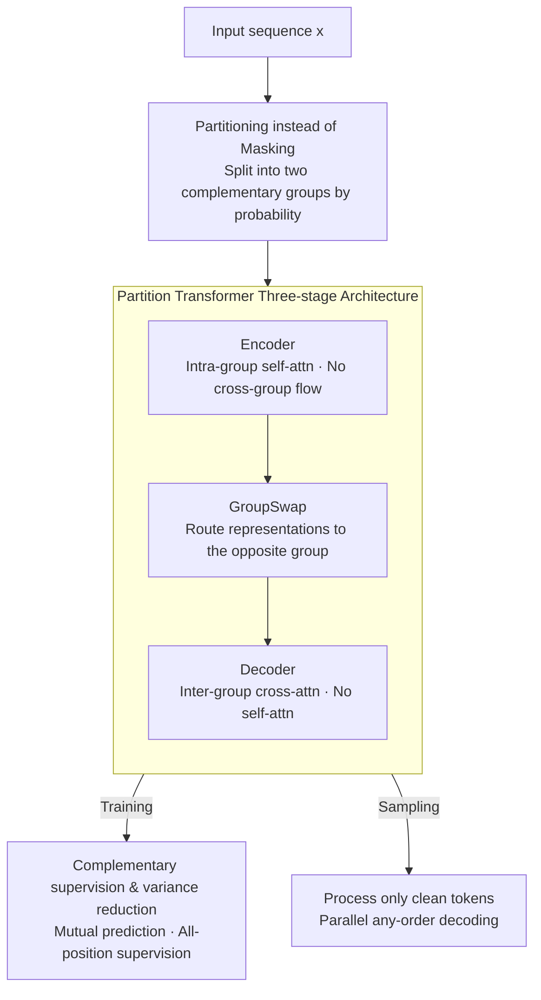

# Partition Generative Modeling: Masked Modeling Without Masks

**Conference**: ICLR 2026  
**OpenReview**: [https://openreview.net/forum?id=vEh1ceS154](https://openreview.net/forum?id=vEh1ceS154)  
**Code**: To be confirmed  
**Area**: Generative Models / Discrete Diffusion / Masked Generative Models  
**Keywords**: Partition Generative Modeling, Masked Diffusion, Parallel Decoding, Inference Acceleration, Partition Transformer  

## TL;DR
Ours proposes "Partition Generative Modeling" (PGM), which replaces the `[MASK]` mechanism of Masked Generative Models (MGM) by "partitioning a sequence into two mutually invisible groups that predict each other." This allows the model to process only "clean tokens" during sampling (saving computation like an autoregressive model) while retaining parallel, any-order generation (flexible like MGM). PGM is 5–5.5× faster than MDLM on OpenWebText with lower perplexity and approaches MaskGIT's FID on ImageNet with 7.5× the throughput.

## Background & Motivation

**Background**: Masked Generative Models (MGM, such as MDLM for text and MaskGIT for images) have two attractive advantages over Autoregressive Models (ARM): they can decode multiple tokens in parallel and generate in any order, rather than just token-by-token from left-to-right. This has led to strong performance in image, video, audio, and language tasks.

**Limitations of Prior Work**: MGM inference is slow. The fundamental reason is that **each sampling step requires feeding the full-length sequence into the model, which includes a large number of `[MASK]` tokens** that carry no information. In contrast, ARMs only process already generated tokens. Consequently, MGMs are disadvantaged in large-scale, real-time, and "test-time compute scaling" scenarios.

**Key Challenge**: MGM training and sampling must remain consistent. They are trained on full sequences using bidirectional architectures where each latent representation depends on all $L$ positions (including masked ones). If one naively "partitions and feeds shorter sequences" during inference to save computation, it results in a distribution mismatch with training, significantly degrading sample quality. In other words, there is a tension between **"saving computation on `[MASK]` tokens" and "maintaining training-sampling consistency while retaining parallel any-order generation."**

**Deficiencies of Existing Solutions**: Decoding more tokens per step can increase throughput but hurts sample quality. Distillation (e.g., SDTT) can reduce the number of sampling steps, but the per-step cost remains unchanged and may harm diversity. Block Diffusion achieves partial KV caching through block generation but sacrifices the any-order generation capability. No method has successfully **made the single-step sampling itself cheaper without losing MGM flexibility**.

**Core Idea**: Replace "masking" with "partitioning." Divide tokens into two disjoint groups and use a specialized attention mechanism to ensure information does not flow between groups. The model "uses one group to predict the other," thereby completely eliminating `[MASK]` tokens. Because the two groups do not interact, only "clean tokens" need to be processed during sampling (like ARM), while maintaining parallel and any-order generation (like MGM).

## Method

### Overall Architecture
PGM is a direct extension of the MGM paradigm: the training objective, guidance mechanism (CFG), samplers, and distillation methods can all be directly applied. The only change required is the neural network architecture. Overall, an input sequence $x$ is first **randomly partitioned into two complementary groups** (Group 0, Group 1) based on time $t$, and then fed into a specially designed **Partition Transformer**. It consists of three stages: "Encoder with intra-group self-attention → GroupSwap layer for switching information → Decoder with inter-group cross-attention (and no self-attention)." This ensures that Group 0's predictions only depend on Group 1, and vice-versa. During training, both groups serve as targets, generating **supervision signals at all positions**. During sampling, only the "determined clean tokens" are fed into the network, decoding several masked positions in parallel each step until the complete sequence is generated.

### Key Designs

**1. Partitioning Instead of Masking: Eliminating `[MASK]` tokens via "Two Mutually Invisible Groups"**

The source of MGM inefficiency is the need to process non-informative `[MASK]` tokens during sampling. Ours' approach is: given $x$ and $t\sim U[0,1]$, each token is assigned to Group 1 with probability $p_t = 1-\alpha_t$, otherwise to Group 0, with group membership recorded in $g\in\{0,1\}^L$. Through the architecture, it is guaranteed that "information cannot flow across groups"—the prediction for a Group 0 position depends only on Group 1 tokens, and vice versa. This is semantically equivalent to the MGM concept of "predicting masked tokens from clean tokens": Group 0 can be viewed as "clean" and Group 1 as "masked," with an expected ratio $\alpha_t$ of tokens in Group 0, matching the expected clean ratio in MDLM's forward process. The difference is that PGM **learns from both groups simultaneously**, and since the groups consist of real tokens, only the currently known group needs to be fed in during sampling, entirely removing `[MASK]`.

**2. Partition Transformer: Making "Processing Only One Group" Architecturally Possible**

To achieve "Group 0 prediction seeing only Group 1," a standard bidirectional Transformer is insufficient. This paper designs a three-stage architecture:

- **Encoder**: Comprized of stacked "partition-wise self-attention" blocks. It is nearly identical to standard bidirectional blocks, except that **tokens from different groups do not attend to each other**. Thus, hidden representations of Group 0 depend only on Group 0, and Group 1 only on Group 1.
- **GroupSwap Layer**: After the Encoder, information is trapped within each group, but prediction requires the opposite dependency. GroupSwap uses cross-attention to route representations to the **opposite group**. To prevent info leakage, the cross-attention query cannot depend on tokens from the opposite group. This paper provides two query initializations: **data-independent query** (a learnable vector $u$ replicated across the sequence, plus positional encoding, then LN + linear projection: $V_{i;\cdot}=W(\mathrm{LN}(u+\mathrm{pos}_{i;\cdot}))+b$) and **data-dependent query** (intra-group aggregation to get $Y_0, Y_1$, then added to the opposite side: $V'_{i;\cdot}=V_{i;\cdot}+Y_{1}\,(g_i{=}0)$ or $Y_0$). Since both performed similarly, the simpler data-independent version is used.
- **Decoder**: Uses cross-attention layers where key/value come from Encoder outputs and queries come from GroupSwap (first block) or the previous Decoder block. **The Decoder has no self-attention layers**—this is the key to efficient sampling: predictions can be calculated only for the "positions to be decoded" without processing the entire group.

The essence of this design is shifting "which positions see which" from "using `[MASK]` placeholders + bidirectional full-sequence" to "physical group partitioning + explicit cross-group routing," allowing only one group of tokens to be fed during sampling.

**3. Complementary Supervision & Variance Reduction: Two Gradient Signals from One Sequence**

Since both groups serve as targets for each other, the PGM training objective calculates loss for **every position**, unlike MGM which only calculates loss at masked positions:

$$\mathcal{L}_{\mathrm{PGM}} := \mathbb{E}_{x\sim D,\, t\sim U[0,1]}\big[w_{\mathrm{PGM}}(g,t)\,\mathrm{CE}(x_\theta(x;g;t),\,x)\big]$$

Where weights treat Group 0 as "clean" and Group 1 as "masked." Thus, Group 1 uses the MDLM weight $w(t)=\frac{\alpha'_t}{1-\alpha_t}$, and Group 0 uses $w(1-t)$ due to symmetry. In other words, **a single forward pass evaluates the MDLM objective at two complementary mask rates simultaneously**. The benefit is that each training sample contributes two complementary gradient signals, equivalent to "training on two complementary masked copies," thereby **reducing gradient variance**. Lower variance benefits the validation likelihood of diffusion models—on LM1B, PGM with the same number of layers achieves a validation perplexity 1.95 lower than MDLM. The paper also conducts an ablation: training a standard bidirectional Transformer with double batch size and complementary masked copies to isolate the contribution of "complementary masking."

**4. Parallel Sampling Processing Only Clean Tokens: Compatible with MGM Samplers and Distillation**

During sampling, let $C_\tau$ be the set of clean token indices at step $\tau$, with $n_\tau=|C_\tau|$. Each step samples $k_\tau$ masked positions from $p_\theta(\cdot\mid x_{C_\tau})$ and merges the results into $C_{\tau+1}$. **Only the clean tokens in $C_\tau$ are fed into the network throughout the process** (the source of compute savings), while still allowing parallel, any-order decoding. For text, it uses a fixed $k$ tokens per-step schedule which yields better quality and throughput than MDLM's per-position sampling; for images, it supports both confidence and Halton samplers, with Halton performing better empirically. Since PGM is an extension of the MGM paradigm, CFG guidance and SDTT distillation can be directly applied—treating one group as `[MASK]` during distillation makes PGM a drop-in replacement for MGM.

## Key Experimental Results

### Main Results

Text (LM1B ctx 128 / OpenWebText ctx 1024, Val PPL + Throughput, batch size 32):

| Model | Parameters | Val PPL ↓ | Latency (s) ↓ | Throughput (tok/s) ↑ |
|------|-----------|-----------|---------------|----------------------|
| MDLM (LM1B) | 170M | 27.67 | 3.78 | 1081.6 |
| **PGM 6/6 (LM1B)** | 171M | **26.80** | **2.12** | **1930.9** |
| MDLM (OWT) | 170M | 23.07 | 31.41 | 1043.2 |
| PGM 8/8 (OWT) | 203M | 22.61 | 5.86 | 5585.6 |
| **PGM 6/6 dim1024 (OWT)** | 268M | **21.43** | **5.93** | 5518.1 |

On LM1B, PGM with the same layers reduces PPL by 1.95 compared to MDLM. On OWT, it slightly lags at the same scale but outperforms MDLM when layers or dimensions are increased, **with sampling throughput at least 5× higher than MDLM**. Images (ImageNet256, Halton sampler + optimal CFG): PGM 12/12 achieves 7.5× throughput with only minor FID degradation (5.54 vs MaskGIT 5.35). Increasing sampling steps to 64 further reduces FID to **4.56**, while still being 3.9× faster than MaskGIT.

### Ablation Study

| Configuration | Key Metric | Description |
|---------------|------------|-------------|
| MDLM (LM1B) | PPL 27.67 | Baseline |
| MDLM† Complementary Mask (LM1B) | PPL 25.72 | Double batch + complementary masked copies; isolates "complementary supervision" gain. |
| PGM 6/6 (LM1B) | PPL 26.80 | Full model |
| MDLM† Complementary Mask (OWT) | PPL 22.98 | Complementary mask gain is smaller on OWT. |
| Data-independent vs Data-dependent query | Similar PPL | Simple data-independent query selected. |
| Encoder/Decoder balance vs imbalance | Balanced is better | Equal layers for encoder/decoder outperform imbalance. |

### Key Findings
- **Complementary masking is useful but not everything**: The "complementary mask" only control (MDLM†) reduced PPL from 27.67 to 25.72 on LM1B, proving that "dual supervision" itself reduces variance and improves likelihood. However, the gain is smaller on OWT, and a gap remains between PGM and MDLM†, suggesting room for architectural improvement.
- **Compute savings come from architecture, not distillation**: Even without distillation, PGM is 5–5.5× faster than MDLM. After combining with SDTT (5 distillation rounds), PGM's perplexity and entropy are higher under standard ancestral sampling but equivalent to MDLM under nucleus sampling (p=0.9), with the speed advantage slightly dropping to ~4.6× due to nucleus sampling overhead.
- **No drop in downstream tasks**: On eight tasks in `lm-eval-harness`, PGM slightly outperformed MDLM on six, with overall performance parity before and after distillation—showing that acceleration does not sacrifice downstream capability.

## Highlights & Insights
- **Reinterpreting "Masking" as "Partitioning"**: The most insightful point is that `[MASK]` in MGM acts as a placeholder to tell the model where to predict. PGM realizes that if the architecture ensures group invisibility, placeholders are unnecessary; clean tokens themselves function as the condition. This unearths wasted computation in MGMs.
- **Dual Supervision for One Forward Pass**: By building "complementary masking" into the architecture, variance reduction is obtained for free—a training trick transferable to other discrete diffusion or masked modeling tasks.
- **Drop-in Ecosystem Compatibility**: It maintains compatibility with CFG, Halton/confidence samplers, and SDTT distillation, meaning existing MGM engineering can migrate with almost zero cost.
- **Self-attention removal in Decoder**: A clean engineering trade-off—because the Decoder has no self-attention, predictions only need to be calculated at the positions to be decoded, directly leading to the throughput increase.

## Limitations & Future Work
- **Architecture has not reached the upper bound**: The gap between PGM and MDLM† implies that the Partition Transformer has room for improvement, especially on OWT where parameter increases were needed to outperform MDLM.
- **Smaller gains from complementary supervision on OWT**: The paper only provides preliminary exploration in the appendix as to why LM1B benefits more than OWT; the mechanism is not fully clear.
- **Distillation is not tailored for PGM**: SDTT distillation treats one group as `[MASK]`, which favors the MDLM setup. Custom distillation strategies for PGM are left for future work.
- **Slight parameter increase**: To outperform MDLM on OWT, more parameters were required (e.g., 268M vs 170M). Although sampling is still 5× faster, the parameter overhead is a real cost.

## Related Work & Insights
- **vs MDLM**: MDLM uses `[MASK]` corruption and bidirectional denoising, processing full sequence lengths at every step. Ours replaces masks with partitions, processing only clean tokens during sampling. At the same depth, PGM achieves lower PPL due to complementary supervision and 5×+ throughput.
- **vs MaskGIT**: MaskGIT uses confidence scheduling in VQGAN latent space but still processes the full sequence. Ours approaches its FID with 7.5× throughput and is compatible with its Halton sampler.
- **vs Block Diffusion**: BD accelerates via block generation and KV caching but sacrifices any-order generation. PGM saves per-step computation while retaining parallel any-order generation, providing a more comprehensive solution.
- **vs Distillation-based Acceleration (SDTT, etc.)**: Distillation reduces steps but per-step cost is constant. PGM makes the step itself cheaper; the two are orthogonal and stackable.

## Rating
- Novelty: ⭐⭐⭐⭐⭐ "Partitioning instead of masking" is a concise and fundamental reconstruction of the MGM paradigm.
- Experimental Thoroughness: ⭐⭐⭐⭐ Covers text/image modalities, distillation, downstream tasks, and complementary mask controls, but the OWT gain mechanism is less clear.
- Writing Quality: ⭐⭐⭐⭐ Clear chain from motivation to architecture to experiments; stage-3 architecture diagram is helpful.
- Value: ⭐⭐⭐⭐⭐ A drop-in replacement for MGM providing 5–7.5× acceleration is highly significant for deploying discrete diffusion and test-time scaling.

<!-- RELATED:START -->

## Related Papers

- [\[ICLR 2026\] LapFlow: Laplacian Multi-scale Flow Matching for Generative Modeling](lapflow_laplacian_multi-scale_flow_matching_for_generative_modeling.md)
- [\[ICLR 2026\] Flow Along the $K$-Amplitude for Generative Modeling](flow_along_the_k-amplitude_for_generative_modeling.md)
- [\[ICLR 2026\] GenCP: Towards Generative Modeling Paradigm of Coupled Physics](gencp_towards_generative_modeling_paradigm_of_coupled_physics.md)
- [\[ICLR 2026\] Continuously Augmented Discrete Diffusion model for Categorical Generative Modeling](continuously_augmented_discrete_diffusion_model_for_categorical_generative_model.md)
- [\[ICLR 2026\] Mirror Flow Matching with Heavy-Tailed Priors for Generative Modeling on Convex Domains](mirror_flow_matching_with_heavy-tailed_priors_for_generative_modeling_on_convex_.md)

<!-- RELATED:END -->
