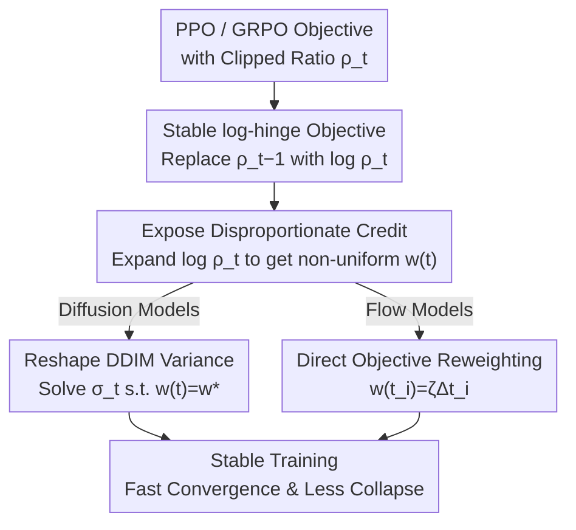

# PCPO: Proportionate Credit Policy Optimization for Preference Alignment of Image Generation Models

**Conference**: ICLR 2026  
**OpenReview**: [https://openreview.net/forum?id=alY08iknli](https://openreview.net/forum?id=alY08iknli)  
**Code**: https://github.com/jaylee2000/pcpo/  
**Area**: Diffusion Models / Alignment RLHF  
**Keywords**: Text-to-Image Alignment, Policy Gradient, GRPO, Credit Assignment, Model Collapse

## TL;DR
This paper identifies that applying policy gradients (PPO/GRPO) to diffusion/flow model alignment results in the sampler's mathematical structure assigning **severely disproportionate credit weights** $w(t)$ across denoising timesteps, which is the root cause of training instability and model collapse. PCPO rectifies this through a "numerically stable log-hinge objective reconstruction + principled reweighting to uniformize timestep weights," significantly accelerating convergence, mitigating collapse, and outperforming SOTA baselines like DanceGRPO.

## Background & Motivation
**Background**: Reinforcement Learning (especially GRPO migrated from LLMs) has become the mainstream online policy gradient framework for aligning text-to-image (T2I) diffusion/flow models. It involves sampling a group of candidates, performing group-wise normalization of rewards to obtain advantages $\hat{A}=(r-\mu_G)/\sigma_G$, and updating the policy using clipped importance sampling ratios $\rho_t$.

**Limitations of Prior Work**: GRPO-based methods in T2I often encounter **training instability** and **model collapse**. This manifests as either depleted sample diversity (mode collapse, where entropy is exhausted by rewards) or sacrificed overall fidelity to inflate rewards (reward hacking, resulting in artifacts and unrealistic outputs). These issues limit convergence speed and degrade final image quality.

**Key Challenge**: The authors trace instability to two root causes. First, terms like $\rho_t-1$ in standard objectives have poor numerical precision, distorting gradient magnitudes. Second and more critically: when policy gradients are applied to generative samplers, the sampler's mathematical structure leads to **disproportionate credit assignment**. Each timestep's gradient contribution is scaled by a "native weight" $w(t)$ tied to the noise schedule, which varies by several orders of magnitude across timesteps. This weight is an artifact of sampler mathematics rather than an intended credit policy, causing inconsistent amplification of gradients and frequent clipping of the largest signals, creating high-variance learning signals.

**Goal**: Concurrently rectify numerical instability and disproportionate credit assignment to stabilize training.

**Key Insight**: By analogy to classic REINFORCE, parameter updates should be proportional to the "eligibility vector" multiplied by the contribution of each action, where contributions are typically assumed to be **uniform**. Since the gradient form of diffusion samplers is isomorphic to this, the non-uniform $w(t)$ is an anomaly. Making $w(t)$ constant restores "proportionate credit assignment."

**Core Idea**: Replace numerically unstable $\rho_t-1$ with $\log\rho_t$ to obtain a stable log-hinge objective. Then, either reshape the variance schedule (diffusion) or directly reweight the objective (flow models) to make the weights $w(t)$ uniform across all timesteps.

## Method

### Overall Architecture
PCPO does not modify the reward model or the group-wise normalization of GRPO. It specifically modifies the **policy ratio $\rho_t$ and the underlying credit assignment mechanism** (derivations use PPO notation for simplicity, but conclusions hold for GRPO). The pipeline first reformulates the PPO objective into an equivalent hinge loss and substitutes the unstable $\rho_t-1$ with $\log\rho_t$ to obtain a stable **log-hinge objective**. Subsequently, $\log\rho_t$ is expanded via Proposition 1 to **expose** the non-uniform native weight $w(t)$ at each timestep. Finally, corrections are applied based on the principle of uniform weighting: for **diffusion models**, the DDIM variance schedule $\tilde\sigma_t$ is redesigned to make $w(t)$ constant; for **flow models**, where modifying the variance schedule is too costly, the **training objective is directly reweighted**. These corrections result in lower clipping ratios, faster convergence, and reduced collapse.

### Key Designs

**1. Stable log-hinge Objective Reconstruction: Replacing unstable $\rho_t-1$ with $\log\rho_t$**

The gradient of the PPO objective is equivalent to a hinge loss $L_{\text{hinge}}=\mathbb{E}[\sum_t \max\{0,\ \xi|A|-A(\rho_t-1)\}]$. The term $\rho_t-1$ is numerically unstable; when $\rho_t$ is close to 1, subtracting two large numbers amplifies floating-point errors and distorts gradient magnitudes. PCPO replaces it with the more robust $\log\rho_t$, resulting in:

$$L_{\text{PCPO-base}}(\theta):=\mathbb{E}\Big[\sum_{t=1}^{T}\max\big(0,\ \xi|A|-A\log\rho_t\big)\Big].$$

This substitution is justified by two factors: first, in the hinge loss view, the term behaves like a replaceable "classifier" function; second, $\log\rho_t\approx\rho_t-1$ provides a reasonable first-order Taylor approximation under small policy updates (ensured by small clipping ranges, with empirical errors below 1.2%). This modification alone eliminates "numerical precision gradient distortion."

**2. Revealing Disproportionate Credit Assignment: Expanding $\log\rho_t$ to find non-uniform $w(t)$**

The more insidious instability lies within $\log\rho_t$. Proposition 1 expands it for DDIM sampling as:

$$\log\rho_t=-\Big[w(t)(\hat\varepsilon_\theta^{(t)}-\hat\varepsilon_{\text{old}}^{(t)})\cdot\epsilon_{\text{old}}^{(t)}+\tfrac12 w(t)(\hat\varepsilon_\theta^{(t)}-\hat\varepsilon_{\text{old}}^{(t)})^2\Big],\quad w(t)=\frac{C(t)}{\sigma_t},$$

where $\hat\varepsilon$ represents the denoiser's noise prediction and $\epsilon_{\text{old}}$ is the Gaussian noise from the old policy. Here $C(t)=\frac{\sqrt{1-\bar\alpha_t}}{\sqrt{\alpha_t}}-\sqrt{1-\bar\alpha_{t-1}-\sigma_t^2}>0$. Upon substitution, the PPO loss becomes an $\varepsilon$-matching loss where each timestep's gradient contribution is scaled by $w(t)$. Crucially, $w(t)$ **varies by several orders of magnitude across timesteps** (Figure 2a) as a byproduct of the noise schedule. This explains why gradients are inconsistently amplified and frequently clipped, serving as the core diagnostic for subsequent designs.

**3. Diffusion Models: Reshaping DDIM variance schedule for uniform weights**

Since instability stems from non-uniform $w(t)=C(t)/\sigma_t$, and $\alpha_t$ (which determines $C(t)$) is fixed in standard DDIM, the only tunable parameter is the variance $\sigma_t$. PCPO solves for the $\tilde\sigma_t$ that yields a target constant weight $w^\star$ for every timestep. To ensure a fair comparison and isolate the effect of "uniform weighting," $w^\star$ is recalibrated to the mean of the original non-uniform weights (approx. $w^\star=4.5$ in experiments). This new $\tilde\sigma_t$ remains close to the original schedule, representing a **minimal adjustment that does not degrade sampling quality** while restoring proportionate credit.

**4. Flow Models: Direct objective reweighting to bypass variance schedule modifications**

Flow matching models introduce randomness via backward SDEs. The single-step $\log\rho_t$ is similar to diffusion, but the weight is $w(t_i)=\frac{\sqrt{\Delta t_i}}{\sigma_{t_i}}\big(1+\frac{(1-t_i)\sigma_{t_i}^2}{2t_i}\big)$. The problem is more complex: timestep shifting in high-resolution synthesis creates **non-uniform integration intervals** $\Delta t_i$, making native weights highly disproportionate ($w(t_i)\propto\sqrt{\Delta t_i}$). Modifying the variance schedule or shifting strategy here would deviate too far from tuned sampling processes. Instead, PCPO **directly reweights the training objective**. Proposition 2 provides weights that make credit proportional to the interval $\Delta t_i$:

$$w(t_i)=\zeta\Delta t_i,\quad \zeta=\sum_{i=1}^{N}\frac{\sqrt{\Delta t_i}}{\sigma_{t_i}}\Big(1+\frac{(1-t_i)\sigma_{t_i}^2}{2t_i}\Big).$$

This weighting scheme provides proportionate timestep weights for both DanceGRPO SDE and Flow-GRPO SDE (Figure 2c,d), achieving "uniform credit" through objective modification rather than sampler modification.

### Loss & Training
The final training objective replaces non-uniform weights with uniformized ones within the log-hinge framework. For diffusion, the reshaped $\tilde\sigma_t$ ensures $w(t) \equiv w^\star$. For flow models, $w(t_i)=\zeta\Delta t_i$ reweights the $\varepsilon$-matching term. Following prior work, the KL penalty is omitted for simplicity (except for SD3.5-M generalization experiments which include an auxiliary KL term). A small clipping range is used to maintain the validity of the $\log\rho_t\approx\rho_t-1$ approximation.

## Key Experimental Results

The analysis covers two frameworks: DDPO (SD1.5 with Aesthetics and BERTScore rewards) and the SOTA DanceGRPO (SD1.4 and FLUX.1-dev with HPSv2.1 rewards), with further validation on Flow-GRPO (SD3.5-M).

### Main Results

Training Efficiency (epochs to reach target reward, lower is faster):

| Framework / Reward | Target Reward | Baseline Epoch | PCPO Epoch | Gain |
|-------------|----------|-----------|-----------|------|
| DDPO / Aesthetics | 6.90 | 147 | 118 | 24.6% |
| DDPO / BERTScore | 0.52 | 191 | 146 | 30.8% |
| DanceGRPO(SD1.4) / HPS | 0.370 | 236 | 188 | 25.5% |
| DanceGRPO(FLUX) / HPS | 0.360 | 209 | 148 | 41.2% |

Sample Quality (FID/FDDINO at matching reward levels, lower is better):

| Setting | Method | FID↓ | FDDINO↓ | LPIPS |
|------|------|------|---------|-------|
| DanceGRPO SD1.4 | Baseline | 90.34 | 1078.42 | 0.4948 |
| DanceGRPO SD1.4 | PCPO | 84.74 | 1035.45 | 0.4894 |
| DanceGRPO FLUX | Baseline | 46.23 | 539.83 | 0.5736 |
| DanceGRPO FLUX | PCPO | 40.38 | 438.88 | 0.5708 |
| DDPO bs256 | Baseline | 31.72 | 473.17 | 0.6208 |
| DDPO bs256 | PCPO | 27.86 | 461.69 | 0.6262 |

### Ablation Study

| Configuration | Key Metrics | Description |
|------|---------|------|
| Full PCPO | Lower/stabler clipped ratio + FID↓ | log-hinge + Uniform Weighting |
| log-hinge only (base) | Better numerical stability but high variance | Disproportionate credit not fixed |
| Baseline (Original PPO/GRPO) | High clipped ratio, slow convergence | Uncorrected non-uniform $w(t)$ |

Statistical testing using Linear Mixed Models (LMM) on DDPO(Aesthetics) shows the Algorithm coefficient for FID is $\beta=-7.750$ ($p=0.047$, significant), and for IS* is $-0.241$ ($p=0.021$, significant). FDDINO improvements follow the same trend but are not significant ($p=0.247$), attributed to metric insensitivity in simpler prompt settings.

### Key Findings
- **Clipped ratio is evidence of stability**: PCPO maintains consistently lower and flatter clipped ratios (Figure 3), which is the key to faster convergence—it breaks the cycle of "inconsistent gradient amplification followed by frequent clipping."
- **Acceleration correlates with weight non-uniformity**: On FLUX, where high resolution and timestep shifting cause the most disproportionate weights, PCPO achieves the highest speedup (41.2%).
- **Quality improvement stems from collapse mitigation**: Lower FID/FDDINO at identical reward levels indicates that gains come from reducing reward hacking and diversity loss rather than just inflating rewards.

## Highlights & Insights
- **Attributing instability to mathematical structure rather than the optimizer**: Instead of blaming generic RL difficulty, the author identifies $w(t)$ from the $\log\rho_t$ expansion as the literal culprit.
- **First-principles justification for uniform weights**: Using the REINFORCE analogy, the paper argues that non-uniform $w(t)$ is an artifact. This provides a theoretical foundation superior to empirical heuristics like TempFlow-GRPO.
- **Dual-path engineering judgment**: By modifying the variance schedule in diffusion (where cost is low) and reweighting the objective in flow models (where schedule modification is costly), the "proportionate credit" principle is applied flexibly to different architectures.

## Limitations & Future Work
- Derivations are based on DDIM/first-order Euler-Maruyama discretization; proportionate weights for higher-order samplers require further derivation.
- While $w^\star$ was set to the mean for fair comparison, the optimal constant weight value was not extensively studied.
- Insignificance of FDDINO in some settings suggests that while collapse is mitigated, quantitative measurement remains difficult on weaker base models.
- The flow model uses approximations to handle division-by-zero at $t=1$.

## Related Work & Insights
- **vs DanceGRPO / Flow-GRPO**: PCPO acts as a plug-in improvement to these SOTA baselines, improving speed and quality without altering their core sampling logic.
- **vs TempFlow-GRPO / MixGRPO**: While these methods seek to improve credit assignment (e.g., via trajectory branching), PCPO’s Proposition 2 provides a more fundamental explanation that covers cases where empirical heuristics fail.
- **vs DPO**: DPO is more stable but its performance ceiling is constrained by the lack of online reinforcement. PCPO follows the path of stabilizing policy gradients to maintain a higher performance ceiling.

## Rating
- Novelty: ⭐⭐⭐⭐⭐ Precisely attributes instability to sampler-derived non-uniform weights and provides a closed-form correction.
- Experimental Thoroughness: ⭐⭐⭐⭐ Covers multiple frameworks and includes statistical tests, though some metrics show limited significance.
- Writing Quality: ⭐⭐⭐⭐ Clear derivations, distinct propositions, and intuitive visualizations.
- Value: ⭐⭐⭐⭐⭐ An easy-to-implement stabilization module with direct utility for T2I training efficiency and robustness.

<!-- RELATED:START -->

## Related Papers

- [\[ICLR 2026\] PCPO: Proportionate Credit Policy Optimization for Aligning Image Generation Models](pcpo_proportionate_credit_policy_optimization_for_aligning_image_generation_mode.md)
- [\[ICLR 2026\] Group Critical-token Policy Optimization for Autoregressive Image Generation](group_critical-token_policy_optimization_for_autoregressive_image_generation.md)
- [\[ICLR 2026\] Reinforcing Diffusion Models by Direct Group Preference Optimization](reinforcing_diffusion_models_by_direct_group_preference_optimization.md)
- [\[ICLR 2026\] TempFlow-GRPO: When Timing Matters for GRPO in Flow Models](tempflow-grpo_when_timing_matters_for_grpo_in_flow_models.md)
- [\[ICLR 2026\] TreeGRPO: Tree-Advantage GRPO for Online RL Post-Training of Diffusion Models](treegrpo_tree-advantage_grpo_for_online_rl_post-training_of_diffusion_models.md)

<!-- RELATED:END -->
