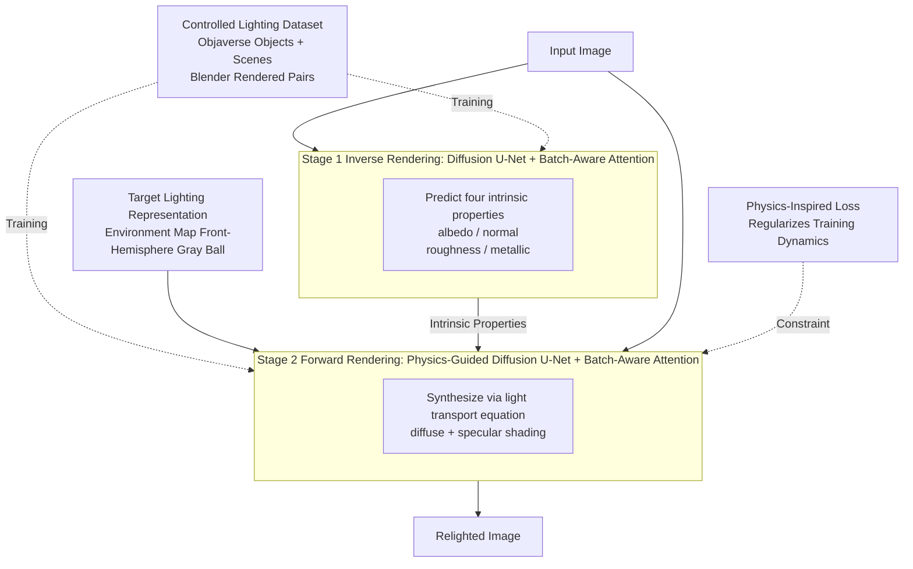

# PI-Light: Physics-Inspired Diffusion for Full-Image Relighting

**Conference**: ICLR 2026  
**arXiv**: [2601.22135](https://arxiv.org/abs/2601.22135)  
**Code**: None  
**Area**: Image Generation / Image Relighting  
**Keywords**: Diffusion Models, Image Relighting, Inverse Rendering, Physics-Guided, Intrinsic Decomposition

## TL;DR

Proposes π-Light (PI-Light), a two-stage full-image relighting framework: the first stage performs intrinsic property decomposition (albedo, normal, roughness, etc.) via a physics-guided diffusion model, and the second stage achieves re-rendering under target lighting conditions through a physics-guided neural rendering module. It introduces batch-aware attention mechanisms and physics-inspired losses to achieve superior generalization to real-world scenes.

## Background & Motivation

Full-image relighting is a long-standing challenge in computer vision and graphics, aiming to change lighting conditions while preserving scene content. This task faces three core difficulties:

**Scarcity of large-scale paired data**: High-quality paired data of the same scene under different lighting conditions is extremely difficult to collect, severely limiting the training of data-driven methods.

**Difficulty in ensuring physical plausibility**: End-to-end learning tends to produce physically unreasonable lighting effects (e.g., incorrect shadow directions, unnatural specular reflections).

**Synthetic-to-real domain gap**: Models trained on rendered data often fail to generalize to real-world scenes, and existing attempts to bridge this gap remain suboptimal.

Existing methods are generally divided into two categories: (1) Direct end-to-end learning of image-level black-box transformations, which lack physical constraints; (2) Reliance on precise 3D geometric reconstruction for re-rendering, which is computationally expensive and sensitive to reconstruction quality. The innovation of this paper lies in "injecting" physical constraints into diffusion models to achieve physically plausible relighting effects without explicit 3D reconstruction.

## Method

### Overall Architecture

PI-Light does not attempt to learn the "Input Image → Relighted Image" black-box mapping in one step. Instead, it decomposes full-image relighting into two stages with clear physical meanings: first "deconstructing" the image, then "re-drawing" it with new lighting. **Stage 1: Inverse Neural Rendering** repurposes a pre-trained image diffusion model (Stable Diffusion) to simultaneously decompose four intrinsic properties from the input image—albedo, normal, roughness, and metallic. These properties describe the object itself and are independent of lighting. **Stage 2: Neural Forward Rendering** feeds the input image, the intrinsic properties from Stage 1, and a target lighting condition back into the diffusion model. Guided by physical light transport priors, it generates the relighted image and outputs diffuse and specular shading. The intermediate intrinsic properties act as a physical "transfer layer," ensuring that lighting changes only occur in Stage 2, thereby preventing content distortion. The attention mechanisms in both stages are extended to be shared across images, and the training data comes from a set of controlled lighting paired datasets rendered with Blender.

### Key Designs

**1. Batch-Aware Attention: Resolving the Ill-posedness of Single-Image Intrinsic Decomposition via Cross-Image Consistency**

Intrinsic decomposition of a single image is highly ill-posed—the same set of pixels can be interpreted as "bright material + dark light" or "dark material + bright light." Single-image information is insufficient for disambiguation. PI-Light draws on the multi-view consistency idea from Wonder3D, extending standard self-attention layers to be "global-aware": attention calculations are linked across multiple images within a batch, allowing them to communicate. Thus, whether in Stage 1 predicting intrinsics or Stage 2 rendering, predictions for the same object across different samples are mutually constrained, forcing the model to provide consistent intrinsic and rendering results. This provides two benefits: it reduces the ambiguity of single-image decomposition and improves cross-image consistency, while also enhancing efficiency through shared computation.

**2. Physics-Guided Forward Rendering & Physics-Inspired Loss: Ensuring Stage 2 Follows Light Transport Equations Rather Than Pure Black-Box Fitting**

Stage 2 receives intrinsic properties and target lighting to "draw" the relighted image. If using pure neural network hard-fitting, it is prone to producing physically unreasonable results (wrong specular directions or intensities) and requires massive data to converge. PI-Light ensures rendering follows Physically Based Rendering (PBR) laws by modeling diffuse and specular reflections separately. Diffuse reflection is modeled by integrating environment light along the normal according to the Lambertian model: $D(p)=\int_{\Omega} L(\omega)\max(0, N(p)\cdot\omega)\,d\omega$, where $N(p)$ is the normal at pixel $p$ and $L(\omega)$ is the incident light from direction $\omega$. Building on this, a **physics-inspired loss** is introduced, using the analytically calculated diffuse shading to supervise the network output, regularizing training dynamics into a physically plausible solution space. This loss is not merely an enhancement; it serves as an efficient learning mechanism that allows the model to converge to correct light transport with less data and compute, which is key to bridging the synthetic-to-real gap.

**3. Hemispherical Light Representation: Avoiding Self-Luminescence Interference for Controllable Direction and Intensity**

Using full environment maps or irradiance as lighting conditions often incorporates the influence of self-luminescent objects or built-in light sources in the scene, leading to inaccurate lighting control and potential background corruption. PI-Light adopts a simple yet effective representation: taking only the **front hemisphere** of the environment map (implemented by modeling lighting with a rendered gray ball). This masks interference from self-luminescence and built-in lighting while allowing users to intuitively and precisely adjust light direction and intensity while maintaining background consistency. This design enables controllable "full-image relighting" without 3D reconstruction.

**4. Controlled Lighting Dataset: Filling the Data Scarcity Gap with Multi-Material Paired Data Rendered in Blender**

The biggest bottleneck in relighting training is the difficulty of obtaining high-quality paired data of "the same scene under multiple lighting conditions"—it is nearly impossible to capture multiple sets of controlled lighting for the same scene in the real world. PI-Light addresses this by building its own dataset: selecting assets with BRDF material properties from Objaverse for objects and supplementing scene-level data with intrinsic annotations, all rendered in Blender under controlled lighting to create "RGB image + ground-truth intrinsics + lighting condition" triplets. This serves as the training foundation for the proposed method and a standardized benchmark for the community's downstream evaluation.

### Loss & Training

Both stages are fine-tuned on pre-trained diffusion models, with the primary loss being the latent space diffusion V-prediction reconstruction loss $L_{\text{V-pred}}=\mathbb{E}_{z_0,\epsilon,t}\big[\lVert\hat v_\theta(z_t,t)-v_t\rVert_2^2\big]$. Stage 2 additionally layers the aforementioned **physics-inspired loss**: using diffuse shading calculated by the Lambertian equation to supervise the network's diffuse output. Attention in both stages utilizes the batch-aware (cross-image shared) format.

> ⚠️ Refer to the original paper for specific loss weights and training hyperparameters.

## Key Experimental Results

### Main Results

| Method | Dataset | PSNR ↑ | SSIM ↑ | LPIPS ↓ | Highlights |
|------|--------|--------|--------|---------|------|
| Prev. SOTA | Synthetic Test Set | — | — | — | Poor physical plausibility |
| PI-Light | Synthetic Test Set | **Best** | **Best** | **Best** | Comprehensive outperformance |
| Prev. SOTA | Real Scenes | Poor Gen. | — | — | Significant domain gap |
| PI-Light | Real Scenes | **Best Gen.** | — | — | Maintains physical plausibility |

**Intrinsic Decomposition Quality**:
- Albedo Prediction: Excellent consistency across different lighting conditions.
- Normal Prediction: Highly consistent with the GT.
- Material Properties: Correctly distinguishes material differences such as metallic vs. non-metallic.

**Relighting Performance**:
- Correctly generates specular highlights.
- Correctly handles diffuse reflections.
- Performs well across diverse materials (metal, plastic, fabric, etc.).
- Real-world scene generalization is significantly superior to previous methods.

### Ablation Study

| Component | Effect when Removed | Explanation |
|------|-----------|------|
| Batch-Aware Attention | Intrinsic consistency drops | Inconsistent albedo predictions under different lighting |
| Physics-Guided Rendering | Physical plausibility worsens | Increased errors in specular direction and intensity |
| Physics-Inspired Loss | Generalization ability drops | Performance degrades in real-world scenes |
| Curated Dataset | Insufficient material coverage | Impaired handling of specific materials (e.g., translucent) |

### Key Findings

1. **Physics-guidance is key to generalization**: With physical constraints, the model generalizes well to real-world scenes even when trained on synthetic data.
2. **Batch-aware attention significantly improves consistency**: Consistency of intrinsic property predictions for the same object under different lighting is greatly enhanced, which is vital for subsequent rendering quality.
3. **Two-stage design outperforms end-to-end**: Decomposing the problem into inverse rendering and forward rendering—two physically clear stages—is more controllable than end-to-end mapping.
4. **Diffusion models provide artistic + physical knowledge**: The combination of rich visual priors from pre-trained diffusion models and physical constraints is the foundation of the success of this work.

## Highlights & Insights

1. **Elegant integration of physical priors and generative models**: Rather than simply adding physical losses to a diffusion model, physical priors are embedded across three levels: model architecture (batch-aware attention), training objectives (physics-inspired losses), and inference pipeline (two-stage physical decomposition).
2. **Innovative design of batch-aware attention**: Leveraging the physical fact that intrinsic properties remain invariant across different lighting conditions of the same scene to enforce constraints at the attention mechanism level—a prime example of injecting domain knowledge into Transformer architectures.
3. **High practicality**: Direct utility for application scenarios such as movie special effects, virtual reality, and augmented reality, enabling high-quality relighting from a single image input.
4. **Data contribution**: The meticulously curated controlled lighting dataset provides a standardized benchmark for the community.

## Limitations & Future Work

1. **Error accumulation in two-stage pipeline**: Errors in intrinsic decomposition propagate to the rendering stage; end-to-end joint optimization might further enhance performance.
2. **Limitations of lighting representation**: Environment maps may be insufficient for expressing complex near-field lighting, area lights, or multi-source scenes.
3. **Computational overhead**: Two-stage inference based on diffusion models might be slower than single-stage methods, limiting real-time applications.
4. **Generalization to outdoor scenes**: The controlled lighting dataset primarily covers indoor/object-level scenes; generalization to complex outdoor scenes remains to be verified.
5. **Editing flexibility**: The fixed two-stage process struggles to support more flexible editing needs (e.g., local lighting adjustments, lighting interpolation).
6. **Resolution limits**: Restricted by the generation resolution of diffusion models, high-resolution images may require additional super-resolution processing.

## Related Work & Insights

- **Intrinsic Image Decomposition**: Evolution from Retinex theory to deep learning methods; PI-Light upgrades this to be diffusion-model-driven.
- **Neural Radiance Fields and Relighting**: NeRFactor, NVDiffrec, etc., achieve relighting through 3D reconstruction; PI-Light avoids explicit 3D reconstruction.
- **Diffusion Models for Inverse Problems**: DDPM/DDIM used for denoising, super-resolution, etc.; PI-Light extends this to relighting.
- **Multi-view consistency attention designs** in works like Zero-1-to-3 and Wonder3D inspired the concept of batch-aware attention.

## Rating

- Novelty: ⭐⭐⭐⭐ — Methodological design that systematically embeds physical guidance into a diffusion relighting framework is novel.
- Experimental Thoroughness: ⭐⭐⭐⭐ — Sufficient verification on synthetic and real scenes, complete ablation, and valuable data contribution.
- Writing Quality: ⭐⭐⭐⭐ — Clear narrative of the two-stage framework and well-articulated physical motivation.
- Value: ⭐⭐⭐⭐ — A practical relighting solution; the physics-guided + diffusion model paradigm is highly generalizable.

<!-- RELATED:START -->

## Related Papers

- [\[ICLR 2026\] A Physics-Inspired Optimizer: Velocity Regularized Adam](a_physics-inspired_optimizer_velocity_regularized_adam.md)
- [\[ICLR 2026\] GenCP: Towards Generative Modeling Paradigm of Coupled Physics](gencp_towards_generative_modeling_paradigm_of_coupled_physics.md)
- [\[NeurIPS 2025\] UniLumos: Fast and Unified Image and Video Relighting with Physics-Plausible Feedback](../../NeurIPS2025/image_generation/unilumos_fast_and_unified_image_and_video_relighting_with_physics-plausible_feed.md)
- [\[ICLR 2026\] CroCoDiLight: Repurposing Cross-View Completion Encoders for Relighting](crocodilight_repurposing_cross-view_completion_encoders_for_relighting.md)
- [\[ICLR 2026\] Condition Matters in Full-head 3D GANs](condition_matters_in_full-head_3d_gans.md)

<!-- RELATED:END -->
