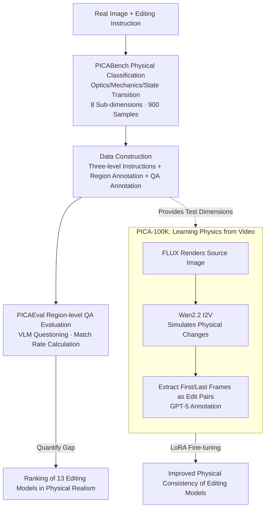

# PICABench: How Far are We from Physically Realistic Image Editing?

**Conference**: ICLR 2026  
**OpenReview**: [https://openreview.net/forum?id=AWxI5xnuZB](https://openreview.net/forum?id=AWxI5xnuZB)  
**Project Page**: [https://pica-research.github.io](https://pica-research.github.io)  
**Code**: To be confirmed  
**Area**: Image Generation / Image Editing / Evaluation Benchmark  
**Keywords**: Physical realism, instruction-based editing, VLM-as-a-judge, video data, region-level evaluation

## TL;DR
This paper points out that current instruction-based image editing models prioritize "semantic correctness" while neglecting "physical realism" (e.g., removing an object without removing its shadows and reflections). The authors construct PICABench, a benchmark covering three major dimensions—Optics, Mechanics, and State Transition—across eight sub-dimensions. They introduce PICAEval, a region-level QA evaluation protocol, and automatically generate the PICA-100K training set by using "Text-to-Image for scene rendering + Image-to-Video for simulating physical changes," significantly improving the physical consistency of existing editing models through fine-tuning.

## Background & Motivation

**Background**: Instruction-based image editing has advanced rapidly over the past two years. Open-source models like FLUX.1 Kontext, Qwen-Image-Edit, and Step1X-Edit, alongside closed-source systems like GPT-Image-1, Nano Banana, and Seedream 4.0, can execute complex natural language instructions such as "add an object" or "change to summer" with semantic coherence and high visual quality.

**Limitations of Prior Work**: However, "realistic editing" involves more than just semantic accuracy; it requires rendering accompanying physical effects correctly. Removing a lamp should cause its cast shadows, tabletop reflections, and ambient illumination to disappear. Moving a boat to the right necessitates moving its water reflection accordingly. In reality, these physical side effects are crucial for realism. Existing models often struggle with this—completing the instruction while leaving behind shadows, misaligned reflections, or illogical deformations.

**Key Challenge**: The root cause is that existing benchmarks reward semantic fidelity and visual consistency but rarely punish physical violations. The few benchmarks attempting to probe "scientific rationality" (e.g., professional chemistry or physics questions) drift toward specialized academic fields, detaching from daily editing scenarios of general users. Consequently, the community lacks a yardstick to measure "how far we are from physically realistic editing."

**Goal**: (1) Establish a benchmark that aligns with real-world editing while providing fine-grained diagnosis of physical violations; (2) Design a reliable, interpretable, and sensitive automated evaluation protocol for subtle physical errors; (3) Provide a training scheme that genuinely improves physical consistency.

**Key Insight**: The authors decompose "physical realism" into three intuitive yet often ignored dimensions: Optics, Mechanics, and State Transition, providing specific verifiable criteria for each. They observe that video naturally contains physical dynamic laws, allowing them to "borrow" physically consistent editing pairs from video data as training signals.

**Core Idea**: Replace vague global scoring of "is this edit correct" with "region-level binary QA tied to specific physical phenomena." Use "Text-to-Image as a scene renderer + Image-to-Video as a state transition simulator" to synthesize editing data with physical supervision signals.

## Method

### Overall Architecture
This work does not propose a new editing model but rather builds a complete "Evaluation + Data" infrastructure. It consists of three components: **PICABench** defines the classification of physical realism and contains test samples (900 items across 3 dimensions and 8 sub-dimensions); **PICAEval** solves the problem of automated and reliable physical correctness assessment by decomposing each sample into region-bound binary questions for VLMs to solve; and **PICA-100K** addresses model improvement by using a pure synthetic video pipeline to generate 100,000 physical editing pairs for fine-tuning.

### Key Designs

**1. PICABench Categorization and Benchmark: Decomposing "Physical Realism" into Eight Sub-dimensions**

To address the failure of existing benchmarks in pinpointing physical violations, the authors subdivide physical consistency into three dimensions and eight sub-dimensions with specific criteria. **Optics** governs light behavior, including Light Propagation (direction and occlusion of shadows), Reflection (dependent on viewpoint and shape), Refraction (background distortion through transparent media), and Light Source Effects (color/softness/attenuation of new light sources). **Mechanics** handles physical responses, including Deformation (rigid body preservation vs. smooth elastic deformation with consistent textures) and Causality (re-distribution of forces and reaction to additions/removals). **State Transition** manages environmental and material changes, divided into Global (GST, e.g., time/season/weather requiring synchronized updates across the scene) and Local (LST, e.g., wetting, drying, melting, burning, freezing restricted to specific objects). The benchmark features 900 samples covering common editing operations (add/remove/modify), each mapped to at least one sub-dimension for targeted diagnosis.

**2. Three-level Instruction Data Construction: From "Commands" to "Explicit Expectations"**

To accurately trigger physical effects, data construction involves two steps. First, GPT-5 expands seed words for the eight sub-dimensions into rich keywords covering materials, lighting scenarios, and long-tail phenomena. Diverse images with significant physical clues (strong directional light, transparent/reflective media, deformable objects) are retrieved from authorized and public libraries, followed by manual de-duplication and labeling. Second, each image is paired with a human-written instruction rooted in the scene's physical affordance, expanded by GPT-5 into three complexity levels: **superficial** (command only, measuring internal physical priors; the default setting), **intermediate** (command with a short physical rule as a reasoning hint), and **explicit** (detailed description of the expected result, minimizing ambiguity to test visual execution). This helps identify whether a model has internalized physical principles.

**3. PICAEval Region-level QA Evaluation: Binary Questions Bound to Critical Regions**

Evaluating physical realism is harder than evaluating semantics because it relies on alignment with implicit physical constraints without a ground-truth reference. PICAEval decomposes each sample into **region-bound binary questions**. Key regions (reflective surfaces, deformation zones, projection areas) are manually labeled in the input image. GPT-5 creates 4–5 Yes/No question-answer pairs per sample based on instructions and regions. During testing, a VLM (e.g., GPT-5) answers questions based specifically on the visible content within the specified regions. The score is the **percentage of questions with exact matches** to reference labels. This approach reduces hallucination through spatial anchoring and enhances interpretability. Consistency is measured separately by calculating PSNR (dB) in non-edited regions. Human Elo studies verify that PICAEval-GPT5 achieves a 0.95 Pearson correlation with human preferences.

**4. PICA-100K Learning Physics from Video: T2I Rendering + I2V Simulation**

The authors use a synthetic pipeline to generate physical supervision signals. They build subject and scene dictionaries (e.g., "a teapot," "a black kitchen table") and use FLUX.1-Krea-dev to generate realistic static source images. Then, they use Image-to-Video (I2V) instruction templates to describe physical transformations (rotation, moving, pouring, swaying). Wan2.2-14B-I2V synthesizes short videos to simulate these physical processes. The **first and last frames** of each video form a (source, edited) image pair. Instructions and labels are automatically generated via GPT-5. The resulting 105,085 samples cover eight physical categories. This targets implicit physical laws with a controllable pipeline and stable non-edited regions. Fine-tuning FLUX.1-Kontext-dev and Qwen-Image-Edit using LoRA (rank 256) significantly improves physical consistency.

## Key Experimental Results

### Main Results
Evaluated on PICABench-Superficial using GPT-5 as the judge across 13 models. Metrics: Accuracy (%, physical correctness) and Consistency (dB, non-edited region PSNR).

| Model | Overall Acc ↑ | Overall Con ↑ | Description |
|------|------|------|------|
| GPT-Image-1.5 | 67.05 | 21.73 | Best Closed-source |
| Nano Banana Pro | 66.16 | 22.97 | Second Best |
| Seedream 4.0 | 61.91 | 23.26 | Closed-source |
| GPT-Image-1 | 61.08 | 15.48 | Closed-source |
| Nano Banana | 59.87 | 23.47 | Closed-source |
| Qwen-Image-Edit | 58.29 | 19.43 | Best Open-source |
| Flux.1 Kontext | 48.93 | 24.57 | Open-source Baseline |
| Bagel-Think | 46.48 | 26.88 | Unified Architecture |
| OmniGen2 | 46.79 | 24.12 | Unified Architecture |
| Uniworld-V1 | 37.68 | 18.48 | Weakest Unified |

Core Conclusion: While top closed-source models exceed 60%, they are far from saturated; all open-source models fall below 60% in the superficial setting, indicating physical realism remains an open problem.

### Ablation Study

| Configuration | Overall Acc | Overall Con | Description |
|------|---------|---------|------|
| Flux.1 Kontext (Baseline) | 48.93 | 24.57 | Untuned |
| + PICA-100K (Ours) | 50.64 | 25.23 | Acc +1.71, Con +0.66 |
| + MIRA400K (Real Video Data) | 46.96 | 32.08 | Acc decreased 1.97 |
| Qwen-Image-Edit (Baseline) | 58.29 | 19.43 | Untuned |
| + PICA-100K | 62.13 | 21.91 | Acc +3.84, pushes open-source > 60 |

### Key Findings
- **Understanding $\neq$ Physical Realism**: Unified multimodal architectures (Bagel/OmniGen2) underperform dedicated editing models, suggesting that "stronger world understanding" does not automatically translate to physical realism.
- **Detailed Instructions Improve Execution but Reduce Consistency**: Accuracy rises monotonically from superficial to intermediate to explicit (e.g., Bagel 45.07 $\rightarrow$ 65.61), but consistency drops, reflecting a trade-off. The small gain from intermediate hints suggests a lack of internalized physical principles.
- **Synthetic Video Data Outperforms Real Video Data**: Fine-tuning with MIRA400K (real video) actually lowered accuracy compared to the baseline, highlighting the effectiveness of the proposed "targeted synthesis and non-edited region control" pipeline.

## Highlights & Insights
- **Grounding "Physical Realism" into Eight Verifiable Criteria**: This is the primary contribution. By decomposing a vague concept into Optics, Mechanics, and State Transition sub-dimensions, the paper enables targeted diagnosis and optimization.
- **Region-level Binary QA as a Portable Paradigm**: Decomposing a subjective "is this image correct" query into objective "is X in this region" questions anchored to ROIs reduces hallucinations. The 0.95 human correlation proves its reliability for any editing task lacking reference images.
- **T2I-as-Renderer + I2V-as-Simulator**: This clever data synthesis strategy leverages video models' capacity as world simulators to create physical supervision with controllable pipelines, proving that targeted synthetic data can be more effective than raw real-world video.

## Limitations & Future Work
- The PICA-100K generation pipeline is relatively simple, and its scale is limited. The models were only trained using SFT, which may not have exhausted the data's potential. Currently, the framework only supports single-image input.
- Physical assessment relies on VLM judges (like GPT-5), which may introduce biases or capability bottlenecks. Relying on the first and last frames of a video discards intermediate states, which explains the slight drop in causality and global state transition performance.
- Future improvements include enhancing the data pipeline, exploring Reinforcement Learning (RL) post-training, and incorporating multi-frame supervision to model temporal transitions more effectively.

## Related Work & Insights
- **vs. Traditional Evaluation (CLIP/DINO/PSNR)**: These metrics measure similarity but fail to capture fine-grained semantic alignment and ignore physical violations entirely. PICAEval fills this gap.
- **vs. Existing VLM-as-a-Judge Benchmarks**: Global prompts for multi-dimensional scoring are insensitive to "unrealistic lighting/deformation" and easily fooled by visually pleasing but illogical outputs.
- **vs. Video-prior Editing (ByteMorph / UniReal)**: Unlike ByteMorph, which focuses on non-rigid motion and may compromise background stability, PICA-100K targets implicit physical laws while maintaining architectural stability in non-edited regions.

## Rating
- Novelty: ⭐⭐⭐⭐⭐ Systematically decomposes "physical realism" into eight sub-dimensions with region-level QA.
- Experimental Thoroughness: ⭐⭐⭐⭐ Evaluates 13 models across three instruction levels, though training is limited to SFT.
- Writing Quality: ⭐⭐⭐⭐ Clear motivation, comprehensive charts, and well-explained taxonomy.
- Value: ⭐⭐⭐⭐⭐ The benchmark, evaluation protocol, and dataset triplet push the community from semantic-focused to physically-grounded editing.

<!-- RELATED:START -->

## Related Papers

- [\[ICLR 2026\] Does FLUX Already Know How to Perform Physically Plausible Image Composition?](does_flux_already_know_how_to_perform_physically_plausible_image_composition.md)
- [\[CVPR 2025\] IDEA-Bench: How Far are Generative Models from Professional Designing?](../../CVPR2025/image_generation/idea-bench_how_far_are_generative_models_from_professional_designing.md)
- [\[ICLR 2026\] Forward-Learned Discrete Diffusion: Learning how to noise to denoise faster](forward-learned_discrete_diffusion_learning_how_to_noise_to_denoise_faster.md)
- [\[ICLR 2026\] Charts Are Not Images: On the Challenges of Scientific Chart Editing](charts_are_not_images_on_the_challenges_of_scientific_chart_editing.md)
- [\[ICLR 2026\] LaTo: Landmark-tokenized Diffusion Transformer for Fine-grained Human Face Editing](lato_landmark-tokenized_diffusion_transformer_for_fine-grained_human_face_editin.md)

<!-- RELATED:END -->
