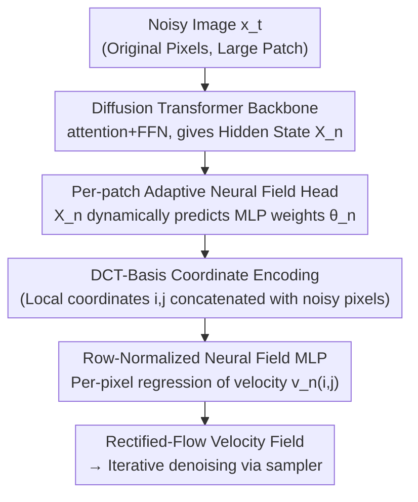

# PixNerd: Pixel Neural Field Diffusion

**Conference**: ICLR 2026  
**OpenReview**: [https://openreview.net/forum?id=BDnOrExHmt](https://openreview.net/forum?id=BDnOrExHmt)  
**Code**: https://github.com/MCG-NJU/PixNerd (Available)  
**Area**: Diffusion Models / Image Generation  
**Keywords**: Pixel-space Diffusion, Neural Field, Diffusion Transformer, Large Patch, End-to-End

## TL;DR
PixNerd replaces the final linear projection of the Diffusion Transformer with a "per-patch implicit neural field head" that dynamically generates weights from Transformer features. This head decodes fine-grained pixels within large patches, enabling single-stage, end-to-end diffusion in the original pixel space without relying on VAEs or cascaded multi-scale architectures. It achieves a 1.93 FID on ImageNet $256 \times 256$ with nearly 8x lower latency than previous pixel-space diffusion models.

## Background & Motivation
**Background**: Current high-quality diffusion Transformers (DiT, SiT, REPA, DDT, etc.) are almost entirely built on a compact latent space compressed by a pre-trained VAE. The VAE significantly reduces the spatial resolution of the original pixels to provide a nearly lossless, small-sized latent. This allows the diffusion model to learn reverse denoising using very small patches (e.g., $2 \times 2$), significantly reducing learning difficulty and computational cost.

**Limitations of Prior Work**: The VAE approach comes with two unavoidable costs. First, training a high-quality VAE usually requires adversarial training and perceptual supervision, which is complex to optimize; a suboptimal VAE introduces artifacts during decoding. Second, the "train VAE then train diffusion" pipeline accumulates errors across stages, making decoding flaws impossible to eliminate. To move away from VAEs, some works Return to original pixel-space diffusion but face new problems: the pixel space dimensionality is enormous. If small patches are used as in latent models, the token count explodes; if large patches are used to maintain comparable token counts, the interior details of those patches and the vastness of the pixel space make diffusion learning extremely difficult. Existing pixel diffusion models (PixelFlow, Teng, etc.) resort to **cascaded/multi-scale** schemes, splitting the diffusion process across different resolutions, which complicates both training and sampling.

**Key Challenge**: Pixel-space diffusion faces a "token count vs. learning difficulty" deadlock—either small patches lead to token explosion, or large patches lead to difficult detail learning. Cascading is a complexity cost paid to mitigate this contradiction. The fundamental issue is that under large patches, the **single linear projection** at the end of the DiT is insufficient to regress high-frequency details within a large patch.

**Goal**: To explore the performance upper bound of "large patches + pixel space" while maintaining token counts and compute comparable to latent diffusion, achieving a single-stage, end-to-end model without cascading or VAEs.

**Key Insight**: The authors observe that implicit neural fields (like NeRF and SIREN, which map coordinate encodings to signals via MLPs) excel at modeling high-frequency details in scene/surface reconstruction. Since a neural field can regress the fine signals of a continuous field, "decoding the per-pixel velocity field within a large patch" is essentially a coordinate-to-signal regression problem, perfectly suited for neural fields.

**Core Idea**: Replace the final linear projection of the DiT with a "per-patch implicit neural field head." The MLP weights of the neural field are dynamically predicted from the last hidden state of each Transformer patch, decoding (local coordinates + noisy pixel values) into diffusion velocities point-by-point. This compensates for the high-frequency modeling capabilities missing in the linear projection under large-patch configurations.

## Method

### Overall Architecture
PixNerd "faithfully" follows the classic Diffusion Transformer: it takes a noisy image (directly in pixel space, no VAE), divides it into non-overlapping sequences using large patches (e.g., $16 \times 16$), and passes it through several layers of self-attention + FFN (with SwiGLU / RoPE2d / RMSNorm, conditions injected via AdaLN) to obtain the final hidden state $X_n$ for each patch. The unique and critical change occurs at the **final decoding**: while DiT normally uses a linear projection to map $X_n$ to the patch's velocity field, PixNerd replaces this with a **per-patch adaptive neural field head**. This head first uses $X_n$ to predict the weights of a small MLP, which then performs point-wise decoding of "coordinate encoding + noisy pixel values $\to$ velocity" for each pixel coordinate within the patch. The entire model is single-scale, single-stage, and end-to-end, without any cascading or VAE.

### Key Designs

**1. Per-patch Adaptive Neural Field Head: Learning high-frequency details for large patches**
This is the core of the paper, addressing the bottleneck where a single linear projection fails to regress fine details in large-patch settings. Given the final hidden state $X_n$ of a patch, PixNerd first uses a linear layer with SiLU to **predict all weights of a two-layer MLP** $\theta_n=\{W_1^n\in\mathbb{R}^{D_2\times D_1},\,W_2^n\in\mathbb{R}^{D_1\times D_2}\}$, i.e., $W_1^n,W_2^n=\mathrm{Linear}(\mathrm{SiLU}(X_n))$. Note that these neural field weights are not fixed training parameters; they are **generated on the fly by the Transformer for every patch, image, and timestep**, effectively creating a custom small decoder for every patch. Then, for each coordinate $(i,j)$ ($i,j\in(0,K)$) within the patch, point-wise decoding is performed: the coordinate encoding $\mathrm{PE}(i,j)$ and the noisy pixel value $x_n(i,j)$ are concatenated and fed into this dynamic MLP to get intermediate features $V_n(i,j)=\mathrm{MLP}_{\theta_n}(\mathrm{Concat}[\mathrm{PE}(i,j),\,x_n(i,j)])$. Finally, a linear projection $v_n(i,j)=\mathrm{Linear}(V_n(i,j))$ yields the diffusion velocity for that pixel. This is effective because neural fields are naturally adept at mapping continuous coordinates to high-frequency signals. Treating "large patch internal details" as an implicit field regression compensates for high-frequency modeling that linear projections lack. The Proof-of-Concept (Figure 3) shows that as the patch size increases, PixNerd's advantage over the purely linear PixDiT becomes more pronounced. To keep this head computationally efficient, it is configured to have a complexity roughly equivalent to "two Transformer blocks," keeping the inference latency of PixNerd-L/16 (22 layers + neural field head) comparable to PixDiT-L/16 (24 layers).

**2. Neural Field Weight Row-Normalization: Stabilizing "dynamically generated weights"**
The magnitudes of the dynamically predicted MLP weights are uncontrollable, which can lead to training instability. PixNerd applies **row-wise normalization** to the predicted weights: $\theta_n=\{\,W_1^n/\lVert W_1^n\rVert,\ W_2^n/\lVert W_2^n\rVert\,\}$. Ablations revealed that in addition to normalizing the two weight layers (FC1/FC2), **normalizing the output features** (FC1/FC2/Out) results in the fastest convergence and lowest final FID. Intuitively, normalization constrains the dynamic weights to a stable scale, preventing optimization oscillations caused by magnitude shifts in the small MLPs generated for different patches. This is the key engineering point that makes the non-conventional design of "on-the-fly weight generation" trainable.

**3. DCT-Basis Coordinate Encoding: Better suited for patch-level coordinate regression**
Neural fields require encoding pixel coordinates into high-frequency-friendly inputs. While traditional NeRF uses sine/cosine positional encoding $\mathrm{PE}(i,j)=[\sin(2^0\pi i),\cos(2^0\pi i),\dots,\sin(2^L\pi j),\cos(2^L\pi j)]$, PixNerd proposes using **DCT-Basis encoding** $\mathrm{DCT\text{-}PE}(i,j)=\{\cos(k_1 i)\cos(k_2 j)\}_{k_1,k_2\in(0,K]}$, which uses 2D cosine bases to encode intra-patch coordinates. Ablations (Figure 6d) show that DCT-Basis significantly outperforms sine/cosine encoding in both convergence speed and final performance. The logic is that DCT bases are classic foundations for describing spatial frequency components in image compression; using them to encode "local patch coordinates" naturally fits the sub-task of reconstructing a 2D signal within a finite patch size.

**4. Inference Scheduling (Interval Guidance + Adams-2 Solver): Stabilizing sampling in pixel space**
Diffusion sampling is harder to stabilize in pixel space than in latent space. PixNerd makes two alignment choices for inference scheduling. First is **Interval Guidance**: CFG is applied only during a segment of the noise interval (e.g., $[0.1, 1]$) rather than throughout the entire process. Sweeps show PixNerd-XL/16 achieves optimal FID with CFG≈3.4–3.6 and an interval of $[0.1, 1]$. Second is the **sampling solver**: compared to Euler, the Adams-style second-order linear multi-step solver (Adam2) is consistently superior at limited step counts. However, fourth-order solvers (Adam4) become unstable due to the difficulty of pixel-space learning, so Adam2 is chosen as the default. While these are not unique PixNerd inventions, they are necessary components to extract good FID from large-patch pixel-space models with few-step sampling.

### Loss & Training
Training follows **Rectified-Flow (Linear Flow Matching)**: data $x_{\text{real}}$ and Gaussian noise $\epsilon$ are connected via linear interpolation, $x_t=\alpha_t x_{\text{real}}+\sigma_t\epsilon$. The network directly predicts the velocity field $v_t=x_{\text{real}}-\epsilon$ with an L2 flow-matching velocity loss. Training uses lognorm timestep sampling, EMA=0.9999, no gradient clipping, and no lr warmup for class-conditional generation, typically on 8×A100. The text-to-image stage involves training on ~45M open-source images (SAM / JourneyDB / ImageNet-1K, etc.), with Qwen3-1.7B as the text encoder (jointly fine-tuning several layers), followed by an SFT stage for quality enhancement.

## Key Experimental Results

### Main Results
In ImageNet $256 \times 256$ class-conditional generation (with CFG), PixNerd significantly leads other pixel generation models and approaches latent diffusion:

| Model | Type | NFE | FID↓ | sFID↓ | Notes |
|------|------|-----|------|-------|------|
| DiT-XL | Latent | 250×2 | 2.27 | 4.60 | Req. VAE |
| SiT-XL | Latent | 250×2 | 2.06 | 4.50 | Req. VAE |
| FractalMAR-H | Pixel | / | 6.15 | / | Pixel generation |
| PixelFlow-XL/4 | Pixel | / | 1.98 | 5.83 | Cascaded multi-scale |
| **PixNerd-L/16** (Euler-50) | Pixel | 50 | 2.64 | 5.25 | 160 epoch |
| **PixNerd-XL/16** (Adam2-50) | Pixel | 50 | 2.16 | 4.93 | 800k steps |
| **PixNerd-XL/16** (Euler-100) | Pixel | 100 | **1.93** | **4.50** | 1600k steps |
| **PixNerd-XL/8** (Euler-100) | Pixel | 100 | **1.87** | — | 800k steps |

The 1.93 FID of PixNerd-XL/16 is comparable to latent models like DiT/SiT. The sFID of 4.50 reflects particularly good spatial structure representation, and **latency is nearly 8x lower than previous pixel diffusion models** (no cascading, no VAE). In text-to-image, PixNerd-XXL/16 achieves a GenEval total score of **0.73** and a DPG average of **80.9** with limited 45M image data, being competitive with much larger models.

### Ablation Study (PixNerd-L/16, ImageNet256, FID50K@step)

| Configuration | Key Finding | Default Choice |
|------|---------|---------|
| Normalization Strategy | FC1 < FC1/FC2 < **FC1/FC2/Out** | Extensively normalize features |
| Neural Field Channels | 36 gives significant drop; 72 gives marginal gain with high cost | **64** |
| Neural Field MLP Depth | 1<2<4 monotonically improves; 4 is not cost-effective | **2 layers** |
| Coordinate Encoding | **DCT-Basis** is superior to sin/cos in convergence and final value | DCT-Basis |
| Solver | Adam2 > Euler (few steps); Adam4 is unstable | Adam2 |

### Key Findings
- The neural field head is the core source of gain: at the same step count, PixNerd-L/16 has lower velocity loss and higher REPA representation alignment similarity than the linear projection PixDiT-L/16. FID50K (without CFG) is also consistently lower. Advantages increase with patch size.
- "FC1/FC2/Out" normalization is critical for convergence speed and final quality; it is the prerequisite for the dynamic weight design to be trainable.
- Pixel space is sensitive to solver order: second-order Adam2 is the most stable and effective for few steps; blindly using fourth-order solvers results in failure.

## Highlights & Insights
- **Redesigning "Final Decoding" as a Regression Problem**: The linear projection in DiT has long been taken for granted. PixNerd points out that it is the bottleneck in large-patch/pixel-space settings and replaces it with a stronger "neural field head." This modification is lightweight yet hits the pain point, making it transferable to any scenario needing high-resolution signal decoding from tokens.
- **Combination of Dynamic Weights + Coordinate Encoding**: Neural field weights are generated on the fly by the Transformer rather than being fixed parameters. This "HyperNetwork" concept is applied at the per-patch level, giving each patch its own decoder. Combined with DCT-Basis encoding, it naturally integrates priors from image compression into diffusion decoding.
- **Replacing Complex Components with Simpler Structures**: It concurrently eliminates the VAE (removing two-stage accumulated error/artifacts) and cascading (removing multi-scale complexity), yet remains competitive with latent SOTA. This alone is an impactful answer to whether "pixel space can be done simply and well."

## Limitations & Future Work
- The authors acknowledge that pixel-space diffusion models **still do not show better performance scaling** than advanced latent diffusion Transformers; further improvements are left for future work.
- Text-to-image was trained only on $256/512$ square crops, lacking multi-resolution/native aspect ratio training. The data scale is also limited to 45M, much smaller than models like SD3.
- Self-identified limitations: The neural field head is configured to be roughly "two Transformer blocks" of compute. Channels and depth were set to small values (64 channels, 2 layers) for the efficiency-quality trade-off; the high-frequency upper bound may still be restricted by this budget. The stability of dynamic weights relies heavily on row-wise normalization; whether this suffices when migrating to larger patches or higher resolutions remains to be validated.

## Related Work & Insights
- **vs Latent Diffusion (DiT/SiT/REPA/DDT)**: They rely on VAE compression for small-patch convenience. PixNerd uses large patches in pixel space, using the "neural field head to compensate for large-patch detail decoding." The advantage is no VAE and no two-stage errors; the disadvantage is that scaling is still inferior to latent models.
- **vs Cascaded Pixel Diffusion (PixelFlow / Teng et al.)**: They split diffusion into multiple resolution stages to save compute. PixNerd replaces cascading with a single-stage neural field head, making training and sampling simpler and achieving nearly 8x lower latency.
- **vs Neural Field-enhanced Generative Models (e.g., Gong et al.'s per-image weights)**: Those methods are either two-stage (training independent weights per image first) or only use coordinate encoding as an auxiliary. PixNerd integrates the neural field as an end-to-end decoding head for the Diffusion Transformer.

## Rating
- Novelty: ⭐⭐⭐⭐⭐ Replaces DiT linear projection with a neural field head for large-patch pixel diffusion; fresh and clean perspective.
- Experimental Thoroughness: ⭐⭐⭐⭐ Covers class-conditional and text-to-image; systematic ablations on normalization, channels, etc. Scaling comparison is somewhat conservative.
- Writing Quality: ⭐⭐⭐⭐ Motivation derivation is clear, well-supported by formulas and PoC figures.
- Value: ⭐⭐⭐⭐⭐ Provides a strong answer to pixel-space diffusion simplicity and achieves significantly lower engineering latency.

<!-- RELATED:START -->

## Related Papers

- [\[ICLR 2026\] Arbitrary-Shaped Image Generation via Spherical Neural Field Diffusion](arbitrary-shaped_image_generation_via_spherical_neural_field_diffusion.md)
- [\[ICLR 2026\] Any-step Generation via N-th Order Recursive Consistent Velocity Field Estimation](any-step_generation_via_n-th_order_recursive_consistent_velocity_field_estimatio.md)
- [\[ICLR 2026\] Interaction Field Matching: Overcoming Limitations of Electrostatic Models](interaction_field_matching_overcoming_limitations_of_electrostatic_models.md)
- [\[ICLR 2026\] NeuralOS: Towards Simulating Operating Systems via Neural Generative Models](neuralos_towards_simulating_operating_systems_via_neural_generative_models.md)
- [\[ICLR 2026\] Amortising Inference and Meta-Learning Priors in Neural Networks (BNNP)](amortising_inference_and_meta-learning_priors_in_neural_networks.md)

<!-- RELATED:END -->
