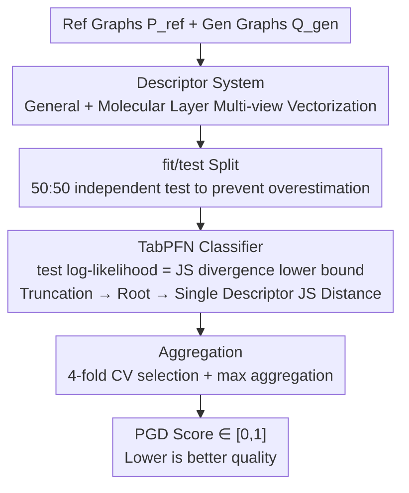

# PolyGraph Discrepancy: a classifier-based metric for graph generation

**Conference**: ICLR 2026  
**arXiv**: [2510.06122](https://arxiv.org/abs/2510.06122)  
**Code**: PolyGraph Open Source Library (mentioned in text, to be publicly released)  
**Area**: Graph Generative Model Evaluation  
**Keywords**: Graph Generation, Jensen-Shannon Distance, Classifier-based Evaluation, MMD, TabPFN

## TL;DR

Ours proposes PolyGraph Discrepancy (PGD), which approximates the variational lower bound of the Jensen-Shannon distance by training a classifier to distinguish between real and generated graphs. This approach solves three core problems: the lack of an absolute scale in MMD metrics, incomparability between different descriptors, and high bias/variance in small sample sizes.

## Background & Motivation

Graph generative models are increasingly important in fields such as drug discovery, social network modeling, and materials science, yet progress is constrained by inadequate evaluation methods. Current evaluation relies primarily on Maximum Mean Discrepancy (MMD) based on graph descriptors, which suffers from three fundamental flaws:

**Lack of an absolute scale**: The range of MMD is $[0, \infty)$, depending on the kernel function and feature scaling. Whether an MMD = 0.05 is good or poor is impossible to judge. Under a linear kernel, multiplying input features by an arbitrary scalar scales the MMD proportionally.

**Incomparability between descriptors**: MMD values calculated using degree histograms versus orbit counts are not on the same scale, making it impossible to determine which descriptor better distinguishes real from generated graphs.

**Severe small-sample issues**: Current mainstream benchmarks (Planar, SBM, Lobster) contain only 20-40 test graphs. At this scale, MMD estimates exhibit extreme bias and variance, leading to unreliable model rankings.

| Property | MMD | PGD |
|------|-----|-----|
| Range | $[0, \infty)$ | $[0, 1]$ |
| Absolute Scale | ✗ | ✓ |
| Comparable Descriptors | ✗ | ✓ |
| Multi-descriptor Aggregation | ✗ | ✓ |
| Unified Ranking | ✗ | ✓ |

## Method

### Overall Architecture

PGD reformulates "evaluating graph generation quality" as a classification problem: training a classifier to distinguish real graphs from generated ones. If the classifier distinguishes them easily, generation quality is poor; if it struggles, quality is good. Crucially, the classifier's log-likelihood on a test set is the variational lower bound of the Jensen-Shannon divergence—it naturally falls in the $[0,1]$ interval and holds for any classifier $D$. The tighter the fit, the closer the bound. The variational form is:
$$D_{\text{JS}}(P \| Q) = \sup_{D:\mathcal{X}\to[0,1]} \frac{1}{2}\mathbb{E}_{x\sim P}[\log_2 D(x)] + \frac{1}{2}\mathbb{E}_{x\sim Q}[\log_2(1-D(x))] + 1$$
The workflow is a direct chain: first, use a set of descriptors to vectorize graphs; for each descriptor, split real and generated graphs into fit/test halves; fit a TabPFN classifier on the fit half; compute the JS divergence lower bound using log-likelihood on the test half; finally, take the tightest (maximum) lower bound across all descriptors as the final PGD score.

### Key Designs

**1. Descriptor System: General + Domain-Specific dual layers to vectorize graphs**

Classifiers require vectors. The first step determines which perspectives characterize a graph—the more comprehensive the descriptors, the closer the JS distance estimate is to the true divergence. Ours designs two layers: the general layer includes degree histograms, clustering coefficient histograms, Laplacian spectra, 4/5-node orbit counts, and GIN embeddings; the molecular layer adds topological indices (BertzCT, Kappa, etc.), physicochemical parameters (Lipinski rules), Morgan fingerprints, and ChemNet/MolCLR learned representations. General descriptors ensure applicability to any graph, while molecular descriptors extend PGD to drug discovery, making the metric sensitive to domain-specific structures.

**2. fit/test Split: Using independent test sets for unbiased JS lower bound estimation**

Given a reference set $P_{\text{ref}}$, a generated set $Q_{\text{gen}}$, and a descriptor, training and evaluating a classifier on the same set causes overfitting and overestimation of the difference. PGD splits both sets (50:50): the fit set is used only to train the classifier, and the test set is used only to calculate log-likelihood. An independent test set ensures the log-likelihood is an unbiased lower bound estimate—easier classification translates to a larger lower bound, a larger JS distance, and a poorer generative model.

**3. TabPFN Classifier and JS Bound: Table-based Foundation Model for the tightest estimate**

The lower bound holds for any classifier, but to make it tight without hyperparameter tuning, ours selects TabPFN. It meets three requirements: it outputs class probabilities (required for log-likelihood), trains quickly, and has no hyperparameters (Transformer-based Bayesian in-context inference). This excludes deep networks (slow/tuning-intensive) and SVMs or Decision Trees (hard labels/no probabilities). After obtaining the test log-likelihood, it is truncated to $\max(\cdot, 0)$ to ensure non-negativity, followed by a square root to obtain the JS distance (since JS distance is a metric, while JS divergence is not). Experiments show TabPFN consistently provides tighter bounds than logistic regression due to its ability to model non-linear decision boundaries.

**4. Multi-descriptor Max Aggregation: Data-driven selection of the most discriminative perspective**

The most sensitive descriptor (degree, orbit, spectra, etc.) varies by dataset and perturbation type; no single descriptor is universally superior. When using $K$ descriptors, PGD performs 4-fold cross-validation on the fit set for each descriptor, selects the descriptor $d^\star$ with the highest average validation metric, then trains on the full fit set and evaluates on the test set using $d^\star$. Since each descriptor provides a lower bound, taking the maximum yields the tightest bound, representing the perspective that best distinguishes real from generated graphs.

### Loss & Training

PGD is an evaluation metric, not a generative model. "Training" refers to a single fit of the TabPFN classifier—as TabPFN is an in-context learner, this is an inference pass rather than gradient iteration. Key implementation details: 50:50 fit/test split, 4-fold CV for descriptor selection, JS bound truncation at $\max(\cdot, 0)$, and square root transformation to convert divergence to distance.

## Key Experimental Results

### Main Results

**MMD Bias and Variance Issues**

At common scales of 20-40 test graphs:
- Biased MMD estimates are severely affected by bias (magnitude differences).
- Unbiased MMD estimates still exhibit variance high enough to make model comparisons unreliable.
- Ours recommends using larger datasets (SBM-L, Planar-L, Lobster-L, each with 4096 samples).

**Correlation between PGD and Model Quality**

| Metric | Planar-L Correlation | SBM-L | Lobster-L |
|------|-----------------|-------|-----------|
| PGD | **99.52** | 88.07 | 89.32 |
| Orbit RBF | 73.49 | 51.05 | -34.81 |
| Degree RBF | 70.79 | 15.77 | -33.40 |
| Spectral RBF | 73.34 | 36.76 | -22.79 |
| Clustering RBF | 71.48 | 83.97 | 87.05 |
| GIN RBF | 82.78 | 14.12 | -30.31 |

The Pearson correlation between PGD and validity reaches 99.52% (Planar-L), significantly outperforming all MMD variants.

**Tracking Training Dynamics**

| Metric | Planar-L Spearman | SBM-L | Lobster-L |
|------|------------------|-------|-----------|
| Validity | 92.31 | 83.64 | 85.47 |
| **PGD** | **93.71** | **62.73** | **78.19** |
| Orbit RBF | 86.71 | 20.00 | -8.09 |
| Degree RBF | 41.96 | -19.09 | -4.66 |

PGD improves monotonically with training iterations, whereas MMD metrics exhibit instability or even negative correlation.

**Model Benchmarking** (PGD × 100, lower is better)

| Dataset | AutoGraph | DiGress | ESGG | GRAN |
|--------|-----------|---------|------|------|
| Planar-L | **34.0** | 45.2 | 54.2 | 65.1 |
| SBM-L | 30.3 | **23.7** | 35.1 | 50.1 |
| Lobster-L | **16.1** | 18.8 | 51.1 | 56.2 |
| Proteins | 72.5 | **68.2** | — | 73.3 |

### Ablation Study

| Configuration | Metric Effect | Description |
|------|---------|------|
| TabPFN vs LogReg | TabPFN consistently tighter | Advantage of non-linear decision boundaries |
| PGD-JS vs PGD-TV | PGD-JS is more robust | TV binarization threshold introduces noise |
| Sample size < 256 | High variance | PGD stabilizes at 256+ samples |
| Sample size > 256 | Stable | Mean and variance converge |
| Single vs max-aggregation | Aggregation is more robust | No single descriptor is optimal across all scenarios |

### Key Findings

1. **No single descriptor is universal**: The most discriminative descriptor varies by dataset and perturbation type, justifying the necessity of a multi-descriptor, data-driven selection strategy.
2. **Monotonic response to perturbations**: PGD increases monotonically with the degree of perturbation (edge removal/addition/rewiring/swapping), with Spearman correlation comparable to MMD.
3. **Unique value of edge-swapping perturbation**: Ours proposes a new perturbation (degree-preserving edge swapping) that MMD (degree and GIN-based) fails to detect, while PGD remains robust through its multi-descriptor strategy.
4. **Proteins dataset challenge**: PGD values are highest (~70), indicating that modeling protein graphs is the most difficult task.
5. **5-node orbit is a strong descriptor**: In model benchmarks, 5-node orbit counts frequently yield the highest PGD, identifying them as a previously underutilized descriptor.

## Highlights & Insights

1. **Theoretical Elegance**: Repurposes the adversarial training concept from GANs for evaluation—the classifier's log-likelihood provides a variational lower bound for JS distance.
2. **High Practical Value**: Absolute scale, descriptor comparability, and multi-descriptor aggregation solve three core pain points in graph generation evaluation.
3. **Big Data Initiative**: Through detailed bias/variance analysis, ours argues strongly that existing benchmarks (20-40 graphs) are insufficient for reliable evaluation and provides SBM-L/Planar-L/Lobster-L as alternatives.
4. **Molecular-specific Descriptors**: Extends the PGD framework to molecular graph evaluation with a descriptor system based on RDKit topological/physicochemical/fingerprint/learned representations.
5. **Open Source Contribution**: Commitment to release the PolyGraph library lowers the barrier to entry for the community.

## Limitations & Future Work

1. **Descriptor Dependence and Information Loss**: PGD operates on handcrafted descriptors; if the divergence of the descriptor distributions does not closely approximate the divergence of the graph distributions, PGD remains a loose lower bound.
2. **Max-aggregation Limitations**: Taking the maximum may not fully utilize complementary information from different descriptors. Future work could explore concatenating multiple descriptors as input to TabPFN.
3. **Sample Size Requirements**: PGD requires approximately 256+ samples for reliable estimation, which limits its use in data-scarce scenarios.
4. **TabPFN Feature Dimension Limits**: TabPFN recommends under 500 dimensions, requiring dimensionality reduction for high-dimensional descriptors.
5. **Unexplored Graph Types**: Validated only on undirected, unweighted, and molecular graphs; directed, weighted, temporal, and heterogeneous graphs require further verification.

## Related Work & Insights

- **MMD Framework** (You et al., 2018): The direct baseline. This work provides a detailed analysis of MMD variants (Gaussian TV, RBF, biased/unbiased).
- **Classifier Two-Sample Test** (Lopez-Paz & Oquab, 2017): The direct theoretical predecessor, using classifier performance as a statistic for two-sample testing.
- **TabPFN** (Hollmann et al., 2025): A foundation model for tabular data; PGD's practical utility depends on this model's robust performance.
- Evaluation metric design requires a balance between theoretical grounding and engineering feasibility; viewing evaluation problems through an information-theoretic lens often leads to more principled solutions.

## Rating

- Novelty: ⭐⭐⭐⭐ — Systematic application of C2ST in the graph domain; multi-descriptor aggregation is innovative despite known theoretical foundations.
- Experimental Thoroughness: ⭐⭐⭐⭐⭐ — Extremely detailed: perturbation experiments, training dynamics, model benchmarks, ablations, and comparisons with various MMD variants.
- Writing Quality: ⭐⭐⭐⭐⭐ — Clear structure, rigorous theoretical derivation, and informative visualizations.
- Value: ⭐⭐⭐⭐⭐ — Likely to become a new standard for graph generation evaluation, solving core problems that have long troubled the community.

<!-- RELATED:START -->

## Related Papers

- [\[ICLR 2026\] HOG-Diff: Higher-Order Guided Diffusion for Graph Generation](hog-diff_higher-order_guided_diffusion_for_graph_generation.md)
- [\[CVPR 2026\] C$^2$FG: Control Classifier-Free Guidance via Score Discrepancy Analysis](../../CVPR2026/image_generation/c2fg_control_classifier-free_guidance_via_score_discrepancy_analysis.md)
- [\[ICLR 2026\] GGBall: Graph Generative Model on Poincaré Ball](ggball_graph_generative_model_on_poincaré_ball.md)
- [\[ICLR 2026\] Generate Any Scene: Scene Graph Driven Data Synthesis for Visual Generation Training](generate_any_scene_scene_graph_driven_data_synthesis_for_visual_generation_train.md)
- [\[ICLR 2026\] Overshoot and Shrinkage in Classifier-Free Guidance: From Theory to Practice](overshoot_and_shrinkage_in_classifier-free_guidance_from_theory_to_practice.md)

<!-- RELATED:END -->
