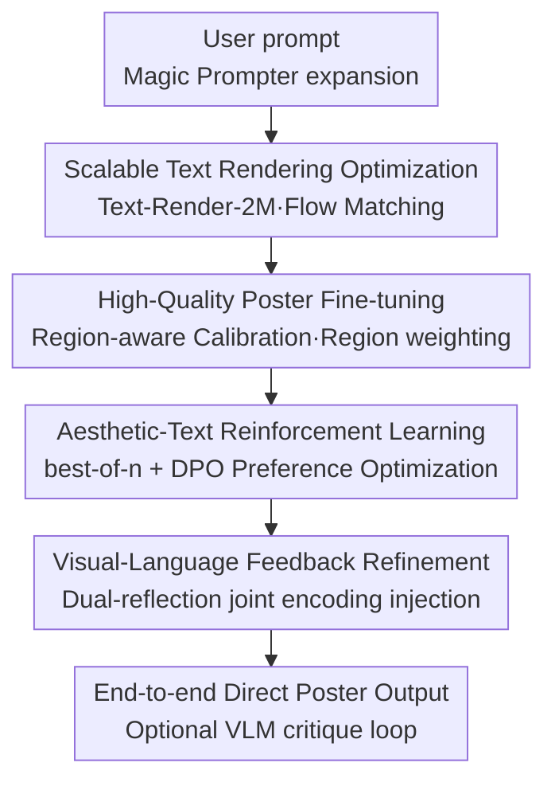

# PosterCraft: Rethinking High-Quality Aesthetic Poster Generation in a Unified Framework

**Conference**: ICLR 2026  
**OpenReview**: [https://openreview.net/forum?id=GhqnOEXQh3](https://openreview.net/forum?id=GhqnOEXQh3)  
**Code**: To be confirmed  
**Area**: Diffusion Models / Image Generation  
**Keywords**: Aesthetic Poster Generation, Text Rendering, Preference Optimization, Visual-Language Feedback, Unified Framework

## TL;DR
PosterCraft abandons the modular "VLM layout planning + separate background generation" paradigm. Instead, it employs a standard diffusion backbone (Flux-dev) through a four-stage cascaded training pipeline (text rendering optimization → high-quality poster fine-tuning → aesthetic-text reinforcement learning → visual-language feedback refinement). With specialized, automatically constructed datasets for each stage, it achieves end-to-end generation of posters with accurate text, coordinated layouts, and overall aesthetic appeal, approaching commercial closed-source systems in text metrics.

## Background & Motivation

**Background**: Aesthetic poster generation is more challenging than general "design graphic" generation. It simultaneously requires precise text rendering, impactful abstract artistic content, outstanding typography, and overall stylistic unity. Current mainstream approaches adopt a modular paradigm: first using a fine-tuned vision-language model (VLM) as a "layout planner" to suggest text content and positions, then overlaying these suggestions onto a separately generated background or treating them as hard constraints for a generation model.

**Limitations of Prior Work**: This decoupled design suffers from two major flaws. First is **aesthetic inconsistency**—text and background are produced in separate steps, breaking the visual and stylistic coherence essential for posters. Second is the **depressed upper bound of visual quality**—the entire pipeline heavily relies on the accuracy and robustness of the VLM; if the layout planning is poor, downstream generation cannot recover. Meanwhile, another class of end-to-end "design-centric" methods can only handle simple tasks like greeting cards or product posters, failing to support the visual and structural complexity of high-quality aesthetic posters.

**Key Challenge**: Modularization splits "text, artistic content, and layout" into several mutually unaware sub-problems, naturally sacrificing integrity. Conversely, while powerful base models (such as Flux) can generate complex natural images, they lack specialized large-scale poster data to unleash their potential—the **lack of data** and the **lack of a unified training paradigm** are mutually stagnating this field.

**Goal**: To allow a standard diffusion backbone to produce complete posters end-to-end without complex architectural modifications, integrating text accuracy, artistic content, and layout coordination simultaneously.

**Key Insight**: The authors argue that "component-level, incremental modifications are insufficient for a major aesthetic leap." Instead, the focus should shift to **workflow optimization**—injecting capabilities stage-by-stage through a carefully designed cascaded training process rather than restricting the model's expressive freedom with new modules or layout embedding constraints.

**Core Idea**: Replace "modular layout planning" with a "four-stage cascaded workflow + stage-specific automatically constructed datasets," unifying poster generation into a single inference pass where the base model itself learns to coordinate text and imagery.

## Method

### Overall Architecture

PosterCraft starts from the Flux-dev diffusion backbone and executes four training stages. Each stage addresses a specific bottleneck in poster generation and is supported by a specialized, automatically constructed dataset. Stage 1 focuses intensely on text rendering accuracy with 2 million samples. Stage 2 performs supervised fine-tuning on 100,000 high-quality posters using "region-aware calibration" to coordinate text and background. Stage 3 frames poster generation as a reinforcement learning problem, using best-of-n preference optimization to inject overall aesthetic preferences. Stage 4 introduces a visual-language feedback loop, allowing the model to iteratively refine outputs based on structured multimodal critiques. During inference, a user prompt is first expanded by an MLLM (Magic Prompter) with rich aesthetic cues, followed by the model generating the poster in a single pass, with an optional VLM critique loop for further enhancement. The key to the entire chain is that capabilities are "stacked stage-by-stage" while the backbone architecture remains largely unchanged.

### Key Designs

**1. Scalable Text Rendering Optimization: Solidifying "how to write" with massive high-quality text-inclusive data**

Text rendering is a long-standing difficulty due to two points: the scarcity of high-quality large-scale data with perfect text rendering, and the tendency of existing text data to have plain or low-quality backgrounds. The authors build **Text-Render-2M** using an automated pipeline—2 million samples where text is highly diverse in content, size, quantity, position, and rotation, cleanly rendered on high-quality backgrounds. Each sample includes precise captions seamlessly merged with original image descriptions. The backbone is fine-tuned using full-parameter flow matching loss:

$$\mathcal{L}^{\text{text}}_{\text{flow}}(\phi)=\mathbb{E}_{t\sim U(0,1),x_0,\varepsilon}\big\|v_\phi(x_t,t)-\dot{x}_t\big\|_2^2$$

Where $x_t=\alpha_t x_0+\sigma_t\varepsilon$ represents the forward noising trajectory and $\dot{x}_t$ is its time derivative, with $v_\phi$ predicting the velocity field. By leveraging "100% text accuracy + rich background diversity," the model simultaneously learns to render text correctly and aligned without losing background representation capability, fundamentally fixing the missing or garbled characters common in Flux baselines.

**2. Region-aware Calibration: Assigning different weights to text and non-text regions during fine-tuning to avoid conflict between "rendering text" and "drawing images"**

Since the first stage establishes text rendering ability, this stage shifts focus to overall poster style, with the difficulty being the harmony between text and background. The authors construct **HQ-Poster-100K**: after MD5 deduplication, an MLLM scorer (InternVL2.5-8B-MPO) filters out posters with large copyright/watermark info. Perceptual hashing removes visual near-duplicates, and Gemini2.5-Flash generates captions, followed by filtering with HPS scores (<0.25). Text region coordinates are extracted to create masks for major and minor text. The core mechanism is a pixel-wise weight map:

$$w(p)=\begin{cases}0.6 & p\in \text{major text mask}\\ 0.2 & p\in \text{minor text mask}\\ 1.0 & \text{other regions}\end{cases}$$

The weighted flow matching loss is $\mathcal{L}^{\text{poster}}_{\text{flow}}=\mathbb{E}\,\|(v_\phi(x_t,t)-\dot{x}_t)\odot w\|_2^2$. The intuition is: major text carrying core info receives medium weight to ensure clarity while blending; minor text, being prone to collapse, receives lower weight to avoid interfering with the whole; non-text regions defining visual style receive full weight. This ensures a smooth transition from high-quality imagery to unified aesthetic layouts while preserving text accuracy.

**3. Aesthetic-Text Preference Optimization: Upgrading "pixel-level text accuracy" to a global preference for "poster aesthetics" using best-of-n + DPO**

The first two stages ensure pixel-level fidelity and calibrated style but miss high-level trade-offs: layout balance, color harmony, and font coordination. The authors frame poster generation as an RL problem, constructing **Poster-Preference-100K**: 5 posters are generated per prompt for 20K prompts. HPSv2 scores are used to select preferred/rejected pairs. To ensure quality, Gemini2.5-Flash verifies text accuracy and stylistic consistency in preferred samples, retaining 6K pairs where "HPSv2 difference > 0.025 and preferred sample text is perfectly accurate." For each prompt, $n$ variants are sampled, and a best-of-n selection is performed using a combined aesthetic-text reward $R(x)$: $x^+=\arg\max_i R(x^{(i)})$, $x^-=\arg\min_i R(x^{(i)})$, followed by optimizing the DPO objective:

$$\mathcal{L}_{\text{RL}}(\theta)=-\mathbb{E}_c\Big[\log\sigma\big(\beta(\log\tfrac{p_\theta(x^+|c)}{p_{\text{ref}}(x^+|c)}-\log\tfrac{p_\theta(x^-|c)}{p_{\text{ref}}(x^-|c)})\big)\Big]$$

Since the marginal distribution $p_\theta(x_0|c)$ is intractable, the authors estimate log-ratio rewards using the ELBO of the diffusion chain. This step injects unified preference signals directly into diffusion training, encouraging the model to favor outputs that satisfy overall aesthetic standards rather than just "accurate denoising." Only LoRA (rank 64) is tuned.

**4. Visual-Language Feedback Refinement: Training "internal contrast + structured editing suggestions" as an inference-time multimodal reflection loop**

To repair residual defects in content and aesthetics, the authors construct **Poster-Reflect-120K**: the preference-learned model generates 6 posters per prompt (120K total). Gemini2.5-Flash selects the best poster meeting "prompt alignment, superior aesthetics, and correct text" as the target, producing 5 reflection pairs per group. Feedback is categorized into "content suggestions" and "aesthetic style optimization suggestions," specifically requiring the model to perform **internal contrast without explicitly referencing a second image**. Reflect VLM (Internvl3-8B) is fine-tuned using original captions and the to-be-optimized image as input, with Gemini-generated feedback as supervision. During inference, Gemini produces content reflection $f_c$ and style reflection $f_s$. Instead of appending these to the prompt, they are jointly encoded $e_{c,s}=E_t(f_c,f_s)$ and concatenated with the original prompt embedding $e_p$. A VAE-encoded image feedback $v_{\text{img}}$ is injected into a conditional branch, resulting in the multimodal condition $c=[e_p;\,e_{c,s};\,v_{\text{img}}]$. The model is fine-tuned with LoRA (rank 128) under conditional flow matching loss $\mathcal{L}^{VL}_{\text{flow}}(\theta)=\mathbb{E}\|v_\theta(x_t,t|c)-\dot{x}_t\|_2^2$.

### Loss & Training
All four stages are based on flow matching loss with different focuses: Stage 1 is standard full-parameter fine-tuning (300K steps on Text-Render-2M, Adafactor, lr=2e-6); Stage 2 is weighted flow matching (6000 steps on HQ-Poster-100K, Adafactor, lr=1e-5); Stage 3 is best-of-n DPO (n=5, AdamW, lr=1e-4, 1500 steps, LoRA rank 64); Stage 4 is conditional flow matching (T5-encoded reflections, LoRA rank 128, 6000 steps, AdamW, lr=1e-4). Refinement feedback generation utilizes a fine-tuned Internvl3-8B. The system is initialized from Flux-dev with mixed-precision training.

## Key Experimental Results

### Main Results
Evaluation used 100 random poster prompts from Gemini2.0-Flash-Gen (balanced length). OCR metrics were calculated using a SOTA VLM engine.

| Method | Text Recall ↑ | Text F-score ↑ | Text Accuracy ↑ |
|------|------|------|------|
| OpenCOLE (Open) | 0.082 | 0.076 | 0.061 |
| Playground-v2.5 (Open) | 0.157 | 0.146 | 0.132 |
| PosterMaker (Open) | 0.522 | 0.488 | 0.467 |
| BizGen (Open) | 0.689 | 0.661 | 0.641 |
| SD3.5 (Open) | 0.565 | 0.542 | 0.497 |
| Flux1.dev (Open, Base) | 0.723 | 0.707 | 0.667 |
| Ideogram-v2 (Closed) | 0.711 | 0.685 | 0.680 |
| BAGEL (Open) | 0.543 | 0.536 | 0.463 |
| Gemini2.0-Flash-Gen (Closed) | **0.798** | **0.786** | **0.746** |
| **PosterCraft (Ours)** | 0.787 | 0.774 | 0.735 |

PosterCraft significantly outperforms all open-source baselines and even closed-source Ideogram-v2, trailing only slightly behind Gemini2.0-Flash-Gen. User studies with 20 designers also confirmed it is superior to Flux1.dev and existing systems across multiple dimensions.

### Ablation Study
Stages were stripped individually while keeping other conditions constant.

| Configuration | OCR Accuracy | Human Preference | Description |
|------|---------|---------|------|
| Full Model | Highest | Highest | All four stages enabled |
| w/o Text Rendering Opt. | Significant Drop | Significant Drop | Loss of clarity and text fidelity |
| w/o Region-aware Calib. | Drop | Drop | Weakened stylistic coherence and text bias |
| w/o Aesthetic-Text RL | Drop | Drop | Poorer coordination between aesthetics and text |
| w/o Reflection Refine. | Drop | Drop | Lack of iterative multimodal guidance |

### Key Findings
- Removing any of the four stages leads to a continuous decline in both OCR accuracy and human preference, validating the "stage-by-stage capability stacking" motivation.
- Text rendering optimization is most critical for "writing correctly"—it ensures legibility and preserves visual quality via diverse backgrounds.
- Region-aware calibration is valuable for adapting to spatial context; without it, visual coherence in complex posters weakens.

## Highlights & Insights
- **"Data + Workflow" over "Architecture"**: Capability is injected via four specialized datasets rather than changing the backbone. This is engineering-friendly and suggests that the potential of strong base models is mainly limited by the lack of appropriate data and training paradigms.
- **Pixel-wise weight map is a lightweight yet effective trick**: Using three levels of weights (0.6/0.2/1.0) resolves the tension between text rendering and aesthetic imagery.
- **Reflection feedback with "internal contrast"**: By strictly aligning training and inference inputs (no reference poster in both), it avoids the distribution shift of "seeing the answer during training but not during inference."
- **Multimodal condition injection**: Concatenating joint embeddings of reflections and using VAE-encoded image feedback in conditional branches avoids encoder length limits.

## Limitations & Future Work
- The entire pipeline heavily relies on external strong models as "judges/annotators," causing the performance ceiling to be bound by these models and introducing potential preference biases.
- Text metrics still slightly lag behind Gemini2.0-Flash-Gen; the gap with the strongest commercial systems is not yet fully closed.
- Cascaded training is costly (300K full steps for Stage 1), and each stage requires large-scale specialized datasets, leading to high replication thresholds.
- HQ-Poster-100K contains third-party materials; while handled under fair use for research, commercial implementation faces copyright constraints.

## Related Work & Insights
- **vs Modular VLM Planning (PosterLLaMA / POSTA)**: These use VLMs for layout planning followed by modular components; PosterCraft is end-to-end, avoiding aesthetic inconsistency and VLM bottlenecks.
- **vs Two-phase Text Rendering (TextDiffuser / DesignDiffusion)**: These rely on OCR masks or rigid layout constraints; PosterCraft integrates text, art, and layout into a single inference pass for higher complexity.
- **vs Unified Transformer Generation (TransFusion / JanusFlow)**: These generate images and text tokens in one architecture; PosterCraft releases the potential of standard diffusion backbones through workflow optimization, maintaining compatibility.

## Rating
- Novelty: ⭐⭐⭐⭐ Solid paradigm shift substituting modular planning with unified workflows and specialized datasets.
- Experimental Thoroughness: ⭐⭐⭐⭐ Robust comparison with 7+ models and comprehensive ablation, though evaluations are somewhat concentrated on specific prompt sets.
- Writing Quality: ⭐⭐⭐⭐ Clear explanation of the motivation-data-mechanism link for all four stages.
- Value: ⭐⭐⭐⭐ Significant practical and data value for aesthetic poster generation.

<!-- RELATED:START -->

## Related Papers

- [\[ICLR 2026\] Scaling Group Inference for Diverse and High-Quality Generation](scaling_group_inference_for_diverse_and_high-quality_generation.md)
- [\[ICLR 2026\] UniCalli: A Unified Diffusion Framework for Column-Level Generation and Recognition of Chinese Calligraphy](unicalli_a_unified_diffusion_framework_for_column-level_generation_and_recogniti.md)
- [\[ICLR 2026\] Safety-Guided Flow (SGF): A Unified Framework for Negative Guidance in Safe Generation](safety-guided_flow_sgf_a_unified_framework_for_negative_guidance_in_safe_generat.md)
- [\[ICLR 2026\] PQGAN: Product-Quantised Image Representation for High-Quality Image Synthesis](pqgan_product-quantised_image_representation_for_high-quality_image_synthesis.md)
- [\[ECCV 2024\] A High-Quality Robust Diffusion Framework for Corrupted Dataset](../../ECCV2024/image_generation/a_highquality_robust_diffusion_framework_for_corrupted_datas.md)

<!-- RELATED:END -->
