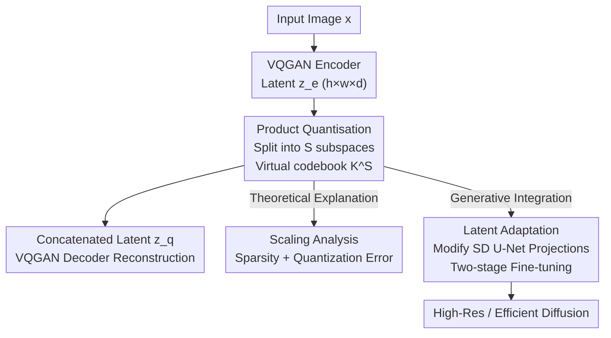

# PQGAN: Product-Quantised Image Representation for High-Quality Image Synthesis

**Conference**: ICLR 2026  
**OpenReview**: [https://openreview.net/forum?id=D8oqcochgq](https://openreview.net/forum?id=D8oqcochgq)  
**Code**: To be confirmed  
**Area**: Image Generation / Discrete Representation / Diffusion Models  
**Keywords**: Product Quantisation, image tokenizer, VQGAN, latent space representation, Stable Diffusion

## TL;DR
PQGAN integrates classic Product Quantisation (PQ) into the quantization module of VQGAN, partitioning each latent vector into $S$ subspaces for individual quantization. This constructs an exponentially large "virtual codebook" via combinations of small sub-codebooks. It improves ImageNet reconstruction PSNR from 27 dB to 37.4 dB and reduces FID to 0.036, outperforming even continuous VAEs. Furthermore, it can be directly integrated into pre-trained diffusion models to double resolution or achieve several-fold speedups.

## Background & Motivation
**Background**: Modern image generation almost exclusively operates in the low-resolution latent space of autoencoders to save computational costs. The discrete path, pioneered by VQ-VAE/VQGAN, learns a codebook and replaces each latent "pixel" with its nearest codebook entry. This converts the latent space into a discrete index space, where the storage cost depends only on spatial resolution and codebook size, rather than vector dimension, benefiting both autoregressive generation and image compression.

**Limitations of Prior Work**: Standard Vector Quantization (VQ) struggles to learn effectively in high-dimensional latent spaces. Because all $d$ dimensions of a codebook entry are **jointly** quantized (a single nearest neighbor search determines all dimensions), the training signals become sparse and entangled. This leads to codebook collapse, slow convergence, and redundancy among entries (where only some dimensions differ). Consequently, as codebook size or dimensionality increases, training becomes harder, and reconstruction fidelity stagnates.

**Key Challenge**: VQ couples representational capacity (high-dimensional, large codebooks) with trainability (dense supervision signals, low quantization error) within the same high-dimensional codebook. Classic quantization theory states that for $K$ centroids in a $d$-dimensional space, the quantization error scales at $O(K^{-2/d})$. Maintaining low error in high dimensions would require an impractical exponential expansion of the codebook.

**Goal**: The objective is to find a discretization scheme that enjoys the representational power of high-dimensional latent spaces without being crippled by sparse training signals and quantization errors, while keeping the VQGAN architecture and training pipeline unchanged. The paper also aims to verify if this scheme can be seamlessly integrated into existing large diffusion models.

**Key Insight**: The authors revisit Product Quantisation (PQ) from 2010, which decomposes high-dimensional vectors into several low-dimensional subspaces for separate quantization. While PQ was previously under-explored in compression or autoregressive scenarios due to the need to store $S$ indices or tackle the combinatorial explosion of the joint codebook, the authors observe that **decoders in diffusion/flow models operate directly on the latent space and do not require explicit autoregressive index decomposition**. This unlocks the full potential of PQ.

**Core Idea**: Replace the single high-dimensional codebook in VQ with Product Quantisation, where latent vectors are split into $S$ independent subspaces, each with a small sub-codebook. This results in a virtual codebook of combinatorial size $K^S$, providing dense training signals and constant quantization error.

## Method

### Overall Architecture
The PQGAN framework fully adopts the encoder, decoder, perceptual reconstruction loss, and adversarial loss of VQGAN (Esser 2021). **The only modification is replacing the central vector quantization module with product quantization**. This isolates the "gains brought by PQ" for controlled comparison. Given an RGB image $x\in\mathbb{R}^{H\times W\times 3}$, the encoder compresses it into $z_e\in\mathbb{R}^{h\times w\times d}$ ($h=H/F$, where $F$ is the downsampling factor, and each spatial position is a $d$-dimensional latent "pixel" $p_\ell$). VQ would quantize the entire $p_\ell$ using a codebook of size $K$. PQ first splits $p_\ell$ along the channel dimension into $S$ segments, each of dimension $d/S$, independently finds the nearest neighbor for each segment in its own small sub-codebook $C^{(s)}$, and concatenates them back for reconstruction.

Furthermore, the paper integrates this quantized latent space into Stable Diffusion 2.1. By only modifying the channel width of the first and last convolutional layers of the U-Net to match the high-dimensional latent representation, the authors freeze the backbone to train the projections first, followed by a full unfreezing for fine-tuning. This allows large diffusion models to sample directly in the PQ latent space.

### Key Designs

**1. Product Quantisation Replacement: Exponential Virtual Codebook via Subspace Decomposition**

This design directly addresses the difficulty of learning high-dimensional single codebooks. PQ splits each latent pixel $p_\ell\in\mathbb{R}^d$ into $S$ disjoint subspaces $p_\ell=[p_\ell^{(1)},\dots,p_\ell^{(S)}]$ (each $p_\ell^{(s)}\in\mathbb{R}^{d/S}$) and learns a separate codebook $C^{(s)}=\{e_1^{(s)},\dots,e_K^{(s)}\}$ for each. Crucially, because entries from different subspaces can be **recombined freely**, PQ defines a "virtual codebook" of size $K^S$ without needing to explicitly store or learn these combinations. Consequently, each sub-codebook remains small (e.g., $K=128\sim 512$), while the collective representational power is immense. VQ ($S=1$) and Scalar Quantization ($S=d$) are special cases of PQ. The training objective follows VQGAN:

$$L_{PQ}=\lVert z_e-\mathrm{sg}(z_q)\rVert_2^2+\beta\lVert \mathrm{sg}(z_e)-z_q\rVert_2^2+L_{rec}+\lambda_{adv}L_{GAN}$$

Where $\mathrm{sg}(\cdot)$ is the stop-gradient operator, $z_q$ is the quantized latent, $L_{rec}$ is the perceptual loss, and $L_{GAN}$ is the adversarial loss. All components are inherited from VQGAN except for the quantization mechanism.

**2. Scaling Law Analysis: Why VQ and PQ Behave Oppositely with Dimensionality**

The authors provide two theoretical explanations for PQ's superiority. First, **Training Signal Sparsity / Sample Efficiency**: VQ learns in an entangled $d$-dimensional space where the samples required to cover a resolution $\epsilon$ grow exponentially at $O((1/\epsilon)^d)$, leaving centroids with minimal supervision in high dimensions. PQ splits the space into $S=d/2$ 2D subspaces, each requiring only $O((1/\epsilon)^2)$ samples regardless of the total dimension, keeping sample density constant as $d$ increases. Second, **Quantization Error Scaling**: According to Zador (1982), the mean squared quantization error scales at $O(K^{-2/d})$. VQ needs an exponentially larger codebook to maintain error as dimensions rise. PQ quantizes in fixed low-dimensional subspaces ($d/S=2$), keeping the error constant at $O(K^{-2/2})=O(K^{-1})$. Together, these imply that **increasing dimensionality degrades VQ but benefits PQ**, explaining why PQ can thrive in high-dimensional latent spaces.

**3. Latent Space Adaptation: Integrating PQ into Pre-trained Diffusion Models**

The authors correct a common misconception in diffusion generation: "Latent representations must be low-dimensional to be efficient." They point out that in a diffusion U-Net, the attention layers cause computational complexity to grow quadratically with **spatial resolution**, making spatial size the bottleneck, not the channel dimension. Thus, "low spatial resolution, high channel dimension" latents are viable. To implement this, they identified the fixed 4→512 and 512→4 projections at the U-Net's input and output as artificial bottlenecks. By widening only these two convolutional layers and reusing pre-trained weights for the rest, they enable PQ integration. Training occurs in two stages: first, freezing the model to train the new projections for 20k steps, then unfreezing the entire model for standard diffusion fine-tuning for ~1M steps:

$$L=\mathbb{E}_{z_0,t,c_t,\epsilon\sim\mathcal{N}(0,1)}\big[\lVert\epsilon-\epsilon_\theta(z_t,t,c_t)\rVert_2^2\big]$$

This adaptation allows for either doubling the output resolution (PQSD-HR: 1536×1536 at the cost of SD 768×768) or up to a 4x speedup at the same resolution (PQSD-Quick) without the artifacts common in standard SD-VAE.

### Loss & Training
The quantization stage uses the VQGAN composite loss (codebook + commitment + perceptual + adversarial), where $\beta$ is the commitment weight. Models are trained on ImageNet 256×256 for 1M steps with a batch size of 20. The diffusion adaptation uses the standard $\epsilon$-prediction objective, starting with 20k steps for projections followed by 1M steps of full fine-tuning. High-res variants are further fine-tuned at 768×768 for 200k steps with batch size 15, gradually increasing the resolution.

## Key Experimental Results

### Main Results
Reconstruction comparison on ImageNet 256×256 validation set (selected, ↑ better / ↓ better):

| Method | Quant. | $F$ | $d$ | $K$ | PSNR↑ | rFID↓ | CMMD↓ | LPIPS↓ |
|------|------|-----|-----|-----|-------|-------|-------|--------|
| VQGAN (Esser 2021) | VQ | 16 | 256 | 16384 | 19.7 | 4.98 | 0.422 | 0.1633 |
| VQGAN-LC | VQ | 8 | 4 | 100000 | 27.0 | 1.29 | 0.080 | 0.0712 |
| Mo-VQGAN | MCQ | 16 | 256 | 1024 | 22.4 | 1.12 | - | 0.1132 |
| SDv2.1 VAE | KL (Cont.) | 8 | 4 | - | 25.3 | 0.75 | 0.133 | 0.0610 |
| SDXL VAE | KL (Cont.) | 8 | 4 | - | 25.3 | 0.74 | 0.148 | 0.0573 |
| **PQGAN (Ours)** | **PQ** | 16 | 128 | 128 | 28.3 | 0.41 | 0.094 | 0.0304 |
| **PQGAN (Ours)** | **PQ** | 8 | 128 | 512 | **37.4** | **0.036** | **0.011** | **0.0024** |

PQGAN achieves a PSNR of 37.4 dB at $F=8$, significantly outperforming all discrete and continuous baselines. Even at $F=16$ (half spatial resolution), it outperforms $F=4$ competitors using 16x more latent pixels. Notably, it uses small codebooks (128~512), whereas VQGAN-LC requires 100k+ entries to compete.

In transferability (FFHQ / LSUN, $F=8$), PQGAN remains the strongest, reaching 42.1 dB PSNR on FFHQ, showing stable performance under domain shift.

Diffusion Integration (A100, 50 steps, single sample):

| Generator | Image Size | Latent Res | $F$ | $d$ | Samples/s↑ | VRAM(GB)↓ |
|-----------|------------|------------|-----|-----|------------|-----------|
| SDv2.1 | 768² | 96² | 8 | 4 | 0.116 | 14.9 |
| PQSD-HR (Ours) | **1536²** | 96² | 16 | 128 | 0.112 | 14.9 |
| PQSD-Quick (Ours) | 768² | 48² | 16 | 128 | **0.465** | **7.7** |

PQSD-HR doubles resolution at the same cost, while PQSD-Quick offers a ~4x speedup with halved VRAM usage.

### Ablation Study
The core ablation focuses on "product space configuration," scanning $d\in\{4,\dots,256\}$, $S\in\{1,d/2,d/4,d/8,d\}$, and $K\in\{128,\dots,16384\}$.

| Variable | Findings | Description |
|----------|----------|-------------|
| Increasing $d$ (VQ, $S=1$) | FID degrades | VQ cannot scale with dimensionality |
| Increasing $d$ (PQ, $S>1$) | FID improves | PQ exhibits inverse scaling |
| Increasing subspaces $S$ | Consistent improvement | Saturates near $S=d/2$ |
| Increasing codebook $K$ | Weak correlation | FID is primarily driven by $S$, not $K$ |

### Key Findings
- **$S$ (number of subspaces) is the most critical knob**. Increasing $S$ consistently improves performance until saturating around $S=d/2$. FID is relatively insensitive to codebook size $K$, meaning small codebooks with high decomposition can beat massive-codebook VQ configurations.
- **Inverse scaling of VQ and PQ**: As $d$ increases, VQ performance degrades while PQ performance improves, validating the theory regarding training signal sparsity and quantization error.
- **Codebook Utilization**: Measured by normalized entropy $H_n$ and perplexity $P_n$, PQ maintains $H_n > 0.8$ even with $K=16384$, indicating full and uniform utilization, whereas VQ usage is sparse.
- **Overhead**: Codebook matching time grows linearly with $S$. The quantization overhead in the best PQ autoencoder accounts for about 50% of the total wall-clock time compared to removing the matching step, which is the primary constraint.

## Highlights & Insights
- **"Old Method + New Context"**: PQ is a classic technique from 2010. The author's insight is that diffusion decoders bypass the need for explicit index decomposition, removing the constraints that hampered PQ in compression/autoregressive tasks and allowing its representational power to fully shine.
- **Theoretical-Empirical Loop**: The work doesn't just chase benchmarks; it uses sample complexity $O((1/\epsilon)^d)$ and quantization error $O(K^{-2/d})$ to **predict** the inverse scaling of VQ vs PQ, which is then empirically verified.
- **Efficiency Realization**: The insight that "spatial resolution is the bottleneck, not channel dimension" for attention-heavy diffusion models is broadly applicable to generative modeling for optimizing latent efficiency.
- **Near-Zero Cost Integration**: Modifying only the U-Net's first and last projections makes it a highly user-friendly drop-in replacement for pre-trained SD models.

## Limitations & Future Work
- **Author-identified Limitations**: Quantization overhead grows linearly with $S$. In high-dimensional settings, searching sub-codebooks adds ~50% wall-clock time, limiting practical throughput.
- The advantages of PQ strictly depend on the fact that diffusion/flow decoders do not require autoregressive indices. Outside of this context, PQ's utility is limited.
- **Observed Limitations**: Evaluation is mostly focused on ImageNet, FFHQ, and LSUN. While rFID/CMMD are useful, they are global statistics. The end-to-end evaluation of text-to-image quality (beyond reconstruction) is relatively sparse.
- **Future Directions**: Exploring approximate nearest neighbor (ANN) or shared sub-codebooks to reduce matching costs, and investigating adaptive allocation of $S$, $d$, and $K$.

## Related Work & Insights
- **vs VQGAN / VQ-VAE**: These use a single high-dimensional codebook, leading to sparse signals and degradation as dimensions rise. PQ partitions the space, densifying signals and decoupling error from total dimension.
- **vs Residual/Hierarchical Quantization (RQ-VAE)**: These are incremental patches that still suffer from high-dimensional sparsity. PQ provides a more fundamental structural decomposition.
- **vs Multi-Channel Quantization (Mo-VQGAN/MCQ)**: MCQ splits along channels but uses a **shared joint** codebook, limiting expressivity. PQ uses independent sub-codebooks for a $K^S$ virtual capacity.
- **vs Continuous KL-VAE (SD/SDXL VAE)**: While continuous latents were long considered the upper bound for reconstruction, PQGAN is a rare case where discrete quantization **outperforms** continuous VAEs across PSNR/rFID/LPIPS while using lower spatial resolution.

## Rating
- Novelty: ⭐⭐⭐⭐⭐ Unlocking classic PQ for diffusion latents and revealing the inverse scaling law.
- Experimental Thoroughness: ⭐⭐⭐⭐⭐ Comprehensive hyperparameter scans, SOTA comparisons, and real-world diffusion integration.
- Writing Quality: ⭐⭐⭐⭐ Clear motivation and closed-loop theory, though some graph details require referring to the appendix.
- Value: ⭐⭐⭐⭐⭐ Drastic increase in fidelity and drop-in compatibility for SD; high practical value for high-res generation.

## Related Papers

- [\[ICLR 2026\] Latent Wavelet Diffusion for Ultra-High-Resolution Image Synthesis](latent_wavelet_diffusion_for_ultra_high-resolution_image_synthesis.md)
- [\[ICLR 2026\] Localized Concept Erasure in Text-to-Image Diffusion Models via High-Level Representation Misdirection](localized_concept_erasure_in_text-to-image_diffusion_models_via_high-level_repre.md)
- [\[ICLR 2026\] Scaling Group Inference for Diverse and High-Quality Generation](scaling_group_inference_for_diverse_and_high-quality_generation.md)
- [\[ICLR 2026\] Product of Experts for Visual Generation](product_of_experts_for_visual_generation.md)
- [\[ICLR 2026\] PosterCraft: Rethinking High-Quality Aesthetic Poster Generation in a Unified Framework](postercraft_rethinking_high-quality_aesthetic_poster_generation_in_a_unified_fra.md)

<!-- RELATED:END -->

<!-- RELATED:START -->

## Related Papers

- [\[ICLR 2026\] Latent Wavelet Diffusion for Ultra-High-Resolution Image Synthesis](latent_wavelet_diffusion_for_ultra_high-resolution_image_synthesis.md)
- [\[ICLR 2026\] Localized Concept Erasure in Text-to-Image Diffusion Models via High-Level Representation Misdirection](localized_concept_erasure_in_text-to-image_diffusion_models_via_high-level_repre.md)
- [\[ICLR 2026\] Scaling Group Inference for Diverse and High-Quality Generation](scaling_group_inference_for_diverse_and_high-quality_generation.md)
- [\[ICLR 2026\] Product of Experts for Visual Generation](product_of_experts_for_visual_generation.md)
- [\[ICLR 2026\] PosterCraft: Rethinking High-Quality Aesthetic Poster Generation in a Unified Framework](postercraft_rethinking_high-quality_aesthetic_poster_generation_in_a_unified_fra.md)

<!-- RELATED:END -->
