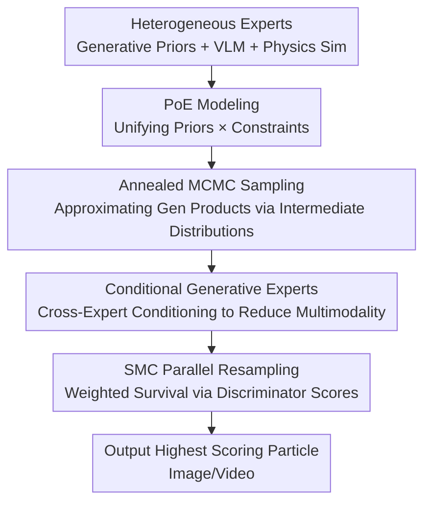

# Product of Experts for Visual Generation

**Conference**: ICLR 2026  
**OpenReview**: [https://openreview.net/forum?id=dTYbqgvZmc](https://openreview.net/forum?id=dTYbqgvZmc)  
**Code**: [Project Page](https://product-of-experts.github.io/)  
**Area**: Diffusion Models / Controllable Visual Generation / Inference-time Model Composition  
**Keywords**: Product of Experts, Annealed MCMC, Sequential Monte Carlo, Heterogeneous Model Composition, Controllable Generation

## TL;DR
This paper unifies controllable image/video generation as a "sampling problem from a product distribution of multiple heterogeneous expert models"—treating generative models as priors, discriminative models (VLMs) as soft constraints, and physics simulators as hard constraints. By utilizing "Annealed MCMC + SMC Resampling" during inference without retraining, the approach achieves superior controllability and fidelity compared to single large-scale models.

## Background & Motivation

**Background**: Modern image/video generation models (diffusion, autoregressive video models) exhibit high fidelity in appearance but struggle to simultaneously "strictly follow complex text instructions," "conform to physical laws," and "precisely place the pose/trajectory of specific objects." Meanwhile, the community has developed numerous specialized models: VLMs for semantic alignment, physics simulators for motion dynamics, and depth/inpainting models for local constraints.

**Limitations of Prior Work**: Incorporating these heterogeneous sources of knowledge into a single model usually requires either training an omnipotent large model (consuming text, visual corpora, and simulation trajectories), which is prohibitively expensive, or using "reward steering." However, mainstream approaches (gradient guidance, CFG, or SMC-based reward steering) typically require differentiable rewards or dense gradients. Furthermore, multiplying generative experts often involves calculating **path-wise importance weights**, leading to **weight degeneracy** where a few particles dominate the weights as the sampling path lengthens.

**Key Challenge**: Each expert only "excels at a subset of constraints," and no single expert is sufficient. Sampling from samples that **simultaneously** satisfy all constraints is essentially sampling from the "product of multiple distributions." The high-probability region of such a product distribution is often a narrow intersection of all experts, making direct rejection sampling in high dimensions nearly impossible with an acceptance rate approaching zero.

**Goal**: To solve two sub-problems: (1) How to efficiently sample from the product of heterogeneous generative experts (diffusion/flow + autoregressive models); (2) How to incorporate non-differentiable discriminative experts (VLMs, physical constraints) that only provide scalar scores.

**Key Insight**: Reformulate "model composition" as the classical **Product of Experts (PoE)** framework in probability. Generative models are represented as data priors $p^{(i)}(x)$, and discriminative models are represented as unnormalized distributions $q^{(j)}(x)=\exp(r^{(j)}(x))$ via Boltzmann transformation of reward functions $r^{(j)}(x)$. The product distribution naturally assigns high probability only to samples that satisfy all constraints simultaneously.

**Core Idea**: Replace infeasible rejection sampling with **Annealed Importance Sampling (AIS) + Sequential Monte Carlo (SMC)**. Annealing allows sampling to gradually approach the target product distribution from an easily sampled smooth distribution. A per-timestep MCMC kernel maintains the intermediate distribution (avoiding weight accumulation and thus bypassing weight degeneracy), while SMC resampling injects discriminative expert scores into the particle population.

## Method

### Overall Architecture

The goal is to sample from the product distribution of all experts:

$$x \sim p(x) \propto \prod_{i=1}^{N} p^{(i)}(x) \prod_{j=1}^{M} q^{(j)}(x),$$

where $p^{(i)}$ are generative experts (flow/diffusion or autoregressive), and $q^{(j)}=\exp(r^{(j)})$ are soft distributions derived from discriminative experts (VLM scores, physical constraints). As direct sampling is infeasible, the proposed approach employs "**Anneal + Particles**": maintaining $L$ particles, starting from an easily sampled initial distribution $p_T$, and gradually annealing through a sequence of intermediate distributions $\{p_t\}_{t=T}^{1}$ toward the target distribution $p_1$. At each annealing layer, MCMC is first applied to each particle to move it into the high-probability region of the **generative expert product**, followed by weighted resampling based on the scores of the **discriminative expert product**. Finally, the particle with the highest discriminative score is selected as the output.

The pipeline only requires **black-box access** to discriminators (knowing the scalar score without gradients), allowing non-differentiable/scalar constraints like VLMs and physical losses to be directly integrated.

### Key Designs

**1. Unified PoE Modeling of Product Distributions: Integrating Heterogeneous Models**

The pain point is that heterogeneous models "speak different languages"—generative models provide distributions, VLMs provide scalar scores, and physics simulators provide rendered images. PoE unifies them: generative experts are priors $p^{(i)}(x)$; discriminative scalar rewards $r^{(j)}(x)$ become unnormalized probabilities via the Boltzmann distribution $q^{(j)}(x):=\exp(r^{(j)}(x))$; and physics simulators are formulated as Gaussians centered on simulations $c_{\text{sim}}$, i.e., $p_{\text{sim}}(x)\propto\exp(-w\|x-c_{\text{sim}}\|_2^2)$. The key benefit is that the product distribution assigned high probability only to samples that satisfy all experts simultaneously, automatically combining constraints like "text following + physical consistency + precise pose" via **intersection** rather than manual rules or retraining.

**2. Annealed MCMC + Per-timestep Invariant Kernel: Sampling Generative Products without Weight Degeneracy**

Directly running MCMC on the product distribution suffers from slow mixing due to "local refinement," requiring exponential time to find high-likelihood samples. The method introduces AIS by constructing a sequence of distributions $p_t(x)\propto\prod_i p_t^{(i)}(x)$, where $p_T$ is smooth and $p_1$ is the target. For flow models, $p_t^{(i)}$ is the discretized probability path of the velocity field $v_t^{(i)}$; the transition $K_{t\leftarrow t+1}$ is an Euler ODE step, and $K_t$ is Langevin dynamics under the combined score $\sum_i\nabla_x\log p_t^{(i)}$. Unlike prior "path-wise importance weight" methods, this approach uses an **MCMC kernel that keeps $p_t$ invariant at each step**, avoiding the accumulation of importance weights and preventing degeneracy regardless of path length.

**3. Conditional Generative Experts: Mitigating Multimodality via Mutual Awareness**

Even with annealing, multimodality in individual experts $p^{(i)}(x)$ can slow MCMC convergence. The method makes experts **conditionally dependent** on regions handled by other experts: $p(x)\propto\prod_i p^{(i)}(x_i\mid x_{\text{pa}(i)})$. For flow models, this is implemented by adding an alignment term to the velocity field toward the parent region's predicted flow:

$$v_t^{(i)}(x_i\mid x_{i'}) \approx v_t^{(i)}(x_i) - w\sum_{i'\in\text{pa}(i)}\nabla_{x_i}\big\|v_t^{(i)}(x_i)-\text{stopgrad}\big(v_t^{(i')}(x_{i'})\big)\big\|_2^2.$$

Allowing experts to "reference" other experts' current predictions significantly reduces multimodality in $p^{(i)}$, making MCMC more efficient. Removing this ("No Cond") leads to a noticeable drop in foreground fidelity and visual coordination.

**4. SMC Parallel Resampling: Injecting Black-box Discriminative Experts**

To include discriminative experts into the full product, standard importance sampling (sampling $L$ particles from the generative product and weighting them by discriminative likelihood) would be biased due to correlated MCMC samples. Instead, **Parallel SMC** is used: keeping $L$ particles throughout, running MCMC at each annealing layer, and then performing weighted resampling based on the discriminative product likelihood $\sum_j r_t^{(j)}(x^{(l)})$. Since noisy flow samples are OOD for VLMs, intermediate scores are defined on the **predicted clean sample** $\hat x$: $r_t^{(j)}(x)=r^{(j)}(\hat x)$. Increasing the particle count $L$ directly improves quality.

### Loss & Training

The method is **training-free**: it involves no new parameters and only schedules pre-trained experts during inference (FLUX.1 Depth/Fill, Wan2.1, FramePack, various VLMs, physics simulators). Key hyperparameters include annealing length $T$, particle count $L$, MCMC steps $K$ per layer, and weights $w$ for conditioning and physical Gaussians.

## Key Experimental Results

### Main Results

**Image Object Insertion** (Inserting 3D assets with specific poses from a graphics engine + text material descriptions). Generative experts: FLUX.1 Depth (pose) + FLUX.1 Fill (realism).

| Setting | Method | Background MSE↓ | Foreground LPIPS↓ | GPT-4o Controllability↑ | ImageReward↑ |
|------|------|-----------|-------------|----------------|--------------|
| Graphics Engine Input | RF-Solver | 1.619 | 0.178 | 0.518 | 0.948 |
| Graphics Engine Input | Ours No Cond | 1.511 | 0.065 | 0.727 | 1.142 |
| Graphics Engine Input | **Ours** | **1.429** | **0.065** | **0.827** | **1.175** |
| Magic Insert | SDEdit | 0.968 | 0.026 | 0.744 | 1.640 |
| Magic Insert | **Ours** | **0.365** | 0.064 | **0.818** | **1.711** |

Ours leads across all controllability metrics (GPT-4o, Foreground LPIPS): baselines either fail to follow poses due to imprecise prompts or destroy the background due to global noise, whereas Ours preserves both background and foreground geometry.

**Physics-Guided Video Generation** (Generating videos aligned with object motion from a physics simulator).

| Setting | Method | Foreground IoU↑ | GPT-4o Controllability↑ | GPT-4o Semantic Align↑ | ViCLIP↑ |
|------|------|-----------|----------------|------------------|---------|
| Object-level Sim | Depth2V | 0.787 | 0.650 | 0.775 | 0.261 |
| Object-level Sim | Image2V | 0.321 | 0.708 | 0.788 | 0.255 |
| Object-level Sim | **Ours** | 0.739 | **0.708** | **0.842** | **0.270** |
| Full-scene Sim (PhysGen3D) | Depth2V | – | 0.550 | 0.788 | 0.242 |
| Full-scene Sim (PhysGen3D) | **Ours** | – | **0.587** | **0.825** | – |

Single Depth2V/Traj2V models often use "camera upward motion" to compensate for falling objects (misaligning motion), while Image2V ignores motion entirely. Ours maintains both foreground motion and natural non-foreground synthesis through expert composition.

### Ablation Study

| Config | Key Metric | Description |
|------|---------|------|
| Ours (Full) | GPT-4o Control 0.827 / FG LPIPS 0.065 | Full model |
| w/o Conditional Sampling (No Cond) | GPT-4o Control 0.727 / LPIPS 0.065 | Accuracy and coordination drop without Expert Conditioning |
| Particle Count L=1 | VQAScore 0.567 | Degenerates to Du et al. (2023), equivalent to no SMC |
| Particle Count L=8 | VQAScore 0.879 | Medium budget |
| Particle Count L=32 | VQAScore 0.904 / mIoU 0.728 | Large budget, monotonically optimal |

### Key Findings
- **Conditional Sampling is Essential**: Removing inter-expert conditioning (No Cond) maintains some foreground fidelity but causes visual coordination and GPT-4o controllability to drop, highlighting that "mutual expert awareness" is key for efficiency.
- **Compute-Quality Trade-off**: The particle count $L$ acts as a clear knob—mIoU and VQAScore increase monotonically from 1 to 32. At $L=1$, it reduces to prior work (Du et al., 2023).
- **Beating Specialized Methods without Training**: In layout-controlled T2I, Ours (with large $L$) outperforms 3DIS-FLUX (a SOTA method with specialized cross-attention intervention) without any task-specific design.

## Highlights & Insights
- **Probabilistic Unification of Composition**: Generative models as priors, discriminative models as soft constraints, and physics as hard Gaussian constraints are all elegantly expressed as a product distribution. Composition is "sampling the intersection" rather than engineering heuristics.
- **Per-timestep Invariant Kernel vs. Path-wise Weighting**: By using MCMC kernels that keep $p_t$ invariant instead of accumulating weights, the paper directly addresses the weight degeneracy problem in previous SMC steering approaches—a transferable concept for other long-path composition scenarios.
- **Black-box Discriminator Interface**: Any scoring function can act as an expert. VLMs, physical losses, and even non-differentiable rules are "plug-and-play," providing a general recipe for controllable generation using off-the-shelf models.

## Limitations & Future Work
- **Inference Cost Scales Linearly**: High quality requires larger $L$ and deeper annealing. Running multiple experts results in significant computational overhead, limiting real-time applications.
- **Approximation on $\hat x$**: Since flow noise is OOD for VLMs, the score is approximated using the predicted clean sample $\hat x$. This may be inaccurate in early annealing stages.
- **Evaluation Scale**: Datasets are relatively small (30-80 scenes for images, 12-50 for others). Statistical reliability needs validation on larger benchmarks.
- **Future Directions**: Exploring adaptive allocation of particle/annealing budgets, making conditioning weights $w$ learnable or adaptive, and caching intermediate expert predictions to reduce overhead.

## Related Work & Insights
- **vs. Compositional Generation (Du et al. 2020/2023, Huang et al. 2022)**: Prior works mostly combine **homogeneous** generative experts or single generators with multiple discriminators. This framework generalizes to heterogeneous generative + discriminative + physics experts.
- **vs. SMC Reward Steering (Skreta et al. 2025, He et al. 2025)**: These calculate path-wise importance weights, leading to degeneracy on long paths. This work uses per-timestep MCMC kernels to bypass weight accumulation.
- **vs. Physics-driven Video (Flow/Point tracking, single models)**: Previous methods convert simulation output into single conditional signals (like optical flow) or rely on a single video model. This approach allows simultaneous integration of multiple signals (depth, trajectory, RGB rendering) for holistic control.

## Rating
- Novelty: ⭐⭐⭐⭐⭐ Unifying heterogeneous composition as PoE sampling and solving weight degeneracy with invariant kernels is elegant and general.
- Experimental Thoroughness: ⭐⭐⭐⭐ Covers image insertion, physical video, and layout T2I with clear ablations, though dataset scales are modest.
- Writing Quality: ⭐⭐⭐⭐ Rigorous probabilistic framework and derivations; good coordination between formulas and figures.
- Value: ⭐⭐⭐⭐⭐ High-value "recipe" for building strong controllable generation from existing models without retraining.

<!-- RELATED:START -->

## Related Papers

- [\[CVPR 2026\] SimplePoster: A Simple Baseline for Product Poster Generation](../../CVPR2026/image_generation/simpleposter_a_simple_baseline_for_product_poster_generation.md)
- [\[ICLR 2026\] PQGAN: Product-Quantised Image Representation for High-Quality Image Synthesis](pqgan_product-quantised_image_representation_for_high-quality_image_synthesis.md)
- [\[ICLR 2026\] Next Visual Granularity Generation](next_visual_granularity_generation.md)
- [\[ICLR 2026\] Pyramidal Patchification Flow for Visual Generation](pyramid_patchification_flow_for_visual_generation.md)
- [\[ICLR 2026\] ReDDiT: Rehashing Noise for Discrete Visual Generation](reddit_rehashing_noise_for_discrete_visual_generation.md)

<!-- RELATED:END -->
