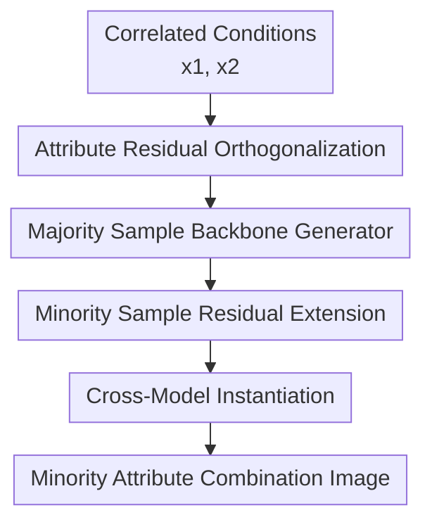

# ProReGen: Progressive Residual Generation under Attribute Correlations

**Conference**: ICLR2026  
**OpenReview**: [https://openreview.net/forum?id=2LzYaW032Q](https://openreview.net/forum?id=2LzYaW032Q)  
**Code**: https://github.com/ruby-stha/ProReGen_ICLR2026  
**Area**: Image Generation  
**Keywords**: Attribute Correlations, Conditional Generation, Residual Generation, Counterfactual Images, Diffusion Models  

## TL;DR
ProReGen reformulates correlated attribute conditions $x_1, x_2$ into orthogonal components $x_1, \gamma$. It first trains a backbone generator using abundant majority samples, then learns residual generation layers using sparse minority samples, thereby improving the generation accuracy of conditional VAEs, GANs, and Diffusion Models on rare attribute combinations.

## Background & Motivation
**Background**: Conditional generative models are commonly used to synthesize images with specific attribute combinations, such as "a specific digit with a specific color," "an object category with a specific corruption type," or "male faces with blond hair." Ideally, models should follow the given conditional combinations rather than merely reproducing the most frequent attribute co-occurrence patterns seen in the training set.

**Limitations of Prior Work**: Attributes in real-world training sets are often strongly correlated. A digit might primarily appear in a certain color, an object category might mostly be paired with a specific background or noise, and facial attributes may naturally entangle with gender or hair color. When standard conditional generative models are trained on such data, they learn these correlations as generation rules. When users request minority attribute combinations, the model often produces images that "look like the majority pattern" or sacrifices image quality to satisfy the conditions.

**Key Challenge**: Minority attribute combinations are precisely the regions where the model needs to learn most, yet these combinations have the fewest samples in the training set. Oversampling can increase the weight of minority samples but leads to overfitting; using classifiers to provide pseudo-supervision for generated images is unstable because the classifiers themselves are trained on biased data with attribute correlations. Explicitly decomposing the generation mechanism into independent modules like shape, texture, and background requires strong priors and may not generalize to arbitrary attribute pairs.

**Goal**: The authors aim to solve the problem of "how to reliably generate minority attribute combinations under attribute-correlated conditional generation." Specifically, the method must reduce the model's dependence on training correlations without placing the entire learning burden on scarce minority samples, while being applicable to different types of deep generative models rather than just one architecture.

**Key Insight**: The paper borrows from the idea of the Robinson partialling-out transformation. Instead of forcibly recovering two independent generation mechanisms from correlated inputs $x_1, x_2$, it decomposes $x_2$ into a part $m(x_1)$ that can be predicted by $x_1$ and a residual $\gamma = x_2 - m(x_1)$ that cannot. In this way, the generation conditions are transformed from correlated $x_1, x_2$ to nearly orthogonal $x_1, \gamma$.

**Core Idea**: Use "Attribute Residual Orthogonalization + Two-Stage Residual Generation" to replace direct conditional generation. This allows majority samples to learn the backbone generation patterns under correlated attributes, while minority samples only learn the residual changes required to transition from majority modes to minority modes.

## Method

### Overall Architecture
The input to ProReGen is a set of correlated image attributes $x_1, x_2$, and the output is an image $y$ matching the target combination. It first estimates the portion of $x_2$ explainable by $x_1$ to obtain the residual attribute $\gamma = x_2 - m(x_1)$. It then learns $\tilde g(z, x_1, \gamma=0)$ on majority samples, freezes the backbone, and learns a residual expansion layer on minority samples to transform majority features into the target minority combination.

From a functional perspective, standard conditional models directly learn $y = g(z, x_1, x_2)$. ProReGen modifies this to $y = \tilde g(z, x_1, \gamma)$, where $\gamma$ represents the part of $x_2$ that cannot be predicted by $x_1$. Majority samples usually satisfy $x_2 \approx m(x_1)$, i.e., $\gamma \approx 0$, so they are used to learn a stable backbone generator $g_{mjr}$. Minority samples correspond to $\gamma \neq 0$ and are used only to learn an additional $g_{res}$, which captures the differences between majority and minority patterns.

The paper instantiates this framework in three types of models: conditional VAEs, conditional GANs, and conditional Diffusion Models. VAE/GAN versions extend lightweight residual layers at the end of the generator and encoder/discriminator. Since Diffusion Models cannot simply "append denoising steps," they utilize feature injection similar to ControlNet, where a frozen stage-one U-Net provides features to a stage-two minority generation network during downsampling and at middle blocks.

### Key Designs
**1. Attribute Residual Orthogonalization: Rewriting correlated conditions into separable correlated and residual effects**

The core first step is modifying the conditional variables rather than the network. When $x_1$ and $x_2$ are highly correlated, the model struggles to distinguish between "image changes caused by $x_1$" and "changes caused by $x_2$ appearing with $x_1$." ProReGen estimates $m(x_1) \approx E[x_2|x_1]$ and defines $\gamma = x_2 - m(x_1)$, rewriting the generation task from $g(z, x_1, x_2)$ to $\tilde g(z, x_1, \gamma)$.

$x_1$ absorbs the $x_2$ components predictable from training correlations (the "correlated effect"), while $\gamma$ retains only the "residual effect." Consequently, the model no longer needs to learn two entangled mechanisms from sparse samples but instead learns a clearer problem: majority modes are explained by $x_1$, and deviations are explained by $\gamma$.

**2. Majority Backbone Generator: Shifting the primary generation burden to data-rich regions**

In correlated data, majority samples are abundant and stable but only cover cases where $\gamma \approx 0$. ProReGen uses this by training $g_{mjr}(z, x_1)$ only on majority samples in the first stage, approximating $\tilde g(z, x_1, \gamma=0)$. This step is equivalent to first learning "what an image should look like under the most common training correlations."

This design avoids a common pitfall: if majority and minority samples are mixed from the start, parameters are dominated by majority modes, and minority samples are insufficient to correct false associations. If only minority samples are emphasized, overfitting occurs. Starting with majority samples stabilizes generation capabilities for shape, background, texture, and noise structures.

**3. Minority Residual Extension: Freezing the backbone to learn differences from majority to minority modes**

The second stage distinguishes ProReGen from standard oversampling. The model freezes the first-stage backbone weights, takes the feature map $h_{mjr}(x_1)$ before the final activation, and adds $x_1$ and the residual attribute $\gamma$ into an additional residual layer $g_{res}$. The overall approximation is:

$$
y = \tilde g(z, x_1, \gamma) \approx g_{res}(h_{mjr}(x_1), x_1, \gamma), \quad \gamma = x_2 - m(x_1).
$$

This reduces the task for minority samples: they only learn how to modify majority features rather than learning the full distribution from scratch. For example, in Colored-MNIST, the backbone learns digit structure, while the residual layer learns how color deviates from the majority.

**4. Cross-Model Instantiation: Applying the same idea to VAE, GAN, and Diffusion Models**

For VAEs, the first stage trains the conditional encoder and decoder; the second stage adds extension layers at the decoder's end and mirrors them in the encoder. For GANs, the first stage trains the generator and discriminator, and the second stage extends both using adversarial loss. For Diffusion Models, the paper trains a second-stage minority denoising network $\epsilon_{\theta_{mnr}}(y_{mnr,t}, t, \gamma)$ and injects features from the frozen first-stage majority U-Net. This allows the second-stage network to leverage structural information at each diffusion step.

### Key Experimental Results

### Main Results
Evaluation was conducted on three synthetic datasets and one naturally correlated dataset. Colored-MNIST used correlation strengths of 95%–99.5%. MNIST-Correlation used parity and zigzag patterns. Corrupted-CIFAR10 used objects and corruptions. CelebA was used for qualitative evaluation of gender and hair color.

| Dataset | Model/Scenario | Key Observation | Conclusion vs. Baselines |
|:---|:---|:---|:---|
| Colored-MNIST | c-VAE / c-GAN / c-DM | ProReGen improves minority generation correctness, especially in c-GAN and c-DM. | Better at generating target minority combinations; less sacrifice of majority correctness than pseudo-supervision. |
| MNIST-Correlation | c-VAE / c-GAN | ProReGen-GAN significantly boosts minority correctness and improves FID. | Pseudo-supervised causal models are unstable; resampling improves correctness but often worsens FID. |
| Corrupted-CIFAR10 | c-GAN / c-DM | As correlation increases, standard model correctness drops; ProReGen maintains it. | Resampling is sometimes effective but decreases diversity or majority correctness. |
| CelebA | c-DM (Gender-Hair) | Naive c-DM fails on minority combinations; ProReGen-DM generates naturally. | Qualitative results support effectiveness on natural images without reliable oracles. |

### Ablation Study
The paper validates two-stage training, $m(x_1)$ estimation error, causal direction, and sub-network size.

| Configuration | Metric | Result | Note |
|:---|:---|:---|:---|
| Two-stage, Majority | Correctness / FID / Density | 0.9592 / 16.9488 / 0.7628 | Majority quality is stable. |
| Two-stage, Minority | Correctness / FID / Density | 0.9256 / 17.2562 / 0.6089 | Minority correctness and diversity are both high. |
| Single-stage, Minority | Correctness / FID / Density | 0.3557 / 65.0227 / 0.0320 | Minority generation almost fails, proving progressive training is essential. |
| $m(x_1)$ with 80% noise | Minority Overall Correctness | 0.8589 | Performance drops but still outperforms naive models. |
| Causal Direction Flip | Minority Correctness | 0.0811 vs. 0.9396 | Color $\to$ digit residual is much harder than digit $\to$ color. |

### Key Findings
- ProReGen primarily improves minority attribute correctness without significantly sacrificing majority performance.
- Progressive training is crucial; single-stage training leads to a drop in minority correctness from 0.9256 to 0.3557.
- Oversampling can approach ProReGen's correctness but risks memorization and worse FID/Coverage.
- Pseudo-supervision fails at high correlation strengths because the classifier itself is biased.
- The choice of attribute direction (causal direction) impacts residual task difficulty.

## Highlights & Insights
- **Turning debiasing into a residual generation task**: Instead of weights or pseudo-labels, ProReGen redefines condition variables, narrowing the problem from full distribution learning to residual learning.
- **Clever use of the Robinson transformation**: Partialling-out, typically used in semi-parametric regression, is successfully adapted as a generative model design principle.
- **Progressive training mitigates minority pressure**: Majority samples handle the heavy lifting of image structure, while minority samples only inform the model on what to change.
- **Architecture agnostic**: The implementation across VAE, GAN, and DM proves the framework's versatility.

## Limitations & Future Work
- Currently assumes samples can be split into discrete majority/minority groups; adaptation for continuous attributes or open-vocabulary prompts is needed.
- Relies on the quality of $m(x_1)$ estimation. While robust to some noise, inaccuracies directly affect generated attributes.
- The choice of causal direction is important but not always known.
- Quantitative evaluation on natural images remains difficult due to the lack of unbiased oracles.

## Related Work & Insights
- **vs. Resampling/Reweighting**: Resampling depends on minority diversity; ProReGen avoids memorization by using majority-learned backbones.
- **vs. Causal-cHVAE/GAN**: ProReGen does not depend on potentially biased external classifiers for supervision.
- **vs. Counterfactual Generative Networks**: ProReGen does not require explicit structural priors for shape/texture/background separation.
- **Insight for Future**: The "backbone + residual" control could be integrated into LoRA or ControlNet for large-scale latent diffusion models to correct for long-tail prompt biases.

## Rating
- Novelty: ⭐⭐⭐⭐☆
- Experimental Thoroughness: ⭐⭐⭐⭐☆
- Writing Quality: ⭐⭐⭐⭐☆
- Value: ⭐⭐⭐⭐☆

<!-- RELATED:START -->

## Related Papers

- [\[ICLR 2026\] Variational Autoencoding Discrete Diffusion with Enhanced Dimensional Correlations Modeling](variational_autoencoding_discrete_diffusion_with_enhanced_dimensional_correlatio.md)
- [\[CVPR 2026\] Omni-Attribute: Open-vocabulary Attribute Encoder for Visual Concept Personalization](../../CVPR2026/image_generation/omni-attribute_open-vocabulary_attribute_encoder_for_visual_concept_personalizat.md)
- [\[CVPR 2026\] SIGMA: Selective-Interleaved Generation with Multi-Attribute Tokens](../../CVPR2026/image_generation/sigma_selective-interleaved_generation_with_multi-attribute_tokens.md)
- [\[ICLR 2026\] SPRINT: Sparse-Dense Residual Fusion for Efficient Diffusion Transformers](sprint_sparse-dense_residual_fusion_for_efficient_diffusion_transformers.md)
- [\[ICLR 2026\] AttriCtrl: A Generalizable Framework for Controlling Semantic Attribute Intensity in Diffusion Models](attrictrl_a_generalizable_framework_for_controlling_semantic_attribute_intensity.md)

<!-- RELATED:END -->
