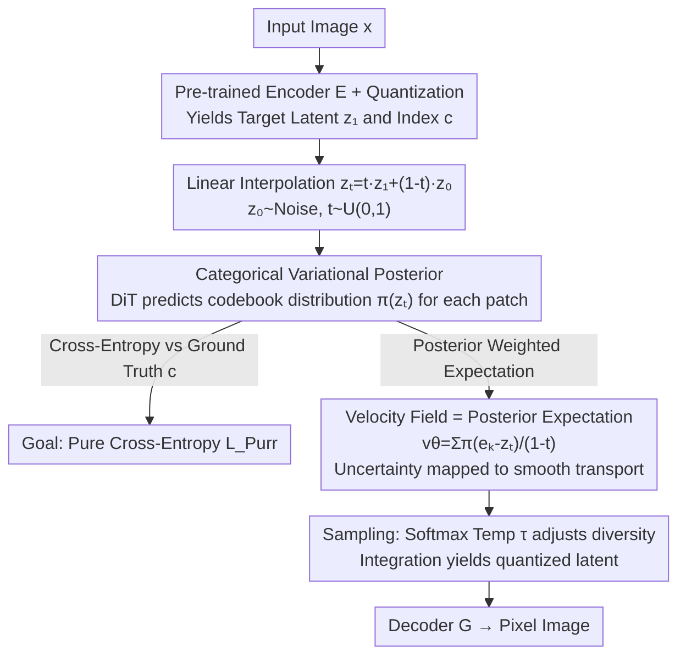

# Purrception: Variational Flow Matching for Vector-Quantized Image Generation

**Conference**: ICLR 2026  
**arXiv**: [2510.01478](https://arxiv.org/abs/2510.01478)  
**Code**: None  
**Area**: Image Generation  
**Keywords**: Variational Flow Matching, Vector Quantization, Discrete Diffusion, Categorical Posterior, Image Generation

## TL;DR

Ours proposes Purrception, an image generation method that adapts Variational Flow Matching (VFM) to the Vector-Quantized (VQ) latent space. By learning a categorical posterior distribution over codebook indices while calculating the velocity field in continuous embedding space, it bridges continuous transport dynamics and discrete supervision, achieving faster training convergence and comparable FID scores to SOTA on ImageNet-1k 256×256.

## Background & Motivation

The core paradigm of image generation is undergoing a profound transformation. Generating in latent space has become the mainstream approach, and **how to model the generation process in latent space** is a central design choice. Two main technical paths currently exist, each with advantages and disadvantages:

### Continuous Methods

Represented by Flow Matching and diffusion models, these define a transport path from noise to data in continuous space.

- **Advantages**: Geometric awareness; transport paths have favorable mathematical properties in continuous space; smooth gradient estimation.
- **Limitations of Prior Work**: Incapable of providing explicit supervision signals for discrete codebook indices; a natural mismatch exists when the underlying latent space is discrete (e.g., VQ-VAE codebooks).

### Discrete Methods

Represented by Discrete Flow Matching and masked language models, these model directly in the discrete token space.

- **Advantages**: Provides explicit categorical supervision over codebook indices; naturally matches the VQ latent space.
- **Limitations of Prior Work**: Lacks geometric structural information in continuous space; training can be inefficient.

The **Goal** of this paper is: **Can the advantages of both methods be combined?** Specifically, can continuous transport dynamics be maintained while providing explicit categorical supervision on discrete codebook indices?

Variational Flow Matching (VFM) provides a natural framework for this bridge—it introduces variational inference on top of continuous flow matching, allowing the definition of posterior distributions over discrete variables. Purrception is the first attempt to adapt VFM for VQ image generation.

## Method

### Overall Architecture

Purrception aims to resolve the inherent "dual identity" contradiction of the VQ latent space: each latent variable is both a discrete index in a codebook and a continuous embedding vector carrying geometric relationships (distance, direction). Continuous Flow Matching treats it only as a vector, losing discrete supervision, while pure discrete flow matching only predicts indices, losing geometric structure. The **Mechanism** is: within the VQ-VAE latent space, a Diffusion Transformer (DiT) predicts a **categorical posterior over the codebook** $\pi$ for each patch based on the interpolated intermediate state $z_t$. The **velocity field for transport is then analytically derived from this posterior** (posterior-weighted endpoint expectation). Training thus simplifies to a **pure cross-entropy** loss against the ground truth codewords. During sampling, diversity is adjusted via softmax temperature, and the generated quantized latents are passed to the decoder to reconstruct the pixel image. The entire pipeline uses a single network and a single loss, yet achieves both discrete supervision and continuous geometry.

### Key Designs

**1. Categorical Variational Posterior: Expressing "which codeword the endpoint should be" via distributions**

Pure continuous methods never receive class-based learning signals, while pure discrete methods treat semantically similar codewords as unrelated tokens, causing prediction to degenerate into "teleportation" between indices. Purrception adopts the **Key Insight** of Variational Flow Matching (VFM)—the velocity at time $t$ can be written as the expectation over the endpoint posterior $u_t(z_t)=\mathbb{E}_{p_t(z_1|z_t)}[u_t(z_t|z_1)]$. It refines this using a key fact: in VQ latent space, the endpoint $z_1$ must be some embedding $e_k$ from a finite codebook. Thus, the endpoint posterior is naturally a **categorical distribution** $q^\theta_t(c|z_t)=\mathrm{Cat}(c|\pi^\theta_t(z_t))$. Consequently, the model (a DiT) only needs to output the probability $\pi^\theta_t(z_t)$ for each patch over the codebook given the intermediate state $z_t$. This expresses "hesitation" between candidates (e.g., codeword 42 or 87), providing built-in uncertainty quantification while retaining logits for temperature control.

**2. Velocity Field = Posterior Weighted Expectation: Analytically deriving continuous transport from categorical posterior**

This is the key step to stitching discrete supervision and continuous geometry together, correcting the misconception of simply "combining two losses." Purrception does **not** train an additional velocity regression head. Instead, it substitutes the categorical posterior back into the VFM expectation formula to analytically obtain the velocity field:

$$v^\theta_t(z_t)=\sum_{k=1}^{K}\pi^{\theta,k}_t(z_t)\,\frac{e_k-z_t}{1-t}=\frac{\mu_t(z_t)-z_t}{1-t},\qquad \mu_t(z_t)=\sum_{k=1}^{K}\pi^{\theta,k}_t(z_t)\,e_k$$

The velocity points toward the "posterior-weighted codebook centroid" $\mu_t$. Thus, uncertainty among similar codewords is translated into **smooth, geometrically aware motion** rather than discrete jumps. Since velocity is determined entirely by the posterior, the training target reduces to a single cross-entropy loss between the predicted posterior and the ground truth codeword: $\mathcal{L}_{\text{Purr}}(\theta)=-\mathbb{E}_{t,x,z_t}[\log q^\theta(c|z_t)]$.

**3. Temperature Control: Using softmax temperature τ as an inference-time knob**

Since $\pi^\theta_t$ is obtained from logits via softmax with temperature $\tau$, $\pi^{\theta,k}_t(z_t)=\exp(\tilde\pi^{\theta,k}_t/\tau)\big/\sum_i\exp(\tilde\pi^{\theta,i}_t/\tau)$, the framework naturally introduces an inference-time degree of freedom. A low $\tau$ causes the posterior to collapse to the most likely codeword, resulting in sharper, high-fidelity generation but potentially oversimplifying. A high $\tau$ flattens the distribution, assigning weight to neighboring codewords and injecting more detail and diversity, though fidelity may drop. This reflects the standard bias-variance tradeoff in generation. Such controllability is absent in pure continuous FM (no categorical logits) and meaningless in pure discrete FM (indices collapse immediately).

### Loss & Training

The training objective is a **singular cross-entropy loss**, derived from the VFM objective specialized for VQ:

$$\mathcal{L}_{\text{Purr}}(\theta)=-\mathbb{E}_{t,x,z_t}\big[\log q^\theta(c\mid z_t)\big]$$

where $x\sim\mathcal{D}$, $z_1$ and $c$ are the corresponding quantized latent and codeword index, and the interpolated state is $z_t:=t z_1+(1-t)z_0$ ($z_0\sim p_0$, $t\sim U(0,1)$). The velocity field is not regressed separately, so no second loss or weighting is needed. Implementation uses DiT-L/2 and DiT-XL/2 backbones with Stable Diffusion's vq-f8 and LlamaGen's vq-ds8-c2i tokenizers.

## Key Experimental Results

### Main Results

Evaluation on ImageNet-1k 256×256 unconditional and class-conditional image generation:

| Method | FID↓ | Training Convergence | Type |
|------|------|------------|------|
| Continuous Flow Matching | Baseline | Slow | Pure Continuous |
| Discrete Flow Matching | Baseline | Slow | Pure Discrete |
| **Purrception** | **Comparable SOTA** | **Faster** | Continuous + Discrete Bridge |
| Other SOTA Models | Reference | - | Various |

### Ablation Study

| Configuration | Key Metrics | Description |
|------|---------|------|
| Continuous FM Only | Poor FID, slow convergence | Lacks discrete supervision |
| Discrete Supervision Only | Poor FID | Lacks continuous geometric info |
| Purrception (Full) | Best FID + Fastest Convergence | Dual signals are complementary |
| Temperature = 0.5 | High quality, low diversity | Deterministic selection via low temp |
| Temperature = 1.0 | Quality-diversity balance | Standard setting |
| Temperature = 1.5 | High diversity, slight quality drop | Softened posterior via high temp |
| No Categorical Posterior | Slower convergence | Validates acceleration from discrete supervision |

### Key Findings

1. **Training Convergence Acceleration**: Purrception converges faster than both pure continuous and pure discrete flow matching baselines. The discrete supervision from the categorical posterior provides a "sharper" learning target.
2. **Quality Comparable to SOTA**: FID scores are comparable to state-of-the-art methods, proving that bridging continuous and discrete approaches does not sacrifice generation quality.
3. **Temperature Controllability**: A single temperature parameter allows for smooth control of the diversity-quality tradeoff.
4. **Uncertainty Quantification**: The categorical posterior naturally provides an uncertainty estimate for encoding at each spatial location.

## Highlights & Insights

1. **Elegant Theoretical Bridge**: Purrception elegantly bridges continuous and discrete generative paradigms via the VFM framework. It is not a simple concatenation of losses but a natural fusion within a unified variational inference framework.
2. **Practical Speed Gain**: Faster training convergence is a highly practical contribution, directly translating to savings in GPU hours and costs during large-scale ImageNet training.
3. **Probabilistic Codeword Selection**: Replacing deterministic codeword lookup (argmin distance) with a probabilistic categorical posterior introduces uncertainty quantification and acts as a "soft quantization."
4. **Interpretable Temperature Control**: Compared to the scale parameter in classifier-free guidance, the temperature parameter has a more intuitive physical meaning by directly controlling the "sharpness" of the posterior distribution.
5. **Creative Naming**: "Purrception" (Purr + Perception) suggests that the model's "perception" of the codebook is soft/smooth (purr) rather than a hard decision.

## Limitations & Future Work

1. **Validation Scale**: Currently limited to ImageNet 256×256. Performance on higher resolutions (512+ or 1024+) or larger datasets remains unverified.
2. **Gap with Latest SOTA**: While FID is "comparable," more detailed quantitative comparisons are needed to determine the exact standing against the very best models.
3. **Codebook Size Sensitivity**: The computational complexity of the categorical posterior scales linearly with codebook size. Large codebooks (e.g., 16384) may face efficiency challenges.
4. **Text-Conditioned Generation**: Evaluation has focused on class-conditional generation; text-to-image performance is not yet clear.
5. **Architectural Compatibility**: Exploring integration with newer VAEs (e.g., FSQ or KL-VAE) is a promising direction.
6. **Video Extension**: Extending the framework to video VQ latent spaces might offer advantages in temporal consistency.

## Related Work & Insights

- **Flow Matching**: The theoretical foundation for continuous transport paths (Lipman et al.).
- **Variational Flow Matching**: The framework introducing variational inference to Flow Matching; the theoretical cornerstone for Purrception.
- **Discrete Flow Matching / Discrete Diffusion**: Generative modeling in discrete token spaces.
- **VQ-VAE / VQ-GAN**: Methods for constructing vector-quantized latent spaces.
- **Masked Image Modeling (MIM)**: Such as MaskGIT, using mask prediction on VQ tokens.
- **Autoregressive VQ Generation**: Using Transformers to generate VQ tokens as sequences.
- **Insight**: Variational inference as a unified framework allows for handling continuous and discrete structures in a single model, a paradigm likely valuable for other mixed-space generative tasks (e.g., molecules, programs).

## Rating

- Novelty: ⭐⭐⭐⭐ (Adapting VFM to VQ space is a natural yet non-trivial contribution with a clear bridging strategy)
- Experimental Thoroughness: ⭐⭐⭐ (Validated on ImageNet-1k 256×256; limited in scale and requires broader baseline comparisons)
- Writing Quality: ⭐⭐⭐⭐ (Clear theoretical derivation and motivation)
- Value: ⭐⭐⭐⭐ (Practical significance in training efficiency and provides a new paradigm for VQ generation)

<!-- RELATED:START -->

## Related Papers

- [\[ICLR 2026\] Scalable Training for Vector-Quantized Networks with 100% Codebook Utilization](scalable_training_for_vector-quantized_networks_with_100_codebook_utilization.md)
- [\[ICLR 2026\] Flow Map Learning via Non-Gradient Vector Flow](flow_map_learning_via_non-gradient_vector_flow.md)
- [\[CVPR 2026\] Learning Straight Flows: Variational Flow Matching for Efficient Generation](../../CVPR2026/image_generation/learning_straight_flows_variational_flow_matching_for_efficient_generation.md)
- [\[ICLR 2026\] Delay Flow Matching](delay_flow_matching.md)
- [\[ICLR 2026\] Variational Autoencoding Discrete Diffusion with Enhanced Dimensional Correlations Modeling](variational_autoencoding_discrete_diffusion_with_enhanced_dimensional_correlatio.md)

<!-- RELATED:END -->
