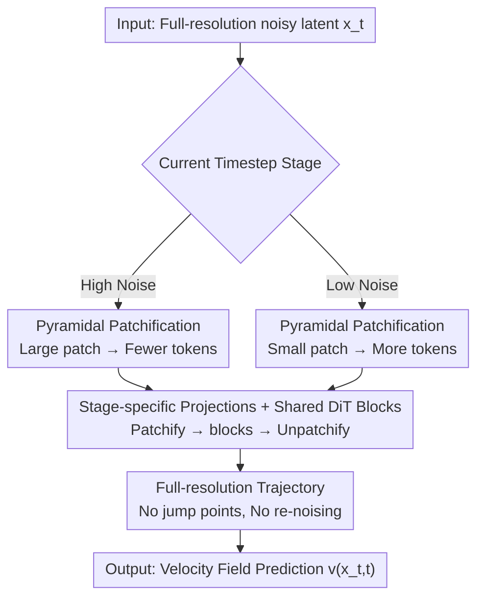

# Pyramidal Patchification Flow for Visual Generation

**Conference**: ICLR 2026  
**OpenReview**: [https://openreview.net/forum?id=hRfJjmsibX](https://openreview.net/forum?id=hRfJjmsibX)  
**Code**: https://github.com/fudan-generative-vision/PPFlow  
**Area**: Diffusion Models / Image Generation  
**Keywords**: Diffusion Transformer, Flow Matching, Patchification Acceleration, Pyramid, Sampling Efficiency

## TL;DR
The Diffusion Transformer is enabled to use larger patches (fewer tokens) at high-noise timesteps and smaller patches (more tokens) at low-noise timesteps. By sharing a single DiT backbone and learning individual linear projections for different patch sizes, denoising inference is accelerated by approximately 1.6× to 2.0× with almost no loss in image quality.

## Background & Motivation

**Background**: Visual generation models represented by Diffusion Transformer (DiT) / flow matching are currently SOTA. The standard pipeline of DiT is Patchify → DiT blocks → Unpatchify: spatial latents are first cut into $p\times p$ patches, linearly projected into $L=(I/p)^2$ tokens, passed through several Transformer blocks to estimate the velocity field, and then projected back to the latent space. Original DiT uses the **same $2\times2$ patch size for all timesteps**, meaning the token budget remains constant regardless of the noise level.

**Limitations of Prior Work**: Every denoising trajectory requires many expensive network forward passes, where the cost is primarily determined by the token count $L$—self-attention has quadratic complexity relative to $L$. In DiT-XL/2, approximately **99.8% of FLOPs occur within DiT blocks**. However, an observation emphasized by the authors is that latents in the high-noise phase are inherently coarse and blurry, and do not require such fine spatial tokens for characterization; a constant token budget in high-noise segments is pure waste.

**Key Challenge**: To reduce token counts and save computation in high-noise segments, the most direct method is to reduce the **representation resolution** in a pyramidal or cascaded manner (e.g., Pyramidal Flow, PixelFlow). However, doing so creates "jump points" at stage transitions: the trajectory becomes discontinuous and fails to satisfy the continuity equation, necessitating carefully designed re-noising techniques for stitching. This increases both training and inference complexity and tends to produce blocky artifacts. Thus, a trade-off exists between "saving tokens" and "maintaining trajectory continuity / implementation simplicity."

**Goal**: Achieve adaptive computational allocation with "fewer tokens at high noise, more tokens at low noise" without changing latent representation resolution, introducing jump points, or requiring re-noising.

**Key Insight**: The authors realized that the token count is actually determined by the **patch size** rather than just the representation resolution. Since the goal is only to reduce tokens, one can simply vary the patch size of the patchify operation while keeping the latent representation at full resolution throughout.

**Core Idea**: Replace "time-varying pyramidal resolution" with "time-varying pyramidal patchification" to save tokens while avoiding re-noising.

## Method

### Overall Architecture

PPFlow (Pyramidal Patchification Flow) divides the entire denoising timeline into several stages (the paper uses a three-stage example $\{[0,t_{s1}),[t_{s1},t_{s2}),[t_{s2},1]\}$), each assigned a pyramidal patch size: large patches (e.g., $4\times4$) for high-noise stages, $4\times2$ for intermediate stages, and standard $2\times2$ for low-noise stages. During the forward pass, the same latent variable $x_t$ always maintains full resolution; depending on which stage the current timestep falls into, the corresponding patch size and its associated Patchify/Unpatchify linear projections are selected. The central DiT block backbone **shares a single set of parameters across all stages**. Since patch size does not change the token dimension $d$ or the structure of the DiT blocks, this design only adds a pair of linear projections for each patch size, requiring minimal modifications.

### Key Designs

**1. Pyramidal Patchification: Regulating Token Budgets via Patch Size Instead of Resolution**

This is the foundation of the work. The pain point is that a constant token budget wastes computation during high-noise stages. PPFlow partitions the timeline into stages, bonding each to a patch size $p_{si}\times p_{si}$, where higher noise uses larger patches and fewer tokens. Since the token count is $L=(I/p)^2$ and the complexity of a single DiT block is $O(L^2 d + L d)$ (quadratic for self-attention, linear for MLP), increasing the patch size from $2\times2$ to $4\times4$ reduces the token count to $1/4$ for that stage, causing computation to plummet. Two-stage and three-stage PPFlow reduce FLOPs on $256\times256$ images by **37.8%** and **50.6%**, respectively. The fundamental difference from resolution-reduction schemes is that the latent representation **remains at full resolution**, only the "granularity of observation" changes, ensuring the trajectory remains unbroken.

**2. Shared DiT Backbone + Stage-specific Projections: Supporting Multiple Patch Sizes with Near-Zero Overhead**

If each patch size required a complete DiT, parameter and training costs would explode. PPFlow's approach is to share the same DiT block parameters across all stages, separating only the Patchify and Unpatchify linear projection matrices by stage—stage $i$ has its own $W_{si}\in\mathbb{R}^{d\times d_{si}}$ (where $d_{si}=C p_{si}^2$) and corresponding unprojection matrix. The elegance of this design lies in a complexity identity:

$$L_s \times d_s \times d = (I/p_s)^2 \times (p_s^2 C) \times d = I^2 C d.$$

This means the **cost of linear projection is independent of patch size**, remaining constant at $I^2Cd$. Only the DiT backbone, which accounts for 99.8% of FLOPs, varies with the token count. Thus, "changing only projections while sharing the backbone" adds almost no extra parameters or computation while capturing the full benefits of token reduction. This also explains why adapting from a pre-trained DiT requires only $+8.9\%$ (two-stage) / $+7.1\%$ (three-stage) extra training FLOPs.

**3. Full Resolution Trajectory: Eliminating Jump Points and Re-noising Tricks**

This is the core differentiator of PPFlow compared to Pyramidal Flow / PixelFlow. The latter change representation resolution between stages, creating "jump points" that violate the continuity equation, necessitating re-noising to stitch adjacent stages—otherwise, blurriness and blocky artifacts occur. Since PPFlow maintains constant latent representation resolution, it **still satisfies the continuity equation**. Stage transitions only involve changing the patch size and the projection pair, without any jump points. Its inference process is identical to standard DiT—integrating the velocity field progressively from noise—with the only difference being the selection of Patchify/Unpatchify based on the current timestep. This saves computation without introducing additional sampling tricks.

**4. Low-cost Adaptation from Pre-trained DiT: Average/Copy Initialization + Stage-level CFG and Level Embedding**

To avoid training from scratch, PPFlow provides an initialization scheme to migrate directly from standard DiT: DiT block weights are copied entirely. For Patchify, large patch projections use **average** initialization; for instance, the $4\times4$ stage sets $W_2=\tfrac14[W,W,W,W]$ (coefficient $\tfrac14=\tfrac{2\times2}{4\times4}$, intuitively averaging four $2\times2$ patches into one token). Unpatchify uses **copy** initialization $W_2^u=[(W^u)^\top,(W^u)^\top,(W^u)^\top,(W^u)^\top]^\top$ so that the initial outputs of the four sub-patches are identical. During training, projections for each patch size are trained **only using noisy latents from their assigned time segments**, allowing the patch size to specialize for its specific noise intensity—unlike FlexiDiT / Lumina-Video where "every patch size covers all timesteps," avoiding train/test inconsistency. Additionally, inference uses **stage-level CFG scheduling** (e.g., PPF-XL-2 uses $[1.0, 3.0]$, PPF-XL-3 uses $[1.0, 3.5, 3.75]$) and learnable patch-level/stage embeddings to further stabilize image quality.

### Loss & Training
The training objective follows standard flow matching: a trajectory from noise to data is constructed via linear interpolation $x_t = t x_1 + (1-t)x_0$, with the velocity field $u_t = x_1 - x_0$. The network is optimized via $\mathbb{E}\big[\lVert v(x_t,t) - (x_1-x_0)\rVert_2^2\big]$. Stage partitioning (time segmentation + patch sizes) is fixed throughout training. Two training modes are supported: training from scratch (initialized like standard DiT, with each patch size projection trained only on samples from its corresponding time segment) and adaptation from pre-trained DiT (using the average/copy initialization mentioned above, the recommended low-cost method). Implementation utilizes "Patch n' Pack" to pack variable-length token sequences into batches, further reducing training FLOPs per iteration.

## Key Experimental Results

### Main Results

ImageNet class-conditional generation, trained from scratch (PPF-B series, compared to SiT-B/2):

| Method | Training Steps | Test FLOPs(%) | FID-50k↓ | IS↑ | Gain (Speedup) |
|------|---------|-------------|----------|-----|------|
| SiT-B/2 | 7M | 100 | 4.46 | 180.95 | 1× |
| PPF-B-2 | 11M | 62.0 | **3.83** | 223.00 | ~1.6× |
| PPF-B-3 | 11M | 49.1 | 4.43 | **230.72** | ~2.0× |

Adaptation from pre-trained DiT (only $\le10\%$ extra pre-training FLOPs):

| Method | Resolution | Extra Training FLOPs(%) | Test FLOPs(%) | FID-50k↓ | IS↑ |
|------|-------|-----------------|-------------|----------|-----|
| SiT-XL/2 | 256 | - | 100 | 2.15 | 258.09 |
| PPF-XL-2 | 256 | 8.9 | 62.6 | **1.99** | 271.62 |
| PPF-XL-3 | 256 | 7.1 | 49.4 | 2.23 | **286.67** |
| DiT-XL/2 | 512 | - | 100 | 3.04 | 240.82 |
| PPF-XL-2 | 512 | 7.6 | 58.7 | 3.01 | 249.98 |

Two-stage achieves ~1.60× and three-stage achieves ~2.02× inference acceleration, with FID remaining comparable or better and IS generally higher. In text-to-image tasks, two-stage PPFlow applied to FLUX.1-dev achieved 1.61×~1.86× speedup at 512→2048 resolutions, with GenEval / DPG Bench / T2I-CompBench performance nearly identical to the fine-tuned baseline FLUX.1-ft.

### Ablation Study

| Config | FID-50k↓ | IS↑ | Description |
|------|----------|-----|------|
| PPF-B-2 | 4.44 | 201.12 | Baseline (1M steps, pre-trained adaptation) |
| + level Emb. | 4.30 | 212.70 | Adding stage embeddings |
| + stage CFG | **4.22** | **252.10** | Adding stage-level CFG |

Comparison with other "high-noise, few-token" approaches (trained 1M steps from scratch):

| Method | FID-50k↓ | IS↑ | Description |
|------|----------|-----|------|
| Pyramid Rep. | 164.48 | 8.29 | Pure pyramidal resolution, failed |
| Pyramid Rep. + Renoising | 27.69 | 73.20 | With re-noising stitching, still poor |
| Lumina-Video method | 18.77 | 79.12 | Changing patch size but training all timesteps |
| **PPF-B-2** | **15.68** | **88.78** | Ours |

Comparison with FlexiDiT on DiT-XL/2: At ~63% FLOPs, PPFlow (FID 2.15) outperforms FlexiDiT (2.25); at ~50% FLOPs, PPFlow (2.31) significantly outperforms FlexiDiT (2.64).

### Key Findings
- The primary contribution is "pyramidal patchification + shared backbone": quality is maintained at nearly half the FLOPs, proving that fine tokens are indeed redundant at high noise levels.
- Stage-level CFG significantly boosts IS (201→252), indicating that different noise stages benefit from different guidance strengths.
- Pure resolution-reduction schemes (Pyramid Rep.) collapse without re-noising (FID 164), and even with re-noising, they underperform PPFlow, highlighting the value of maintaining a "full-resolution trajectory."
- While more stages reduce test FLOPs further, they require more training steps to match the image quality of two-stage models—there is a trade-off between the number of stages and the training budget.

## Highlights & Insights
- **Decoupling token count from representation resolution**: Separating "token reduction" from "resolution reduction" by modifying only the patch size is the cleanest insight of this paper—bypassing the entire complexity of jump points and re-noising.
- **The complexity identity $I^2Cd$ is elegant**: It proves that linear projection overhead is independent of patch size, making "swapping projections while sharing the backbone" a nearly free lunch that can be directly applied to any existing DiT/FLUX.
- **Average/Copy initialization** keeps the cost of adapting from pre-trained models to a single-digit percentage of pre-training FLOPs, making it engineering-friendly and essentially "plug-and-play" for acceleration.
- The concept of "allocating compute adaptively based on noise intensity" is transferable to any patchify-based diffusion/flow framework, such as video or 3D generation.

## Limitations & Future Work
- The number of stages, transition points, and patch sizes per stage are fixed schedules set manually; the paper does not provide an automated search scheme, meaning adjustments might be needed for different datasets/resolutions.
- Acceleration gains are limited by the maximum usable patch size and the proportion of high-noise stages; benefits are diluted when low-noise stages (full tokens) are long.
- Evaluation focuses on ImageNet class-conditional and FLUX text-to-image generation; scalability to more complex video/long-sequence generation is mentioned only as future work.
- Although there are no resolution jump points at stage transitions, the paper does not deeply explore if subtle representation discontinuities exist between different patch size projections or how robust the approach is to extreme prompts.

## Related Work & Insights
- **vs. Pyramidal Flow / PixelFlow**: These change representation resolution between stages, creating jump points and violating the continuity equation, requiring re-noising stitches. PPFlow maintains full resolution and changes only patch size, avoiding re-noising and achieving better quality and stability (FID 15.68 vs 27.69).
- **vs. FlexiDiT / Lumina-Video**: These also use large patches at high noise, but each patch size covers all timesteps during training, leading to train/test inconsistency. PPFlow trains each patch size only on its corresponding noise segment, specializing for that intensity and yielding better results (FID 2.15 vs 2.25 at ~63% FLOPs).
- **vs. Distillation / Consistency Models / Quantization**: Methods targetting the number of forward passes or per-pass cost are orthogonal to PPFlow. PPFlow reduces the "token count per forward pass" and can theoretically be combined with distillation or quantization for further speedups.

## Rating
- Novelty: ⭐⭐⭐⭐ Decoupling token reduction from resolution reduction via patch size is simple yet hits the mark.
- Experimental Thoroughness: ⭐⭐⭐⭐ Covers from-scratch/adaptation, multiple resolutions, class-conditional + text-to-image, and direct comparisons with multiple acceleration routes.
- Writing Quality: ⭐⭐⭐⭐ Clear methodology, sound complexity derivation, and thorough distinction from related works.
- Value: ⭐⭐⭐⭐ Highly practical, enabling 1.6×~2× speedups for existing DiT/FLUX models with minimal modifications.

<!-- RELATED:START -->

## Related Papers

- [\[CVPR 2026\] DPAR: Dynamic Patchification for Efficient Autoregressive Visual Generation](../../CVPR2026/image_generation/dpar_dynamic_patchification_for_efficient_autoregressive_visual_generation.md)
- [\[ICLR 2026\] UniEdit-Flow: Unleashing Inversion and Editing in the Era of Flow Models](uniedit-flow_unleashing_inversion_and_editing_in_the_era_of_flow_models.md)
- [\[ICLR 2026\] Product of Experts for Visual Generation](product_of_experts_for_visual_generation.md)
- [\[ICLR 2026\] Next Visual Granularity Generation](next_visual_granularity_generation.md)
- [\[ICLR 2026\] Safety-Guided Flow (SGF): A Unified Framework for Negative Guidance in Safe Generation](safety-guided_flow_sgf_a_unified_framework_for_negative_guidance_in_safe_generat.md)

<!-- RELATED:END -->
