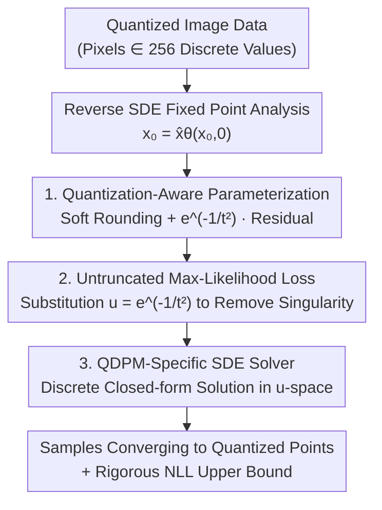

# Quantization-Aware Diffusion Models for Maximum Likelihood Training

**Conference**: ICLR 2026  
**OpenReview**: [https://openreview.net/forum?id=5ekhMkawuT](https://openreview.net/forum?id=5ekhMkawuT)  
**Code**: To be confirmed  
**Area**: Diffusion Models / Image Generation / Density Estimation  
**Keywords**: Diffusion Models, Data Quantization, Maximum Likelihood, Density Estimation, Reverse SDE

## TL;DR
Addressing the fundamental contradiction where digital images are discrete quantized values but diffusion models treat them as continuous signals, this paper introduces a "soft rounding + super-exponentially decaying residual" parameterization for the signal predictor. This ensures the reverse SDE converges to quantized points at $t\to0$, pushing density estimation to the limit—reducing CIFAR-10 NLL from the previous SOTA of 2.42 bpd to 0.27 bpd.

## Background & Motivation
**Background**: Continuous-time diffusion models (score-based / SDE framework) are SOTA for image generation and density estimation. They gradually perturb data toward Gaussian noise and learn a reverse SDE to restore the data. When the weight function is $w(t)=t$, the score matching loss is equivalent to a lower bound of the data likelihood, allowing diffusion models to be used for rigorous log-likelihood evaluation.

**Limitations of Prior Work**: All such models inherently assume data is continuous, yet real digital images are **quantized**—8-bit pixels only take 256 integer values (0–255). Existing works either ignore quantization by treating data as continuous (rounding after inference) or use "dequantization" by adding uniform noise to map data into continuous space. The former cannot guarantee samples from the reverse SDE land on quantized points, while the latter forces the model to generate noisy data, degrading performance. Both are ad-hoc solutions.

**Key Challenge**: The endpoint of a diffusion model's reverse SDE is a continuous distribution; it **naturally does not** converge to a finite set of quantized points. For maximum likelihood evaluation, data must be treated as discrete to calculate probabilities. This mismatch between "continuous generation ↔ discrete data" necessitates variational upper bounds and introduces a numerical pathology: the ELBO objective contains a $t^{-3}$ coefficient that diverges as the starting time $t_{\min}\to0$. Consequently, previous maximum likelihood training required artificial time truncation within $[t_{\min}, t_{\max}]$, leaving the "last mile" unmodeled.

**Goal**: Integrate quantization directly into the score function design to produce a reverse SDE that **guarantees** convergence to quantized points, thereby (1) eliminating ad-hoc dequantization/post-processing and (2) enabling truncation-free maximum likelihood training as $t_{\min}\to0$.

**Core Idea**: Replace standard predictors with a specialized parameterization for the signal predictor $\hat{x}_\theta$. By ensuring its **fixed point at $t=0$ is exactly a quantized point**, the reverse SDE endpoint is forced to land on the quantized grid.

## Method

### Overall Architecture
The paper proposes **QDPM (Quantizing Diffusion Probabilistic Model)**. The starting point is a simple yet critical observation: the solution of the reverse SDE at $t\to0$ must be a fixed point of the signal predictor ($x_0=\hat{x}_\theta(x_0,0)$). Since the endpoint is a fixed point, restricting the signal predictor's fixed points to quantized values ensures the reverse SDE terminates at those points. The pipeline involves: deriving the sufficient condition for "convergence to quantized points" (fixed point equals the rounding function), constructing a parameterization satisfying this (soft rounding + decaying residual), deriving an untruncated maximum likelihood loss, and providing an efficient solver based on the closed-form solution of the reverse SDE.

### Key Designs

**1. Quantization-Aware Parameterization: Aligning Fixed Points with Quantized Values**

This addresses the failure of reverse SDEs to land on quantized points. The authors prove two propositions: Proposition 1 shows the limit $x_0$ of the reverse SDE at $t\to0$ almost surely satisfies $x_0=\hat{x}_\theta(x_0,0)$ (the paper verifies this on pretrained EDM by showing fixed-point error converges to 0 as $t\to0$). Proposition 2 provides a sufficient condition: if $\hat{x}_\theta(x,0)=\mathrm{round}(x):=\arg\min_{y\in\Omega}\lVert x-y\rVert$ (mapping any point to the nearest quantized point), the endpoint must lie in the quantized set $\Omega=\{x^{(k)}\}_{k=1}^{K\,d}$.

The construction is:

$$\hat{x}_\theta(x_t,t)=\mathrm{softround}(x_t,t)+e^{-1/t^2}\,\hat{\delta}_\theta(x_t,t)$$

Where $\mathrm{softround}$ is a smooth version of rounding, weighted by softmax: $(\mathrm{softround}(x_t,t))_i=\sum_k \mathrm{softmax}\!\left(-\frac{(x^{(k)}-(x_t)_i)^2}{2t^2}\right)x^{(k)}$. As $t\to0$, the softmax becomes hard rounding ($\mathrm{softround}\to\mathrm{round}$), and the $e^{-1/t^2}$ coefficient decays **super-exponentially** to 0, satisfying the sufficient condition at $t=0$. The neural network $\hat{\delta}_\theta$ (based on U-Net) only predicts the residual "signal minus soft-rounding." The beauty is that deterministic rounding is handled analytically, while the network learns the continuous correction which is forced to zero at the endpoint.

**2. Untruncated Maximum Likelihood Loss: Eliminating $t^{-3}$ Singularity**

This addresses the divergence of ELBO as $t_{\min}\to0$. Substituting the parameterization into the NLL upper bound and setting $t_{\min}\to0, t_{\max}\to\infty$ yields the negative ELBO:

$$-\log p_0(x_0;\theta)\le \mathbb{E}_{\epsilon}\left[\int_0^\infty \frac{1}{t^3}\lVert x_0-\hat{x}_\theta(x_t=x_0+t\epsilon)\rVert^2\,dt\right]=L(x_0,\theta)$$

To handle the $t^{-3}$ divergence, use the substitution $u=e^{-1/t^2}\in[0,1]$ (where $t=1/\sqrt{- \log u}$ and $du=\frac{2e^{-1/t^2}}{t^3}dt$). The loss is rewritten as a uniform expectation over $u$ in $[0,1]$:

$$L(x_0,\theta)=\mathbb{E}_{u\sim U(0,1)}\left[\hat{\delta}_\theta^\top\!\left(\frac{u}{2}\hat{\delta}_\theta-\delta_t\right)\right]+c,\qquad \delta_t=x_0-\mathrm{softround}(x_t,t)$$

Because the $e^{-1/t^2}$ coefficient of $\hat{\delta}_\theta$ decays super-exponentially, it cancels the explosion of $t^{-3}$. Equivalently, $L=\mathbb{E}\big[\frac{1}{2u}\lVert u\hat{\delta}_\theta-\delta_t\rVert^2\big]$. This allows optimization over the full time range without $t_{\min}$ or soft truncation. 

**3. QDPM-Specific SDE Solver: Discrete Closed-form Solution in $u$-space**

For sampling efficiency, the authors use the closed-form solution of the reverse SDE. By applying a first-order approximation to the drift term, they derive an analytical Gaussian transition: $x_t\sim\mathcal{N}\!\big(\frac{t^2}{s^2}x_s+(1-\frac{t^2}{s^2})\hat{x}_\theta(x_s,s),\ t^2(1-\frac{t^2}{s^2})I\big)$. Since $t\in[0,\infty)$ is unbounded, the solver discretizes the bounded $u=e^{-1/t^2}\in[0,1]$ space (QDPM-Solver-1) and includes a second-order version (QDPM-Solver-2) using Runge-Kutta principles. While similar to DPM-Solver++, it specifically adapts to the VE-SDE setting where $t$ and $\lambda$ are unbounded.

### Loss & Training
The objective is $L(x_0,\theta)=\mathbb{E}_{u\sim U(0,1)}\big[\frac{1}{2u}\lVert u\hat{\delta}_\theta-\delta_t\rVert^2\big]$, sampled uniformly for $u \in [0,1]$. It uses the U-Net architecture from Kingma et al. (2021) without data augmentation. Evaluation uses the NLL upper bound converted to bits-per-dimension (BPD).

## Key Experimental Results

### Main Results (Density Estimation, NLL / BPD, Lower is Better)

| Dataset | Metric | QDPM | Prev. SOTA | Theoretical Lower Bound |
|--------|------|------|-----------|----------|
| CIFAR-10 | NLL (bpd) | **0.27** | 2.42 (i-DODE, w/ aug) | 0.0043 |
| ImageNet-32 | NLL (bpd) | **0.32** | 3.43 (i-DODE) | 0.0051 |

QDPM crushes previous results, being the first to drop below 1.0 bpd and approach the theoretical lower bound, representing a massive leap rather than incremental improvement.

### Ablation Study / Analysis

| Configuration | Key Observation | Explanation |
|------|---------|------|
| QDPM NLL vs FID | NLL 0.27 (SOTA) / FID 5.60 (CIFAR-10) | Strong NLL but FID lags behind methods optimized for perceptual quality (e.g., GDD's 1.54). |
| VDM vs VDM + uniform dequant | 2.65 → 2.85 | Adding uniform noise for dequantization degrades performance. |
| QDPM-Solver-2 NFE=4~256 | High quality at NFE 16~64 | The closed-form solver is effective with few steps. |

### Key Findings
- **Quantization-aware parameterization is the root of the performance surge**: Treating quantization as a structural guarantee rather than a soft constraint allows the model to bridge the "last mile" ($t\to0$) gap.
- **Decoupling of NLL and FID**: QDPM achieves SOTA likelihood but higher FID. This is a known phenomenon for maximum likelihood trained models.
- **Dequantization is harmful**: Tests on VDM show NLL degradation when using uniform dequantization, justifying the avoidance of noise-based methods.

## Highlights & Insights
- **From Loss Constraint to Structural Guarantee**: Instead of using a loss to encourage quantization, it uses `softround` + $e^{-1/t^2}$ to make the fixed point **analytically** equal to the rounded value. This "hard structural floor" approach can be applied to other tasks requiring discrete endpoints.
- **The $u=e^{-1/t^2}$ substitution**: It elegantly solves two problems—neutralizing the $t^{-3}$ ELBO singularity for untruncated training and providing a bounded space for discrete solvers.
- **Fixed-point Perspective**: Simplifies the complex task of controlling SDE endpoint distributions into the simpler task of designing a function with specific fixed points.

## Limitations & Future Work
- Currently limited to SDEs; **ODE and Flow Matching versions are future work**.
- High FID: The model is optimized for density; perceptual quality (FID 5.60 / 8.89) is not SOTA.
- Requires known and regular quantization sets $\Omega$ (e.g., 256 equidistant levels); applicability to complex or non-uniform grids is not discussed.
- The 0.27 bpd result depends on a specific quantization-aware evaluation protocol; care is needed when comparing across different metrics (e.g., dequantized vs. discrete).

## Related Work & Insights
- **vs Dequantization (ScoreFlow / Song et al. 2021)**: They add noise to make data continuous. QDPM integrates quantization into the reverse SDE directly, outperforming these as dequantization is shown to be suboptimal.
- **vs VDM / DDPM Discrete Outputs**: These methods use a discrete/categorical head at $t_{\min}$. QDPM ensures the entire reverse SDE converges to quantized points naturally, requiring no $t_{\min}$.
- **vs Soft Truncation (Kim et al. 2022)**: Soft truncation alleviates numerical instability by personalizing $t_{\min}$ but still requires truncation. QDPM's parameterization removes the need for $t_{\min}$ entirely.
- **vs DPM-Solver++ (Lu et al. 2022)**: Both use closed-form solutions, but QDPM requires discretization in $u$-space due to the VE-SDE's unbounded nature, whereas DPM-Solver++ uses $\lambda$-space for VP-SDE.

## Rating
- Novelty: ⭐⭐⭐⭐⭐ Innovative use of fixed-points to bake quantization into structure.
- Experimental Thoroughness: ⭐⭐⭐⭐ Dominant in density estimation, though FID and dataset diversity are limited.
- Writing Quality: ⭐⭐⭐⭐⭐ Clear, logical progression from motivation to theoretical proof.
- Value: ⭐⭐⭐⭐⭐ A milestone for diffusion-based density estimation, breaking the 1.0 bpd barrier.

<!-- RELATED:START -->

## Related Papers

- [\[CVPR 2026\] SegQuant: A Semantics-Aware and Generalizable Quantization Framework for Diffusion Models](../../CVPR2026/image_generation/segquant_a_semantics-aware_and_generalizable_quantization_framework_for_diffusio.md)
- [\[ICLR 2026\] Improving Diffusion Models for Class-imbalanced Training Data via Capacity Manipulation](improving_diffusion_models_for_class-imbalanced_training_data_via_capacity_manip.md)
- [\[ICLR 2026\] Joint Distillation for Fast Likelihood Evaluation and Sampling in Flow-based Models](joint_distillation_for_fast_likelihood_evaluation_and_sampling_in_flow-based_mod.md)
- [\[ICCV 2025\] DMQ: Dissecting Outliers of Diffusion Models for Post-Training Quantization](../../ICCV2025/image_generation/dmq_dissecting_outliers_of_diffusion_models_for_post-training_quantization.md)
- [\[ICLR 2026\] Half-order Fine-Tuning for Diffusion Model: A Recursive Likelihood Ratio Optimizer](half-order_fine-tuning_for_diffusion_model_a_recursive_likelihood_ratio_optimize.md)

<!-- RELATED:END -->
