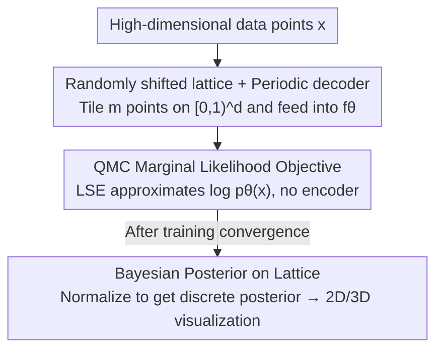

# Quasi-Monte Carlo Methods Enable Extremely Low-Dimensional Deep Generative Models

**Conference**: ICLR 2026  
**OpenReview**: [https://openreview.net/forum?id=fdLU72nQdr](https://openreview.net/forum?id=fdLU72nQdr)  
**Code**: To be confirmed  
**Area**: Deep Generative Models / Latent Variable Models / Interpretable Representation Learning  
**Keywords**: Quasi-Monte Carlo, Latent Variable Models, Low-dimensional Embedding, VAE, Marginal Likelihood

## TL;DR
This paper proposes QLVM (Quasi-Monte Carlo Latent Variable Model): by discarding the VAE encoder and the variational lower bound, it directly approximates the marginal likelihood using randomized Quasi-Monte Carlo (QMC) lattice integration to train a decoder. This enables training deep generative models in extremely low-dimensional latent spaces (1/2/3D) that outperform VAEs/IWAEs of the same dimensionality and are inherently visualizable.

## Background & Motivation
**Background**: Deep generative models (especially VAEs) are widely used by scientists to find "interpretable representations" for high-dimensional data—analyzing kinematics, animal vocalizations, single-cell gene expression, and neural population dynamics. Dimensionality reduction is seen as a key step towards interpretability, typically implemented in VAEs via a bottleneck latent layer.

**Limitations of Prior Work**: However, VAE latent dimensions are usually set relatively high (typically 32–128), as it is commonly believed that reconstruction quality collapses when dimensions fall below ~10. Consequently, users must often apply an additional layer like UMAP or t-SNE to visualize the latent space, but these post-processing steps (clustering, visualization) are difficult to tune and verify in higher dimensions. In other words, "interpretability" is deferred to a high-dimensional latent space that is itself uninterpretable.

**Key Challenge**: Why is it difficult to directly learn a 2D/3D latent space? In extremely low dimensions, the VAE encoder struggles to learn a good posterior approximation $q_\phi(z\mid x)$—the true posterior may be very narrow or violate diagonal Gaussian assumptions. This causes the ELBO lower bound to be loose, providing poor training signals to the decoder. Thus, the reconstruction quality of low-dimensional VAEs collapses, forcing users to increase dimensionality.

**Key Insight**: The authors return to the most fundamental approach—directly calculating the marginal likelihood $p_\theta(x_i)=\int p_\theta(x_i\mid z)\,p(z)\,dz$ via numerical integration. This vanilla Monte Carlo estimation has long been dismissed as "impractical," but the authors point out that its error is proportional only to the variance of $p_\theta(x\mid z)$ under the prior. For sufficiently simple datasets, this is entirely feasible; more importantly, in 1–3 dimensions, tiling the space with QMC lattices is far less costly than previously imagined.

**Core Idea**: Replace "encoder + variational lower bound" with "tiling a low-dimensional latent space with a randomly shifted QMC lattice to directly approximate the marginal likelihood." This entirely bypasses difficult variational approximations in exchange for extremely low-dimensional, directly visualizable generative models.

## Method

### Overall Architecture
QLVM is a latent variable model consisting **only of a decoder without an encoder**. Given high-dimensional data points $x_i\in\mathbb{R}^D$ and a $d$-dimensional ($d=1,2,3$) latent variable $z_i\sim p(z)$, the goal is to directly maximize the marginal likelihood:

$$p_\theta(x_1,\dots,x_n)=\prod_{i=1}^n\int p_\theta(x_i\mid z_i)\,p(z_i)\,dz_i$$

During training, each batch distributes a **randomly shifted lattice** $\tilde z_1,\dots,\tilde z_m$ across the latent space. All points are fed into a shared decoder $f_\theta$ to obtain reconstructions, and log-sum-exp is used to reduce the set of $\log p_\theta(x_i\mid\tilde z_j)$ into an estimate of $\log p_\theta(x_i)$ as the loss. This lattice can be reused across all samples in a minibatch, making the amortized cost very low. During evaluation/dimension reduction, since the prior is uniform, the discrete posterior on the latent space can be obtained by normalizing the same set of $\log p_\theta(x_i\mid\tilde z_j)$ via Bayes' rule $p(z_i\mid x_i)\propto p_\theta(x_i\mid z_i)$. The mean or mode is then taken as the low-dimensional embedding for $x_i$.

### Key Designs

**1. QMC Marginal Likelihood Objective: Discarding the encoder and ELBO to directly approximate $\log p_\theta(x)$**

Addressing the pain point where encoders fail in low dimensions, QLVM removes the encoder and uses the log marginal likelihood directly as the training objective:

$$\mathcal{L}^{(i)}_{\mathrm{MC}}(\theta)=\log p_\theta(x_i)=\log\!\Big(\tfrac{1}{m}\sum_{j=1}^m p_\theta(x_i\mid\tilde z_j)\Big)$$

By Jensen’s inequality, $\mathbb{E}[\log\tfrac1m\sum_j p_\theta(x_i\mid\tilde z_j)]\le\log p_\theta(x_i)$, so it is a lower bound in expectation. However, as the number of samples $m\to\infty$, the variance of $\tfrac1m\sum_j p_\theta(x_i\mid\tilde z_j)$ approaches 0, and this bound tightens toward the true value. Like IWAE, it possesses an asymptotic advantage, but QLVM uses **fixed prior sampling** instead of learning a proposal. Implementation uses log-sum-exp (LSE) for numerical stability. The decoder receives a direct likelihood estimate without a variational gap.

**2. Randomly Shifted Lattice + Periodic Decoder: Enabling brute-force integration in low dimensions**

Vanilla Monte Carlo is often avoided due to uneven distribution and high variance of independent samples. This work adopts **Quasi-Monte Carlo**: sampling $\tilde z_1,\dots,\tilde z_m$ as a **randomly shifted lattice**. This ensures the marginal distribution of each point matches the prior $p(z)$ (satisfying Jensen’s inequality) while spreading points uniformly to reduce integration error. Specifically, for $p(z)=\mathrm{Uniform}[0,1)^d$, Fibonacci lattices are used for $d=2$ and Korobov lattices for $d=3$. To make the latent space periodic (avoiding "corner" effects), the authors **fix the first layer** of the decoder as $z\mapsto(\sin z, \cos z)$. The primary efficiency gain is **reusability**: the same randomly shifted lattice is used for all samples in a minibatch. 

**3. Bayesian Posterior on Lattice: Turning embeddings into visualizable objects**

Without an encoder, QLVM projects new $x_i$ into low dimensions using Bayes' rule. Since the prior is uniform, $p(z_i\mid x_i)\propto p_\theta(x_i\mid z_i)$. Normalizing the $p_\theta(x_i\mid\tilde z_j)$ values computed during training over the $m$ lattice points yields a discrete approximation of the posterior. The mean or mode of this posterior serves as the 2D/3D embedding. Since the latent space is only 2-3D, this posterior can be plotted as a heatmap for kernel density estimation, mean-shift clustering, geodesic analysis, or examining the Frobenius norm of the decoder Jacobian $\partial f_\theta/\partial z$ to locate "cluster boundaries."

### Loss & Training
The objective is to maximize $\mathcal{L}^{(i)}_{\mathrm{MC}}$ for each point (using LSE on the lattice). There is no KL term and no encoder parameters. The sole knob for the performance-compute trade-off is the number of lattice points $m$. For tight estimates during evaluation, the authors use up to $m=6724$. All comparison models share the same decoder architecture. Non-uniform priors $p(u)$ can be used via the inversion method $u=\Phi^{-1}(z)$.

## Key Experimental Results

### Main Results
On MNIST, Grayscale CelebA, zebra finch syllables, and gerbil vocalizations, 2D QLVM was compared against 2D VAE/IWAE.

| Comparison | 2D QLVM | 2D VAE / IWAE | Conclusion |
|----------|---------|---------------|------|
| Held-out Log-likelihood | Higher (QMC est.) | Lower (ELBO/IWAE bound) | QLVM bound is higher across all 2D models. |
| Reconstruction Quality | Sharper | Blurry | Superior qualitatively and quantitatively. |
| Prior Sampling Diversity | Higher | Lower | Clear advantage in Fig. 2C. |
| Pareto Frontier | Red line (frontier) | Above/Right of frontier | QLVM dominates VAE/IWAE across architectures. |

The authors also used QMC ($m=6724$) to evaluate the **trained 2D VAE/IWAE decoders**. They found that the variational bounds used during VAE training were indeed loose; even when evaluated with tighter bounds, VAE decoders could not match QLVM, indicating that the gain comes from using a tight QMC bound **during training**.

### Ablation Study

| Configuration / Analysis | Phenomenon | Explanation |
|-------------|------|------|
| Increasing $m$ | Monotonic improvement | $m$ is the primary performance-compute knob. |
| Higher-dim VAE vs 2D QLVM | High-dim VAE better on CelebA; negligible on simple data | QLVM lacks fine detail on complex data but is "good enough" for simple data. |
| Jacobian Norm for Boundaries | Norm peaks at "valleys" | Validated on MNIST and gerbil data; UMAP cannot do this. |
| 3dShapes 2D vs UMAP | QLVM shows continuous spectrum | QLVM smoothly encodes the top 3 pixel-variance factors; UMAP creates "hallucinated" clusters. |

### Key Findings
- **Root Cause Confirmation**: In low dimensions, the variational posterior often fails to match the true posterior, confirming that encoder failure is why low-dim VAEs collapse.
- **Tight Training Bounds are Key**: Using tight bounds only at test time does not fix a decoder trained with loose variational bounds.
- **Interpretability Dividend**: 2D embeddings allow for KDE, non-parametric clustering, and Jacobian analysis, providing more reliable results than discriminative methods like UMAP.

## Highlights & Insights
- **"Brute force works in low dimensions"**: Vanilla MC integration, when paired with QMC lattices and periodic decoders, outperforms VAEs in 1–3D.
- **Lattice Reuse**: Sharing the same lattice across a minibatch is the efficiency secret, allowing QLVM to utilize more samples than IWAE within the same compute budget.
- **Jacobian as "Boundary Detector"**: The Frobenius norm of the decoder Jacobian can identify "valleys" between clusters, turning clustering into a visual analysis.
- **Versatile Priors**: The inversion method makes it nearly cost-free to adapt the uniform lattice to any prior.

## Limitations & Future Work
- **Sample Quality Ceiling**: QMC integration scales poorly with dimension; QLVM is an exploratory tool for interpretability, not high-fidelity synthesis.
- **Curse of Dimensionality**: The number of points $m$ must grow exponentially with latent dimensionality.
- **Interpretability Limits**: It remains difficult to linearly disentangle $>2$ factors in a 2D space.
- **Unidentifiability**: Latent embeddings are not unique, which may affect downstream clustering consistency.

## Related Work & Insights
- **vs. VAE**: QLVM removes the encoder and ELBO, avoiding the poor training signals inherent in low-dimensional variational approximations.
- **vs. IWAE**: QLVM can be viewed as an IWAE with a fixed prior proposal. This saves VAE memory/parameters and avoids the optimization pathologies of large-$m$ IWAE encoders.
- **vs. UMAP / t-SNE**: These lack a generative process; QLVM provides density estimation and smoothness analysis that discriminative methods cannot.

## Rating
- Novelty: ⭐⭐⭐⭐⭐ Bringing "brute-force MC" back as a viable low-dim solution is counter-intuitive and elegant.
- Experimental Thoroughness: ⭐⭐⭐⭐ Strong comparisons across four datasets and Pareto analysis, though more numerical tables would be beneficial.
- Writing Quality: ⭐⭐⭐⭐⭐ Clear progression from motivation to diagnostics and application.
- Value: ⭐⭐⭐⭐ Highly practical for scientific/interpretability-focused domains (neuroscience, bioacoustics).

<!-- RELATED:START -->

## Related Papers

- [\[ICLR 2026\] One Step Further with Monte-Carlo Sampler to Guide Diffusion Better](one_step_further_with_monte-carlo_sampler_to_guide_diffusion_better.md)
- [\[ICLR 2026\] Efficient Approximate Posterior Sampling with Annealed Langevin Monte Carlo](efficient_approximate_posterior_sampling_with_annealed_langevin_monte_carlo.md)
- [\[ICLR 2026\] Variational Autoencoding Discrete Diffusion with Enhanced Dimensional Correlations Modeling](variational_autoencoding_discrete_diffusion_with_enhanced_dimensional_correlatio.md)
- [\[ICML 2026\] Simple Approximation and Derivative Free Inference-Time Scaling for Diffusion Models via Sequential Monte Carlo on Path Measures](../../ICML2026/image_generation/simple_approximation_and_derivative_free_inference-time_scaling_for_diffusion_mo.md)
- [\[ICML 2026\] Diffusion Models Are Statistically Optimal for Learning Low-Dimensional Multi-Modal Distributions](../../ICML2026/image_generation/diffusion_models_are_statistically_optimal_for_learning_low-dimensional_multi-mo.md)

<!-- RELATED:END -->
