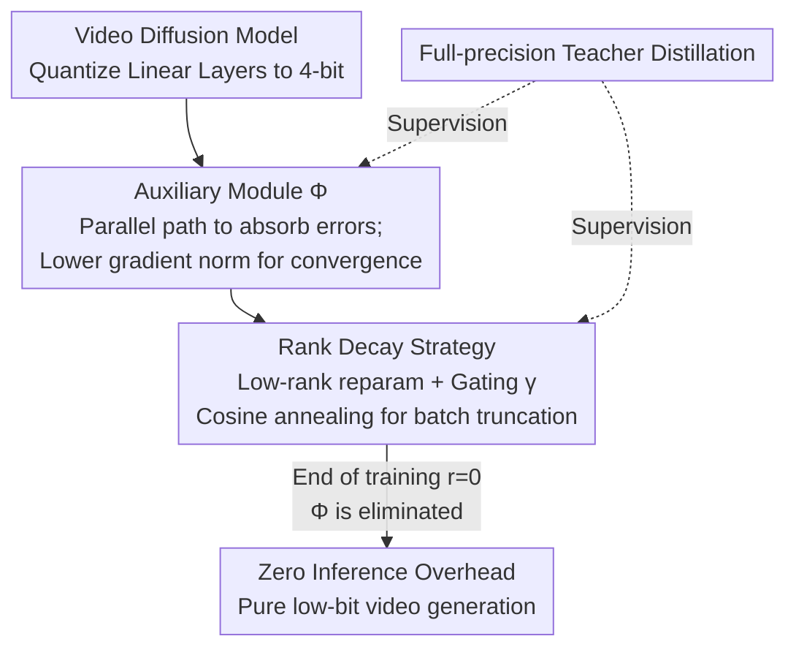

# QVGen: Pushing the Limit of Quantized Video Generative Models

**Conference**: ICLR 2026  
**arXiv**: [2505.11497](https://arxiv.org/abs/2505.11497)  
**Code**: [https://github.com/ModelTC/QVGen](https://github.com/ModelTC/QVGen)  
**Area**: Image Generation  
**Keywords**: Video Diffusion Models, Quantization-Aware Training, Low-bit Quantization, Rank Decay Strategy, Auxiliary Module

## TL;DR

Propose QVGen, a Quantization-Aware Training (QAT) framework for video diffusion models, which introduces an auxiliary module to reduce gradient norms for improved convergence and designs a rank decay strategy to gradually eliminate the inference overhead of the auxiliary module during training, achieving near full-precision video generation quality under 4-bit quantization for the first time.

## Background & Motivation

Video diffusion models (e.g., CogVideoX, Wan) can generate high-quality videos but have extreme computational and memory demands—generating a 10-second 720p video with Wan 14B on a single H100 takes over 30 minutes and 50GB VRAM. Model quantization is an effective compression solution, where 4-bit quantization can achieve approximately $3\times$ speedup and $4\times$ model size reduction.

However, directly transferring quantization methods from image diffusion models to video diffusion models yields poor results. Existing QAT methods (e.g., Q-DM, EfficientDM, LSQ) suffer severe quality degradation under 4-bit video quantization, primarily due to the **convergence difficulties** of quantized video models.

## Method

### Overall Architecture

QVGen aims to solve the "lack of convergence" challenge for video diffusion models under 4-bit quantization. The framework follows a single training timeline: first, linear layers are quantized to 4-bit, and a full-precision **auxiliary module $\Phi$** is connected in parallel to absorb quantization errors and lower gradient norms to ensure convergence. Throughout the training, a full-precision teacher model is used for distillation to keep the quantized student on the correct denoising trajectory. Simultaneously, a **rank decay strategy** reduces the rank of $\Phi$ batch-by-batch. By the end of training, $\Phi$ is "trained away," leaving only pure low-bit computation and zero extra overhead during inference. The former ensures "good training" while the latter ensures "fast execution," and their coordination is key to approximating full-precision performance at extremely low bits.

### Key Designs

**1. Auxiliary Module: Feeding Quantization Errors to Gradients for Low-bit Convergence**

The failure of 4-bit QAT for video diffusion models originates from convergence difficulties. The authors utilize regret analysis to provide an upper bound for average regret: $\frac{R(T)}{T} \leq \frac{dD_\infty^2}{2T\eta_T^m} + \frac{1}{T}\sum_{t=1}^{T}\frac{\eta_t^M}{2}\|\mathbf{g}_t\|_2^2$. When the number of training steps $T$ is large enough, the first term is negligible, making the reduction of the gradient norm $\|\mathbf{g}_t\|_2$ the primary lever for improving convergence. Accordingly, they parallelize an auxiliary module next to each quantized linear layer. The forward pass becomes $\hat{\mathbf{Y}} = \mathcal{Q}_b(\mathbf{W})\mathcal{Q}_b(\mathbf{X}) + \Phi(\mathcal{Q}_b(\mathbf{X}))$, where $\Phi(\mathcal{Q}_b(\mathbf{X})) = \mathbf{W}_\Phi \mathcal{Q}_b(\mathbf{X})$. $\mathbf{W}_\Phi$ is initialized as the weight quantization error $\mathbf{W} - \mathcal{Q}_b(\mathbf{W})$. Thus, $\Phi$ immediately undertakes the bias introduced by quantization and continues to absorb residuals that are difficult to express in low-bit form. Empirically, the gradient norm remains lower than pure QAT throughout training, leading to stable convergence.

**2. Rank Decay Strategy: Making the Auxiliary Module Disappear for Zero Inference Overhead**

The auxiliary module $\Phi$ represents an additional full-precision matrix multiplication during inference, which contradicts the goal of quantization. It must be completely removed before training ends without losing the accumulated convergence benefits. The authors observed through SVD of $\mathbf{W}_\Phi$ that the proportion of small singular values naturally increases during training (from 73% at step 0 to 99% at step 2K), indicating that most components become increasingly weak. Consequently, $\mathbf{W}_\Phi = \sum_{s=1}^d \sigma_s \mathbf{u}_s \mathbf{v}_s^\top$ is rewritten in low-rank form as $\Phi(\mathcal{Q}_b(\mathbf{X})) = \mathbf{L}\mathbf{R}\mathcal{Q}_b(\mathbf{X})$. A rank regularization gate $\boldsymbol{\gamma}$ is applied, making the forward pass $\hat{\mathbf{Y}} = \mathcal{Q}_b(\mathbf{W})\mathcal{Q}_b(\mathbf{X}) + (\boldsymbol{\gamma} \odot \mathbf{L})\mathbf{R}\mathcal{Q}_b(\mathbf{X})$, where $\boldsymbol{\gamma} = \text{concat}([1]_{n \times (1-\lambda)r}, [u]_{n \times \lambda r})$. A portion of the rank is fixed at 1, while others decay from 1 to 0 via cosine annealing controlled by $u$. When $u$ reaches zero, these low-contribution components are truncated, reducing the rank from $r$ to $(1-\lambda)r$. Repeating this in batches until $r=0$ smoothly "trains away" $\Phi$, leaving only pure low-bit operations for inference.

### Loss & Training

Training utilizes knowledge distillation from a full-precision teacher model to align the quantized student in the output space:

$$\mathcal{L} = \mathbb{E}_{\mathbf{x}_0, \mathcal{C}, \tau}\left[\|\hat{\boldsymbol{\epsilon}}_\theta(\mathbf{x}_\tau, \mathcal{C}, \tau) - \boldsymbol{\epsilon}_\theta(\mathbf{x}_\tau, \mathcal{C}, \tau)\|_F^2\right]$$

The introduction of the auxiliary module and rank decay are both performed under this distillation objective, ensuring the student is consistently pulled back to the correct denoising trajectory while $\Phi$ is gradually removed.

## Key Experimental Results

### Main Results

Results on VBench:

| Method | Bits (W/A) | Quality↑ | Dynamic Degree↑ | Scene Consistency↑ |
|------|-----------|----------|----------|-----------|
| CogVideoX-2B Full-prec | 16/16 | 59.15 | 67.78 | 36.24 |
| SVDQuant (PTQ) | 4/6 | 58.27 | 40.83 | 27.69 |
| Q-DM (QAT) | 4/4 | 54.96 | 48.61 | 28.02 |
| **QVGen (Ours)** | **4/4** | **60.16** | **67.22** | **31.42** |
| **QVGen (Ours)** | **3/3** | **58.36** | **53.89** | **23.85** |

3-bit QVGen achieves a $+25.28$ Gain in Dynamic Degree and $+8.43$ Gain in Scene Consistency compared to Q-DM.

### Ablation Study

| Component | FID↓ |
|------|------|
| Without Auxiliary Module (Pure QAT) | Poor Baseline |
| With Auxiliary Module + Direct Decay All Parameters | Suboptimal |
| With Auxiliary Module + Rank Decay ($\lambda=1/2$) | **Best** |

### Key Findings

- QVGen is the first video QAT method to reach quality comparable to full-precision at 4-bit.
- The framework is general and effective across two major video model series: CogVideoX and Wan.
- When applied to Wan 14B (one of the largest open-source models), performance loss on VBench-2.0 is negligible.
- Gradient norm analysis confirms that $\|\mathbf{g}_t\|_2$ for QVGen is consistently lower than for Q-DM.

## Highlights & Insights

- First theoretical analysis of convergence in video QAT, revealing the relationship between gradient norms and convergence.
- The rank decay strategy is elegantly designed, leveraging the natural contraction of singular values during training.
- Significant superiority over all baselines at extremely low bits (3-bit and 4-bit).

## Limitations & Future Work

- High training cost (Wan 14B requires 32×H100 GPUs for 16 epochs).
- Requires a full-precision teacher model for knowledge distillation.
- Currently only validates quantization of linear layers, excluding other components like attention mechanisms.

## Related Work & Insights

- **PTQ Methods**: Post-training quantization methods like ViDiT-Q and SVDQuant show limited effectiveness at extremely low bits.
- **QAT Methods**: Standard quantization-aware training like Q-DM, EfficientDM, and LSQ face convergence challenges on video models.
- **Model Compression**: Alternative compression means including low-rank decomposition and pruning.

## Rating

- Novelty: ⭐⭐⭐⭐ — Novel combination of auxiliary modules and rank decay.
- Theory: ⭐⭐⭐⭐ — Solid theoretical analysis of convergence.
- Experimental Thoroughness: ⭐⭐⭐⭐⭐ — Covers 4 SOTA video models ranging from 1.3B to 14B.
- Value: ⭐⭐⭐⭐⭐ — Directly addresses the critical bottleneck of video model deployment.

<!-- RELATED:START -->

## Related Papers

- [\[NeurIPS 2025\] EditInfinity: Image Editing with Binary-Quantized Generative Models](../../NeurIPS2025/image_generation/editinfinity_image_editing_with_binary-quantized_generative_models.md)
- [\[ICLR 2026\] Purrception: Variational Flow Matching for Vector-Quantized Image Generation](purrception_variational_flow_matching_for_vector-quantized_image_generation.md)
- [\[ICLR 2026\] Scalable Training for Vector-Quantized Networks with 100% Codebook Utilization](scalable_training_for_vector-quantized_networks_with_100_codebook_utilization.md)
- [\[ICLR 2026\] GenCompositor: Generative Video Compositing with Diffusion Transformer](gencompositor_generative_video_compositing_with_diffusion_transformer.md)
- [\[ICLR 2026\] Many-for-Many: Unify the Training of Multiple Video and Image Generation and Manipulation Tasks](many-for-many_unify_the_training_of_multiple_video_and_image_generation_and_mani.md)

<!-- RELATED:END -->
