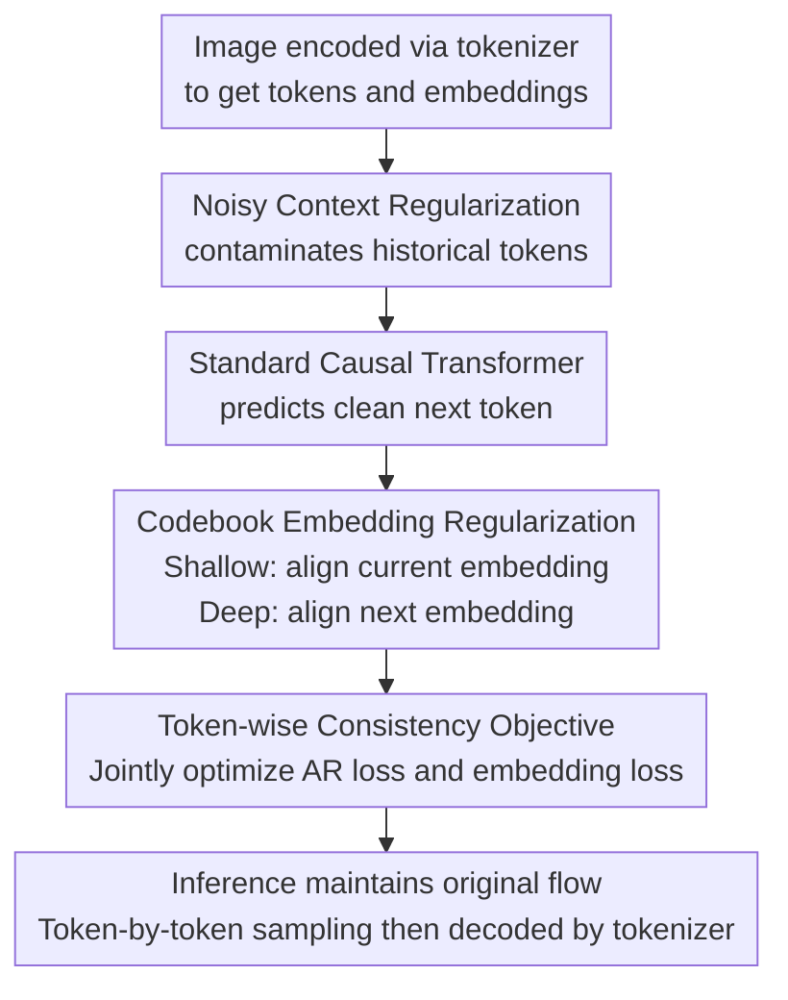

# reAR: Rethinking Visual Autoregressive Models via Token-wise Consistency Regularization

**Conference**: ICLR2026  
**OpenReview**: [https://openreview.net/forum?id=9CpHEbtvA9](https://openreview.net/forum?id=9CpHEbtvA9)  
**Code**: To be released (Anonymous code mentioned in paper, will be public after acceptance)  
**Area**: Image Generation  
**Keywords**: Visual Autoregressive Generation, Discrete Tokenizer, Exposure Bias, Codebook Embedding Regularization, ImageNet Generation  

## TL;DR
reAR argues that the core bottleneck of visual autoregressive generation is not the single-token prediction accuracy itself, but the inconsistency between the discrete token sequence produced by the generator and the tokenizer decoder. By using noisy context regularization and codebook embedding regularization to constrain the hidden representations of each token during training, reAR significantly improves ImageNet image generation quality without altering the tokenizer, generation order, or inference process.

## Background & Motivation
**Background**: Visual autoregressive generation typically compresses images into discrete token sequences using visual tokenizers like VQGAN, MAGVIT, TiTok, or AliTok, and then uses a decoder-only Transformer to predict the next token in raster-scan or other orders. This paradigm is similar to language models, offering hope to incorporate visual generation into a unified autoregressive modeling framework.

**Limitations of Prior Work**: In image generation, standard visual AR still lags behind diffusion models, masked generation, MAR, and VAR paradigms. Existing works mostly attribute this to inadequate tokenizers, unsuitable token sequence orders, or the fact that visual tokens are not naturally 1D language tokens, leading to the design of stronger tokenizers, random generation orders, or next-scale prediction.

**Key Challenge**: This paper argues that the problem is not just that "either the tokenizer or the generator is not strong enough," but rather an interface mismatch between the two. During training, AR models only care whether the discrete token index is predicted correctly, but the tokenizer decoder actually decodes a sequence of codebook embeddings. During inference, the AR model samples based on its own previously generated tokens; once an early error pushes the context out of the tokenizer's training distribution, subsequent tokens may appear locally reasonable but the entire embedding sequence may be difficult for the decoder to reconstruct into a natural image.

**Goal**: The authors aim to make the generator more "tokenizer-friendly" while maintaining the standard visual AR training and inference interfaces. On one hand, the model should continue to predict correct tokens under imperfect contexts to mitigate exposure bias; on the other hand, the generator's hidden features should be aware of the tokenizer's embedding space, ensuring that representations of incorrect tokens remain close to visual semantics acceptable to the decoder.

**Key Insight**: The paper first uses two controlled experiments to demonstrate that the Correct Token Ratio (CTR) is insufficient to explain final image quality. At the same CTR, the positions of incorrect tokens and the degree of context pollution change the LPIPS. Furthermore, if an incorrect token is replaced by another whose embedding is closer to the correct token, the decoded image is actually better. This suggests that the training objective of visual AR needs to explicitly consider the tokenizer's decoding space.

**Core Idea**: Instead of redesigning the tokenizer or changing the raster order, reAR introduces token-wise consistency regularization during training. This forces the model to predict correct tokens within noisy contexts while making shallow hidden features recover the current token embedding and deep hidden features predict the next token embedding.

## Method

### Overall Architecture
reAR is a plug-and-play training regularization framework. Its goal is to allow standard decoder-only visual AR models to learn "how the current token is represented by the tokenizer and where the next token should land in the embedding space" in addition to token index prediction. During training, images are encoded into discrete tokens and codebook embeddings by a frozen visual tokenizer. The AR model receives a context contaminated by random noise but is still required to predict the clean next token, while aligning with tokenizer embeddings at specified layers. During inference, it returns entirely to the original token-by-token sampling process without additional modules.

The key to this framework is "adding constraints during training without changing the interface during inference." Noisy context regularization addresses the issue of unclean historical tokens during AR generation. Codebook embedding regularization addresses the problem where the model only knows token indices but not how the tokenizer decoder interprets embeddings. A joint objective combines both into a single token-wise consistency loss.

### Key Designs
**1. Generator-Tokenizer Consistency: Defining the visual AR bottleneck as "decodability by the decoder"**

The most critical observation of the paper is that the output semantics of visual AR and language AR differ: language tokens are part of the final output, whereas visual tokens are merely intermediate symbols that must pass through a tokenizer decoder to form an image. Thus, even if a token sequence looks similar to the training set at the index level, it does not guarantee that its corresponding embedding sequence can be stably reconstructed by the decoder.

The authors support this by highlighting the inconsistency between CTR and LPIPS. CTR is defined as $CTR(\hat{x}_{1:n}, x_{1:n}) = \frac{1}{n}\sum_i \mathbf{1}\{\hat{x}_i=x_i\}$, which only counts exact token hits. Experiments show that at the same CTR, if incorrect tokens enter the context earlier, subsequent generation deviates more severely, and the LPIPS of the decoded image is higher. Another experiment replaces incorrect tokens with ones closer in embedding space to the correct token; while CTR remains unchanged, LPIPS decreases and PSNR increases, proving that the tokenizer embedding space contains visual similarities not directly utilized by the index loss.

**2. Noisy Context Regularization: Simulating imperfect history during inference via parallel random contamination**

During standard teacher-forcing training, the model sees clean ground-truth historical tokens at every step. During inference, historical tokens come from the model's own sampling, where early errors contaminate subsequent contexts. Instead of using scheduled sampling, which breaks Transformer parallel training, reAR directly applies uniform noise perturbation to the input token sequence: each position is replaced by a random codebook index with probability $\epsilon$, yet the model must still predict the original clean token.

Formally, the noisy input is $\tilde{x}_i=(1-b_i)x_i+b_i u_i$, where $b_i\sim Bernoulli(\epsilon)$ and $u_i\sim Uniform(\{1,\ldots,K\})$. The training objective becomes maximizing $p_\theta(x_i\mid \tilde{x}_{<i})$ conditioned on $\tilde{x}_{<i}$. To prevent a fixed strong noise from causing training collapse, the paper sets $\epsilon\sim U(0,f(t))$ with an annealing schedule. The final choice is a truncated linear schedule $f(t)=\max(0,1-\frac{4}{3}t)$, allowing the model to see more perturbations early on and gradually return to a more stable distribution.

**3. Codebook Embedding Regularization: Enabling hidden layers to understand current tokens and prepare for next visual embeddings**

AR models originally learn token indices only through softmax classification, lacking direct knowledge of whether two tokens in the codebook are visually similar in embedding space. reAR adds a lightweight MLP projection head $h_\phi$ to map Transformer intermediate hidden features to the tokenizer codebook embedding dimension, then uses cosine distance for alignment.

Alignment occurs at two locations: shallow features $w_\theta^l(\tilde{x})$ predict the current token's embedding $z_{x_i}$, and deep features $w_\theta^{l'}(\tilde{x})$ predict the next token's embedding $z_{x_{i+1}}$. Intuitively, shallow layers are closer to the input token representation and are suitable for recovering "what visual token I am currently reading," while deep layers have aggregated context and are suitable for expressing "what visual patch should be generated next." By default, encoding regularization is placed at layer 0, and decoding regularization is placed at approximately three-quarters of the depth (e.g., layer 15 for reAR-S).

**4. Lightweight Joint Objective: Modifying only training loss, not the tokenizer, order, or inference pipeline**

The total objective for reAR is $L_{reAR}(\theta,\phi;t)=L'_{AR}(\theta;t)+\lambda L_{re}(\theta,\phi;t)$, where $L'_{AR}$ is the next-token prediction under noisy context, and $L_{re}$ is the cosine alignment loss for current and next embeddings. The paper defaults to $\lambda=1$ and finds that variations between $0.5$ and $1.5$ have minimal impact.

The engineering value of this design is direct: it does not require retraining the tokenizer, introducing external teachers like DINO-v2, changing the raster order to random, or increasing computation during sampling. Extra parameters come mainly from the 2-layer MLP projection heads (approx. 2.1M for reAR-S/B, 4.2M for reAR-L); training time increases negligibly, e.g., from 8.11 min/epoch for AR-B to 8.14 min/epoch for reAR-B.

### Loss & Training
The visual tokenizer consists of an encoder $E$, quantizer $Q$, and decoder $D$, encoding image $I$ into continuous features $\hat{z}=E(I)$, quantizing them into codebook embeddings $z_q=Q(\hat{z})$, and finally reconstructing the image via $D(z_q)$. Standard AR optimizes $\sum_i \log p_\theta(x_i\mid x_{<i})$ on rasterized token sequences $x_{1:N}$, whereas reAR replaces inputs with noisy history $\tilde{x}_{<i}$.

The AR loss under noisy context is:

$$
L'_{AR}(\theta)=-\mathbb{E}_{x,\tilde{x},\epsilon}\sum_{i=1}^{N}\log p_\theta(x_i\mid \tilde{x}_{i-1},\ldots,\tilde{x}_1)
$$

The embedding regularization term is:

$$
L_{re}=\mathbb{E}_{x,\tilde{x},\epsilon}\sum_{i=1}^{N-1}\left[d(h_\phi^i(w_\theta^l(\tilde{x})),z_{x_i})+d(h_\phi^i(w_\theta^{l'}(\tilde{x})),z_{x_{i+1}})\right]
$$

where $d(\cdot,\cdot)$ is the cosine distance. In implementation, the main experiments use the MaskGIT VQGAN tokenizer, and the AR backbone is a DiT-style causal Transformer. reAR-S/B/L use 20/24/24 layers with hidden sizes of 768/768/1024. Training is conducted on ImageNet-1K 256×256 for 400 epochs, with batch size 2048, AdamW, and a learning rate warmed up to $4\times10^{-4}$ over 100 epochs before decaying to $1\times10^{-5}$. Classifier-free guidance is supported with a class label dropout of 0.1.

## Key Experimental Results

### Main Results
The main experiments compare FID and IS on ImageNet-1K 256×256 class-conditional generation. The core finding is that under standard raster-order causal AR settings, reAR reduces the FID of vanilla AR from 3.02 to 1.86 without relying on advanced tokenizers or random orders, approaching or exceeding more complex paradigms with fewer parameters.

| Method | Paradigm / Tokenizer | Params | Training Epochs | FID↓ | IS↑ |
|------|----------------------|--------|----------|------|-----|
| DiT-XL | diffusion / Patch-VAE | 675M | 1400 | 2.27 | 278.2 |
| REPA | diffusion + representation alignment | 675M | 800 | 1.42 | 305.7 |
| MAR-L | continuous masked autoregressive | 479M | 800 | 1.98 | 290.3 |
| VAR-d30 | next-scale prediction | 2.0B | 350 | 1.92 | 323.1 |
| LlamaGen-XXL | raster causal AR / Patch-VQ | 1.4B | 300 | 2.34 | 253.9 |
| AR-L† | raster causal AR / Patch-VQ | 461M | 400 | 3.02 | 256.2 |
| reAR-S | raster causal AR / Patch-VQ | 201M | 400 | 2.00 | 295.7 |
| reAR-B | raster causal AR / Patch-VQ | 261M | 400 | 1.91 | 300.9 |
| reAR-L | raster causal AR / Patch-VQ | 461M | 400 | 1.86 | 316.9 |

reAR's generalization experiments are also critical. It improves not only standard patch tokenizers but also works with non-standard tokenizers like TiTok and AliTok. With AliTok, reAR-B-AliTok (177M parameters) achieves an FID of 1.42, matching the diffusion-based REPA (675M parameters).

| Method | Tokenizer / Setting | Params | Training Epochs | FID↓ |
|------|------------------|--------|----------|------|
| AR-TiTok-b64 | TiTok | 261M | 400 | 4.45 |
| RAR-TiTok-b64 | TiTok + randomized AR | 261M | 400 | 4.07 |
| reAR-TiTok-b64 | TiTok + reAR | 261M | 400 | 4.01 |
| AR-AliTok-B | AliTok | 177M | 800 | 1.50 |
| RAR-B-AliTok | AliTok + randomized AR | 177M | 800 | 1.52 |
| reAR-B-AliTok | AliTok + reAR | 177M | 800 | 1.42 |

### Ablation Study
Ablations focus on two questions: how to set the noisy context for stability, and at which layer the embedding regularization is most effective. Noise experiments show that fixed large noise disrupts training, while random noise and an annealing schedule provide stable gains.

| Configuration | FID↓ | Description |
|------|------|------|
| $\epsilon=0.0$ | 2.12 | Only embedding regularization, no noisy context |
| $\epsilon=0.25$ | 2.08 | Fixed moderate noise gives slight gains |
| $\epsilon=0.5$ | 3.15 | Fixed strong noise significantly degrades quality |
| $\epsilon\sim U(0,0.5)$ | 2.05 | Random noise per sequence is more stable than fixed |
| $\epsilon\sim U(0,f(t)), f(t)=1-t$ | 2.02 | Further improvement with annealing |
| $\epsilon\sim U(0,f(t)), f(t)=\max(0,1-\frac{4}{3}t)$ | 2.00 | Truncated linear annealing is optimal |
| w/o embedding regularization | 2.18 | Only noisy context, weaker than joint regularization |

Layer selection for embedding regularization is also deliberate. Shallow encoding regularization (EN) works best at layer 0, and deep decoding regularization (DE) is optimal around layer 15. Simply tying codebook embeddings yields little gain, suggesting "soft regularization of hidden features" is superior to "hard embedding sharing."

| Regularization Config | FID↓ | IS↑ | Description |
|----------|------|-----|------|
| Vanilla AR | 21.32 | 57.3 | 80 epochs, small model analysis setting |
| + tied codebook embedding | 21.08 | 57.2 | Direct sharing is almost ineffective |
| + DE@10 | 21.29 | 57.5 | Decoding regularization too early, small gain |
| + DE@15 | 20.03 | 61.0 | Deep but not final layer works better |
| + DE@20 | 20.28 | 61.2 | Slight degradation if too late |
| + EN@5 + DE@15 | 21.36 | 57.4 | Deep encoding regularization hurts generation |
| + EN@0 + DE@15 | 19.72 | 61.3 | Final choice |
| $\lambda=0.5$ | 19.79 | 60.9 | Weight variation has small impact |
| $\lambda=1.5$ | 19.74 | 61.5 | Weight variation has small impact |

### Key Findings
- The gains of reAR primarily stem from the joint effect of noisy context regularization and codebook embedding regularization; each improves results individually (FID 2.18 and 2.12 respectively), but combined they reach 2.00.
- Token index metrics do not always align with final image quality; under the same CTR, the position of historical errors and their embedding proximity affect decoder output, supporting the diagnosis of generator-tokenizer inconsistency.
- reAR maintains the sampling speed advantage of AR. Using KV-cache, reAR-B-AliTok outperforms various parallel-decoding methods in both FID and throughput.
- Scaling behavior is preserved: FID consistently drops for reAR-S/B/L as training steps increase, indicating the regularization does not disrupt the scaling of visual AR.

## Highlights & Insights
- The most valuable contribution is shifting the failure analysis of visual AR from "is the tokenizer advanced enough" to "is the generator output suitable for the decoder." This explains why identical token accuracy can lead to different image qualities and ties the training objective closer to pixel quality.
- The method is highly restrained: it only adds noisy inputs and embedding alignment during training, without changing the inference pipeline. This is easier to implement for teams with existing large-scale AR pipelines than switching tokenizers, changing generation orders, or introducing external visual teachers.
- The paper avoids forcing codebook embeddings into the input or output heads, choosing instead to inject tokenizer inductive bias through soft regularization of intermediate layers. This suggests representation alignment in visual generation does not strictly require external models and can occur between a generator and its own tokenizer.
- The layer selection analysis is insightful: shallow layers handle current token understanding, while deep layers prepare for the next token, and the final layer, being closer to the classification boundary, may not be ideal for aligning with original codebook embeddings. This strategy can be migrated to video AR, audio tokens, or unified multi-modal token generation.

## Limitations & Future Work
- The paper primarily validates on ImageNet 256×256 class-conditional generation; while a common benchmark, this is insufficient to prove gains in text-to-image, controllable generation, or high-resolution open-domain scenarios.
- Layer selection for decoding regularization still relies on heuristics and CKA analysis. Optimal layers might change across different backbones, tokenizers, or sequence lengths; future work could explore adaptive layer selection or multi-layer weighted alignment.
- reAR assumes the tokenizer codebook embeddings themselves represent a visual space worth aligning to; if a tokenizer is poorly trained or its embedding geometry is unstable, regularization might pull the generator toward an undesirable space.
- Noisy context uses uniform random token replacement, which does not perfectly match the distribution of actual inference errors. A more advanced direction would be using the model's own high-probability errors, embedding-nearest errors, or curriculum rollouts for more realistic training perturbations.
- There is no deep discussion on misuse risks arising from enhanced generation capabilities, only a brief acknowledgment in the ethics section that high-fidelity generation might lower the barrier for synthetic media misuse. Watermarking and detection remain necessary for open-domain applications.

## Related Work & Insights
- **vs LlamaGen / Standard Raster AR**: LlamaGen proved decoder-only AR works for images but primarily optimized next-token prediction. reAR retains the same raster causal AR inference while fixing tokenizer consistency through the training objective, achieving lower FID with fewer parameters.
- **vs RAR / RandAR**: These mitigate inconsistency via random ordering or positional mechanisms. reAR maintains the generation order but constrains the generator via noisy context and embedding alignment, allowing it to adapt to various tokenizers like TiTok and AliTok.
- **vs TiTok / AliTok / FlexTok**: These focus on making the tokenizer more compatible with 1D or unidirectional modeling. reAR shows that even with such tokenizers, explicitly aligning with their embeddings during generator training continues to yield quality improvements.
- **vs REPA**: REPA aligns diffusion Transformers with external visual representations (e.g., DINO-v2) to accelerate training. reAR aligns visual AR with its own tokenizer's codebook embeddings, avoiding external teachers and fitting better into the discrete token decoding chain.
- **vs MAR / VAR**: Both change the generation paradigm using continuous masked generation or next-scale prediction. reAR serves as a low-intrusion enhancement for standard decoder-only AR, making it attractive for routes aiming to unify visual and language generation interfaces.

## Rating
- Novelty: ⭐⭐⭐⭐⭐ Clear diagnosis of the generator-tokenizer inconsistency as the visual AR bottleneck, combining exposure bias and embedding unawareness into a single regularization framework.
- Experimental Thoroughness: ⭐⭐⭐⭐ Comprehensive results across main experiments, tokenizer generalization, and detailed ablations; however, open-domain text-to-image and high-resolution scenarios are missing.
- Writing Quality: ⭐⭐⭐⭐ Logical flow with controlled experiments effectively motivating the method; minor layout issues in some formulas/schedules, but they do not hinder core understanding.
- Value: ⭐⭐⭐⭐⭐ Lightweight method, compatible with existing AR pipelines, and zero additional inference cost. Highly relevant for visual AR's competition with diffusion and unified multi-modal autoregressive generation.

<!-- RELATED:START -->

## Related Papers

- [\[ICLR 2026\] Hyperspherical Latents Improve Continuous-Token Autoregressive Generation](hyperspherical_latents_improve_continuous-token_autoregressive_generation.md)
- [\[ICLR 2026\] Group Critical-token Policy Optimization for Autoregressive Image Generation](group_critical-token_policy_optimization_for_autoregressive_image_generation.md)
- [\[ICLR 2026\] Scale-wise Distillation of Diffusion Models](scale-wise_distillation_of_diffusion_models.md)
- [\[ICLR 2026\] BAR: Refactor the Basis of Autoregressive Visual Generation](bar_refactor_the_basis_of_autoregressive_visual_generation.md)
- [\[ICLR 2026\] Continual Unlearning for Text-to-Image Diffusion Models: A Regularization Perspective](continual_unlearning_for_text-to-image_diffusion_models_a_regularization_perspec.md)

<!-- RELATED:END -->
