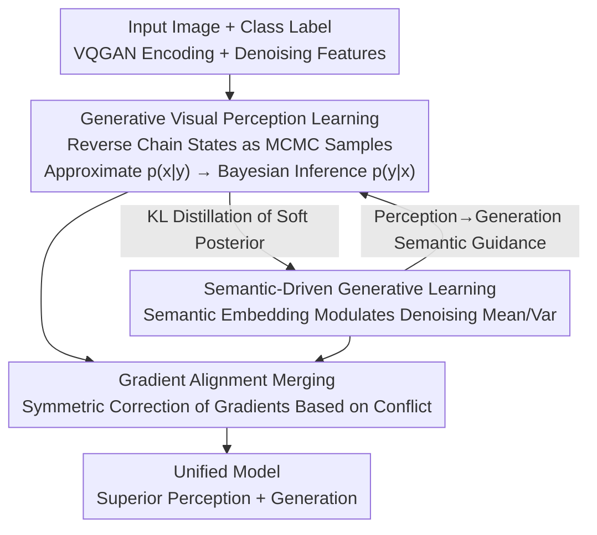

# Reconciling Visual Perception and Generation in Diffusion Models

**Conference**: ICLR 2026  
**OpenReview**: [https://openreview.net/forum?id=yKC3CaFg8K](https://openreview.net/forum?id=yKC3CaFg8K)  
**Code**: Open-sourced (labeled as GenRep in the paper, refer to the original text for links)  
**Area**: Diffusion Models / Unified Perception and Generation  
**Keywords**: Diffusion Models, Unified Perception and Generation, Monte Carlo Approximation, Gradient Alignment, Representation Learning

## TL;DR
GenRep performs discriminative perception and generative modeling simultaneously within a single diffusion model. It uses Monte Carlo methods to distill distribution knowledge from the diffusion model to perception tasks and conversely utilizes high-level semantics learned by perception to guide the generative denoising process. By employing gradient alignment to coordinate the two objectives, GenRep achieves leading performance across both perception and generation benchmarks.

## Background & Motivation
**Background**: Computer vision has long been bifurcated: visual understanding follows discriminative representation learning (mapping pixels to category-discriminating features), while image generation follows generative modeling (learning the underlying distribution of data to synthesize new samples). These pathways utilize different technical paradigms, and most works excel in only one area.

**Limitations of Prior Work**: The authors decompose the costs of this fragmentation into three points: ① Discriminative learning focuses solely on inter-class decision boundaries, leading to poor generalization on unseen patterns and neglect of fine-grained details since it does not characterize the underlying data distribution like generative models. ② Generative models such as GANs and diffusion rely on low-level reconstruction losses, resulting in a lower level of semantic understanding compared to discriminative methods. ③ The two sets of technical protocols operate in isolation, making it difficult for innovations in one paradigm to benefit the other.

**Key Challenge**: Discriminative representation learning "draws decision boundaries but lacks distribution knowledge," while generative modeling "understands distribution but remains semantically low-level." Each is incomplete, yet they are optimized as two independent problems, with neither compensating for the other's shortcomings.

**Goal**: To retain both generative and understanding capabilities within the **same model** and enable them to mutually benefit each other, rather than sacrificing generation for perception or semantics for generation as seen in previous works.

**Key Insight**: The authors leverage two validated observations: i) Diffusion models can assist downstream visual perception tasks; ii) High-quality discriminative representations can accelerate the generative learning of diffusion models. This indicates a potential commonality between the representations learned by the two paradigms, serving as the foundation for a unified framework.

**Core Idea**: Distill the distribution knowledge of the diffusion model to perception (Generation → Perception), while using the semantics learned by perception to guide generative denoising (Perception → Generation), and coordinate the two losses via gradient alignment to form a positive feedback loop.

## Method

### Overall Architecture
GenRep is built upon a pre-trained diffusion model (CNN-based LDM or ViT-based DiT), where perception and generation branches are jointly trained by hooking onto the same set of attention blocks in the denoising network. In the preparation phase, standard practices are followed: input images are encoded into latent space using VQGAN, and a "noise-free" forward pass is performed with class labels as conditions to obtain discriminative features. Intermediate outputs from multiple decoder blocks of the denoising network are then aggregated and fed into task-specific decoders.

Building on this, GenRep introduces three interlocking components: **Generative Visual Perception Learning** treats intermediate states of the reverse diffusion chain as Monte Carlo samples to approximate the class-conditional distribution $p(x|y)$, followed by Bayesian inference of the posterior $p(y|x)$ to supervise discriminative learning; **Semantic-Driven Generative Learning** conversely uses semantic embeddings $x_{sem}$ learned from the perception branch to dynamically modulate the mean and variance of the denoising process, aligning generation with target semantics; **Gradient Alignment** symmetrically corrects the gradients of the two losses based on their conflict level before merging updates, allowing both objectives to coexist within the same weights. These create a positive feedback loop: "More accurate perception → stronger semantics → better generation → more reliable distribution knowledge → more accurate perception."

### Key Designs

**1. Generative Visual Perception Learning: Distilling Distribution Knowledge via Diffusion Reverse Chains as Monte Carlo Samples**

To address the issue where "discriminative models only draw decision boundaries and do not understand distributions," the authors aim to use the class-conditional distribution $p(x|y)$ implicit in diffusion models as additional supervision for perception. Since $p(x|y)$ cannot be calculated exactly, it is approximated via MCMC: the reverse diffusion process $x_T \to x_{T-1} \to \cdots \to x_0$ is naturally a non-stationary Markov chain, where each transition kernel $p_\theta(x_{t-1}|x_t)=\mathcal{N}(x_{t-1};\mu_\theta(x_t,t),\sigma_\theta(x_t,t))$ acts like a sample from a sequence of transitions in MCMC. Using the entire chain directly has two flaws: early stages are close to pure noise with poor sample quality, and adjacent samples are temporally correlated, violating the independence assumption of Monte Carlo. The authors address these using two standard MCMC techniques—**burn-in** to discard the first $m$ uninformative samples, and **thinning** to take a sample every $k$ steps to reduce correlation (experimentally, $k=2, m=50$ is optimal). Thus, the trajectory of a single reverse process can estimate $p(x|y)\approx \frac{1}{T}\sum_{t=1}^{T}\mathcal{N}(x;\mu_{t,y},\sigma_{t,y})$, avoiding the overhead of running multiple full denoising processes for every condition $y$ in standard Monte Carlo.

Once $p(x|y)$ is obtained, a uniform prior $p(y)=1/|Y|$ is substituted into the Bayesian formula to derive the posterior $p(y|x)=\frac{p(y)p(x|y)}{\sum_{y'}p(y')p(x|y')}$, which is then used to constrain the softmax output $q(y|x)$ of the discriminative head:

$$\mathcal{L}_{\text{gen\_distil}}=D_{KL}(p\|q)=\sum_{y\in Y}p(y|x)\log\frac{p(y|x)}{q(y|x)}$$

The total perception loss is $\mathcal{L}_{\text{percept}}=\mathcal{L}_{\text{disc}}+\mathcal{L}_{\text{gen\_distil}}$. Unlike standard discriminative losses that encourage overconfidence, the generative likelihood provides a "soft posterior" that truthfully preserves ambiguity between similar categories, leading to lower calibration error. Compared to prior work (Li et al. 2023a) using diffusion for distribution estimation via noise prediction error of forward diffusion to approximate $\log p(x|y)$, this paper directly averages Gaussian probability densities predicted by the reverse process and requires significantly fewer diffusion steps (~200 vs 1000).

**2. Semantic-Driven Generative Learning: Modulating Denoising Mean and Variance with Learned Semantic Embeddings**

To address the "semantically low-level" nature of generative models, the authors allow generation to benefit from the perception branch. Assuming a denoising network optimized for perception, its intermediate output $x_{sem}$ is rich in high-level semantics. During reverse denoising, the mean and variance of the noise distribution are dynamically modulated by $x_{sem}$. A semantic correction term is added to the mean: $\mu_\theta(x_t,t,x_{sem})=\mu_\theta^{base}(x_t,t)+f_{sem}^\mu(x_t,x_{sem})$, where $f_{sem}^\mu=W_t^\mu\cdot\mathrm{concat}(x_t,x_{sem})$—since the mean determines the primary denoising direction, this term pulls the trajectory towards the target semantics. The variance is scaled by a semantic factor: $\sigma_\theta(x_t,t,x_{sem})=\sigma_\theta^{base}(x_t,t)\cdot(1+f_{sem}^\sigma(x_{sem}))$, with $f_{sem}^\sigma=\mathrm{MLP}(x_{sem})$ mapping to a scalar: positive values expand the variance to encourage broader exploration when samples are far from the target, while negative values shrink the variance to facilitate fine-grained refinement near the target.

The generative objective is $\mathcal{L}_{\text{genera}}=\mathcal{L}_{LDM}+\mathcal{L}_{\text{rep\_align}}$, with the latter minimizing the cosine similarity between $x$ and $x_{sem}$ for representation alignment. A practical detail: at inference time, explicit $x_{sem}$ is no longer needed and can be replaced by the current noisy sample $x_t$, as the enhanced denoising network has already encoded semantic cues into its weights.

**3. Gradient Alignment for Weight Merging: Symmetric Correction of Gradient Directions Based on Conflict**

Combining the perception loss $\mathcal{L}_{\text{percept}}$ and generation loss $\mathcal{L}_{\text{genera}}$ into the same set of weights causes directional conflict. The authors decompose each gradient into parallel and orthogonal components relative to the other: the parallel component represents motion in the same/opposite direction as the other task, while the orthogonal component is the direction that does not affect the other objective. During gradient reconstruction, **orthogonal components are fully retained, while parallel components are decayed**: $\nabla^{aligned}=\nabla^{\perp}+\alpha\nabla^{\parallel}$. The decay coefficient $\alpha$ is adaptively determined by the cosine similarity of the two gradients: $\alpha=((\cos\_sim+1)/2)^k$ ($k=2$); when gradients are perfectly aligned ($\cos\_sim=1$), $\alpha=1$ (no decay), and as they trend toward opposite directions ($\cos\_sim\to-1$), the decay becomes more severe. The final update uses a weighted sum of the symmetrically aligned gradients: $\nabla^{aligned}_{symmetric}=w_p\nabla^{aligned}_{percept}+w_g\nabla^{aligned}_{genera}$ ($w_p=0.7, w_g=0.3$). In this way, non-conflicting information is preserved, while conflicts are smoothly suppressed according to their severity, allowing both objectives to be optimized in balance.

### Loss & Training
Training proceeds in two stages. First, the denoising network $\epsilon_\theta^{sem}$ is trained using only the perception loss $\mathcal{L}_{\text{percept}}$ to encode semantics into the intermediate output $x_{sem}$. Subsequently, the generation loss $\mathcal{L}_{\text{genera}}$ is introduced, and a unified network $\epsilon_\theta^{unified}$ is initialized from $\epsilon_\theta^{sem}$. In each step: gradients for both losses are calculated simultaneously for the same input image; the attention blocks of $\epsilon_\theta^{unified}$ are updated via gradient alignment; and the parameters of $\epsilon_\theta^{sem}$ are updated via momentum $\theta_{sem}\leftarrow m\theta_{sem}+(1-m)\theta_{unified}$ ($m=0.999$) to maintain stable semantic features for generative learning. The backbones used are LDM-8 / DiT-XL, with DDPM inference for 200 / 250 steps, initialized with ImageNet and LAION pre-trained weights respectively to align with different baselines.

## Key Experimental Results

### Main Results
Spanning nine datasets and two major task categories (perception and generation), the model reaches or approaches State-of-the-Art (SOTA).

| Task / Dataset | Metric | GenRep | Prev. SOTA | Note |
|--------|------|------|----------|------|
| Fine-grained Classification CUB-200 | Top-1↑ | 92.9 | 91.8 (Li 2023a) | LAION-5B pre-trained |
| OOD Generalization ObjectNet | Top-1↑ | 57.8 | 52.5 (Li 2023a) | +5.3% over diffusion baseline |
| Depth Estimation NYUv2 | AbsRel↓ | 0.057 | 0.059 (ECoDepth) | Approaches DepthAnything (0.056) trained on 62M samples |
| Closed-set Segmentation ADE20K | mIoU↑ | 54.6 | 53.7 (VPD) | LDM backbone |
| Open-vocabulary Segmentation ADE20K | mIoU↑ | 34.7 | 28.7 (ODISE) | +6.0% |
| Open-vocabulary Detection MS COCO | AP$^n_{50}$↑ | 43.4 | 37.4 (SAS-Det) | DiT backbone |
| Class-conditional Gen. ImageNet | FID↓ | 2.09 | 2.27 (DiT-XL) | GenRep exceeds baseline |
| Generation CelebA-HQ | FID↓ | 3.84 | 5.11 (LDM-4) | +GenRep |

Notably, while previous diffusion perception methods often sacrificed generation capability, GenRep actually improves the generation FID of the LDM/DiT baselines (ImageNet 2.27→2.09, CelebA-HQ 5.11→3.84, LSUN-Churches 4.02→3.12), confirming "mutual benefit" rather than a trade-off.

### Ablation Study

| Configuration | Top-1↑ | mIoU↑ | FID↓ | Note |
|------|--------|-------|------|------|
| Baseline (None) | 45.4 | 27.8 | 13.27 | Pure diffusion backbone |
| + Generative Perception Learning | 47.8 | 30.9 | 12.96 | Perception gain |
| + Semantic-Driven Generation | 44.1 | 25.6 | 7.45 | Drastic generation improvement |
| + Both Combined | 49.4 | 31.5 | 7.23 | Positive feedback emerges, both improve |
| + Gradient Alignment (Full) | 51.1 | 32.5 | 6.92 | All three optimal |

### Key Findings
- **Positive feedback definitely exists**: Adding generative perception or semantic-driven generation individually only improves one side, whereas using both together causes perception and generation to rise simultaneously (49.4/31.5/7.23), proving they nourish each other. Adding gradient alignment further unifies the optimization, reaching the best performance across all metrics.
- **Clear trade-off in hyperparameters**: A thinning interval of $k=2$ is optimal (large $k$ yields too few samples and high variance in distribution estimation); a burn-in discard of $m=50$ balances "removing noise-heavy early stages" with "retaining sufficient samples."
- **Calibration and Robustness**: Expected Calibration Error (ECE) decreases across the board with $\mathcal{L}_{\text{gen\_distil}}$ (ObjectNet 0.237→0.208, CUB-200 0.095→0.076), as the soft posterior mitigates overconfidence. On ObjectNet, as noise is gradually added to the input ($t=0\to50$), GenRep only drops from 51.1 to 37.2, whereas Swin-Transformer collapses from 40.3 to 4.6, demonstrating the significantly stronger robustness brought by distribution modeling.
- **Symmetric alignment is superior to unidirectional**: Aligning only the generation gradient yields 48.7/30.3/6.79, while symmetric alignment of both gradients yields 50.1/32.5/6.92, providing better overall balance.

## Highlights & Insights
- **Applying MCMC burn-in/thinning to diffusion reverse chains**: Instead of running massive full denoising for every class, GenRep reuses intermediate states of a single reverse trajectory as samples to estimate $p(x|y)$. This is an ingenious, low-cost way to inject generative distribution knowledge into perception via a "soft posterior" supervisor.
- **Semanic-to-generation backflow via "modulating noise parameters" rather than "concatenating conditions"**: Directly altering the mean direction and variance magnitude of denoising has a very intuitive physical meaning, where variance signs correspond to "broad exploration when far" and "fine-grained refinement when near."
- **Gradient alignment with orthogonal preservation and parallel suppression**: Continuously decaying multi-task conflicts based on cosine similarity rather than hard gradient projection allows for smoother optimization. This logic is transferable to any joint "discriminative + generative" or general multi-task learning scenario.
- **The most striking "Aha!" moment is the empirical proof of mutual benefit**: The ablation shows that while individual directions only help one side, their combination causes both to rise, truly establishing that the "unified model > the sum of two independent models."

## Limitations & Future Work
- The framework relies on class labels as conditions to estimate $p(x|y)$ and assumes a uniform prior. Its approximation quality in unlabeled, open-class, or long-tail distribution scenarios is not fully explored.
- The two-stage training + momentum teacher + gradient alignment makes the training pipeline heavy. There are many interconnected hyperparameters ($k, m, k_{damp}, w_p/w_g$), leading to high replication and tuning costs.
- Generation evaluation is focused on ImageNet/CelebA-HQ/LSUN—relatively structured class-conditional settings. Whether "semantic-driven modulation" remains effective in more open generative scenarios like text-to-image remains to be verified.
- Replacing $x_{sem}$ directly with $x_t$ during inference is an engineering approximation; the quantitative impact on semantic guidance precision lacks detailed analysis.

## Related Work & Insights
- **vs. Diffusion Perception Methods (VPD / ODISE / Li 2023a)**: These use diffusion as a perception backbone or approximate distributions via forward noise error, often at the cost of generation ability. GenRep directly averages Gaussian densities from the reverse process with fewer steps and explicitly improves generation.
- **vs. Unidirectionally Beneficial Work**: Most prior works are one-sided ("discriminative for generative" or vice-versa). GenRep builds a bidirectional feedback loop via gradient alignment, enabling mutual improvement.
- **vs. LLM-based Unified Understanding-Generation (Tokenizer-Detokenizer types)**: Those use autoregressive tokens to link modalities. GenRep follows a pure diffusion route, injecting high-level perception semantics directly into denoising sampling, avoiding the semantic limitations of low-level reconstruction.

## Rating
- Novelty: ⭐⭐⭐⭐⭐ Assembling MCMC distribution estimation + semantic noise modulation + gradient alignment into a truly mutually beneficial unified framework is a fresh perspective.
- Experimental Thoroughness: ⭐⭐⭐⭐⭐ Nine datasets covering classification, depth, segmentation, detection, and generation, complete with ablation, calibration, robustness, and hyperparameter analysis.
- Writing Quality: ⭐⭐⭐⭐ The methodology derivation is clear and motives are progressive, but notations and two-stage training details are dense, requiring careful reading.
- Value: ⭐⭐⭐⭐⭐ Provides a feasible and high-performance diffusion paradigm for "perception and generation unification," with reusable components like gradient alignment.

<!-- RELATED:START -->

## Related Papers

- [\[CVPR 2026\] UniPercept: A Unified Diffusion Model for Generalizable Visual Perception](../../CVPR2026/image_generation/unipercept_a_unified_diffusion_model_for_generalizable_visual_perception.md)
- [\[ICLR 2026\] Next Visual Granularity Generation](next_visual_granularity_generation.md)
- [\[ICLR 2026\] Product of Experts for Visual Generation](product_of_experts_for_visual_generation.md)
- [\[ICLR 2026\] VMDiff: Visual Mixing Diffusion for Limitless Cross-Object Synthesis](vmdiff_visual_mixing_diffusion_for_limitless_cross-object_synthesis.md)
- [\[ICLR 2026\] Synthetic History: Evaluating Visual Representations of the Past in Diffusion Models](synthetic_history_evaluating_visual_representations_of_the_past_in_diffusion_mod.md)

<!-- RELATED:END -->
