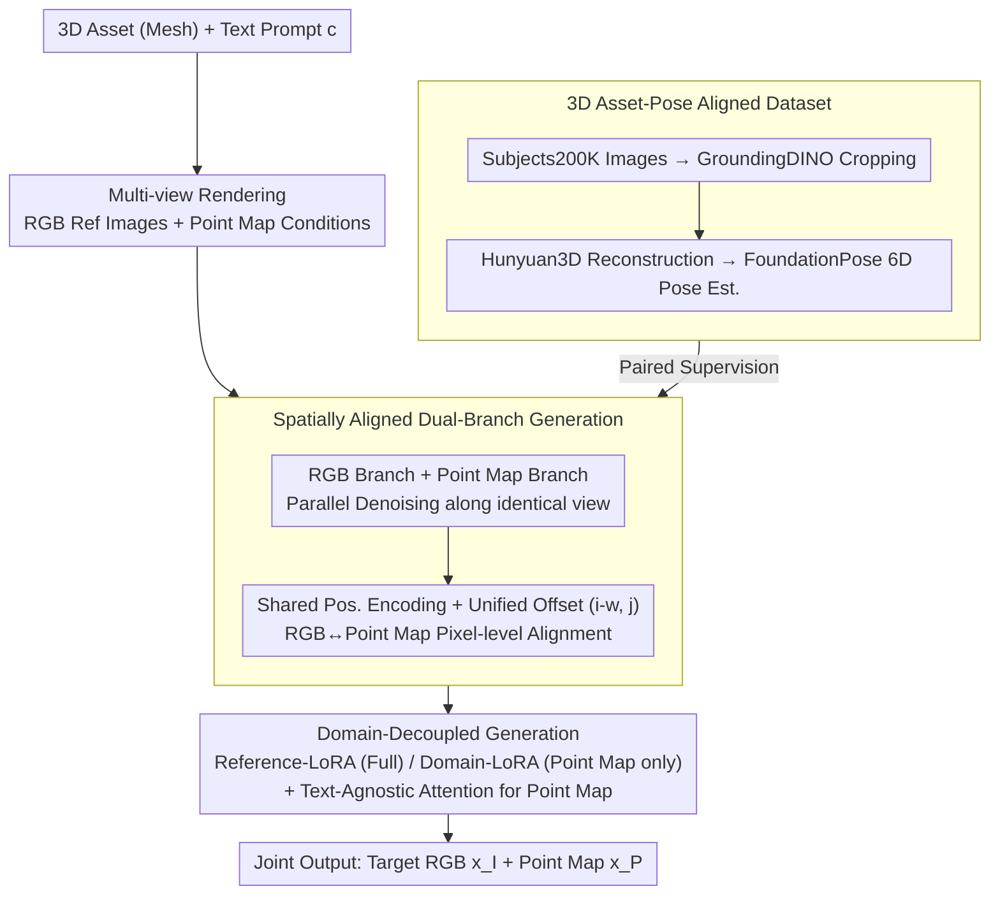

# RefAny3D: 3D Asset-Referenced Diffusion Models for Image Generation

**Conference**: ICLR 2026  
**arXiv**: [2601.22094](https://arxiv.org/abs/2601.22094)  
**Code**: [https://judgementh.github.io/RefAny3D](https://judgementh.github.io/RefAny3D)  
**Area**: 3D-guided Image Generation / Diffusion Models  
**Keywords**: 3D asset reference, dual-branch generation, point map, domain decoupling, subject-driven generation  

## TL;DR

RefAny3D is proposed as a 3D asset-referenced image generation framework. By employing a dual-branch generation strategy that jointly models RGB images and point maps, it achieves precise geometric and textural consistency between the generated images and the 3D reference assets.

## Background & Motivation

**Background**: Existing reference-based image generation methods (e.g., IP-Adapter, OminiControl) rely on 2D reference images and cannot effectively utilize 3D assets. In practical creation, designers often need to use 3D assets such as meshes as references to visualize the same object in different scenes and under various perspectives.

**Limitations of Prior Work**: Utilizing 3D assets for reference generation faces three major challenges. First is **insufficient consistency**, where generated results struggle to align precisely with the geometry and texture of the asset. Second is **limited perspective**, as a single reference image cannot cover the full appearance of an object. Third is **perspective conflict**, as multi-image conditioning methods lack 3D structural priors, frequently leading to geometric drift and inconsistency across views.

**Core Idea**: RefAny3D uses multi-view RGB and corresponding point maps of 3D assets as conditions. It allows the point map to act as a geometric anchor, generated in parallel with the RGB branch, thereby structurally constraining the generated result to "stick" to the 3D reference.

## Method

### Overall Architecture

RefAny3D is built upon the Flux.1-dev diffusion model. It takes multi-view RGB images and corresponding point maps of 3D assets as conditions to jointly generate the target RGB image $x_I$ and its point map $x_P$ during denoising. The entire task is formalized as joint distribution modeling $p(x_I, x_P \mid y, c)$, where $y$ is the reference 3D model and $c$ is the text prompt. The point map branch serves as a geometric anchor: it undergoes parallel denoising with the RGB branch along the same perspective. It achieves pixel-level alignment via **shared position encoding** (Design 1), separates the informational responsibilities of RGB and point maps through **dual-LoRA domain decoupling** to avoid mutual contamination (Design 2), and utilizes a self-built **dataset construction pipeline** to provide paired supervision from "image-3D asset-pose" triplets (Design 3).

### Key Designs

**1. Spatially Aligned Dual-Branch Generation: Pixel-level Correspondence**

Simply feeding 3D assets as rendered reference images makes it difficult for the model to determine which pixel in the generated image corresponds to which surface point on the asset, leading to geometric drift across views. RefAny3D performs parallel denoising for RGB and point maps along the same perspective and applies **shared position encoding** to tokens of both within the same view. Leveraging the property that closer position encodings in DiT result in higher attention scores, RGB tokens and point map tokens at the same spatial location naturally align. To avoid bias caused by inconsistent arrangement distances among multiple conditional tokens, a unified position offset $(i-w, j)$ is introduced to bring all conditional tokens into a consistent relative coordinate system, stabilizing the RGB-to-geometry correspondence at the pixel level.

**2. Domain-Decoupled Generation: Resolving Information Asymmetry**

RGB and point maps inherently carry asymmetrical information: point maps describe 3D geometry and pose, while RGB must render realistic details of the entire scene. Fitting both with a single set of parameters causes background information to contaminate geometry, producing artifacts. RefAny3D splits responsibilities using two sets of LoRAs—**Reference-LoRA** is activated for all conditional tokens to drive reference-based generation, while **Domain-LoRA** is activated only for point map tokens to absorb point-map-specific geometric knowledge. Additionally, a **text-agnostic attention** mask is added to the point map branch to shield point maps from text tokens, preventing background descriptions in the prompt from leaking into the geometric channel and ensuring the point map remains a clean structural representation.

**3. 3D Asset-Pose Aligned Dataset: Training Supervision**

As this task lacks ready-made "image-3D asset-pose" triplets, the authors built a data pipeline based on Subjects200K. GroundingDINO is used to box and crop target objects from images, followed by Hunyuan3D to reconstruct the cropped objects into 3D assets. Finally, FoundationPose estimates the 6D pose of the asset within the original image. This strictly aligns every image with a posed 3D reference, providing paired supervision for dual-branch generation.

## Key Experimental Results

### Main Results (GPT Evaluation + Vision Model Evaluation)

| Method | Texture↑ | Geometry↑ | Aesthetic↑ | Total↑ | CLIP Avg↑ | DINO Avg↑ | GIM↑ |
|------|------|------|------|------|----------|----------|------|
| Textual Inversion | 2.89 | 4.42 | 6.26 | 4.53 | 0.827 | 0.548 | 3360 |
| DreamBooth | 5.37 | 6.68 | 6.89 | 6.32 | 0.867 | 0.695 | 3483 |
| OminiControl | 5.63 | 6.58 | 6.89 | 6.37 | 0.855 | 0.665 | 3474 |
| **Ours** | **6.32** | **7.37** | **7.69** | **7.12** | **0.873** | **0.720** | **3901** |

### Ablation Study

| Setting | Effect |
|------|------|
| w/o Shared Pos. Encoding | Pixel-level alignment fails; geometric consistency decreases |
| w/o Text-Agnostic Attention | Point map affected by text; color mixing in background areas |
| w/o Domain-specific LoRA | Single LoRA learns both domains, leading to background artifacts |
| w/o Point Map Branch | Lack of 3D cues results in unstable training and poor 3D consistency |

### Key Findings
RefAny3D outperforms all baselines in fidelity (4.655), ID preservation (4.737), aesthetic quality (4.632), and overall ranking (1.579) according to user studies.

## Highlights & Insights

- First exploration of the image generation task conditioned on 3D asset references.
- The design of point maps as structural anchors effectively establishes pixel-level correspondence across views.
- The domain decoupling strategy elegantly resolves the information asymmetry between RGB and point maps.
- Can be integrated into multi-view to 3D generation models to form a complete workflow.

## Limitations & Future Work

- Poor performance on non-rigid objects (e.g., ropes, cushions) due to dataset limitations.
- Significant computational and temporal overhead caused by a large number of perspective condition inputs.
- Dependency on the quality of Hunyuan3D and FoundationPose for data construction.

## Related Work & Insights

- **Subject-driven Generation**: Textual Inversion, DreamBooth, IP-Adapter, OminiControl, etc.
- **3D-guided Generation**: ThemeStation, Phidias, etc., which focus on 3D asset generation rather than image generation.
- **Multimodal Generation**: Marigold, GeoWizard, etc., which jointly generate RGB and geometric information.

## Rating

- Novelty: ⭐⭐⭐⭐ — 3D asset-referenced image generation is a brand-new task definition.
- Technicality: ⭐⭐⭐⭐ — Dual-branch + domain decoupling design is well-reasoned.
- Experimental Thoroughness: ⭐⭐⭐⭐ — Comprehensive evaluation across GPT metrics, vision models, and user studies.
- Value: ⭐⭐⭐⭐ — Practical value for 3D content creation workflows.

<!-- RELATED:START -->

## Related Papers

- [\[CVPR 2025\] 3DTopia-XL: Scaling High-Quality 3D Asset Generation via Primitive Diffusion](../../CVPR2025/image_generation/3dtopia-xl_scaling_high-quality_3d_asset_generation_via_primitive_diffusion.md)
- [\[ICLR 2026\] Asynchronous Denoising Diffusion Models for Aligning Text-to-Image Generation](asynchronous_denoising_diffusion_models_for_aligning_text-to-image_generation.md)
- [\[ICLR 2026\] Generalization of Diffusion Models Arises with a Balanced Representation Space](generalization_of_diffusion_models_arises_with_a_balanced_representation_space.md)
- [\[ICLR 2026\] RIDER: 3D RNA Inverse Design with Reinforcement Learning-Guided Diffusion](rider_3d_rna_inverse_design_with_reinforcement_learning-guided_diffusion.md)
- [\[ICLR 2026\] Reconciling Visual Perception and Generation in Diffusion Models](reconciling_visual_perception_and_generation_in_diffusion_models.md)

<!-- RELATED:END -->
