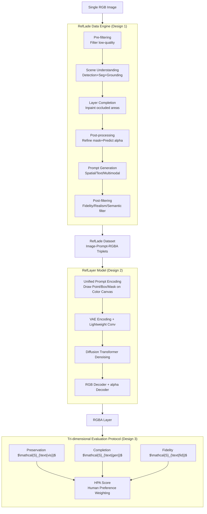

# Referring Layer Decomposition

**Conference**: ICLR 2026  
**arXiv**: [2602.19358](https://arxiv.org/abs/2602.19358)  
**Code**: [https://yaojie-shen.github.io/project/RLD/](https://yaojie-shen.github.io/project/RLD/)  
**Area**: Image Decomposition / Image Editing  
**Keywords**: Layer Decomposition, RGBA Layers, Multimodal Referring Input, Data Engine, RefLayer

## TL;DR

The authors propose the Referring Layer Decomposition (RLD) task to predict complete RGBA layers from a single RGB image based on flexible user prompts (spatial, textual, or hybrid). They also construct the RefLade dataset with 1.11 million samples and an automated evaluation protocol.

## Background & Motivation

Modern generative models typically process images as a whole and lack explicit representation of individual scene elements, making selective manipulation, cross-editing consistency, and semantic alignment difficult. Image layers (visual units in RGBA format) provide a more intuitive framework, similar to the layer-based workflow in Photoshop.

Limitations of Prior Work:
- MuLAn: Limited data scale (44K images), with a success rate of only 36%.
- Text2Layer: Restricted to separating only two layers (foreground/background).
- LayerDecomp: Relies on synthetic supervision and requires target masks.

The core novelty of the RLD task lies in its support for multiple user prompts (points, boxes, masks, text) to achieve on-demand extraction of target RGBA layers.

## Method

### Overall Architecture

RLD decomposes the "prompt-based layer extraction" task into three mutually supporting components. The pipeline follows the sequence of "Data Generation → Model Training → Quality Evaluation". The first component is the **RefLade data engine**, which uses a six-stage pipeline to automatically process single RGB images into "prompt + corresponding full RGBA layer" training triplets while completing areas occluded by the foreground. The second component is the **RefLayer model**, based on Stable Diffusion 3, which encodes arbitrary spatial/textual prompts into a unified input to output RGBA layers with a transparency channel. The third component is a **tri-dimensional evaluation protocol** that automatically scores extraction quality across three axes: visibility fidelity, occlusion completion, and composition naturalness, aligning with human preferences. Together, these provide training data, a reference implementation, and scoring standards for the task.

### Key Designs

**1. RefLade Data Engine: Improving RLD Triplet Success Rate from 36% to 70% via a Six-Stage Pipeline.**

The primary challenge of the RLD task is the lack of off-the-shelf data—a single RGB image must be paired with a "prompt + corresponding full RGBA layer," where occluded areas behind the foreground must be completed. The engine addresses this through a six-step process: First, **pre-filtering** uses rules to discard low-quality images (~86.1% pass the suitability check). Second, **scene understanding** integrates closed-set detection, open-vocabulary detection, and MLLM grounding to identify candidate targets. Third, **layer completion** reconstructs occluded object regions. Fourth, **post-processing** refines masks and predicts alpha mattes. Fifth, **prompt generation** synthesizes spatial, textual, and multimodal prompts for each target. Finally, **post-filtering** screens out sub-standard RGBA layers based on fidelity, realism, and semantic consistency. This pipeline improves the end-to-end success rate per sample from MuLAn's 36% to 70%, enabling the creation of the million-scale RefLade dataset.

**2. RefLayer Model and Unified Prompt Encoding: Feeding Heterogeneous Prompts (Points/Boxes/Masks/Text) into Diffusion Models via an RGB Canvas and Direct Alpha Layer Generation.**

Once the data engine produces triplets, a model is required to process these prompts and generate layers. The difficulty lies in allowing a generator to receive diverse prompts while outputting layers with transparency channels. The prompt encoding strategy draws all spatial prompts onto a single color canvas for unified representation: a blue canvas for the background, green boxes for boundaries, red regions for masks, and points rendered as Gaussian heatmaps. This aligns prompts of different granularities into a single modality at the input stage. The model is based on Stable Diffusion 3. The VAE encoder processes the original image and this prompt canvas; after channel compression via a lightweight convolution, the data enters the Diffusion Transformer for denoising. At the decoding stage, a custom alpha decoder (identical in structure to the VAE decoder but with a single output channel) is added alongside the standard RGB decoder. This allows the network to predict the alpha matte directly in latent space while generating RGB content, bypassing post-hoc matting. During training, the VAE is frozen, and the Diffusion Transformer and alpha decoder are trained independently under a shared latent space, reducing optimization difficulty and enabling zero-shot generalization to unseen prompts.

**3. Tri-dimensional Evaluation Protocol + HPA Score: Assessing Extraction through Fidelity, Completion, and Naturalness, Synthesized via Human Preferences.**

A reliable metric is needed to evaluate layer extraction quality, as single metrics often show bias. The protocol measures three aspects in parallel. **Preservation** $\mathcal{S}_{\text{vis}}$ compares LPIPS between the predicted layer and the ground truth within the visible mask $g_v$: $\mathcal{S}_{\text{vis}} = \mathbb{E}_{(p,g)\sim\mathcal{D}}[\text{LPIPS}(g_{\text{rgb}} \odot g_v, p_{\text{rgb}} \odot g_v)]$, measuring whether visible regions were corrupted. **Completion** $\mathcal{S}_{\text{gen}}$ uses directional similarity in CLIP feature space to monitor the inpainted portions: $\mathcal{S}_{\text{gen}} = \mathbb{E}[\cos(f(g_{\text{rgb}}) - f(g_{\text{rgb}} \odot g_v),\, f(p_{\text{rgb}}) - f(g_{\text{rgb}} \odot g_v))]$, comparing whether the predicted semantic shift from visible to complete matches the ground truth. **Fidelity** $\mathcal{S}_{\text{fid}}$ calculates the FID after alpha-blending the predicted layer back onto the background to check overall realism. Since these three axes alone cannot consistently reflect human judgment, the protocol utilizes a normalized weighted average derived from human preference Elo rankings to produce the **HPA** score. This ensures automatic scoring strongly correlates with human judgment, making layer quality assessment scalable and reproducible.

## Key Experimental Results

### Dataset Statistics

| Dataset | Task | #Images | #Classes | #Instances | Occlusion Rate |
|---------|------|---------|----------|------------|----------------|
| MuLAn   | LD   | 44,860  | 759      | 101,269    | 7.7%           |
| **RefLade** | **RLD** | **430,488** | **12K** | **871,829** | **60.8%**      |

### Evaluation Protocol Validation

The HPA score shows a strong correlation with human ELO rankings, whereas individual metrics $\mathcal{S}_{\text{vis}}$, $\mathcal{S}_{\text{fid}}$, and $\mathcal{S}_{\text{gen}}$ fail to consistently reflect human preferences.

### Main Results

- 74.7% of foreground layers and 70.2% of background layers reached the quality threshold.
- Manual annotation took 43 days and was performed by 9 professional annotators.
- Careful filtering yielded 59K high-quality images and 110K validation layers.

## Key Findings

- Coarse-grained prompts (e.g., a single point) may result in coarse-grained outputs, while precise prompts produce accurate object-level layers.
- RefLayer demonstrates strong zero-shot generalization capabilities.
- The multi-granularity prompt system enables flexible control from coarse to fine levels.

## Highlights & Insights

- Defines the Referring Layer Decomposition task based on multimodal referring inputs for the first time.
- The comprehensive data engine design increases the success rate from 36% to 70%.
- The evaluation protocol is highly aligned with human preferences, resolving the evaluation bottleneck.
- The RefLade dataset scale far exceeds existing counterparts (430K vs. MuLAn's 44K).

## Limitations & Future Work

- The data engine relies on several external models (detection/segmentation/completion), making cascading errors inevitable.
- High manual annotation costs (43 days × 9 people).
- The Ground Truth layers in the evaluation protocol themselves may not be perfect.

## Related Work & Insights

- **Image Understanding and Editing**: Tasks like detection, segmentation, inpainting, and alpha matting.
- **Compositional Image Representation**: RGBA layer methods like MuLAn and Text2Layer.
- **Referring Expression Segmentation**: Promptable segmentation methods like SAM output only masks without reconstructing occluded content.

## Rating

- Novelty: ⭐⭐⭐⭐⭐ — Innovative task definition filling a research gap.
- Value: ⭐⭐⭐⭐⭐ — Million-scale dataset + data engine + manual annotation.
- Experimental Thoroughness: ⭐⭐⭐⭐ — Tri-dimensional evaluation protocol aligned with human preference.
- Writing Quality: ⭐⭐⭐⭐ — Directly applicable to image editing and synthesis.

<!-- RELATED:START -->

## Related Papers

- [\[CVPR 2026\] From Inpainting to Layer Decomposition: Repurposing Generative Inpainting Models for Image Layer Decomposition](../../CVPR2026/image_generation/from_inpainting_to_layer_decomposition_repurposing_generative_inpainting_models_.md)
- [\[CVPR 2026\] Qwen-Image-Layered: Towards Inherent Editability via Layer Decomposition](../../CVPR2026/image_generation/qwen-image-layered_towards_inherent_editability_via_layer_decomposition.md)
- [\[CVPR 2026\] Illustrator's Depth: Monocular Layer Index Prediction for Image Decomposition](../../CVPR2026/image_generation/illustrators_depth_monocular_layer_index_prediction_for_image_decomposition.md)
- [\[CVPR 2025\] Generative Image Layer Decomposition with Visual Effects](../../CVPR2025/image_generation/generative_image_layer_decomposition_with_visual_effects.md)
- [\[ICLR 2026\] Long-Text-to-Image Generation via Compositional Prompt Decomposition](long-text-to-image_generation_via_compositional_prompt_decomposition.md)

<!-- RELATED:END -->
