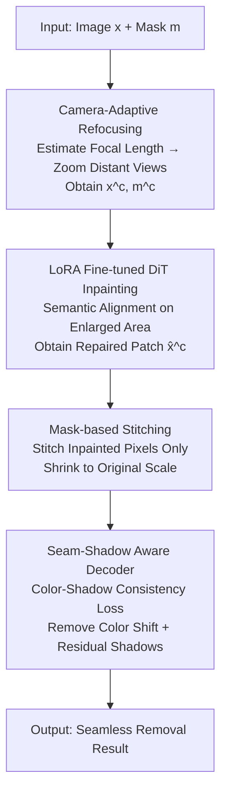

# ReFocusEraser: Refocusing for Small Object Removal with Robust Context-Shadow Repair

**Conference**: ICLR 2026  
**OpenReview**: [https://openreview.net/forum?id=OkNxZGenYr](https://openreview.net/forum?id=OkNxZGenYr)  
**Code**: https://github.com/ProAirVerse/ReFocusEraser.git  
**Area**: Diffusion Models / Image Editing  
**Keywords**: Object removal, image inpainting, small objects, camera refocusing, shadow repair  

## TL;DR
Addressing the issue of detail loss when diffusion models remove small objects, ReFocusEraser utilizes "Camera-adaptive magnification + LoRA fine-tuning" to enlarge and repair small targets first, followed by "Mask-based stitching + Seam-Shadow Aware Decoder" to seamlessly re-insert them into the original image while automatically removing residual shadows. This elevates the PSNR from 25.0 to 31.3 on the RORD dataset.

## Background & Motivation
**Background**: Object removal aims to fill user-defined masked regions with semantically coherent backgrounds. Currently, the most powerful approaches are diffusion-based methods (RePaint, CLIPAway, PowerPaint, OmniEraser, etc.), which rely on various explicit guidances (sampling known pixels, AlphaCLIP for foreground-background separation, task prompts, independent guidance) to ensure generated content fits the background rather than creating new objects.

**Limitations of Prior Work**: These methods generally fail when removing **small objects**, as structural and textural details cannot be restored. The root cause lies in the **fixed downsampling compression rate** of the diffusion model's VAE encoder: large objects occupy many pixels and retain most structures after compression, whereas small objects may consist of only a few pixels, causing almost all high-frequency details to be discarded during encoding (visually demonstrated in Figure 1(b) of the paper). The decoder cannot recover these details through upsampling alone.

**Key Challenge**: The VAE compression rate is fixed, placing small regions at a natural disadvantage. While direct fine-tuning of the entire VAE can alleviate this, it is costly, requires massive data, and is prone to instability or posterior collapse, which destroys generation diversity—creating a dilemma where "preserving detail requires modifying the VAE, but modifying the VAE introduces new problems."

**Key Insight**: The authors draw inspiration from **camera zoom** in real-world photography—distant scenes can become close-ups by adjusting focal length, "pulling in and magnifying" distant subjects. Since VAEs are friendly to large regions, why not enlarge small targets before feeding them into the VAE? Repair after enlargement, then shrink and stitch back. This bypasses the bottleneck of fixed VAE compression without modifying the VAE itself.

**Core Idea**: A two-stage pipeline of "Enlarge → Repair → Shrink & Stitch" is used instead of "repairing directly at original resolution." A specialized decoder is designed to solve color shifts, seams, and residual shadows caused by the VAE's asymmetric up-and-down sampling during stitching.

## Method

### Overall Architecture
ReFocusEraser is a **two-stage** small object removal framework built upon the general-purpose FLUX.1-dev (a DiT-architected diffusion model). Given an input image $x$ and user mask $m$, the output is a result with the masked area seamlessly filled and shadows removed.

**Stage I (Camera-Adaptive Refocused Inpainting)**: A camera calibration algorithm first estimates the focal length to determine if the scene is far or near. For distant scenes with small targets, "zoom-in magnification" is applied under camera conditions to obtain the enlarged image $x^c$ and mask $m^c$. Then, LoRA fine-tuning on the FLUX.1-dev DiT is used to repair the enlarged region, yielding the repaired result $\hat{x}^c$ at the enlarged scale.

**Stage II (Seam-Shadow Aware Restoration)**: The enlarged and repaired region is shrunk and re-inserted into the original image using a **mask-based stitching** strategy. It is then fed into a specialized fine-tuned **Seam-Shadow Aware Decoder**, which uses a "Color-Shadow Consistency Loss" to eliminate color shifts, seams, and residual shadows of small objects not covered by the mask. Finally, camera alignment transformation restores the image to the original coordinates.

### Key Designs

**1. Camera-Adaptive Refocusing Mechanism: Magnifying Disadvantaged Small Targets Before Repair**

This step directly addresses the bottleneck where "fixed VAE compression erases small object details." Since target sizes vary significantly across images, fixed cropping or constant magnification cannot preserve all small targets. Thus, the authors make the magnification factor **adaptive to camera parameters**. Specifically, a camera calibration algorithm estimates the focal length of the input $x$, classifying scenes as distant or near: a **500-pixel** threshold is empirically set. Distant scenes typically have large fields of view and relatively small masked objects, suffering the most information loss in the VAE. Camera-conditioned "zoom-in magnification" is applied to distant scenes to enlarge small objects, yielding $x^c$ and $m^c$ which are more repair-friendly. Essentially, this trades relative resolution for detail preservation under the "fixed VAE compression" constraint without altering the VAE itself.

**2. LoRA Refocusing Inpainter: Adding Low-Rank Adaptation Without Altering General Large Models**

Repairing must be done at the enlarged scale. Instead of using Flux-Fill or Flux-Kontext specifically trained for inpainting, the authors inject LoRA into all linear layers (self-attention + feed-forward) of the **general-purpose** FLUX.1-dev DiT. Training is performed using the enlarged $x^c$ instead of the original image. For weights $W \in \mathbb{R}^{d_{out}\times d_{in}}$, the adapted output is $W_{LoRA}X = WX + \frac{\alpha}{r}BAX$, where $A,B$ are trainable low-rank matrices and $r \ll \min(d_{in},d_{out})$. Simultaneously, the DiT input layer is extended to receive masked foreground $x\odot m$, visible background $x\odot(1-m)$, binary mask $m$, and noisy latents. These are concatenated and passed through a linear layer to provide foreground-background guidance, optimized by the flow matching loss $L^c_{flow}=\mathbb{E}\,b(t)^{}2\lVert\epsilon_t-\epsilon_\theta(x^c_t\mid y^c;t)\rVert_2^2$ (where $y^c=[m^c, x^c_0\odot m^c, x^c_0\odot(1-m^c)]$). Choosing a general model + LoRA over a specialized inpainting model **preserves pre-trained parameters and cross-task transferability**, enhancing semantic alignment only on the enlarged regions.

**3. Mask-based Stitching Strategy: Stitching Mask Pixels Only to Preserve Context**

The repaired block $\hat{x}^c$ must be shrunk and stitched back. How to stitch is critical. The straightforward "box-based stitching" covers the entire block after scaling: $x_{box}=x+S(\hat{x}^c)$. While it preserves the complete structure of the block, it often introduces boundary misalignments and obvious seams. The authors instead use **mask-based stitching**, re-inserting only the repaired pixels within the mask: $x_{mask}=x+S((1-m^c)\odot x^c + m^c\odot \hat{x}^c)$, keeping the surrounding context unchanged. The cost is slight chromatic aberration near mask boundaries and the inability to remove shadows outside the mask—but it ensures better spatial alignment and semantic coherence, hence its selection as the default strategy. Remaining shifts and shadows are handled in Stage II.

**4. Seam-Shadow Aware Restoration: Fine-tuning the Decoder with Region-Aware Loss**

Color shifts, seams, and residual shadows from mask-based stitching are handled here. The authors **fine-tune only the VAE decoder** while freezing the FLUX.1-dev encoder. Fine-tuning the entire VAE would cause catastrophic forgetting of the pre-trained reconstruction prior and requires impractical amounts of data/compute. Modifying only the decoder maximizes the reuse of pre-trained reconstruction capabilities while allowing Stage II to focus on repairing color and shadows without disrupting the global scene representation learned in Stage I. The Stage II decoder $D_{seam}$ is initialized from the Stage I decoder. The challenge is that with a frozen encoder, simple L1/L2 reconstruction losses would result in blurry outputs for small/distant objects (high-frequency edges, textures, and shadows are compressed in the latent space). To fix this, the **Color-Shadow Consistency Loss** is proposed, providing partitioned supervision for foreground and background:

$$L_{color\ shadow}=\mathbb{E}\big[\lVert x^c_{fg}-\hat{x}^c_{fg}\rVert_1\big]+\mathbb{E}\big[\text{LPIPS}(x^c_{bg},\hat{x}^c_{bg})\big]$$

L1 loss ensures pixel-level color consistency for the masked foreground, while LPIPS preserves high-frequency details (including shadows) for the unmasked background. This region-aware perceptual supervision allows the decoder to repair foreground structures while maintaining a realistic, coherent background. Finally, a camera alignment transformation maps the result back to the original image.

## Key Experimental Results

### Main Results
Evaluated on RORD (12,757 training pairs / 1,542 validation pairs) and the real-world benchmark RemovalBench, metrics are categorized into overall image quality (FID, CMMD) and region-level fidelity (PSNR, SSIM, LPIPS). All metrics are calculated on the **entire image** after stitching.

| Dataset | Metric | ReFocusEraser | Prev. SOTA | Gain |
|--------|------|------|----------|------|
| RORD-val | PSNR↑ | 31.256 | 25.025 (Flux-Fill) | +6.231 |
| RORD-val | SSIM↑ | 0.924 | 0.794 (Flux-Fill) | +0.130 |
| RORD-val | LPIPS↓ | 0.041 | 0.092 (Flux-Fill) | −0.051 |
| RORD-val | FID↓ | 21.378 | 25.393 (AttentiveEraser) | −4.015 |
| RemovalBench | PSNR↑ | 30.495 | 25.265 (AttentiveEraser) | +5.230 |
| RemovalBench | FID↓ | 38.115 | 65.326 (AttentiveEraser) | −27.211 |

Qualitatively: General inpainting methods (RePaint, PixelHacker, Flux-Fill/Kontext) often leave remnants or incoherent backgrounds. OmniEraser removes the foreground but damages the background. AttentiveEraser preserves the background but leaves object shadows. Only ReFocusEraser achieves clean removal, structural and semantic consistency, and shadow elimination.

### Ablation Study
Table 2 incrementally adds components ((a) baseline trained on original image, (b)–(d) trained on 3× enlarged images):

| Configuration | PSNR↑ | SSIM↑ | LPIPS↓ | FID↓ | Description |
|------|------|------|--------|------|------|
| (a) Baseline (Original LoRA) | 23.683 | 0.626 | 0.323 | 40.287 | Seams/Shadows/Color Shift |
| (b) +CAR + Box Stitching | 31.082 | 0.923 | 0.046 | 24.288 | Magnification added, PSNR +7.4 |
| (c) + Mask Stitching | 31.732 | 0.932 | 0.039 | 25.036 | Further Region Fidelity gain |
| (d) + Seam-Shadow Decoder | 31.256 | 0.924 | 0.041 | 21.378 | Lowest FID, repairs shadows/shifts |

### Key Findings
- **Camera-Adaptive Refocusing (CAR) contributes most**: Moving from (a) to (b) by adding CAR alone increases PSNR by 7.399, SSIM by 0.297, and decreases FID by 15.999. This proves that "enlarging before repairing" successfully bypasses the VAE compression bottleneck and is the core source of the method's gains.
- **Mask-based stitching improves fidelity but leaves shadows**: Moving from (b) box-based to (c) mask-based stitching improves PSNR/SSIM/LPIPS (+0.65/+0.009/−0.007). However, residual shadows cause FID and CMMD to drop slightly—this is exactly the gap Stage II is designed to fill.
- **Stage II trades PSNR for FID**: Compared to (c), (d) shows a slight drop in PSNR/SSIM but decreases FID from 25.036 to 21.378 by completely fixing seams and shadows. It provides the best overall visual perception (distribution alignment), showing that this stage sacrifices minimal pixel fidelity for significant overall consistency.

## Highlights & Insights
- **Integrating "Camera Zoom" into Inpainting**: Instead of modifying the VAE's fixed compression rate, enlarging small targets via focal length estimation at the input stage allows small regions to enjoy the same effective resolution as large ones. This "perspective change rather than model change" approach is clever and incurs almost no extra model cost.
- **Freezing Encoder, Fine-tuning Only Decoder**: This circumvents catastrophic forgetting and posterior collapse associated with full VAE fine-tuning. It is a practical engineering trade-off transferable to any editing task that seeks to leverage VAE reconstruction without destroying priors.
- **Region-Aware Color-Shadow Loss**: Foreground L1 preserves color consistency while background LPIPS preserves high-frequency details. It addresses "color shift" and "shadow removal" simultaneously with a partitioned loss, avoiding the blurriness of pure L1/L2.
- **General FLUX.1-dev + LoRA Choice**: Preserving general pre-trained parameters over specialized models like Flux-Fill maintains cross-task transferability, which is valuable for scenarios aiming to reuse the same backbone for multiple editing tasks.

## Limitations & Future Work
- The method depends on **focal length estimation** and the 500-pixel threshold. Performance might degrade in scenarios where camera calibration fails or thresholds aren't applicable (e.g., synthetic images, images without clear camera models).
- The two-stage, two-training process (Stage I LoRA ~2 days on 4×H200, Stage II Decoder ~1.5 days on 8×H200) is heavy. Inference involving magnification, repair, shrinking, and decoding is slower than single-forward methods.
- Shadow removal relies on LPIPS supervision on the background; its effectiveness on **large-scale or complex projected shadows** has not been fully verified. The slight PSNR/SSIM regression in Stage II (d) vs (c) indicates an ongoing trade-off between color-shadow repair and pixel fidelity.
- primarily focused on "small objects"; performance on ultra-large masks or dense multi-object scenes was not the primary focus.

## Related Work & Insights
- **vs Flux-Fill**: Flux-Fill is a specialized inpainting model relying on text+binary masks at original resolution. It was previously SOTA for small objects (PSNR 25.0). Ours bypasses the resolution bottleneck via magnification and use a general Flux+LoRA, pushing PSNR to 31.3 by "solving compression loss through perspective change."
- **vs OmniEraser**: OmniEraser uses dual foreground/background guidance to enhance context (a design Ours also utilizes). However, it repairs at the original scale, often damaging backgrounds or leaving shadows. Ours uses mask-based stitching to preserve backgrounds and a decoder to remove shadows.
- **vs AttentiveEraser**: AttentiveEraser was previously best for overall quality (FID/CMMD) and background preservation, but it dejó object shadows. Ours preserves the background while automatically repairing shadows, further reducing FID/CMMD.

## Rating
- Novelty: ⭐⭐⭐⭐ The "camera zoom to bypass VAE compression" angle is novel and targets the root cause.
- Experimental Thoroughness: ⭐⭐⭐⭐ Two benchmarks, five metrics, comparison with 8 methods, and component-wise ablation.
- Writing Quality: ⭐⭐⭐⭐ Clear motivation, well-explained pipeline and losses.
- Value: ⭐⭐⭐⭐ Small object removal is a real-world demand; the method offers strong engineering reproducibility.

<!-- RELATED:START -->

## Related Papers

- [\[ICML 2026\] AdaEraser: Training-Free Object Removal via Adaptive Attention Suppression](../../ICML2026/image_generation/adaeraser_training-free_object_removal_via_adaptive_attention_suppression.md)
- [\[CVPR 2025\] MetaShadow: Object-Centered Shadow Detection, Removal, and Synthesis](../../CVPR2025/image_generation/metashadow_object-centered_shadow_detection_removal_and_synthesis.md)
- [\[CVPR 2026\] Precise Object and Effect Removal with Adaptive Target-Aware Attention](../../CVPR2026/image_generation/precise_object_and_effect_removal_with_adaptive_target-aware_attention.md)
- [\[CVPR 2025\] RORem: Training a Robust Object Remover with Human-in-the-Loop](../../CVPR2025/image_generation/rorem_training_a_robust_object_remover_with_human-in-the-loop.md)
- [\[CVPR 2026\] ShadowDraw: From Any Object to Shadow-Drawing Compositional Art](../../CVPR2026/image_generation/shadowdraw_from_any_object_to_shadow-drawing_compositional_art.md)

<!-- RELATED:END -->
