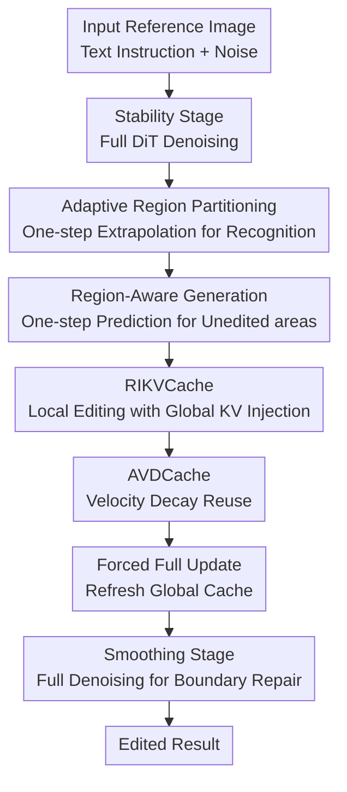

# RegionE: Adaptive Region-Aware Generation for Efficient Image Editing

**Conference**: ICLR 2026  
**OpenReview**: [https://openreview.net/forum?id=I6j5fLdH80](https://openreview.net/forum?id=I6j5fLdH80)  
**Code**: https://github.com/Peyton-Chen/RegionE  
**Area**: Image Generation / Image Editing / Diffusion Model Acceleration  
**Keywords**: Instruction-based Image Editing, Region-Aware Generation, Diffusion Model Acceleration, KV Cache, Trajectory Redundancy  

## TL;DR
RegionE observes that in instruction-based image editing, the generation trajectories of unedited regions are approximately linear, while those of edited regions are more curved but exhibit similar velocities between adjacent steps. By employing adaptive region partitioning, region-level KV injection, and velocity decay caching, it accelerates Step1X-Edit, FLUX.1 Kontext, and Qwen-Image-Edit by approximately 2.06-2.57x without training new models, while largely preserving the output quality of the original models.

## Background & Motivation
**Background**: Instruction-based image editing (IIE) is shifting from early methods requiring masks, inversion, or task-specific modules toward general DiT/flow-matching editing models driven directly by text instructions. Models such as Step1X-Edit, FLUX.1 Kontext, and Qwen-Image-Edit typically feed text tokens, noise tokens, and reference image tokens into an Instruction-DiT, obtaining the edited image through multi-step denoising.

**Limitations of Prior Work**: Although these models possess strong editing capabilities, they suffer from high inference latency. More importantly, they allocate the same computational budget to the entire image at every step, even though user instructions often only require modifications to a local region—such as adding a hat to a cat, replacing text, or removing an object. Large areas of the background, main contours, and textures that do not need editing remain almost unchanged but still undergo complete DiT computation, resulting in significant spatial redundancy.

**Key Challenge**: The redundant structures in IIE differ from those in pure text-to-image generation. While text-to-image generation requires synthesizing the entire image from noise, editing tasks naturally contain "regions that should change" and "regions that should stay the same." Mixing both types of regions for uniform denoising wastes computation on unedited areas; however, naively calculating only local regions discards reference images and global context, causing the edited regions to deviate from the original image in terms of boundaries, semantics, and details.

**Goal**: The authors aim to achieve training-free inference acceleration for existing IIE models rather than retraining a smaller model. Specifically, the goal is to automatically identify which tokens belong to edited versus unedited regions, replace multi-step denoising with cheaper one-step estimation for unedited regions, and reduce computation of irrelevant tokens and redundant timesteps for edited regions while avoiding boundary artifacts caused by region splicing.

**Key Insight**: The paper's critical observation comes from generation trajectories. During denoising, trajectories of unedited regions are approximately linear, and early velocities can reliably extrapolate to subsequent or even final results. In contrast, trajectories of edited regions are more curved, making one-step extrapolation inaccurate; however, velocity directions between adjacent timesteps are highly consistent, with only the magnitude decaying over time. This observation provides the basis for "differential regional treatment" and "cross-step velocity caching."

**Core Idea**: RegionE utilizes early first-order extrapolation to identify unedited regions and combines one-step prediction for unedited regions, local iteration for edited regions, global KV context injection, and adaptive velocity decay caching into a region-aware inference framework.

## Method

### Overall Architecture
RegionE focuses on Instruction-DiT editing models based on flow matching / rectified flow. At each step, the original model receives text tokens $X_P$, current noise tokens $X_{t_i}$, and reference image tokens $X_I$, predicts the velocity $v(X_{t_i}, t_i)$, and uses an Euler update $X_{t_{i-1}} = X_{t_i} - (t_i - t_{i-1}) \cdot v(X_{t_i}, t_i)$.

RegionE does not change model weights or user inputs. Instead, it inserts a three-stage inference strategy into the sampling process: initial steps maintain full denoising for stable velocity estimation; the intermediate phase performs segmented generation based on regional properties and uses caching to reduce spatial and temporal redundancy; and the final steps perform a small amount of full denoising to smooth boundary differences between edited and unedited regions.

The primary contribution nodes in this diagram are "Adaptive Region Partitioning," "RIKVCache," and "AVDCache." The Stability Stage, Forced Full Update, and Smoothing Stage are sampling schedules designed to ensure the reliable operation of these designs: the former avoids misjudgment during low SNR stages, the forced update prevents KV expiration, and the smoothing stage addresses fine boundary discontinuities after regional reorganization.

### Key Designs
**1. Adaptive Region Partitioning: Separating "To Compute" and "Not To Compute" Tokens via One-step Extrapolation**

The first step of RegionE is not to crop the image directly but to determine which areas truly require editing. The paper leverages the Euler form of rectified flow: if a region's trajectory is approximately linear, then at timestep $t_i$, the current velocity can be used for one-step extrapolation to estimate the state at a later timestep $t_f$: $\hat{X}_{t_f}^U = X_{t_i}^U - v^U(X_{t_i}^U, t_i) \cdot \Delta t_{i,f}$. When $t_f = 0$, this directly estimates the final unedited region. The authors found that this estimate is very close to the true result for unedited regions, whereas for edited regions, the curved trajectory causes early one-step estimates to deviate significantly.

Specifically, after the stability stage, current velocities are used to estimate the full final image $\hat{X}_0$, and cosine similarity between $\hat{X}_0$ and reference image $X_I$ is compared at the token level. Tokens with similarity above a threshold $\eta$ are classified as unedited regions, as these positions show minimal change between the "predicted final result" and the "original reference image." Remaining tokens are treated as edited regions. To avoid mask noise, RegionE also uses morphological opening and closing operations for regional continuity. This design eliminates the need for external segmenters, user masks, or additional training, inferring the editing range directly from the model's own generation dynamics.

**2. RIKVCache: Computing Edited Regions Locally while maintaining Global Context**

Identifying edited regions is insufficient. Simply shrinking the DiT input from $[X_P, X_{t_i}, X_I]$ to $[X_P, X_{t_i}^E]$ reduces computation but causes edited regions to lose key/value information from unedited regions and reference image tokens. Since DiT attention layers rely on global token interactions, such crude localization biases local velocity estimation, leading to issues with boundaries, object relationships, and semantic consistency.

The Region-Instruction KV Cache (RIKVCache) in RegionE retains local queries but injects KV pairs from unedited regions and the reference image obtained from previous full DiT computations into the attention mechanism. That is, real-time input still only contains text and edited region tokens, but the attention becomes $\text{softmax}([Q_P,Q_E][K_P,K_E,K_U^C,K_I^C]^T/\sqrt{d})[V_P,V_E,V_U^C,V_I^C]$. Here, $K_U^C,V_U^C,K_I^C,V_I^C$ are derived from the cached full image calculation. Consequently, edited regions no longer recompute queries or forward passes for unedited tokens but still perceive the background, reference image, and global layout through the cached KV pairs. The paper demonstrates the feasibility of this caching by showing high key similarity across timesteps, particularly for static instruction tokens.

**3. AVDCache: Reusing Velocities as "Same Direction, Decaying Magnitude" across Adjacent Steps**

While edited regions require iterative denoising, it does not mean every step must involve a full DiT run. The paper observes that during intermediate denoising stages, the velocity directions of edited regions remain nearly identical between adjacent timesteps, with cosine similarities close to 1. The variation mainly manifests in the progressive decay of the velocity norm, which is correlated with the timestep. Instead of simple residual reuse, RegionE explicitly models velocity decay.

The core of AVDCache is a decay factor: $\|v_{t_i}\|/\|v_{t_{i+1}}\| = (1 - \Delta t_{t_{i+1},t_i}) \cdot \gamma_{t_i}$, where $(1 - \Delta t)$ is determined by the discrete Euler solver and $\gamma_{t_i}$ is a timestep-aware correction term fitted from randomly sampled data. The continuation of cache usage is controlled by an accumulated error $\text{Criterion} = 1 - \prod_{i=s}^{e}(1 - \Delta t_{t_{i+1},t_i})\gamma_{t_i}$. When the accumulated error exceeds a threshold $\delta$, RegionE reruns the DiT and refreshes the velocity cache; otherwise, it approximates the current velocity by multiplying the cached velocity by the corresponding decay factor. This design fits the velocity dynamics of flow-matching editing models better than standard residual caching, significantly reducing intermediate computations with almost no quality loss.

### A Complete Example
Consider the instruction "Add a hat to the cat." The original IIE model would repeatedly process all tokens in the full image—including the cat’s body, background, and table—across 28 sampling steps. RegionE performs full denoising for the first 6 steps as the high noise ratio makes velocity estimation unstable.

Upon entering the region-aware generation stage, RegionE extrapolates the final image and compares it token-by-token with the reference image. The area around the cat's head, where a hat will appear, shows low similarity to the reference and is marked as an edited region. Background, body, and table areas show high similarity and are marked as unedited. Subsequently, unedited regions bypass full DiT at every step via one-step estimation to later timesteps. Edited regions are gathered into local tokens and sent to the DiT for continued iteration.

During local iteration, queries from edited regions can still access cached KV pairs from the background and reference image, ensuring the generated hat remains consistent with the cat's head position, lighting, and overall semantics. If velocity directions remain stable across several steps, AVDCache replaces full DiT calls with decayed cached velocities. When accumulated error becomes too large or a preset forced update step is reached, RegionE re-aggregates the full image for a complete DiT run and refreshes the RIKVCache. Finally, two steps of full denoising clean up minor gaps that might appear at the boundary between the hat and unedited regions.

### Loss & Training
RegionE is a training-free inference framework. It does not introduce new training losses or fine-tune Step1X-Edit, FLUX.1 Kontext, or Qwen-Image-Edit. It relies on the underlying models' original flow matching / rectified flow training objectives, which supervise the model to predict the velocity field from noise distributions to target image distributions.

Inference hyperparameters mainly involve the number of steps for the three stages and two thresholds. In experiments, all models used 28 sampling steps: 6 for the stability stage, 2 for the smoothing stage, and a forced full update at step 16. ARP thresholds $\eta$ were set to 0.88, 0.93, and 0.80 for Step1X-Edit, FLUX.1 Kontext, and Qwen-Image-Edit, respectively. AVDCache thresholds $\delta$ were set to 0.02, 0.04, and 0.03. A larger $\eta$ classifies more areas as edited regions, improving quality at the expense of speed; a larger $\delta$ skips more timesteps, increasing speed at the risk of quality degradation.

## Key Experimental Results

### Main Results
The paper evaluates RegionE on three open-source IIE models: Step1X-Edit-v1p1, FLUX.1 Kontext, and Qwen-Image-Edit. For datasets, Step1X-Edit and Qwen-Image-Edit use 606 image-instruction pairs from GEdit-Bench English covering 11 editing categories; FLUX.1 Kontext uses 1026 samples from KontextBench covering 5 categories. All latencies were measured on a single NVIDIA H800 GPU.

| Base Model | Method | PSNR↑ | SSIM↑ | LPIPS↓ | Latency(s)↓ | Gain↑ |
|----------|------|-------|-------|--------|----------|---------|
| Step1X-Edit | Vanilla | - | - | - | 27.945 | 1.000x |
| Step1X-Edit | TeaCache | 28.262 | 0.924 | 0.072 | 11.212 | 2.493x |
| Step1X-Edit | RegionE | 30.520 | 0.939 | 0.054 | 10.865 | 2.572x |
| FLUX.1 Kontext | Vanilla | - | - | - | 14.682 | 1.000x |
| FLUX.1 Kontext | TeaCache | 28.307 | 0.869 | 0.097 | 6.203 | 2.367x |
| FLUX.1 Kontext | RegionE | 32.133 | 0.917 | 0.057 | 6.096 | 2.409x |
| Qwen-Image-Edit | Vanilla | - | - | - | 32.125 | 1.000x |
| Qwen-Image-Edit | TeaCache | 28.314 | 0.900 | 0.075 | 16.445 | 1.954x |
| Qwen-Image-Edit | RegionE | 31.115 | 0.937 | 0.046 | 15.604 | 2.059x |

The main table indicates that RegionE is positioned to optimize the quality-speed trade-off. Compared to baselines like TeaCache, FORA, Stepskip, RAS, and ToCa, RegionE typically achieves higher PSNR/SSIM, lower LPIPS, and stronger acceleration simultaneously. Particularly on FLUX.1 Kontext, RegionE's PSNR reaches 32.133 compared to TeaCache’s 28.307, suggesting that region-aware processing preserves the original model's output better than pure temporal caching.

| Base Model | Method | G-SC↑ | G-PQ↑ | G-O↑ | Conclusion |
|----------|------|-------|-------|------|------|
| Step1X-Edit | Vanilla | 7.479 | 7.466 | 6.906 | Original Reference |
| Step1X-Edit | RegionE | 7.552 | 7.405 | 6.948 | Semantics/perceptual quality stable |
| FLUX.1 Kontext | Vanilla | 7.197 | 6.963 | 6.497 | Original Reference |
| FLUX.1 Kontext | RegionE | 7.278 | 6.953 | 6.538 | Perceptual quality unchanged |
| Qwen-Image-Edit | Vanilla | 8.242 | 7.948 | 7.700 | Original Reference |
| Qwen-Image-Edit | RegionE | 8.242 | 7.968 | 7.731 | On par with vanilla semantics |

GPT-4o evaluations further demonstrate that RegionE's acceleration does not come at the cost of obvious visual degradation. G-SC represents semantic consistency, G-PQ perceptual quality, and G-O overall quality. RegionE scores across all three models are close to vanilla, with some metrics even slightly higher. User studies also indicate that participants found it difficult to distinguish whether an image was accelerated by RegionE.

### Ablation Study
Ablation studies were primarily conducted on Step1X-Edit-v1p1, removing caching and scheduling components respectively. This analysis shows that while all modules aim to save computation, they play different roles in quality protection.

| Configuration | PSNR↑ | SSIM↑ | LPIPS↓ | G-O↑ | Latency(s)↓ | Gain↑ | Description |
|------|-------|-------|--------|------|----------|---------|------|
| RegionE | 30.520 | 0.939 | 0.054 | 6.948 | 10.865 | 2.572x | Complete method |
| w/o RIKVCache | 22.868 | 0.822 | 0.207 | 5.191 | 10.223 | 2.734x | Slightly faster but significant quality loss |
| w/o AVDCache | 31.139 | 0.946 | 0.046 | 7.023 | 16.122 | 1.733x | Better quality but much lower gain |
| w/o STS | 21.441 | 0.814 | 0.161 | 6.325 | 7.149 | 3.909x | Acceleration in early stage ruins results |
| w/o SMS | 28.857 | 0.904 | 0.085 | 6.773 | 9.766 | 2.862x | Insufficient smoothing causes degradation |
| w/o Forced Step | 28.452 | 0.915 | 0.080 | 6.925 | 10.204 | 2.739x | KV accumulation error without refresh |

The most critical conclusion is: RIKVCache is the quality foundation, while AVDCache is the source of speed. Removing RIKVCache makes local editing faster, but PSNR drops from 30.520 to 22.868, emphasizing that "only computing the edited area" cannot happen without global context. Removing AVDCache yields slightly higher quality but drops the gain from 2.572x to 1.733x, showing that temporal redundancy utilization is a primary driver for exceeding 2x acceleration.

### Key Findings
- One-step prediction of unedited regions is the core entry point for RegionE. It transforms the common knowledge that "most pixels shouldn't change" into a computable region partition rather than relying on human masks or external networks.
- RIKVCache shows the largest performance drop when removed, indicating that local generation cannot be isolated from whole-image semantics. Region-aware acceleration must reduce redundant computation, not context.
- AVDCache contributes significantly to speed but must avoid the stability stage. Supplementary material shows that using AVDCache during STS increases speed to 3.256x but drops PSNR from 30.520 to 28.610, as early velocity directions are unreliable.
- Smoothing stages and forced updates, while seemingly minor, handle boundary discontinuities and KV similarity decay. Without them, acceleration is higher, but visible or measurable quality declines occur.
- Failure cases usually involve slight color shifts or local shape deviations, such as the edge of a silver donut or the shape of a ceramic cup; these generally do not violate instruction following but indicate local errors at high acceleration settings.

## Highlights & Insights
- The most interesting aspect is that RegionE does not treat IIE as generic diffusion sampling but captures the specific "static region" property of editing tasks. The observation that unedited trajectories are nearly linear provides a concrete explanation for spatial redundancy.
- The ARP design is elegant: it uses the model's own current velocity to extrapolate the final image and compares it to the reference. Unlike traditional mask-based editing, it requires no extra prompts or external semantic segmentation, letting the editing model itself reveal what will change.
- RIKVCache is essential for preventing quality collapse. It serves as a reminder that localized computation does not equal localized context; in global attention models like DiTs, what can be saved is the real-time computation of certain tokens, not the global information itself.
- AVDCache provides a more grounded explanation for velocity caching in flow matching compared to simple residual caching. The paper notes that standard residual cache can be viewed as an un-decayed version of velocity cache, and adding the timestep-aware $\gamma_t$ gives the caching strategy dynamic justification.
- This logic could be transferred to video editing or high-resolution image editing. As long as large unchanged regions exist and there is static context within model tokens, the combination of "local real-time query + global cached KV + adaptive velocity reuse" is worth considering.

## Limitations & Future Work
- RegionE relies on the assumption that unedited regions change little and have straighter trajectories. For tasks involving global style transfer, large-area lighting changes, or overall texture migration, spatial redundancy decreases, and the gains will primarily come from temporal caching.
- Thresholds for ARP ($\eta$) and AVDCache ($\delta$) are model-dependent. While the paper provides empirical values for three models, changing the base model, sampler, or resolution may require recalibration.
- RIKVCache introduces a 6%-10% VRAM overhead. While managed, this could become a constraint for large models already near VRAM limits or for extremely high-resolution editing.
- Evaluations focus on deviation from vanilla outputs and VLM/user preferences, but failure modes under extreme instructions—such as fine-grained text modification or complex layout restructuring—require further discussion.
- Future work could make region partitioning more continuous or hierarchical rather than binary. Applying different steps and caching strategies to strong-edit, weak-edit, and structure-preservation regions might further improve the quality-speed trade-off.

## Related Work & Insights
- **vs Stepskip / Timestep Reduction**: Stepskip reduces sampling steps directly, which is simple but often loses detail in complex edits. RegionE differentiates between regions and timesteps, treating unedited areas, edited areas, and cached steps separately for better quality retention.
- **vs TeaCache / $\Delta$-DiT / FORA**: These utilize temporal redundancy by reusing residuals or features. RegionE also uses temporal redundancy but adds IIE-specific spatial redundancy and explicitly models velocity decay via AVDCache, making it more stable across the three tested models.
- **vs RAS / ToCa**: RAS and ToCa reduce computation via token importance or spatial redundancy for general generation. RegionE's region partitioning is defined by the change between pre- and post-editing, making it better suited for the "modify local, preserve global" nature of IIE.
- **vs EEdit**: EEdit focuses on redundancy between inversion and denoising in two-stage editing. RegionE targets the new generation of denoising-only / MLLM-assisted IIE models that require neither inversion nor input masks.
- **Insights for Future Research**: Efficient generation does not have to rely solely on model compression, quantization, or distillation. Task structure itself provides acceleration signals; for editing, inpainting, or video modification, asking "which tokens are truly changing" may be more effective than uniform optimization.

## Rating
- Novelty: ⭐⭐⭐⭐⭐ Precisely transforms the trajectory differences of edited/unedited regions in IIE into a training-free acceleration mechanism.
- Experimental Thoroughness: ⭐⭐⭐⭐⭐ Covers three strong IIE models, multiple temporal/spatial baselines, VLM evaluations, user studies, and ablation analyses with a complete evidence chain.
- Writing Quality: ⭐⭐⭐⭐ Methodology diagrams and ablation logic are clear, though some notation and pseudocode details are dense and require careful reading.
- Value: ⭐⭐⭐⭐⭐ Highly valuable for practical image editing deployment, especially for high-resolution and local editing, providing a transferable paradigm for region-aware diffusion inference.

<!-- RELATED:START -->

## Related Papers

- [\[ICLR 2026\] Follow-Your-Shape: Shape-Aware Image Editing via Trajectory-Guided Region Control](follow-your-shape_shape-aware_image_editing_via_trajectory-guided_region_control.md)
- [\[CVPR 2026\] HierEdit: Region-Aware Hierarchical Diffusion for Efficient High-Resolution Editing](../../CVPR2026/image_generation/hieredit_region-aware_hierarchical_diffusion_for_efficient_high-resolution_editi.md)
- [\[ICLR 2026\] DragFlow: Unleashing DiT Priors with Region Based Supervision for Drag Editing](dragflow_unleashing_dit_priors_with_region_based_supervision_for_drag_editing.md)
- [\[ICLR 2026\] Locality-aware Parallel Decoding for Efficient Autoregressive Image Generation](locality-aware_parallel_decoding_for_efficient_autoregressive_image_generation.md)
- [\[ICLR 2026\] Efficient Sliced Wasserstein Distance Computation via Adaptive Bayesian Optimization](efficient_sliced_wasserstein_distance_computation_via_adaptive_bayesian_optimiza.md)

<!-- RELATED:END -->
