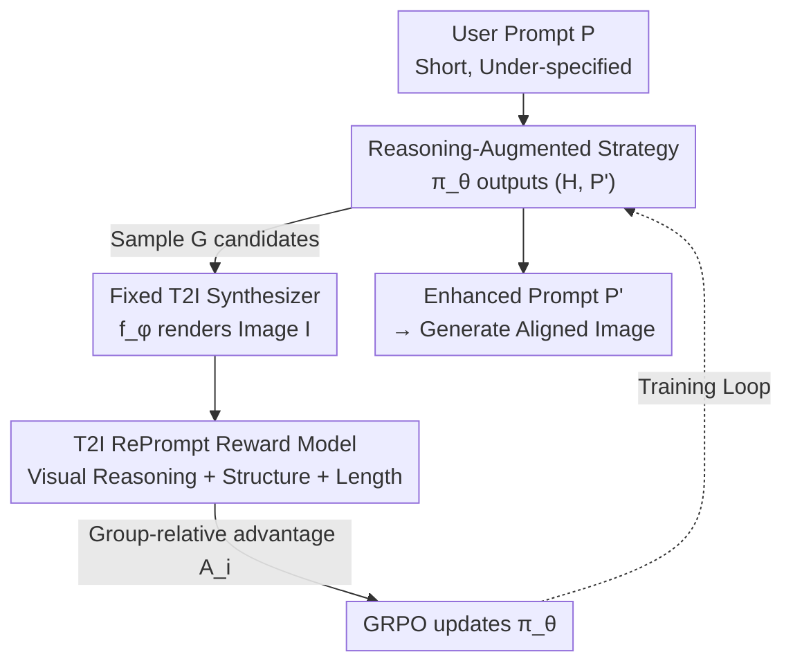

# RePrompt: Reasoning-Augmented Reprompting for Text-to-Image Generation via Reinforcement Learning

**Conference**: ICLR 2026  
**OpenReview**: [https://openreview.net/forum?id=HJ3vgg7TYQ](https://openreview.net/forum?id=HJ3vgg7TYQ)  
**Code**: https://github.com/microsoft/DKI_LLM/tree/main/RePrompt  
**Area**: Diffusion Models / Text-to-Image Generation  
**Keywords**: Prompt Rewriting, Chain-of-Thought, Reinforcement Learning, GRPO, Compositional Generation

## TL;DR
RePrompt trains a small language model (Qwen2.5-3B) using reinforcement learning to perform explicit chain-of-thought reasoning before generating structured enhanced prompts. By directly optimizing downstream generation results with a "level-image" integrated reward, it achieves new SOTA performance in compositional abilities (spatial positioning, counting) on GenEval and T2I-Compbench, with inference latency significantly lower than iterative optimization methods.

## Background & Motivation

**Background**: Text-to-Image (T2I) diffusion models (FLUX, SD3, PixArt-Σ, etc.) can generate high-resolution, photorealistic images. However, user-provided prompts are often short and under-specified, making it difficult for models to capture true user intent. To bridge this gap, common practices include "prompt enhancement": either through multi-round iteration—generating images first, then updating prompts based on human preference models or automatic feedback—or through single-round prompt expansion using Large Language Models (LLMs).

**Limitations of Prior Work**: Iterative methods (e.g., Idea2Img) require re-generating images in each round, leading to extremely high latency and computational overhead (up to 140s per image) and rarely incorporating explicit scene semantics or compositional reasoning. Single-round LLM expansion (e.g., Promptist, DALL·E 3 caption upsampling) produces fluent language, but LLMs lack grounding in physical reality and do not receive feedback from downstream visual tasks. This often results in semantic inconsistency or physically implausible content—such as rewriting "a sofa below a vase" into a beautiful but nonsensical layout, with incorrect object counts, chaotic spatial relations, or lost attribute bindings.

**Key Challenge**: The quality of a prompt rewrite should be judged by "how good the final generated image is." However, LLMs see no images during rewriting and lack training signals oriented toward visual outcomes. Optimizing text based solely on linguistic fluency or manual rules essentially targets a proxy metric misaligned with the true goal.

**Goal**: Enable the rewriting model to "rehearse the scene mentally" before writing, thereby pre-emptively avoiding object conflicts, missing entities, and spatial inconsistencies. This training should be transferable across different T2I backbones and independent of human-annotated reasoning trajectories.

**Core Idea**: Model prompt rewriting as a "reason-then-rewrite" single-step decision process. Use GRPO reinforcement learning to train the rewriting strategy directly using downstream image quality as the reward. Since the reward signal only considers the "prompt $\to$ image" input-output pair, bypassing the non-differentiable generator, it is naturally backbone-agnostic.

## Method

### Overall Architecture
The key design of RePrompt is decoupling "prompt generation" from "image generation": only a language model is trained to produce structured, semantically rich prompts, while the T2I backbone remains frozen. The system consists of three modules: a rewriting strategy $\pi_\theta$, a fixed T2I synthesizer $f_\phi$, and a specialized T2I RePrompt reward model $R_{\text{total}}(I, P, P')$.

Given an original user prompt $P$, the strategy samples a "reasoning trajectory + enhanced prompt" pair $y=(H, P')\sim\pi_\theta(P)$. The synthesizer renders the image $I=f_\phi(P')$. The reward model scores the image based on realism, semantic alignment, and prompt structure, and these scores are backpropagated via GRPO to update $\pi_\theta$. Since $f_\phi$ is non-differentiable, the authors formalize the rewriting as a **single-step Markov Decision Process (MDP)**: the state is the original prompt $P$, the action is the sample $y=(H,P')$, the transition is the deterministic mapping $P'\mapsto I=f_\phi(P')$, and the reward is $r=R_{\text{total}}$. The objective is to maximize $\mathbb{E}_{P\sim D}\big[\mathbb{E}_{y\sim\pi_\theta(y|P)}[r]\big]$. Freezing $f_\phi$ means RePrompt learns a reasoning and rewriting strategy "tailored to a specific backbone" without retraining the image generator.

### Key Designs

**1. Reasoning-Augmented Single-Step MDP: "Mental Rehearsal" Before Writing**

To address the lack of visual grounding in LLM rewriting, RePrompt forces the strategy to output two parts: an explicit Chain-of-Thought reasoning $H$ and a final enhanced prompt $P'$, formatted as `<reason>...</reason><prompt>...</prompt>`. The reasoning segment allows the model to decompose spatial relationships and resolve object conflicts—for instance, reasoning that "a vase below a sofa" should be corrected as "the vase is on a floating shelf above the sofa"—before writing the prompt. This avoids the high latency of iterative generation. The training requires no human-annotated reasoning trajectories; supervision comes entirely from downstream image feedback.

**2. T2I RePrompt Reward Model: Integrated Tri-fold Assessment**

For stable RL training, rewards must be dense and multi-dimensional. The authors design an image-level integrated reward $R_{\text{total}}=R_{\text{vis}}+R_{\text{struc}}+R_{\text{len}}$ (components are normalized to unit variance before summation). The **Visual Reasoning Reward** $R_{\text{vis}}=\alpha R^{\text{IMG}}_{\text{pref}}+\gamma R^{\text{VLM}}_{\text{sem}}$ captures both human preference and semantic accuracy: $R^{\text{IMG}}_{\text{pref}}$ uses ImageReward, while $R^{\text{VLM}}_{\text{sem}}$ uses a VLM (GPT-4V) to evaluate semantic consistency and visual quality. The **Structural Reward** $R_{\text{struc}}$ is binary ($+1$ for correct format, else $-1$). The **Length Reward** $R_{\text{len}}$ constrains $P'$ to $[L_{\min}, L_{\max}]=[15,77]$ tokens to fit backbone limits. This reward system is backbone-agnostic as it only depends on the "prompt $\to$ image" pair.

**3. GRPO Optimization: Group Relative Comparison**

The strategy $\pi_\theta$ is trained using Group Relative Policy Optimization (GRPO). For each prompt $P$, $G$ candidates $\{y_i\}$ are sampled, rendered, and scored. Group-relative advantages are calculated as $A_i=(r_i-\mu_r)/\sigma_r$. The objective function includes a clipped PPO-style surrogate objective and a KL regularization term:

$$J_{\text{GRPO}}(\theta)=\mathbb{E}_{P,\{y_i\}}\Big[\tfrac{1}{G}\sum_{i=1}^G \min\big(\rho_i A_i,\ \text{clip}(\rho_i,1-\varepsilon,1+\varepsilon)A_i\big)-\beta_{\text{KL}}\,\text{KL}\big(\pi_\theta\|\pi_{\text{ref}}\big)\Big]$$

where $\rho_i=\pi_\theta(y_i|P)/\pi_{\theta_{\text{old}}}(y_i|P)$. This approach is highly effective for high-variance scenarios where rewards come from a black-box image renderer.

### Loss & Training
The base model is Qwen2.5-3B. Training uses FLUX.1-dev (512×512) as the T2I synthesizer. It runs for 3 epochs with 4 candidates per instance. Training data includes 9,000 prompts generated by GPT-4 using 6 object-centric templates: 8,000 for SFT to inject priors and 1,000 for RL. Training takes ~6 hours on 8×A100 (80GB).

## Key Experimental Results

### Main Results

On GenEval, RePrompt (trained with FLUX) achieves the highest overall scores across three backbones, with particularly significant gains in spatial positioning:

| Backbone | Configuration | Position | Counting | Overall |
|------|------|----------|----------|---------|
| FLUX | + Qwen2.5 3B | 0.35 | 0.63 | 0.68 |
| FLUX | **+ Ours** | **0.62** (+77.1%) | **0.77** (+22.2%) | **0.76** (+11.8%) |
| SD3 | + Qwen2.5 3B | 0.33 | 0.53 | 0.68 |
| SD3 | **+ Ours** | **0.59** (+78.8%) | 0.60 | **0.75** (+10.3%) |
| PixArt-Σ | + Qwen2.5 3B | 0.18 | 0.48 | 0.58 |
| PixArt-Σ | **+ Ours** | **0.40** (+122.2%) | 0.56 | **0.62** (+6.9%) |

T2I-Compbench also shows comprehensive improvements, especially in long-standing challenges like Spatial (FLUX: 0.2494 $\to$ 0.3301) and Numeracy (SD3: 0.2815 $\to$ 0.3315).

Latency-Accuracy comparison (GenEval subset, single A100):

| Method | Accuracy ↑ | Latency (s/img) ↓ |
|------|-----------|-------------------|
| FLUX | 0.65 | 20 |
| Idea2Img (w/ FLUX) | 0.69 | 140 |
| PARM++ (w/ Show-o) | 0.72 | 110 |
| **RePrompt (w/ FLUX)** | **0.76** | 30 |

RePrompt achieves the highest accuracy with approximately 1/4 to 1/5 of the latency of iterative methods.

### Ablation Study

| Config | Position | Counting | Overall | Note |
|------|----------|----------|---------|------|
| FLUX + Qwen2.5 3B | 0.35 | 0.63 | 0.68 | Baseline |
| w/ SFT | 0.43 | 0.64 | 0.69 | Injecting object-attribute priors |
| w/ RL | 0.41 | 0.71 | 0.72 | Direct optimization of visual correctness |
| w/ SFT + RL | **0.62** | **0.77** | **0.76** | Full Model |

Reasoning ablation: Removing reasoning from RL drops the overall score to 0.68 (on par with the vanilla LLM). Adding reasoning provides major gains in complex semantic categories like Colors (0.83 $\to$ 0.87) and Attribute Binding (0.46 $\to$ 0.53).

### Key Findings
- **SFT provides priors, RL provides robustness**: SFT alone adds little (+0.01), and RL alone adds +0.04. The synergy (+0.08 overall) shows SFT injects knowledge while RL masters compositional reasoning.
- **Reasoning is the game-changer**: RL without reasoning performs similarly to standard LLM expansion. Only integrating explicit reasoning into the RL loop provides a substantial leap.
- **Cross-backbone Plug-and-Play**: RePrompt trained on FLUX generalizes to SD3 and PixArt-Σ, validating the backbone-independent nature of "prompt-image pair" rewards.

## Highlights & Insights
- **Aligning Rewriting with True Objectives**: While traditional rewriting optimizes fluency, RePrompt optimizes downstream image quality via external rewards, bypassing the non-differentiable renderer—a paradigm applicable to any "text front-end + black-box back-end" system.
- **Integrated Multi-objective Rewards**: The tri-fold reward manages aesthetics, accuracy, and usability simultaneously, avoiding the instability typical of sparse rewards in RL.
- **Pre-shifting Test-time Compute**: Iterative methods spend compute on repeated image generation. RePrompt "squashes" this into a single reasoning-augmented text generation step, reducing latency by an order of magnitude.

## Limitations & Future Work
- The VLM-Reward depends on powerful external models (GPT-4V), which limits reproducibility and cost-efficiency.
- Training data is synthetic and object-centric; generalization to open-domain, long-description, or purely artistic prompts is not fully explored.
- While the method is plug-and-play, RePrompt is currently trained "for" a specific backbone (FLUX). Optimal performance still likely requires per-backbone tuning.
- Hard binary constraints like the $[15,77]$ token window are empirical and may need adjustment for newer T2I models.

## Related Work & Insights
- **vs. Iterative Rewriting (Idea2Img, PARM++)**: These achieve accuracy through high-latency (110-140s) feedback loops. RePrompt shifts reasoning to the initial rewrite, achieving higher accuracy at $\sim$30s.
- **vs. Single-round LLM Expansion (Promptist)**: These lack visual grounding and downstream feedback. RePrompt introduces grounding via image-level rewards and reasoning.
- **vs. T2I-R1**: While both use RL, T2I-R1 targets unified VLM models (Janus-Pro). RePrompt trains a decoupled, model-agnostic assistant LLM that can be used with any existing T2I model.

## Rating
- Novelty: ⭐⭐⭐⭐ Applying explicit reasoning + RL + integrated image rewards to prompt rewriting is a clear, practical, and effective 1-step MDP formulation.
- Experimental Thoroughness: ⭐⭐⭐⭐ Strong performance across benchmarks and backbones, though the training distribution is somewhat restricted.
- Writing Quality: ⭐⭐⭐⭐ Motivation, methodology, and reward design are logically presented.
- Value: ⭐⭐⭐⭐ High utility for real-world T2I systems due to low latency and backbone flexibility.

<!-- RELATED:START -->

## Related Papers

- [\[ICLR 2026\] GoT-R1: Unleashing Reasoning Capability of Autoregressive Visual Generation with Reinforcement Learning](got-r1_unleashing_reasoning_capability_of_autoregressive_visual_generation_with_.md)
- [\[ICLR 2026\] ImageDoctor: Diagnosing Text-to-Image Generation via Grounded Image Reasoning](imagedoctor_diagnosing_text-to-image_generation_via_grounded_image_reasoning.md)
- [\[CVPR 2026\] Leveraging Verifier-Based Reinforcement Learning in Image Editing](../../CVPR2026/image_generation/leveraging_verifier-based_reinforcement_learning_in_image_editing.md)
- [\[ICLR 2026\] Consolidating Reinforcement Learning for Multimodal Discrete Diffusion Models](consolidating_reinforcement_learning_for_multimodal_discrete_diffusion_models.md)
- [\[ICLR 2026\] Interleaving Reasoning for Better Text-to-Image Generation](interleaving_reasoning_for_better_text-to-image_generation.md)

<!-- RELATED:END -->
