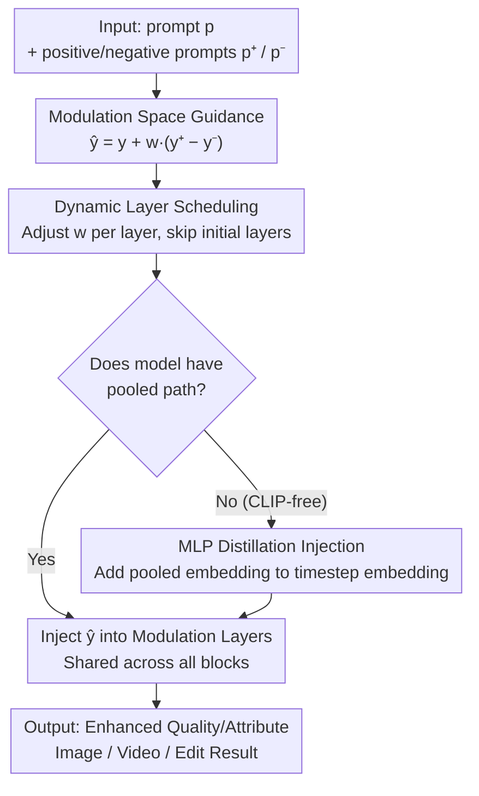

# Rethinking Global Text Conditioning in Diffusion Transformers

**Conference**: ICLR 2026  
**OpenReview**: [https://openreview.net/forum?id=65Ai8mLfjI](https://openreview.net/forum?id=65Ai8mLfjI)  
**Code**: https://github.com/quickjkee/modulation-guidance  
**Area**: Diffusion Models / Image Generation  
**Keywords**: Diffusion Transformer, global text conditioning, pooled embedding, modulation guidance, training-free  

## TL;DR
This paper systematically analyzes the "global conditioning path via modulation of pooled text embeddings" in Diffusion Transformers. It finds that while nearly ineffective in conventional usage, repurposing this path from a "condition" to a "guidance direction" significantly improves image/video quality and controllability for text-to-image/video and image editing in a training-free, near-zero-overhead manner.

## Background & Motivation
**Background**: Modern Diffusion Transformers (DiT) typically inject text through two paths: first, concatenating T5 token-wise embeddings with image tokens for cross-attention; second, feeding pooled CLIP embeddings along with the timestep $t$ into an MLP to generate a global condition vector $y$ shared across blocks. This vector is used for feature modulation: $\mathrm{Mod}(s,y)=\alpha_s(y)\cdot s+\beta_s(y)$, performing scaling and shifting.

**Limitations of Prior Work**: Recent models (e.g., Wan, COSMOS) have discarded this "global/pooled condition" path, achieving comparable text alignment through attention alone. This raises an unanswered question: Is modulation-based global text conditioning still necessary? The authors performed ablation experiments by zeroing out pooled CLIP embeddings in FLUX schnell and HiDream-Fast. Results showed that for **long prompts**, pooled embeddings had almost no impact on FLUX schnell (DreamSim approached 0 as token count increased), and were **completely ineffective** on HiDream-Fast. Even re-injecting CLIP into COSMOS (which lacks it) yielded no observable gains.

**Key Challenge**: Phenomenologically, pooled embeddings provide low information density when used as conditioning inputs, as attention already faithfully propagates prompt information. This supports the trend of discarding them. However, the authors argue this conclusion is premature: the issue is not that pooled embeddings are useless, but that they are **misused**.

**Key Insight**: Drawing from the interpretability of modulation mechanisms (where modulation spaces drive semantic changes in GANs/StyleGAN) and the shared vision-language geometry of CLIP, the authors hypothesize that interpretable semantic directions **already exist** within the model. These can be accessed via shifts in the modulation space. Thus, pooled embeddings should not be treated as a "condition" but as a "rectifier" to push diffusion trajectories toward modes with higher quality and ideal attributes.

**Core Idea**: Replace "modulated conditioning" with "modulation guidance." By extrapolating pooled embeddings using positive/negative prompts, the role of global conditioning is activated and amplified in a training-free manner to enhance generation quality.

## Method

### Overall Architecture
The goal is to transform the "semi-inactive" pooled text embedding into a controllable knob for quality and attribute adjustment without retraining the backbone or increasing inference overhead. The pipeline takes an original prompt $p$ and a pair of positive/negative prompts $p^+, p^-$ describing "desired vs. undesired" attributes. It extrapolates the global vector $y$ in the modulation space to obtain $\hat y$, applies a layer-wise dynamic schedule to determine guidance strength, and feeds it into modulation layers. For CLIP-free models lacking a pooled path, a small MLP + distillation is used to "inject" the pooled embedding before applying the same guidance process.

### Key Designs

**1. Modulation Guidance: Transforming pooled embeddings from "conditions" to "guidance directions"**

Addressing the "semi-inactive" nature of pooled embeddings, the authors no longer treat $y(p,t)$ as a passive condition. Instead, inspired by Classifier-Free Guidance (CFG), they construct a guidance vector in the modulation space. Given the original prompt and positive/negative prompts $p^+, p^-$, the global condition vector is rewritten as:

$$\hat y(p,p^+,p^-,t)=y(p,t)+w\cdot\big(y(p^+,t)-y(p^-,t)\big),$$

where $y(p^+,t)-y(p^-,t)$ serves as the semantic direction in the pooled embedding space representing "desired minus undesired attributes," and $w$ is the guidance scale. Since $\hat y$ only modifies modulation coefficients and is shared across DM blocks, the additional overhead is negligible. Key advantages include: (1) **Training-free**: just select a prompt pair for target attributes (aesthetics, complexity, hands, counting, etc.); (2) **Orthogonal to CFG**: can be layered on models with or without CFG; (3) **Semantic Activation**: attention visualization shows the model concentrates more on target tokens (e.g., "hands"), proving it activates rather than overrides original semantics.

**2. Dynamic Layer-wise Modulation Guidance: Avoiding degradation of text alignment**

A constant guidance scale $w$ can cause the global direction to overpower prompt-specific semantics, hurting text alignment. Unlike dynamic CFG which varies $w$ over time, the authors find it more effective to vary $w$ **across network layers**. They use a simple step function controlled by the layer index $i$, **skipping the initial layers** of the model. In evaluations on MJHQ, the dynamic version achieves a superior Pareto frontier (Aesthetics via PickScore vs. Text Relevance via CLIP score) compared to constant guidance, enhancing quality without sacrificing alignment. This strategy generalizes well across tasks without per-task tuning.

**3. Injecting pooled embeddings into CLIP-free models: Enabling guidance for all models**

For models like COSMOS or Wan that lack a pooled path, $y$ is generated solely from the timestep $t$. The authors "patch" in the pooled embedding using a lightweight modification: a small MLP is trained on the pooled text embedding, and its output is added to the timestep embedding while **freezing the rest of the network**. To preserve existing capabilities, the model is constrained to behave identically to the original when the pooled embedding is zero. Training involves two points: (1) **Modality isolation**: during forward passes, text info is forced through the pooled path (using null prompts for T5); (2) **Distillation objective**: minimizing the MSE between predictions of the original and modified models using the model's own synthetic data. This distillation approach is efficient for few-step models and ensures improvements stem from the mechanism rather than data distribution shifts.

### Loss & Training
Most features are training-free. Only Design 3 (CLIP-free injection) requires training: the backbone is frozen while the small MLP is trained using an MSE distillation loss between the original and modified model outputs. Training data consists of synthetic samples (e.g., 4k steps on COSMOS with 500k synthetic samples).

## Key Experimental Results

### Main Results
Validated on SOTA text-to-image models with modulation paths (FLUX schnell/dev, SD3.5 Large, HiDream) and the CLIP-free COSMOS. Evaluation includes human side-by-side (SbS) win rates and automated metrics (PickScore, CLIP, ImageReward, HPSv3, GenEval, VBench).

| Task / Metric | Setting | Original | Ours (Modulation Guidance) | Gain |
|------|------|------|----------|------|
| Aesthetics (FLUX schnell, SbS Win Rate) | Aesthetics | — | 72% | Significant |
| Complexity (FLUX schnell, SbS) | Complexity | — | 69% | Significant |
| Counting (FLUX schnell, GenEval) | Counting | 56 | 65 | +9 |
| Color (GenEval) | Color | 79 | 86 | +7 |
| Position (GenEval) | Position | 25 | 30 | +5 |
| Counting (SbS Win Rate) | — | — | 61% | +22% |
| Hand Correction (SbS Win Rate) | — | — | 59% | +18% |

Compared to Normalized Attention Guidance, aesthetic win rate is 34% higher. Compared to Concept Sliders, hand correction is 16% higher with no extra computation. It also works on video (VBench) for Hunyuan-13B and CausVid-1.3B, outperforming baselines in dynamic degree and aesthetics.

### Ablation Study

| Configuration | Key Phenomenon | Explanation |
|------|---------|------|
| Remove pooled / Long prompt (FLUX) | CLIP Score −0.3, IR +0.1 | Pooled embedding is nearly inactive for long prompts |
| Remove pooled (HiDream-Fast) | ≈ 0 change in metrics | Pooled embedding is completely ineffective |
| COSMOS + CLIP only (no guidance) | Complexity decreases | Simply adding pooled path is useless |
| COSMOS + CLIP + Guidance | Gain in Aesthetics/Complexity | Gains come from "guidance," not "conditioning" |
| Constant vs. Dynamic Guidance | Dynamic is Pareto superior | Skipping early layers prevents overriding alignment |

### Key Findings
- Pooled text embeddings contribute very little as "conditions" (nearly zero for long prompts or in HiDream-Fast/COSMOS), but provide statistically significant gains as "guidance directions."
- The COSMOS control experiment is conclusive: adding the CLIP path alone is ineffective; only when combined with modulation guidance are gains observed, proving the mechanism's efficacy.
- Aesthetic guidance "spills over" into complexity, while complexity guidance primarily affects complexity, suggesting varying degrees of semantic coupling in the modulation space.

## Highlights & Insights
- **Reinterpretation over addition**: Reactivating a component considered "useless" by switching from "conditioning" to "guidance" provides gains at zero cost.
- **Training-free & Orthogonal to CFG**: Works by simply selecting prompt pairs and is applicable to few-step distilled models, lowering the barrier for deployment.
- **Layer-wise Dynamic Scheduling**: Contrary to the "temporal" intuition of dynamic CFG, "layer-wise" adjustment (skipping shallow layers) is more effective, suggesting modulation guidance acts on deep semantic stages.
- **Extending to CLIP-free models**: The frozen distillation paradigm for injecting pooled paths is a safe and reusable modification template.

## Limitations & Future Work
- The method **does not improve text-image alignment** (semantic fidelity); it enhances visual attributes like aesthetics rather than correcting "wrong content."
- Introduced hyperparameters (guidance scale $w$, skipped layers, prompt selection) require tuning, though the process is straightforward.
- Positive/negative prompts are currently selected manually. Automating this (e.g., via LLMs) and characterizing semantic coupling (e.g., aesthetics vs. complexity) remains for future work.

## Related Work & Insights
- **vs. CFG**: CFG extrapolates between conditional and unconditional branches; this method extrapolates between positive and negative pooled modulation vectors. They are orthogonal and can be stacked.
- **vs. Attention Guidance (e.g., NAG)**: These extrapolate in attention space. This method works in the modulation (feature) space via a small MLP/shared vector, resulting in lower overhead and 34% higher aesthetic win rates.
- **vs. Test-time Optimization (e.g., Concept Sliders)**: The latter requires manual loss or LoRA tuning; this method is training-free and still outperforms it in hand correction by 16%.

## Rating
- Novelty: ⭐⭐⭐⭐⭐ Counter-intuitive and self-consistent reinterpretation of global conditioning.
- Experimental Thoroughness: ⭐⭐⭐⭐ Covers various models and tasks (T2I/V/Editing) with human evaluations and diverse metrics.
- Writing Quality: ⭐⭐⭐⭐ Clear logic (Analysis → Method → Proof) with a persuasive narrative.
- Value: ⭐⭐⭐⭐⭐ Training-free, near-zero cost, and plug-and-play for SOTA models; highly practical.

<!-- RELATED:START -->

## Related Papers

- [\[ICLR 2026\] Scaling Laws for Diffusion Transformers](scaling_laws_for_diffusion_transformers.md)
- [\[ICLR 2026\] What Matters for Representation Alignment: Global Information or Spatial Structure?](what_matters_for_representation_alignment_global_information_or_spatial_structur.md)
- [\[ICLR 2026\] Dual-Path Condition Alignment for Diffusion Transformers](dual-path_condition_alignment_for_diffusion_transformers.md)
- [\[ICLR 2026\] Guidance Matters: Rethinking the Evaluation Pitfall for Text-to-Image Generation](guidance_matters_rethinking_the_evaluation_pitfall_for_text-to-image_generation.md)
- [\[ICLR 2026\] A Hidden Semantic Bottleneck in Conditional Embeddings of Diffusion Transformers](a_hidden_semantic_bottleneck_in_conditional_embeddings_of_diffusion_transformers.md)

<!-- RELATED:END -->
